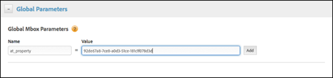

#  設定企業權限

有關將用戶添加到[!DNL Target]實施所需任務的資訊；建立工作區、使用者群組和屬性；更新您的[!DNL Target]實作以包含`at_property`參數；並指定角色和權限。

>[!NOTE]
>
>屬性和權限功能屬於 [Target Premium](/help/c-intro/intro.md#premium) 解決方案的一部分。在沒有 [!DNL Target Standard] 授權的 [!DNL Target Premium] 中無法使用。

下表列出要建立屬性和指派使用者角色和權限，您應該執行的工作。請參閱以下各節，瞭解各工作的詳細資訊。

| 任務 | 執行於 |
|--- |--- |
| 1. 新增使用者 (可選) | [!DNL Adobe Admin Console for Enterprise] |
| 2. 建立工作區 (產品設定檔) | [!DNL Adobe Admin Console for Enterprise] |
| 3. 建立使用者群組 (可選) | [!DNL Adobe Admin Console for Enterprise] |
| 4. 建立屬性 | [!DNL Target] UI |
| 5: 更新您的實作以包括 `at_property` 參數 | [!DNL Target] UI、at.js 函數、[!DNL Adobe Launch] 或 [!DNL Dynamic Tag Management] |
| 6: 指定角色和權限 | [!DNL Adobe Admin Console for Enterprise] |

對於在[!DNL Adobe Admin Console for Enterprise]中執行的這些任務，請按照以下步驟訪問控制台：

1. 在Adobe Target，按一下「**[!UICONTROL 管理]** > **[!UICONTROL 屬性]** > **[!UICONTROL 將屬性分配給工作區]**」。

   或

   如果您尚未登入，請前往[https://adminconsole.adobe.com/enterprise](https://adminconsole.adobe.com/enterprise/) >使用您的Adobe ID登入。

1. (條件式) 如果您可以存取一個以上組織的 [!DNL Admin Console for Enterprise]，請按一下右上角或上方導覽列中的使用者頭像，然後選取需要的組織。

## 步驟 1.新增使用者（選用）{#section_A92AF0F921B743FEB9E9033433BD816A}

開始使用新的[!UICONTROL 「屬性」]功能時，所有使用者管理必須在 [!DNL Adobe Admin Console for Enterprise] 中執行。不過，[!DNL Target] 中的所有現有使用者將會從 [!DNL Target] 移轉至 [!DNL Admin Console for Enterprise]。

1. [在 Admin Console 中](/help/administrating-target/c-user-management/property-channel/properties-overview.md#section_79796E0227D048F59BAE0AB02E544EBE)，按一下頁面頂端的&#x200B;**[!UICONTROL 使用者]**&#x200B;索引標籤 > **[!UICONTROL 新增使用者]**，以建立新使用者或編輯現有的使用者。
1. 遵循&#x200B;*《企業使用者指南》*&#x200B;的[在 Experience Cloud 中管理使用者和群組](https://helpx.adobe.com/enterprise/help/users.html)中的指示。

## 步驟 2.建立工作區（產品設定檔）{#section_B82EB409B67C4D9D9D20CE30E48DB1DC}

工作區（產品設定檔）可讓組織將一組特定使用者指派給一組特定屬性。 工作區有許多地方皆與 [!DNL Analytics] 中的報表套裝相似。

組織可以開始利用企業權限功能，方法是在[!DNL Admin Console]中建立新的工作區，將[!DNL Target]屬性指派給這些工作區，並將使用者從「預設工作區」設定移至這些較新的有限存取工作區。

客戶可以使用這些工作區來依地區、事業單位、網站區段或透過其選擇的任何其他方法來對不同團隊區分存取權。

使用者可以屬於多個工作區並且甚至可具有每個工作區內不同的角色。

1. 在 中[!DNL Admin Console]，按一下&#x200B;**[!UICONTROL 「產品」]**，然後選取所需產品的名稱。

   

1. 建立需要的工作區 (產品設定檔):

   * **預設存取:** 所有現有活動將合併到稱為「預設存取」的單一專案。這對客戶沒有影響。所有使用者角色和功能將保持與此變更之前完全相同。

      所有透過 [!DNL Adobe Experience Manager] (AEM)、[!DNL Adobe Mobile Services] 和 [!DNL Target Classic] 建立的活動也會是「預設存取」工作區的一部分。您目前無法將專案從「預設存取」移動至另一個專案。

   * **新工作區 (產品設定檔):** 您可以透過下列方式，開始利用新權限功能:

      * 在 [!DNL Admin Console for Enterprise] 內建立新工作區。
      * 對工作區指派 Target 屬性。

   您可以使用這些工作區來依地區、事業單位、網站區段或透過您選擇的任何其他方法來對不同團隊劃分存取權。使用者可以屬於多個工作區並且可具有每個工作區內不同的角色。

1. 遵循&#x200B;*《企業使用者指南》*&#x200B;的[建立和管理產品組態](https://helpx.adobe.com/enterprise/help/manage-products-and-configurations.html)中的指示。

>[!NOTE]
>請觀看下方的訓練影片，以瞭解關於設定工作區的詳細資訊。

### 取得您的工作區ID {#workspace-id}

您必須傳遞 Workspace ID，才能在 [Target API](/help/c-implementing-target/c-api-and-sdk-overview/api-and-sdk-overview.md) 中運用企業權限。

1. 在 [Adobe Admin Console](https://adminconsole.adobe.com)/tw 中，按一下[!UICONTROL 產品]標籤，然後按一下左側功能表中的產品，以顯示 PLC(workspace) 清單。
1. 按一下想要的 PLC(workspace)，然後在 URL 中找出「設定檔」ID，如下所示。

   

## 步驟 3.建立使用者群組（選用）{#section_5F5CB9AA7A9F4D26953E22016DA59605}

您可以建立使用者群組，例如開發人員、分析人員、行銷人員、行政人員等，然後跨多個 Adobe 產品和工作區指派權限。跨不同的 Adobe 產品為新團隊成員指派所有適當的權限，就如同將它們新增至特定使用者群組一樣簡單。

1. 在 Admin Console 中，按一下頁面頂端的&#x200B;**[!UICONTROL 「使用者」]**&#x200B;索引標籤 > **[!UICONTROL 「使用者群組」]**，以建立新使用者群組或編輯現有的使用者群組。
1. 遵循[《企業使用者指南》](https://helpx.adobe.com/enterprise/help/manage-products-and-configurations.html)的&#x200B;*管理產品設定的使用者和群組*&#x200B;中的指示。

## 步驟 4.建立屬性{#section_E8F2C92BE0F4466AB87604059C9CF3FD}

透過新增特定名稱／值對作為參數與任何呼叫（Target呼叫、api呼叫等）來啟用屬性 對 Target 的任何呼叫 (mbox 和 API 等)。

屬性屬於特定管道 (Web、行動電話、電子郵件和 API/其他)。

**提示**: 請觀看下方的訓練影片，瞭解關於如何建立屬性的詳細資訊。

1. 在[!DNL Target]中，按一下&#x200B;**[!UICONTROL 管理]** > **[!UICONTROL 屬性]**&#x200B;以顯示[!UICONTROL 屬性]清單。
1. 按一下&#x200B;**「建立屬性」**。

   

   填寫欄位: 

   * **屬性名稱（必要）:** 指定屬性的描述性名稱。
   * **說明:** 指定此屬性的可選說明。
   * **管道:** 選取屬性需要的管道: Web、行動應用程式、電子郵件或其他/API (例如電視盒或 PlayStation 主控台)。

1. 按一下&#x200B;**[!UICONTROL Copy]**，將程式碼複製到剪貼簿中，當您執行[5中的步驟時，將會使用：更新您的實作以包含at_property參數](/help/administrating-target/c-user-management/property-channel/properties-overview.md#section_9B17A59807A94712BE642942442EBBC8)。
1. 完成時，按一下&#x200B;**[!UICONTROL 「儲存」]**。

>[!NOTE]
>請觀看下方的訓練影片，以瞭解關於建立屬性的詳細資訊。

## 步驟5:更新您的實作以包含at_property參數{#section_9B17A59807A94712BE642942442EBBC8}

若要使用[!DNL Target]使用者權限功能，您必須將`at_property`參數新增至任何正在點擊[!DNL Target]的呼叫（Target呼叫、api呼叫等）。

**若要取得 `at_property` 參數程式碼:**

1. (條件式) 使用您在執行 [4. 建立屬性](/help/administrating-target/c-user-management/property-channel/properties-overview.md#section_E8F2C92BE0F4466AB87604059C9CF3FD)中的步驟時產生並儲存至剪貼簿的實作程式碼，並繼續進行步驟 2。

   或

   在[!DNL Target]中，按一下&#x200B;**[!UICONTROL 管理]** > **[!UICONTROL 屬性]**&#x200B;以顯示[!UICONTROL 屬性]清單。

   1. 將滑鼠游標移至所需屬性的[!UICONTROL 「上次更新時間」]欄以顯示[!UICONTROL 「程式碼」]圖示，並按一下該圖示。

      

   1. 以滑鼠右鍵按一下醒目提示的實作程式碼，以將它複製到您的剪貼簿。

      

1. 使用上一步驟中取得的實作程式碼更新您的[!DNL Target]實作。

   更新您的 [!DNL Target] 實作有數個方式。例如，下列方法可以用於網頁:

   * **透過 [!DNL Adobe Launch] 中的「全域參數」:**

      如需詳細資訊，請參閱&#x200B;*Adobe Experience Platform Launch*&#x200B;檔案中的[新增全域目標參數](https://docs.adobelaunch.com/extension-reference/web/adobe-target-extension#add-global-mbox-params)。

   * **透過 [!DNL Dynamic Tag Management] 中的「全域參數」:**

      

      如需詳細資訊，請參閱&#x200B;*動態標籤管理產品文件*&#x200B;中的[全域參數 - Adobe Target](https://experienceleague.adobe.com/docs/dtm/using/tools-reference/target.html#global-parameters---adobe-target)。

   * **透過targetPageParams()函式：** 在at.js或mbox.js參考 `<head>` 上方的標籤中置入下列程式碼。

      

      如需關於如何對 at.js 執行此動作的資訊，請參閱 [targetPageParams()](/help/c-implementing-target/c-implementing-target-for-client-side-web/targetpageparams.md)。

   * **透過 mboxCreate() 函數:**

      

      如需關於如何對 at.js 執行此動作的資訊，請參閱 [targetPageParams()](/help/c-implementing-target/c-implementing-target-for-client-side-web/targetpageparams.md) 和 [mboxCreate(mbox,params)](/help/c-implementing-target/c-implementing-target-for-client-side-web/mboxcreate-atjs.md)。

## 步驟6:指定角色和權限{#section_8C425E43E5DD4111BBFC734A2B7ABC80}

1. 在 Admin Console 中，按一下&#x200B;****「產品」，然後選取所需產品的名稱。

   

1. 按一下所要描述檔的名稱（例如預設工作區）。

   

1. 按一下&#x200B;**[!UICONTROL 「使用者」]**。

   [!UICONTROL 使用者]索引標籤會顯示該工作區中的所有使用者。

   

1. 使用[!UICONTROL 產品角色]欄中每個使用者的下拉式清單，選擇所要的權限角色（核准者、編輯者、觀察者或發佈者）。

   

   | 角色 | 說明 |
   |--- |--- |
   | 核准者 | 可以建立、編輯和啟動或停止活動。 |
   | 編輯器 | 可以在活動上線之前建立和編輯活動，但無法核准活動的啟動。 |
   | 觀察者 | 可以檢視活動，但無法建立或編輯活動。 |
   | 發行者 | 類似於「觀察者」角色（可以查看活動，但無法建立或編輯活動）。 不過，「發佈者」角色具有啟動活動的額外權限。 |

   如需詳細資訊，請參閱&#x200B;*《企業使用者指南》*&#x200B;中的[在 Admin Console 中管理產品權限和角色](https://helpx.adobe.com/enterprise/help/manage-permissions-and-roles.html)。

## 訓練影片

以下影片含有本文章探討之概念的詳細資訊。

>[!NOTE]
>
>[!DNL Target] [!UICONTROL Administration]功能表UI（先前稱為[!UICONTROL Setup]）已重新設計，以提供改善的效能、縮短發布新功能時所需的維護時間，並改善整個產品的使用者體驗。 以下視訊中的資訊通常正確；不過，選項可能位於稍微不同的位置。 更新的影片將很快發佈。

### 如何配置Adobe Target工作區(6:55)

此影片說明如何建立工作區。

* 從 Adobe Target 介面存取 Adobe Admin Console (3 個方式)
* 在 Adobe Admin Console 中設定工作區

   * 新增使用者至工作區
   * 新增屬性至工作區

* 瞭解預設工作區

>[!VIDEO](https://video.tv.adobe.com/v/19463/)

### 如何在Adobe Target(3:05)中建立屬性

* 如何在 [!DNL Adobe Target] 介面中建立屬性
* 如何產生要包括在您的屬性實作中的屬性 Token
* 讓您自己熟悉這三個實作方法:

   * Web
   * 行動應用程式
   * 電子郵件、電視盒或 API 呼叫

>[!VIDEO](https://video.tv.adobe.com/v/18990/)
