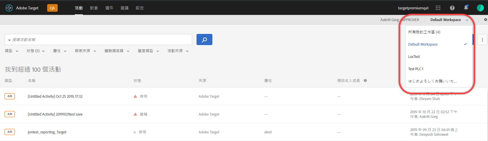
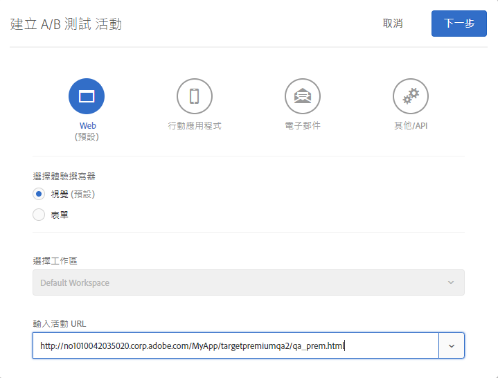
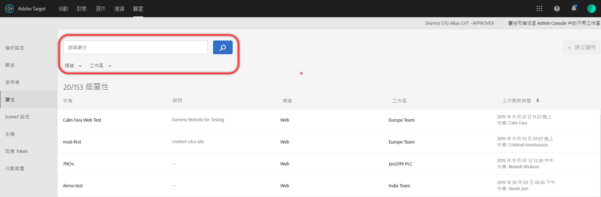

#  企業使用者權限

企業用戶權限是一種正式管理企業範圍內[!DNL Adobe Target]用戶訪問權限的方法。 根據不同的部門、全域位置、管道和其他邏輯群組，將使用者新增至[!DNL Target]、根據其角色指派權限，以及建立團隊的工作區。 您可以為使用者指派[!UICONTROL 觀察者]、[!UICONTROL 編輯者]或[!UICONTROL 核准者]的角色。

## 判斷您是否擁有企業使用者權限的存取權

>[!NOTE]
>
>屬性和權限功能屬於  Premium 解決方案的一部分。[!DNL Target]在沒有 [!DNL Target] Premium 授權的 [!DNL Target] Standard 中無法使用。
>
>您的[!DNL Target]實作可以使用任何版本的at.js。

您可以區分您的組織具有的Standard或Premium授權，方法是按一下[!DNL Target] UI頂端的[!UICONTROL Administration]連結。

* **[!DNL Target Standard]客戶**:如果您看到  Userstab([!UICONTROL 管理>使用者])(而不是屬性  資料表)，則您的組織擁有 [!DNL Target Standard] 授權。[!DNL Target Standard] 客戶應該遵循使用者中  的指示，在中新增使用者並指派 [!DNL Adobe Admin Console]權限。

* **[!DNL Target Premium]客戶**:如果您看到「屬  性」表([!UICONTROL 「管理」>「屬性」])和「  用戶」表，則您的組織具有 [!DNL Target Premium] 許可證。[!DNL Target Premium] 客戶應該遵循本文和[設定企業權限](/help/administrating-target/c-user-management/property-channel/properties-overview.md)中的指示。

## 開始使用企業權限之前

>[!IMPORTANT]
>
>在繼續處理企業權限之前，請務必閱讀以下的[注意事項](/help/administrating-target/c-user-management/property-channel/property-channel.md#section_9714311B1CD9497A86F4910F8AE635E2)一節。

## 本節中使用的字詞和定義 {#section_F8D229544FEA41C3BC2EFD1F95AA0116}

本小節中會使用下列詞語，對於想在[!DNL Target] Premium中使用屬性和權限功能的使用者，這些詞語可能是新詞。

### 屬性

屬性的性質與[!DNL Adobe Platform Launch]內的屬性類似，因為它們使用唯一的程式碼片段來加以區分。

Web 屬性是一組規則加上一個內嵌代碼。Web 屬性可以是一或多個網域和子網域的任何群組。

將特定名稱/值組新增為[!DNL Target]的任何呼叫（Target呼叫、api呼叫等）的參數，以啟用屬性。

屬性屬於特定管道 (Web、行動電話、電子郵件或 API/其他)。

### 工作區 (產品設定檔)

工作區可讓組織將特定一組使用者指派至特定一組屬性。工作區有許多地方皆與 [!DNL Adobe Analytics] 中的報表套裝相似。

注意：工作區在[!DNL Adobe Admin Console for Enterprise]中稱為[!UICONTROL 產品設定檔]。

如果您屬於多國組織，可能會有一個工作區用於歐洲網頁、屬性或網站，以及另一個工作區用於美洲網頁、屬性或網站。如果您屬於多品牌組織，則可能會有每個品牌的個別工作區。

使用者可以屬於多個工作區並且甚至可具有每個工作區內不同的角色。

使用者可以透過在工作區之間移動來擁有不同的[!DNL Adobe Target]檢視，類似於[!DNL Analytics]使用者透過在報表套裝之間移動來擁有不同[!DNL Analytics]檢視的方式。

工作區可以包含完全不同的對象、代碼選件和活動。

在新企業權限模型移轉前建立的所有對象和活動，都會分組在「預設工作區」中，如下所述。

所有透過[!DNL Adobe Experience Manager](AEM)、[!DNL Adobe Mobile Services]和[!DNL Adobe Target Classic]建立的活動皆為「預設工作區」的一部分。

### 預設工作區

在您的組織移轉至新的企業權限模型期間，[!DNL Admin Console]內的所有現有工作區（產品設定檔）會合併至稱為「預設工作區」的單一工作區。

>[!IMPORTANT]
>
>請勿刪除預設工作區。

所有[!DNL Target]功能的使用者角色和存取權與移轉至新企業權限模型之前相同。

### 使用者群組

您可以建立使用者群組，例如開發人員、分析人員、行銷人員、執行官等。 然後，您可以跨多個Adobe產品和工作區指派權限。 跨不同的 Adobe 產品為新團隊成員指派所有適當的權限，就如同將它們新增至特定使用者群組一樣簡單。

### 角色與權限

角色和權限會決定使用者在您的 [!DNL Target] 實作中建立和管理活動所具備的存取層級。在 [!DNL Target] 中，角色包括下列:

| 角色 | 說明 |
|--- |--- |
| 核准者 | 可以建立、編輯和啟動或停止活動。 |
| 編輯器 | 可以在活動上線之前建立和編輯活動，但無法核准活動的啟動。 |
| 觀察者 | 可以檢視活動，但無法建立或編輯活動。 |
| 發行者 | 類似觀察者角色（可以檢視活動，但無法建立或編輯活動）。 但是，發佈者角色具有激活活動的附加權限。 |

### 頻道

管道是指您的 [!DNL Target] 活動傳送所在的內容類型: 網頁、行動應用程式、電子郵件訊息等。

建立活動時，會在目前選取的工作區中建立。 您會在第一個對話方塊中看到管道選取選項，可讓您為活動選擇所需的管道：網頁、行動應用程式、電子郵件或其他/API。

## 權限概述 {#section_DC2172520DA84605B218A5E9FB6D187A}

下列資訊說明先前在 [!DNL Target] 中執行權限的方式，以及如何使用[!UICONTROL 屬性]和[!UICONTROL 權限]功能來加以執行。

新的[!UICONTROL 權限]功能可讓您建立不同的專案（在[!DNL Adobe Admin Console for Enterprise]中稱為「產品設定檔」）。 專案可讓您為單一使用者指派不同權限，支配該使用者對每個專案的存取權。 這些獨特的專案可與 [!DNL Adobe Analytics] 中報表套裝的運作方式比較。每個專案可以有特定的使用者具有適用一組屬性的特定角色。結果是客戶能夠根據地區、環境（開發/預備/生產）、管道或其他自訂條件，限制其使用者的檢視、編輯和核准存取權，如下所示：

例如，特定使用者可能會有美國網站的「核准」存取權，但只有歐洲行動應用程式的「檢視」存取權。該相同使用者可能沒有 APAC 區域中 Web 和行動屬性上提供的活動的任何存取權 (甚至是檢視)。

目前的 [!DNL Target][!UICONTROL  權限]模型有三個權限角色 (觀察者、編輯者和核准者)，如下圖所示:

每個角色有不同層級的權限:

| 角色 | 說明 |
|--- |--- |
| 核准者 | 可以建立、編輯和啟動或停止活動。 |
| 編輯器 | 可以在活動上線之前建立和編輯活動，但無法核准活動的啟動。 |
| 觀察者 | 可以檢視活動，但無法建立或編輯活動。 |
| 發行者 | 類似觀察者角色（可以檢視活動，但無法建立或編輯活動）。 但是，發佈者角色具有激活活動的附加權限。 |

務必注意，每個使用者的角色會套用至您的帳戶中包含 [!DNL Target] 標記的每個頁面、屬性或網站上，如下所示:

新的 [!DNL Target][!UICONTROL  權限]模型有相同的三個權限角色 (觀察者、編輯者和核准者)；不過，您可以為個別頁面、屬性或網站個別指派使用者的權限角色，如下所示:

在此範例中，Jan 具有美國首頁和美國網站的核准者權限，以及法國網站的觀察者權限。

此外，Jan在[!DNL Target]中看不到她沒有權限可查看的頁面、屬性或網站，如下所示：

在此範例中，Jan 看不到產品頁面、俄羅斯網站和求職網站。

## 使用案例 {#section_F3CE8576959E4F4CB13BEEED38311DD8}

下列使用案例有助於瞭解屬性、專案、角色和權限如何能協助您使用 [!DNL Target] 達成您的行銷目標:

### 多國組織

如果您屬於多國組織，可能會有一個工作區用於歐洲網頁、屬性或網站，以及另一個工作區用於美洲網頁、屬性或網站。重新組織之後，使用上圖中的角色，您可以設定類似於以下的工作區和權限:

* **Jan**: Jan 是組織的美國網頁、屬性和網站的 Center of Excellence 的最佳化領導者。她很可能具有 Adobe Experience Cloud 中的系統管理員權限。

   在她的角色中，她具有美國首頁和美國網站的核准者權限。利用核准者權限，她可以建立、編輯和啟動或停止活動。

   Jan 也洽詢了法國的最佳化團隊，因此，具有法國網站的觀察者權限，該權限提供她對活動的唯讀存取。Jan 可以檢視活動，但無法建立或編輯活動。

   因為 Jan 沒有需要她看到產品頁面、俄羅斯網站或求職網站的角色，她看不到這些網站的活動。

* **Ernie**: Ernie 是組織的行銷經理，負責在美國的行銷。

   因為Ernie是組織的新人，並且對Target沒有經驗，他具有美國首頁、美國網站和產品頁面的編輯者權限。 有了編輯者權限，Ernie可以在活動上線之前建立和編輯活動。他無法核准活動的啟動，具有核准權限的人（例如Jan）必須先核准活動，活動才能投入生產。

   因為 Ernie 沒有需要他看到俄羅斯網站、法國網站或求職網站的角色，他看不到這些網站的活動。

* **Diana**: Diana 現在是組織的分析師，並且已獲得美國首頁、美國網站、產品頁面、俄羅斯網站和法國網站的觀察者權限，該權限提供她對活動的唯讀存取。Diana 可以檢視活動，但無法建立或編輯活動。

   因為 Diana 沒有需要她看到求職網站的角色，她看不到這些網站的活動。

### 多品牌組織

如果您屬於多品牌組織，則可能會有每個品牌的網頁、屬性或網站的個別工作區。

重新組織之後，使用上圖中的角色，您可以設定類似於以下的專案和權限:

* **Jan**: Jan 是在醫院產品和消費者產品領域營運的醫療組織的 Center of Excellence 的最佳化領導者。她很可能具有 Adobe Experience Cloud 中的系統管理員權限。

   在她的角色中，她具有醫院網站的核准者權限。利用核准者權限，她可以建立、編輯和啟動或停止活動。

   Jan 也洽詢了消費者產品空間的最佳化團隊，因此，具有該網站的觀察者權限，該權限提供她對活動的唯讀存取。Jan 可以檢視活動，但無法建立或編輯活動。

* **Ernie**: Ernie 是組織的行銷經理，負責消費者產品領域的行銷。

   因為Ernie是組織的新人，對Target沒什麼經驗，他具有消費者網站的編輯者權限。 有了編輯者權限，Ernie可以在活動上線之前建立和編輯活動。他無法核准活動的啟動 — 某人具有消費者網站的核准權限，但此情境中不是Jan，必須先核准活動，活動才能投入生產。

   因為 Ernie 沒有需要他看到醫院網站的角色，他看不到該網站的活動。

* **Diana**: Diana 現在是組織的分析師，並且已獲授與醫院網站和消費者網站的觀察者權限，該權限提供她對活動的唯讀存取。Diana 可以檢視活動，但無法建立或編輯活動。

## Target UI屬性和權限接觸點 {#section_3414371393BB42999A268628B5456EC9}

您可以在 [!DNL Target] UI 的多個位置看到新的權限功能。

* **工作區 (產品設定檔) 下拉式清單:**「工作區」下拉式清單顯示在[!UICONTROL 「活動」]、[!UICONTROL 「對象」]和[!UICONTROL 「選件」]頁面的頂部。選取所需的工作區以篩選清單，以僅顯示所選取工作區中的項目。

   

* **活動建立：** 建立活動時，會在目前選取的工作區中建立。您會在第一個對話方塊中看到管道選取選項，可讓您為活動選擇所需的管道：網頁、行動應用程式、電子郵件或其他/API。

   

* **建立對象：** 建立對象時，會建立在目前選取的工作區中。
* **選件建立：** 當您建立選件時，會建立在目前選取的工作區中。
* **屬性頁面（管理>屬性）:** 您可以使用Searchbox  來搜尋屬性  清單。

   

## 注意事項 {#section_9714311B1CD9497A86F4910F8AE635E2}

在[!DNL Target] Premium中使用或設定屬性和權限時，請考量下列事項：

* **重要**: 請勿刪除具有活動的工作區。如果您刪除含有活動的工作區，請與客戶服務合作以復原這些活動。
* 使用「所有我的工作區」檢視時:

   * 您可以查看具有適當角色和權限可存取之所有工作區的活動、對象和選件。
   * 當您選取[!UICONTROL 所有我的工作區]檢視時，會將新欄新增至「活動」、「對象」和「選件」頁面。 此列列出項目的工作區以及與該項目關聯的用戶權限（觀察者、編輯者或批准者）,
   * 在「所有我的工作區」檢視中建立活動、對象或選件時，您必須選取要建立項目的工作區。只能選取您具有「編輯者」或「核准者」權限的工作區。
   * 在「所有我的工作區」檢視中複製活動、對象或選件時，您必須選取要複製項目的工作區。只能選取您具有「編輯者」或「核准者」權限的工作區。

* 下列「管理」頁面上的任何設定都可由任何工作區中的任何核准者控制：

   * 可視化體驗撰寫器
   * 報表
   * Scene7設定
   * 實施
   * 屬性
   * 主機
   * 環境
   * 回應 Token
   * 使用者

* 使用者無法將資源從一個工作區 (產品設定檔) 移動至另一個。不過支援複製。
* 從 [!DNL Audiences] 頁面檢視對象時，頁面載入的速度會低於預期。如果您以任何方式與搜尋列互動，對象會較快顯示。此問題已知，並將在近期的更新中修正。 此問題不會影響在活動建立工作流程期間選取對象。
* 下列資源屬於新企業權限模型:

   * 在啟用客戶的權限之後，於 Target Standard/Premium 內建立的活動、對象和代碼選件。(注意: 客戶必須取得使用 Target Premium 的授權。)
   * 屬性可新增至預設工作區中的現有活動；但是，這種方法可能會改變。
   * 只有在Target Premium（啟用企業權限後）內建立的新資源（例如活動、代碼選件和對象）可供透過權限限制使用。
   * 外部資源僅可供預設工作區中的使用者使用。預設工作區中的使用者的角色將全域適用 (所有 Target 要求 和所有 Target 資源)。

* 下列資源&#x200B;*不*&#x200B;屬於新企業權限模型:

   * 影像選件
   * 所有建議資源，包括條件資料庫、設計資料庫、目錄、建議設定。
   * 在啟用企業權限之前在Target Premium中建立的現有資源（例如活動、代碼選件和對象）可以複製，但無法移至其他工作區。
   * 使用下列解決方案或方法建立的活動、對象、代碼選件、影像選件或任何其他資源，無法透過企業權限模型控制，但屬於預設工作區的一部分：Target Classic、Adobe Experience Manager(AEM)、AdobeMobile Services和透過API建立的資源。 透過 API 建立的資源包括活動、對象、代碼選件和影像選件。
   * 影像選件（儲存在`https://[tenantName].marketing.adobe.com/content/mac/[tenantName]/target/offers.html#image-library`下的資產）目前無法透過企業權限模型控制。
   * 當目的地連結或目的地頁面屬於活動中包含之屬性的一部分時，clickTracking和重新導向便可運作。 此外，使用`targetPageParams()`函式時，clickTracking可能無法運作。 `targetPageParamsAll()` 為建議的函數。

   [!DNL Target] 目前需要在發生追蹤所在的任何頁面上具有 `at_property` Token。如果Token(1)不存在，(2)未在活動設定時（在VEC內）偵測到，或(3)未透過`targetPageParamsAll()`函式傳遞至clickTracking Target呼叫，度量將不會遞增，並顯示為「0」。

   對於使用重新導向的活動也是相同的情況。目的地頁面必須具有 `at_property` Token，並且需在 VEC 內設定時辨識。

   在未來的版本中，Target 將處理不存在 `at_property` Token 的頁面或存在不同的 `at_property` Token 的頁面。

* [Adobe I/O API 呼叫](https://developers.adobetarget.com)不支援「企業使用者權限」功能。

## 常見問題 {#faqs}

企業權限相關常見問題集包括下列內容:

### 我可以將活動從一個工作區移動至另一個工作區嗎?

很抱歉，您無法將活動從一個工作區移動至另一個工作區。不過，您可以知道報表資料不會持續存在，將活動複製到任何工作區。 如需詳細資訊，請參閱[使用工作區時複製/編輯活動](/help/c-activities/edit-activity.md#section_45A92E1DD3934523B07E71EF90C4F8B6)中的「使用工作區時複製/編輯活動」。

移轉之前建立的活動會繼續在「預設工作區」中以相同方式執行，除非它們是經過編輯和指派的屬性。特定工作區下的活動會執行指派給該工作區的屬性，因此，行為可能與移轉前不同。

### 即使在已指派屬性的情況下，為何仍出現錯誤訊息，指出沒有任何與此活動相關聯的屬性?

如果您已使用 [!DNL Adobe Experience Platform Launch] 實作 [!DNL Target]，而系統出現錯誤訊息，指出沒有任何與此活動相關聯的屬性，請使用 `targetPageParams` 函數傳送 `at_property` 參數。

### 如果重新導向頁面和活動 URL 屬於不同屬性，是否會記錄點擊追蹤轉換?

如果頁面上的頁面和活動 URL 屬於不同屬性，系統則不會記錄點擊追蹤。

假設有下列情況:

* Page1 屬於 Property1。
* Page2 屬於 Property2。
* 在活動中，Page1 會重新導向到 Page2，這包含點擊追蹤。

當訪客在瀏覽器中開啟Page1時，系統會將訪客重新導向至Page2。 因為 Page2 沒有傳送活動的資格，其 Target 呼叫在其回應中不會包含點擊追蹤。

如果重新導向頁面和活動 URL 屬於相同的屬性，點擊追蹤會如運期般運作。如需詳細資訊，請參閱[點擊追蹤](/help/c-activities/r-success-metrics/click-tracking.md)。

## 訓練影片

以下影片含有本文章探討之概念的詳細資訊。

### 訓練影片：企業權限訓練影片

學習目標:

* Adobe Target 使用者可以擁有的三個角色層級
* 屬性和工作區的概念，以及這些限制和分組工作如何讓您控制使用者的存取層級
* 供您的組織考慮的不同屬性範例

>[!VIDEO](https://video.tv.adobe.com/v/19042/)

### 營業時間：[!DNL Target]高級工作區

這支影片記錄了「營業時間」，這是一項 Adobe 客戶服務團隊主導的計劃。

* 建立工作區 (產品設定檔)
* 選擇屬性。
* 新增使用者
* 更新實施

>[!NOTE]
>
>已重新設計[!DNL Target] [!UICONTROL Administration]功能表UI（原稱[!UICONTROL Setup]），以提供改善的效能、減少發行新功能時所需的維護時間，並改善整個產品的使用者體驗。 以下視頻中的資訊正確；不過，選項可能位於稍微不同的位置。

>[!VIDEO](https://video.tv.adobe.com/v/23643/)
