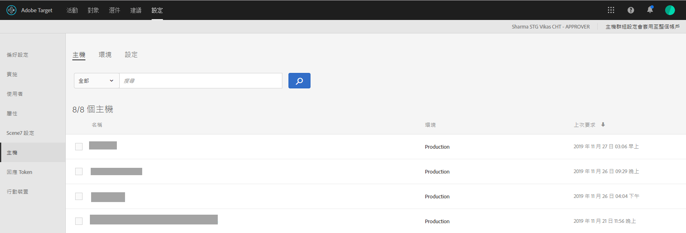

# 主機{#hosts}

組織您的網站和生產前環境，適用於簡易管理和分開的報表。

主機管理的主要目標是確保網站上沒有意外出現非使用中的內容。主機管理也可讓您依[environment](/help/administrating-target/environments.md)區隔報表資料。

主機是指從中發出[!DNL Target]請求的任何域。 在網站上，通常是提出[!DNL Target]請求的URL的`location.hostname`屬性。

預設情況下，[!DNL Target]不限制能夠發出[!DNL Target]請求並接收[!DNL Target]響應的主機。 當新主機發出請求時，它們會自動運作。 這也可讓您在您不知道或無法預測的不同網域上進行測試。 如果要覆蓋此預設行為，可以設定允許清單或塊清單以限制哪些主機將與[!DNL Target]一起使用。

要管理主機，請按一下「管理」「**** > **[!UICONTROL 主機」「]**」。

## 識別主機{#concept_0D4B43E23AA9408F8B28A57ED754BF65}

要識別主機並將其添加到[!UICONTROL Hosts]清單中，必須滿足以下條件：

* 主機上至少必須存在一個[!DNL Target]請求
* 主機上的頁面必須具有以下內容：

   * 精確的at.js或mbox.js參考
   * [!DNL Target]請求或自動產生的全域[!DNL Target]請求

* 必須在瀏覽器中檢視具有[!DNL Target]請求的頁面

在檢視頁面後，主機會列在[!UICONTROL  Hosts]清單中，讓您在環境中管理它，以及預覽和啟動活動與測試。

>[!NOTE]
>
>這包括任何個人開發伺服器。

當主機新增至[!UICONTROL 「主機」]清單之後，請確定可辨識該主機。

1. 按一下「**[!UICONTROL 管理]** > **[!UICONTROL 主機]**」。
1. 如果您的主機未列出，請重新整理瀏覽器。

   預設情況下，新識別的主機放置在[!UICONTROL Production]環境中。 這是最安全的環境，因為它不允許從這些主機檢視未批准的活動。

1. （條件性）按一下「移動」圖示（**[!UICONTROL 「移動」圖示），將主機移入「開發」[!UICONTROL 、「測試」]或其他環境。**]

>[!NOTE]
>
>即使更名[!UICONTROL Production]環境，也無法刪除。 這是您提供最終使用中活動與測試的地方。預設環境不允許檢視非使用中的行銷活動。

## 排序或搜索主機清單{#section_068B23C9D8224EB78BC3B7C8580251B0}

要對[!UICONTROL Hosts]清單進行排序，請按一下任何列標題（[!UICONTROL Name]、[!UICONTROL Environment]或[!UICONTROL Last Requested]），以升序或降序對清單進行排序。

要搜索[!UICONTROL Hosts]清單，請在[!UICONTROL 搜索主機]框中鍵入搜索詞。

## 建立允許清單，指定授權將Target請求傳送至Target的主機。{#allowlist}

您可以建立允許清單，該清單指定有權將[!DNL Target]請求發送到[!DNL Target]的主機（域）。 所有其他產生請求的主機將收到註解的授權錯誤回應。 預設情況下，任何包含[!DNL Target]請求的主機都會在[!UICONTROL Production]環境中註冊到[!DNL Target] ，並且可以訪問所有活動和批准的活動。 如果這不是所需的方法，您可以改用allowlist來記錄有資格發出[!DNL Target]請求並接收[!DNL Target]內容的特定主機。 所有主機將繼續顯示在[!UICONTROL  Hosts]清單中，並且環境仍可用於將這些主機分組，並為每台主機分配不同級別，例如主機是否可以看到活動和／或非活動活動。

要建立允許清單：

1. 在[!UICONTROL Hosts]清單中，按一下&#x200B;**[!UICONTROL Authorize Hosts]**。
1. 啟用&#x200B;**[!UICONTROL 啟用授權主機以進行內容傳送]**&#x200B;切換。
1. 根據需要，在&#x200B;**[!UICONTROL Host contains]**&#x200B;框中添加所需的主機。

   可新增多個主機，每個主機各一行。

1. 在&#x200B;**[!UICONTROL Host does not contains]**&#x200B;框中添加所需的主機。

   可新增多個主機，每個主機各一行。

1. 按一下&#x200B;**[!UICONTROL 「儲存」]**。

如果對未授權主機發出[!DNL Target]請求，則呼叫將以`/* no display - unauthorized mbox host */`回應。

>[!IMPORTANT]
>
>**安全性最佳實務**:如果您使用的ubox功 [!DNL Target]能，請注意，此允許清單也會控制重新導向程式所導覽的網  域清單。當您將ubox用作實作的一部分時，請確定您新增任何要重新導向的網域。 如果未指定允許清單，[!DNL Adobe]將無法驗證重定向URL並防止潛在的惡意重定向。
>
>允許清單優先於環境。 在使用allowlist功能之前，應清除所有主機，然後僅允許清單允許的主機顯示在主機清單中。 接著可將主機移至想要的環境中。

有時，來自其他網站的網域會出現在您的環境中。如果網域對您的at.js或mbox.js進行呼叫，網域會出現在清單中。 例如，若有人將您的其中一個網頁複製到他們的伺服器，則您環境中就會出現該網域。您也可以從編目引擎、語言翻譯工具網站或本機磁碟中看見網域。

如果在 API 呼叫中傳入 `mboxHost`，則會針對傳入的環境來記錄轉換。如果未傳遞任何環境，則呼叫中的主機預設為[!UICONTROL Production]。

您也可以在[!UICONTROL 主機不包含]方塊中新增所需的主機，以建立指定主機（網域）而非無法傳送[!DNL Target]要求至[!DNL Target]的登入清單。

>[!NOTE]
>
>由於「授權主機」清單同時用於[!DNL Target]主機和預設重新導向主機，因此您必須新增所有已核准使用[!DNL Adobe Target] Javascript SDK(at.js)*AND*&#x200B;的現有網域，才能使用ubox預設重新導向URL。 您還必須在未來將任何新的類似域添加到allowlist中。

## 刪除主機{#section_F56355BA4BC54B078A1A8179BC954632}

您不再需要使用某個主機時，可以將它刪除。

1. 在[!UICONTROL Hosts]清單中，按一下&#x200B;**[!UICONTROL Delete]**&#x200B;表徵圖。
1. 按一下「**[!UICONTROL 刪除]**」以確認刪除。

>[!NOTE]
>
>如果有人瀏覽至主機上包含[!DNL Target]請求的頁面，則主機將再次列出。

## 疑難排解主機 {#concept_B3D7583FA4BB480382CC7453529FE1B7}

如果遇到主機方面的問題，請嘗試下列疑難排解訣竅:

**主機不會出現在您帳戶的清單中。**

* 在瀏覽器中重新整理[!UICONTROL 「主機」]頁面。
* 確認[!DNL Target]要求正確，包括at.js或mbox.js參考。
* 嘗試瀏覽至主機上的[!DNL Target]請求之一。 主機上的[!DNL Target]請求可能未在瀏覽器中呈現。

**[!UICONTROL 主機]清單中出現隨機或未知的網域。**

如果從網域請求[!DNL Target]，此清單中將顯示一個網域。 通常，您可以從編目引擎、語言翻譯工具網站或本機磁碟中看見網域。如果列出的網域不是您團隊使用的網域，則可以按一下[!UICONTROL 刪除]將它移除。

**我的 [!DNL Target] 請求傳回/*無顯示——未授權的mbox主機*/。**

如果在未授權的主機上提出[!DNL Target]要求，則要求會以/* no display - unauthorized mbox host */回應。
