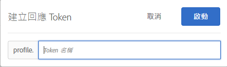

# 回應 Token{#response-tokens}

回應Token可讓您自動輸出特定於[!DNL Target]（活動詳細資訊、使用者設定檔資訊、地理資訊等）的資訊，以便用於除錯或與協力廠商系統整合（例如Clicktale）。

回應Token可讓您選擇要運用的變數，然後讓這些變數可作為Target回應的一部分傳送。 為此，您只需使用開關啟用變數，變數就會隨Target回應一併傳送，並可在網路呼叫中驗證。 回應Token也能在[!UICONTROL 預覽]模式中運作。

外掛程式和回應 Token 之間的主要差異在於，外掛程式會將 JavaScript 傳送至頁面，此頁面會在傳送後立即執行，而回應 Token 會傳送物件，可利用事件接聽程式來讀取並處理此物件。如需詳細資訊，請參閱 [at.js 自訂事件](/help/c-implementing-target/c-implementing-target-for-client-side-web/atjs-custom-events.md)和本章稍後的範例。回應 Token 方法比較安全，而且在開發和維護第三方整合時較輕鬆。

>[!NOTE]
>
>回應Token可與at.js 1.1或更新版本搭配使用。 回應 Token 不支援搭配 mbox.js 使用。

| 使用中的 Target 資料庫 | 建議的動作 |
|--- |--- |
| at.js | 確保您使用 at.js 版本 1.1 或更新版本。如需有關下載最新版 at.js 的資訊，請參閱[下載 at.js](/help/c-implementing-target/c-implementing-target-for-client-side-web/how-to-deployatjs/implementing-target-without-a-tag-manager.md)。如需每個 at.js 版本中新功能的相關資訊，請參閱 [at.js 版本詳細資料](/help/c-implementing-target/c-implementing-target-for-client-side-web/target-atjs-versions.md)。<br>對於使用 at.js 的客戶，建議採用回應 Token，而不要使用外掛程式。mbox.js 中有部分外掛程式所依賴的內部方法，但 at js 中卻沒有，雖然可以傳送這些外掛程式，但卻會失敗。如需詳細資訊，請參閱 [at.js 限制](/help/c-implementing-target/c-implementing-target-for-client-side-web/t-mbox-download/c-target-atjs-implementation/target-atjs-limitations.md)。 |
| mbox.js | 使用 mbox.js 時會繼續支援並傳送外掛程式。<br>不過，對於使用 mbox.js 和外掛程式的客戶，建議改用 at.js 和回應 Token。如需有關使用 at.js 優於 mbox.js 的資訊，請參閱 [at.js 常見問題集](/help/c-implementing-target/c-implementing-target-for-client-side-web/c-target-atjs-faq/target-atjs-faq.md)。如需移轉的相關資訊，請參閱[從 mbox.js 移轉至 at.js](/help/c-implementing-target/c-implementing-target-for-client-side-web/t-mbox-download/c-target-atjs-implementation/target-migrate-atjs.md)。<br>在 Target Classic 淘汰之後 (2017 年 11 月)，您可能需要聯絡客戶服務來編輯或停用現有外掛程式。在 Target Classic 淘汰之前，您應該稽核外掛程式並停用無用的外掛程式。<br>您無法在 Target Standard/Premium 中建立新的外掛程式。請改為使用回應 Token。<br>您應停用舊版 SiteCatalyst 增效模組，並改用[以 Adobe Analytics 取代，作為 Adobe Target (A4T) 的報表來源](/help/c-integrating-target-with-mac/a4t/a4t.md)。應該停用 ttMeta 外掛程式並換成 [Adobe Experience Cloud Debugger](https://chrome.google.com/webstore/detail/adobe-experience-cloud-de/ocdmogmohccmeicdhlhhgepeaijenapj)。 |

## 使用回應 Token {#section_A9E141DDCBA84308926E68D05FD2AC62}

1. 確保您使用 [!DNL at.js] 版本 1.1 或更新版本。

   如需詳細資訊，請參閱[下載 at.js](/help/c-implementing-target/c-implementing-target-for-client-side-web/how-to-deployatjs/implementing-target-without-a-tag-manager.md#concept_1E1F958F9CCC4E35AD97581EFAF659E2)。

1. 在[!DNL Target]中，按一下「**[!UICONTROL 管理]** > **[!UICONTROL 響應Token]**」。

   

1. 啟動所需的回應 Token，例如 `activity.id`、`option.id`等等。

   依預設有下列參數可用:

   | 類型 | 參數 | 附註 |
   |--- |--- |--- |
   | 內建的設定檔 | `profile.activeActivities` | 傳回訪客合格可使用的 `activityIds` 陣列。這會隨著使用者合格而增加。例如，在含有兩個[!DNL Target]請求傳送兩個不同活動的頁面上，第二個請求包含兩個活動。 |
   |  | `profile.isFirstSession` | 傳回 &quot;true&quot; 或 &quot;false&quot;。 |
   |  | `profile.isNewSession` | 傳回 &quot;true&quot; 或 &quot;false&quot;。 |
   |  | `profile.daysSinceLastVisit` | 傳回訪客上次造訪後所經過的天數。 |
   |  | `profile.tntId` | 傳回訪客的 tntID |
   |  | `profile.marketingCloudVisitorId` | 傳回訪客的 Experience Cloud 訪客 ID。 |
   |  | `profile.thirdPartyId` | 傳回訪客的第三方 ID。 |
   |  | `profile.categoryAffinity` | 傳回訪客最喜愛的類別。 |
   |  | `profile.categoryAffinities` | 以字串形式傳回訪客前 5 名類別的陣列。 |
   | 活動 | `activity.name`<br>`activity.id`<br>`experience.name`<br>`experience.id`<br>`option.name`<br>`option.id` | 目前活動的詳細資料。請注意，&quot;option&quot; 等於 &quot;offer&quot;。 |
   | 地理 | `geo.country`<br>`geo.state`<br>`geo.city`<br>`geo.zip`<br>`geo.dma`<br>`geo.domainName`<br>`geo.ispName`<br>`geo.connectionSpeed`<br>`geo.mobileCarrier` | 請參閱[地理](/help/c-target/c-audiences/c-target-rules/geo.md)，以取得在活動中使用地理鎖定目標的詳細資訊。 |
   | 流量分配方法<br>（僅適用於[!UICONTROL Auto-Target]和[!UICONTROL Automated Personalization]活動）。 | `experience.trafficAllocationId` | 如果訪客從「控制」流量中收到體驗，則傳回0；如果訪客從「目標」流量分佈收到體驗，則傳回1。 |
   |  | `experience.trafficAllocationType` | 傳回「控制」或「已定位」。 |

   使用者設定檔屬性和客戶屬性也顯示在清單中。

   >[!NOTE]
   >
   >含特殊字元的參數不會顯示在清單中。僅支援英數字元和底線。

1. （條件性）如果您想使用描述檔參數做為回應Token，但參數尚未透過[!DNL Target]請求傳遞，因此尚未載入Target UI，則可使用[!UICONTROL 新增回應Token]按鈕將描述檔新增至UI。

   按一下「新增回應Token」，提供Token名稱，然後按一下「啟動」。********

   

1. 建立活動。

使用 [at.js 自訂事件](/help/c-implementing-target/c-implementing-target-for-client-side-web/atjs-custom-events.md)接聽 回應並讀取回應 Token。[!DNL Target]

下列程式碼範例直接將 [!DNL at.js] 自訂事件處理常式新增至 HTML 頁面:

```html
<html> 
  <head> 
    .... 
    <script src="at.js"></script> 
    <script> 
      document.addEventListener(adobe.target.event.REQUEST_SUCCEEDED, function(e) { 
        console.log("Request succeeded", e.detail); 
      }); 
    </script> 
  <head> 
  <body> 
  ... 
  </body> 
</html>
```

下列指示顯示如何使用 Adobe Dynamic Tag Manager (DTM) 來新增 [!DNL at.js] 自訂事件處理常式:

1. 登入 DTM。
1. 瀏覽至適當的屬性。
1. 開啟 Target 工具。

   因為 DTM 原本就不支援 at.js，您必須使用程式碼編輯器。

1. 在程式碼編輯器中，將下列程式碼附加至 [!DNL at.js]:

   ```json
   document.addEventListener(adobe.target.event.REQUEST_SUCCEEDED, function(e) { 
     console.log("Request succeeded", e.detail); 
   });
   ```

如果您要將一切都放在單一檔案中，可以將下列程式碼片段新增至資料庫頁尾 [at.js 設定頁面](/help/c-implementing-target/c-implementing-target-for-client-side-web/how-to-deployatjs/implementing-target-without-a-tag-manager.md#concept_2FA0456607D04F82B0539C5BF5309812)。

```json
document.addEventListener(adobe.target.event.REQUEST_SUCCEEDED, function(e) { 
  console.log("Request succeeded", e.detail); 
});
```

## 回應 Token FAQ {#section_3DD5F32C668246289CDF9B4CDE1F536D}

**需要什麼角色才能啟動或停用回應 Token?**

只有具備「Target 管理員」角色的使用者才能啟動或停用回應 Token。

**如果是執行 at.js 1.0 或更舊版本，將會發生什麼情形?**

您會看到回應 Token，但無法供 at.js 使用。

**如果在網站的某些頁面上使用 at.js 1.1 (或更新版)，但在其他頁面上使用 mbox.js，將會發生什麼情形?**

回應Token會傳送至[!DNL at.js] Target回應，但不會傳送至[!DNL mbox.js]回應。

**我可以同時使用 Target Classic 外掛程式和回應 Token 嗎?**

外掛程式和回應 Token 平行可用，但未來將淘汰外掛程式。

**回應Token是透過所有回應傳遞， [!DNL Target] 還是僅透過回應 [!DNL Target] 傳遞活動傳遞？**

回應Token僅透過傳送活動的[!DNL Target]回應傳送。

**我的 Target Classic 外掛程式包含 JavaScript。如何使用回應 Token 來複寫其功能?**

移轉至回應 Token 時，這種 JavaScript 需要保留在程式碼庫或標記管理解決方案中。您可以使用 [!DNL at.js] 自訂事件來觸發此程式碼，並將回應 Token 值傳遞至 JavaScript 函式。

**我的設定檔/客戶屬性參數為何沒有顯示在回應 Token 清單中?**

Target 通常每 15 分鐘重新整理一次參數。這項重新整理有賴於使用者動作，只有當您檢視回應 Token 頁面時才會重新整理資料。如果您的參數沒有顯示在回應 Token 清單中，可能是因為 Target 尚未重新整理資料。

另外，如果參數包含非英數字元，或底線以外的任何符號，則參數不會出現在清單中。目前僅支援英數和底線字元。

**如果我使用設定檔指令碼或設定檔參數建立回應 Token，然後刪除該設定檔指令碼或參數，回應 Token 仍會傳送內容嗎?**

回應 Token 會從使用者設定檔中擷取資訊，然後傳送該資訊。如果您刪除設定檔指令碼或參數，這不代表該資訊已從使用者設定檔中移除。使用者設定檔仍然具有對應於設定檔指令碼的資料。回應 Token 會繼續傳送內容。對於未將該資訊儲存在設定檔中的使用者，或對於新訪客，則不會傳送該 Token，因為設定檔中沒有資料。

Target 不會自動關閉 Token。如果您刪除設定檔指令碼，且不想再傳送 Token，則必須自行關閉 Token。

**我已重新命名設定檔指令碼，但為何使用該指令碼的 Token 仍以舊名稱處於使用中狀態?**

如上所述，回應 Token 會處理使用者已儲存的設定檔資訊。即使您重新命名設定檔指令碼，但造訪過您的網站的使用者在其設定檔指令碼中仍儲存舊的設定檔指令碼值，因此，Token 會繼續取用已儲存在使用者設定檔中的舊值。如果您現在想要以新名稱來傳送內容，則必須關閉先前的 Token，並開啟新的 Token。

**如果屬性已變更，何時會從清單中移除?**

Target 會定期重新整理屬性。任何未開啟的屬性將於下一次重新整理時移除。不過，如果您有一個已開啟且移除的屬性 (例如，您將一個當作 Token 的設定檔指令碼移除)，則要等到您關閉該指令碼，指令碼才會從屬性清單中移除。只有在刪除或重新命名已關閉的屬性時，Target 才會從清單中移除這些屬性。

## 透過 at.js 將資料傳送至 Google Analytics  {#section_04AA830826D94D4EBEC741B7C4F86156}

在 HTML 頁面中新增下列程式碼，即可透過 at.js 將資料傳送至 Google Analytics:

```javascript
<script type="text/javascript"> 
  (function(i, s, o, g, r, a, m) { 
    i['GoogleAnalyticsObject'] = r; 
    i[r] = i[r] || function() { 
      (i[r].q = i[r].q || []).push(arguments) 
    }, i[r].l = 1 * new Date(); 
    a = s.createElement(o), 
      m = s.getElementsByTagName(o)[0]; 
    a.async = 1; 
    a.src = g; 
    m.parentNode.insertBefore(a, m) 
  })(window, document, 'script', 'https://www.google-analytics.com/analytics.js', 'ga'); 
  ga('create', 'Google Client Id', 'auto'); 
</script> 
 
<script type="text/javascript"> 
  document.addEventListener(adobe.target.event.REQUEST_SUCCEEDED, function(e) { 
    var tokens = e.detail.responseTokens; 
 
    if (isEmpty(tokens)) { 
      return; 
    } 
 
    var activityNames = []; 
    var experienceNames = []; 
    var uniqueTokens = distinct(tokens); 
 
    uniqueTokens.forEach(function(token) { 
      activityNames.push(token["activity.name"]); 
      experienceNames.push(token["experience.name"]); 
    }); 
 
    ga('send', 'event', { 
      eventCategory: "target", 
      eventAction: experienceNames, 
      eventLabel: activityNames 
    }); 
  }); 
 
  function isEmpty(val) { 
    return (val === undefined || val == null || val.length <= 0) ? true : false; 
  } 
 
  function key(obj) { 
     return Object.keys(obj) 
    .map(function(k) { return k + "" + obj[k]; }) 
    .join(""); 
  } 
 
  function distinct(arr) { 
    var result = arr.reduce(function(acc, e) { 
      acc[key(e)] = e; 
      return acc; 
    }, {}); 
   
    return Object.keys(result) 
    .map(function(k) { return result[k]; }); 
  } 
</script>
```

## 偵錯 (類似於 ttMeta 外掛程式)  {#section_DB3392B6E80749C1BFB520732EDF3BCE}

將下列程式碼新增至 HTML 頁面，即可建立等同於 ttMeta 的外掛程式作為偵錯用途:

```javascript
<script type="text/javascript" > 
  document.addEventListener(adobe.target.event.REQUEST_SUCCEEDED, function (e) { 
    window.ttMETA= typeof(window.ttMETA)!="undefined" ? window.ttMETA : []; 
 
    var tokens=e.detail.responseTokens; 
 
    if (isEmpty(tokens)) { 
      return; 
    } 
     
    var uniqueTokens = distinct(tokens); 
 
    uniqueTokens.forEach(function(token) { 
      window.ttMETA.push({ 
        'CampaignName': token["activity.name"], 
        'CampaignId' : token["activity.id"], 
        'RecipeName': token["experience.name"], 
        'RecipeId': token["experience.id"], 
        'OfferId': token["option.id"], 
        'OfferName': token["option.name"], 
        'MboxName': e.detail.mbox}); 
      console.log(ttMETA); 
    }); 
  }); 
 
  function isEmpty(val){ 
    return (val === undefined || val == null || val.length <= 0) ? true : false; 
  } 
 
  function key(obj) { 
     return Object.keys(obj) 
    .map(function(k) { return k + "" + obj[k]; }) 
    .join(""); 
  } 
 
  function distinct(arr) { 
    var result = arr.reduce(function(acc, e) { 
      acc[key(e)] = e; 
      return acc; 
    }, {}); 
   
    return Object.keys(result) 
    .map(function(k) { return result[k]; }); 
  } 
</script>
```

## 訓練影片: 回應 Token 與 at.js 自訂事件  {#section_3AA0A6C8DBD94A528337A2525E3E05D5}

觀看以下影片，瞭解如何使用回應 Token 和 at.js 自訂事件，共用從 Target 到協力廠商系統的設定檔資訊。

>[!NOTE]
>
>[!DNL Target] [!UICONTROL Administration]功能表UI（先前稱為[!UICONTROL Setup]）已重新設計，以提供改善的效能、縮短發布新功能時所需的維護時間，並改善整個產品的使用者體驗。 以下視頻中的資訊通常正確；不過，選項可能位於稍微不同的位置。 更新的影片將很快發佈。

>[!VIDEO](https://video.tv.adobe.com/v/23253/)
