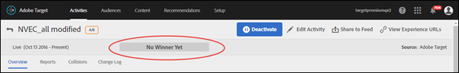

# 決定獲勝者{#determine-a-winner}

檢視 Target UI 中的指示器，來判斷自動分配 A/B 活動中的獲勝者。

許多行銷人員犯了一種錯誤，在結果指出明確的贏家之前便提早宣告獲勝體驗。我們現在已經可讓您輕鬆決定獲勝者。

## 在 Target UI 中檢視獲勝者徽章 {#section_24007470CF5B4D30A06610CE8DD23CE3}

使用[!UICONTROL 自動分配]功能時，在活動達到最低轉換次數且有足夠信賴度之前，[!DNL Target] 會在活動頁面頂端顯示徽章，指出「尚未有贏家」。

宣告明確的獲勝者時，[!DNL Target] 會顯示「獲勝者: 體驗 X」。

>[!NOTE]
>
>「自動分配」活動旨在所有選項之中找出最佳體驗，而不只與控制項進行成對比較而已。

## 自動分配的統計保證 {#section_7AF3B93E90BA4B80BC9FC4783B6A389C}

A/B 活動結束時，「自動分配」會保證決定的獲勝者有 5% 的有效誤判率。這表示在活動的所有體驗之中，只有 5% 的時間，決定的獲勝者實際上不是最佳體驗。如果是 A/A 測試 (使用相同的體驗)，我們發現測試有小於 5% 的時間。A/A 測試 (使用相同的體驗) 的預期行為是無限期執行，所以獲勝者徽章永遠不會出現。

對於「自動分配」，我們不採用 p 值信賴度。

「自動分配」的「信賴度」欄 (如下圖) 顯示體驗是獲勝者的機率，誤差率在 1% 之內 (亦即，在最佳和次佳轉換率之間，演算法採用最低可偵測效應 1%)。請注意，演算法採用 [Bernstein 不等式](https://en.wikipedia.org/wiki/Bernstein_inequalities_(probability_theory))來計算此機率。

一般 A/B 測試會根據 p 值來計算信賴度。「自動分配」不使用 p 值。P 值會「寬鬆」計算所給定體驗與控制項不同的機率。這些 p 值只能用來判斷體驗是否與控制不同。這些值只能用來判斷體驗是否與另一個體驗 (非控制) 不同。

下圖顯示尚無獲勝者的活動:

下圖顯示已有獲勝者的活動:

## 常見問題 {#section_C8E068512A93458D8C006760B1C0B6A2}

**進入活動已過了幾天。為何所有信賴度仍顯示 0%?**

下列任何原因說明所有活動在報表的[!UICONTROL 「信賴度」]欄中為何顯示 0%:

* 手動 A/B 測試和「自動分配」使用不同的統計量來顯示「信賴度」值。

   手動 A/B 測試採用基於 [Student 的 t 檢定](https://en.wikipedia.org/wiki/Student%27s_t-test)的 p 值。P 值計算所給定體驗與控制項不同的機率。這些 p 值只能用來判斷體驗是否與控制不同。這些值只能用來判斷體驗是否與另一個體驗 (非控制) 不同。

   自動分配顯示在活動的所有體驗之中，所給定體驗是真正獲勝者的機率。這表示只有勝出體驗 (很可能就是獲勝者) 才有非零的信賴值。其他很可能全部都是失敗者，將會顯示 0%。

* 只有在勝出體驗收集到 60% 信賴度時，「自動分配」才會開始顯示信賴度。「自動分配」比一般 A/B 測試大約快兩倍。若要判斷一般 A/B 測試會執行多久，請使用[樣本大小計算機](https://docs.adobe.com/content/target-microsite/testcalculator.html): 在「基準轉換率」中插入控制項的轉換率，「提升度」為 &quot;5%&quot;，「信賴度」為 95%。通常在每一個體驗至少累積每一體驗必要樣本的 50% 之後，才會開始出現信賴度。這樣可讓您大概知道何時會開始出現信賴度。
* 如果報表完全顯示 0%，可能表示太早進入活動。

