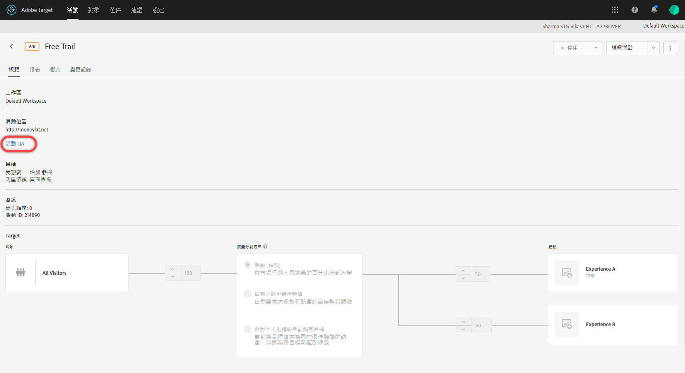
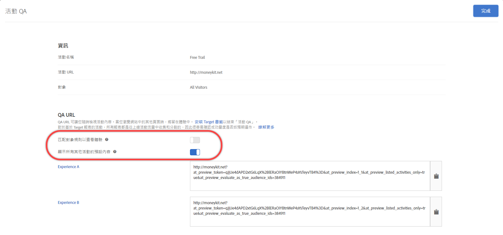

# 活動 QA

使用[!DNL Adobe Target]中的QA URL，以便透過預覽連結輕鬆執行端對端活動QA，這些連結不會變更、選擇性的受眾定位，以及與即時活動資料保持區隔的QA報告。

## 概述 {#section_11B761A522A14E61978275772210A4C2}

活動 QA 可讓您在將 Target 活動推上線之前進行完整測試。活動 QA 功能包括:

* 與團隊成員分享的連結，無論體驗或活動如何更新，這些連結皆不可能變更或需要重新產生。這可讓您完整測試整個使用者旅程中的活動。

   已新增[!UICONTROL Automated Personalization]活動的預覽連結支援[at.js 2.5.0](/help/c-implementing-target/c-implementing-target-for-client-side-web/target-atjs-versions.md)。

* 可選擇是否考量對象狀況，這讓市場行銷人員測試鎖定目標條件或忽略鎖定目標條件，以 QA 體驗的外觀，而不必配合對象狀況。
* 擷取 QA 報表，讓市場行銷人員可以確認量度如預期增加，且 QA 報表資料和生產報表 (適用於非 A4T 報表) 分開。
* 能夠單獨預覽體驗，或與符合傳送條件的其他即時活動（頁面/Target要求／觀眾）搭配預覽。
* 能夠 QA 整個使用者旅程。您可以利用 QA 連結來存取一次您的網站，然後在活動 QA 期間瀏覽整個網站。您會停留在活動 QA 中直到結束工作階段，或直到您使用[QA Target 書籤小程式](/help/c-activities/c-activity-qa/activity-qa-bookmark.md#concept_A8A3551A4B5342079AFEED5ECF93E879)強迫自己離開活動 QA。如果活動橫跨多個網頁，此功能特別有用。

   >[!NOTE]
   >
   >對於第2版的at.js實作而言，這是正確的。** x或更新版本。for at.js 1.** ximplementations，這只有在訪客的瀏覽器未封鎖第三方Cookie時才成立。

## 存取和共用 QA URL {#section_1C59BAA247B247BDB125D1BE8EAD4547}

1. 從活動的[!UICONTROL 概述]頁面，按一下&#x200B;**[!UICONTROL 活動QA]**&#x200B;連結。

   

1. 完成下列設定:

   

   * **匹配對象規則以查看體驗:** 您有時需要確認對象比對有效果。也有時只想檢查活動的外觀和風格。如果此設定切換到「開啟」位置，測試者必須符合鎖定目標需求，才有資格看到體驗。對於「體驗鎖定目標 (XT)」活動，只會提供單一活動 URL。您看到的體驗取決於您是否符合其中一個鎖定目標規則。

      如果此設定切換到「關閉」位置，則按一下連結所顯示的體驗不在乎您是否符合資格。執行 QA 時，您可以在是否需要顧及對象鎖定目標之間來回切換。

   * **顯示所有其他活動的預設內容：** 如果此選項被切換至「開啟」位置，則會針對所有其他活動顯示預設內容(例如，預覽會單獨顯示，而不會考慮相同頁面／請求上的所有其他即時[!DNL Target] 活動。

      如果此設定切換為「關閉」，請考量下列事項:

      * 如果您測試的活動與其他已上線的活動之間有衝突，則會套用[標準優先順序規則](/help/c-activities/priority.md#concept_1780C11FEA57440499F0047DD6900E0F)。因此，您可能看不到想要 QA 的活動。
      * 已檢視的活動會增加量度，但僅限於 QA 報表環境中。

1. 按一下 **[!UICONTROL 「完成」]**&#x200B;以儲存變更。
1. 與組織的成員共用活動連結 URL 以便測試。

   活動連結永不過期，如果有人變更活動或體驗，您不需要重送連結。不過，如果您從對象資料庫取得不同的對象，而非只編輯活動，則會產生新連結，將需要重新共用。

   每個活動連結 URL (用於體驗 A、體驗 B 等)可讓您從相應的體驗啟動使用者旅程。您可以按一下為體驗所產生的 URL，然後繼續正常的網站瀏覽，在多個頁面上查看體驗 (如果有多個頁面存在)。即使體驗橫跨多個頁面 (範本測試或多頁測試)，每個體驗也只會產生一個 URL。

   因為活動 QA 有黏性，您可以導覽網站來查看其他頁面。請注意，對於第2版的at.js實作而言，這是正確的。** x或更新版本。for at.js 1.** ximplementations，這只有在訪客的瀏覽器未封鎖第三方Cookie時才成立。

1. 若要查看從活動連結 URL 產生的報表，請按一下活動的 **[!UICONTROL 「報表」]** 頁面，按一下 **[!UICONTROL 「設定」]** 圖示 ()，然後從 **[!UICONTROL 「環境」]** 下拉式清單中選取 **[!UICONTROL 「QA 模式」]**。

## 考量事項 {#section_B256EDD7BFEC4A6DA72A8A6ABD196D78}

* 自動個人化 (AP) 除外，所有活動類型的[!UICONTROL 「概覽」]頁面上皆會顯示[!UICONTROL 「活動 QA」]連結。您可以使用[預覽連結](/help/c-activities/t-automated-personalization/experience-preview.md#task_586C6655A6FD4AF08F5678FC3F481EFC)以顯示 AP 活動。
* 如果帳戶中有太多已儲存的活動，已儲存活動的活動 QA 預覽連結可能會無法載入。重試預覽連結應可解決此問題。為避免繼續發生此問題，請封存不再需要使用的已儲存活動。
* 以 Analytics 作為報表來源 (A4T) 的活動皆有活動 QA URL。使用活動 QA 執行 QA 時所產生的點閱，將會流向活動資料所流向的相同個報表套裝 (即使活動上線後)。
* 針對已封存的活動或超過結束日期的活動，活動 QA 不會顯示內容。若停用已結束的活動，您必須再次儲存活動以使活動 QA 運作。
* 匯入到 Target Standard/Premium 的活動 (例如，從 Target Classic) 不支援 QA URL。
* 在自動分配、自動鎖定目標和建議活動中，模型不受活動 QA 中擷取的造訪所影響。
* 因為活動 QA 有黏性，當您在活動 QA 中瀏覽網站後，您的 Target 工作階段必須到期，否則需要由 Target 幫您脫離活動 QA，才能像一般訪客一樣檢視您的網站。使用[Target QA 書籤小程式](/help/c-activities/c-activity-qa/activity-qa-bookmark.md#concept_A8A3551A4B5342079AFEED5ECF93E879)強迫自己離開活動 QA。

   您也可以在網站上以帶有空白值的 `at_preview_token` 參數 (例如，`https://www.mysite.com/?at_preview_token=`) 來載入頁面，以手動強迫自己離開。

* 如果您在建立活動時指定「URL 是」[表單式撰寫器中的細分](/help/c-experiences/form-experience-composer.md#task_FAC842A6535045B68B4C1AD3E657E56E)或[可視化體驗撰寫器中的頁面傳送選項)](/help/c-experiences/c-visual-experience-composer/viztarget-options.md#reference_3BD1BEEAFA584A749ED2D08F14732E81)，則 QA URL 沒有作用，因為活動 QA 會附加 URL 參數。若要解決此問題，請按一下 QA URL 前往您的網站，從 URL 中移除附加的參數，然後載入新的 URL。
* 如果您有at.js 1。*如果*&#x200B;您使用Safari或其他封鎖第三方Cookie的瀏覽器，則x或mbox.js的「活動QA」模式將不嚴格。在這些情況下，您必須將預覽參數新增至您導覽至的每個URL。 如果您已實作[CNAME](/help/c-implementing-target/c-considerations-before-you-implement-target/implement-cname-support-in-target.md)，則情況也相同。
* 如果活動使用多個體驗對象 (例如，相同活動中包含的 US 和 UK 網站)，則這四個組合 (體驗 A/ US 網站、體驗 A/ UK 網站、體驗 B/ US 網站、體驗 B/ UK 網站) 不會產生 QA 連結。只會建立兩個 QA 連結 (體驗 A 和體驗 B)，使用者必須屬於適當的對象，才能看到頁面。UK QA 的人無法看見 US 網站。
* 所有 `at_preview` 參數和值皆已完成 URL 編碼。一切通常皆沒問題，不過，某些客戶可能有負載平衡器或 Web 伺服器，會嘗試將查詢字串參數再一次編碼。

   因為這會編碼兩次，當我們嘗試將 `at_preview_token` 解碼時，Target 無法擷取正確的 Token 值，導致預覽無法正常運作。

   我們建議您與IT團隊交談，以確保所有預覽參數皆可列出，以避免以任何方式轉換這些值。

   下表列出了可在域中列出的參數：

   | 參數 | 類型 | 值 | 說明 |
   |--- |--- |--- |--- |
   | `at_preview_token` | 加密的字串 | 強制；無預設值 | 此加密實體包含可在 QA 模式中執行的促銷活動 ID 清單。 |
   | `at_preview_index` | 字串 | 空白 | 參數格式為 `<campaignIndex>` 或 `<campaignIndex>_< experienceIndex>` 兩個索引的開頭皆為 1。 |
   | `at_preview_listed_activities_only` | 布林值 (true/false) | 預設值: false | 若設為「true」，則 `at_preview_index` 參數中指定的所有促銷活動都會經過處理。 若設為「false」，即使預覽 Token 中未指定促銷活動，頁面的所有促銷活動都會經過處理。 |
   | `at_preview_evaluate_as_true_audience_ids` | 字串 | 空白 | 在[!DNL Target]請求範圍中，應一律（在目標和報告層級）評估為&quot;true&quot;的區段Id清單(&quot;_&quot;)以底線分隔。 |
   | `_AT_Debug` | 字串 | 視窗或主控台 | 主控台記錄或新視窗。 |
   | `adobe_mc_ref` |  |  | 將預設頁面的轉介 URL 傳給新頁面。與 `AppMeasurement.js` 2.1 版 (或更新版) 一起使用時，[!DNL Adobe Analytics] 會在新頁面上將此參數值當作轉介 URL。 |
   | `adobe_mc_sdid` |  |  | 將補充資料 [!DNL Supplemental Data Id] (SDID) 和 [!DNL Experience Cloud Org Id] 從預設頁面傳給新頁面，以便 Analytics for Target (A4T) 將預設頁面的 Target 要求與新頁面的 Analytics 要求「拼接」起來。 |

* Target QA 模式 UI 只會顯示多頁活動中的體驗的第一個 URL。假設的情況試，您正在建立旅程測試，並將從 URL1 移轉到 URL2。不過，若要單獨前往 URL2，請複製根據 URL1 提供的所有 URL 參數，並在放置 &quot;?&quot; 後將其套用至 URL2，  就像您在 URL1 中看到的一樣。
