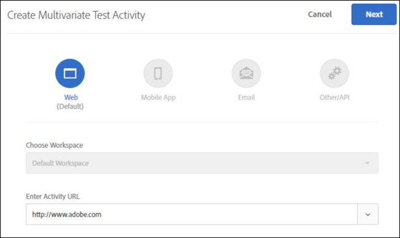
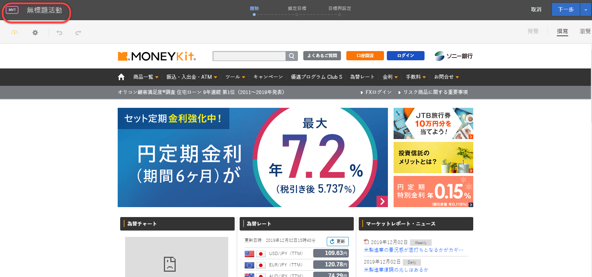
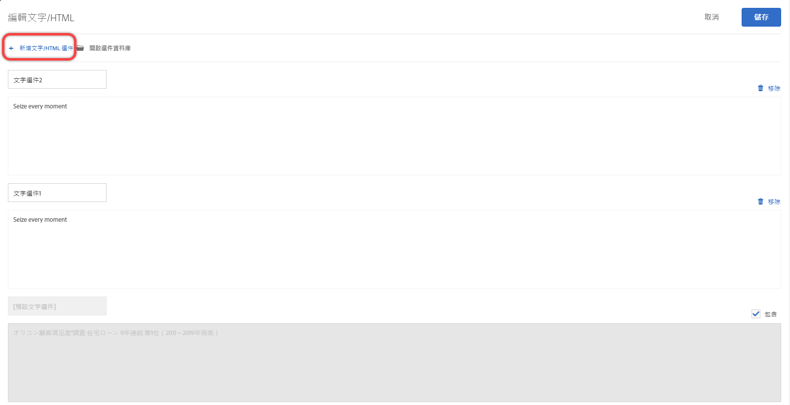
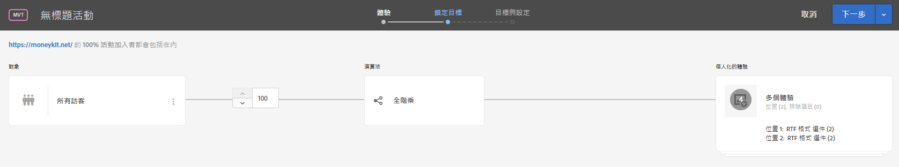

# 建立多變數測試{#create-a-multivariate-test}

Target 中的可視化體驗撰寫器讓您直接在啟用 Target 的頁面上輕鬆建立您的測試，以及在 Target 內修改頁面的部分。

Target 指向和點按編輯程式可讓您挑選任何位置並新增多個選件。

多變數測試需要頁面優先的報表。換句話說，測試會在具有您為頁面所設計體驗的特定 URL 上執行。

1. 按一下**[!UICONTROL 「建立活動]** &gt; **[!UICONTROL 多變數測試」]**。

   

1. 為您要測試的頁面[指定 URL](../../../c-activities/c-multivariate-testing/t-create-multivariate-test/url.md#concept_C12E4A85FF3B4E518E3110F6CF1AF9C0)，然後按一下**[!UICONTROL 「建立活動」]**。

   

   >[!NOTE]
   >
   >使用完整的 URL，開頭要包括 HTTP 或 HTTPS。

   如果出現訊息，要求您啟用您的瀏覽器使用混合的內容，請遵循訊息中的說明。為您的瀏覽器啟用混合的內容之後，請從步驟 1 重新開始。

   可視化體驗撰寫器隨即開啟。

   如遇問題，需要關於 VEC 的疑難排解資訊，請參閱[疑難排解可視化體驗撰寫器](../../../c-experiences/c-visual-experience-composer/r-troubleshoot-composer/troubleshoot-composer.md#reference_77743144F10143A3A89D56E116D296E4)。
1. 輸入活動的名稱。

   

   活動名稱中不允許下列字元:

   | 字元 | 說明 |
   |--- |--- |
   | / | 正斜線 |
   | ? | 問號 |
   | # | 數字符號 |
   | : | 冒號 |
   | = | 等號 |
   | + | 加號 |
   | - | 減號 |
   | @ | 「@」符號 |

1. [在每個位置中建立選件](../../../c-activities/c-multivariate-testing/t-create-multivariate-test/add-offers.md#concept_DCE6B45C30F7419B8EC17AFDEE8D8AA6)。

   

   您可以新增下列類型的選件:

   * HTML
   * 影像
   * 文字

1. [預覽您的體驗](../../../c-activities/c-multivariate-testing/t-create-multivariate-test/preview-experiences.md#task_21A700587E88453A9FC2210C0DE53A28)。

   

   您可以檢視每個體驗，以及排除不想在您的測試中包括的任何體驗。
1. [使用流量估算程式](../../../c-activities/c-multivariate-testing/t-create-multivariate-test/traffic-estimator.md#task_71AA6922AFD447EA8C5E610A78ABA714)來測試您的測試計劃的可行性。

     

1. 選擇對象和符合您要讓其進入活動之訪客的百分比。

   

   例如，您可將項目限制為所有訪客的 50%，或「加州人」觀眾的 45%。

   >[!NOTE]
   >
   >除了選取現有對象，您可以結合多個對象來建立隨選結合的對象而非建立新對象。如需詳細資訊，請參閱[合併多個對象](../../../c-target/combining-multiple-audiences.md#concept_A7386F1EA4394BD2AB72399C225981E5)。

1. [檢閱測試摘要](../../../c-activities/c-multivariate-testing/t-create-multivariate-test/test-summary.md#reference_971AB225963A4DC18EEB5B0E20F0A4A7)，並進行任何需要的變更，然後按一下**[!UICONTROL 「下一步」]**。

   

1. [指定測試的目標與設定](../../../c-activities/c-multivariate-testing/t-create-multivariate-test/goals-and-settings.md#reference_B25389FD6F3A4989801E740364B089CC)。

   

1. 按一下**[!UICONTROL 「儲存並關閉」]**來建立活動。

## 訓練影片: 建立多變數測試 (9:25)

此影片示範如何使用 Target 三步驟引導式工作流程來規劃和建立多變數測試。

* 定義和設計多變數測試
* 建立多變數測試

>[!VIDEO](https://video.tv.adobe.com/v/17395)
