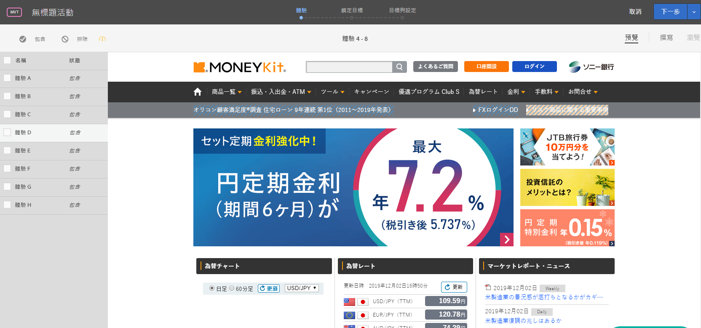

# 多變數測試的預覽體驗

由於[!DNL Adobe Target]中的[!UICONTROL 多變數測試]會比較頁面上的多個體驗，因此預覽包含每個體驗的頁面會很有幫助。

1. 在Visual Experience Composer(VEC)中，按一下「預覽」。****

   所有體驗的清單隨即出現。

   

1. 按一下清單中的體驗來檢視該體驗。

1. 若要將一或多個體驗從多變數測試中排除，請選取所需的體驗，然後按一下&#x200B;**[!UICONTROL 排除]**。

   

   您可能會排除顯示發生衝突變數的體驗，或是審美觀點上不平衡的體驗。

   >[!NOTE]
   >
   >建立多變數測試時，若您認可之後必須使用離線報表進行分析的警告，您現在可以從測試排除超過 10% 的體驗。

   依預設，所有體驗都包括在多變數測試中。若要納入已排除的體驗，請選取排除的體驗，然後按一下&#x200B;**[!UICONTROL 「包含」]**。

按一下&#x200B;**[!UICONTROL 「結束預覽模式」]**&#x200B;以回到體驗撰寫器，讓您可以進行變更，或按一下&#x200B;**[!UICONTROL 「繼續」]** 以前往測試摘要。
