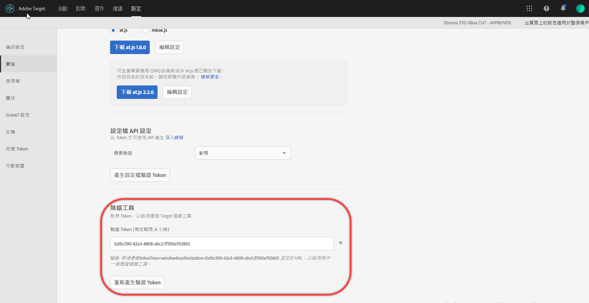

# 疑難排解內容傳送{#troubleshoot-content-delivery}

如果頁面未顯示預期的內容，您應執行一些步驟來除錯內容傳送。

* 請仔細檢查您的活動或促銷活動程式碼。錯字或其他錯誤都可能導致預期的內容無法顯示。
* 使用 mboxTrace 或 mboxDebug 來疑難排解 mbox。
* 使用 Adobe Experience Cloud Debugger，與 mboxDebug 提供的資訊大多相同的易用工具，來針對 mbox 進行疑難排解。

如果您在頁面上設定 Target 以確保引發 mbox 以及設定 Cookie，mboxDebug 會很有用。但是，這不會深入到偵錯內容傳送時很有用的詳細程度。如果您的活動未顯示在頁面上，或是顯示不想要的內容，請使用 mboxTrace 來詳細檢查和偵錯頁面。

## 擷取授權 Token 以用於偵錯工具 {#section_BED130298E794D1FA229DB7C3358BA54}

由於 mboxTrace 和 mboxDebug 會公開促銷活動資料和描述檔資料給外部對象，因此需要授權權仗。在[!DNL Target]UI 中可以擷取授權 Token。授權 Token 的有效期限為六小時。

擷取授權 Token:

1. 按一下**[!UICONTROL 「設定]** &gt; **[!UICONTROL 實作」]**。
1. 選取**[!UICONTROL 「mbox.js」]**或**[!UICONTROL 「at.js」]**。
1. 按一下**[!UICONTROL 「產生驗證 Token」]**。

   

1. 將產生的 Token 當作參數新增至 URL，以啟用其中一個進階偵錯工具。

## mboxTrace {#section_256FCF7C14BB435BA2C68049EF0BA99E}

mboxTrace 可讓您接收附加至 mbox 回應的追蹤資訊。追蹤資訊可反映 mbox 呼叫的結果 (例如，轉換或印象) 以及可協助判斷為何發生此特定結果的任何其他資料，例如在促銷活動中所進行選擇內的一組可用分支。請使用此資訊來對內容傳送除錯。

以下是可用的參數:

| mboxTrace 選項 | 結果 |
|--- |--- |
| `?mboxTrace=console` | 列印至控制台記錄做為物件。 針對 at.js，不使用彈出新瀏覽器視窗或輸出至控制台的 mbox.js 中，您需檢查網路請求並查看「預覽」(Chrome) 或「回應」(Firefox)。 |
| `?mboxTrace=json` | 列印至控制台記錄做為常值 JSON 字串 |
| `?mboxTrace=window` | 列印至彈出式視窗做為 JSON 字串 |
| `?mboxTrace=disable` | 關閉追蹤作業模式 |

**mboxTrace 呼叫範例**

`https://www.mysite.com/page.html?mboxTrace=window&authorization=f543abf-0111-4061-9619-d41d665c59a6`

輸出會顯示與內容相關的極詳細資訊。mboxTrace 會顯示與您促銷活動或活動以及描述檔相關的詳細資訊，也會提供執行前的描述檔快照，以及執行後的變更項目快照。同時顯示每個位置評估了哪些促銷活動或活動。

有些資訊包括相符和不相符的群體與目標 ID:

* **SegmentId**: 群體的 ID，來自可重複使用的群體庫或為特定促銷活動建立的匿名群體。
* **TargetId**: 目標的 ID，來自目標運算式庫或來自促銷活動的匿名目標。
* **不相符**: 請求在此呼叫中不符合那些群體或目標的資格。
* **相符**: 請求符合指定的群體或目標的資格。

**在 Recommendations 頁面上使用 mboxTrace**: 使用 mboxTrace 詳細資料視窗，新增 mboxTrace 做為具有建議之頁面上的查詢參數，以取代該頁面的 Recommendations 設計，此可顯示關於您建議的深入資訊，包括下列項目:

* 傳回的建議以較請求的建議
* 使用的索引鍵，以及是否產生建議
* 條件產生的建議比較備份建議
* 條件組態
* 套用的排除和包含
* 收集規則

您不需要在查詢參數中加入`=console`、`=json` 或 `=window`。使用完 mboxTrace 詳細資料後，請新增 `=disable`，然後按下 **[!UICONTROL Enter]** 鍵，即可返回正常顯示模式。

mboxTrace 不會影響您網站的正常功能和外觀。訪客看到的是您的正常 Recommendations 設計。

## mboxDebug {#section_DC92A0E4388A4A2787365AD9D556FEFA}

若要使用 mboxDebug，請附加 mboxDebug 參數至 URL 結尾。下列表格含有 mbox 相關 URL 參數的相關資訊。

>[!NOTE]
>
>有些 mboxDebug 參數可以不使用驗證。

| URL 參數 | 用途 |
|--- |--- |
| `mboxDebug=1` | 除錯工具 將此參數新增至任何已定義 mbox 的 URL 會開啟彈出式視窗，其中含有重要的除錯詳細資訊。Cookie 資訊、PCid 及作業 ID 值會出現，而且所有的 mbox URL 都會顯示。按一下 mbox URL 可顯示該 mbox 的回應。如需詳細資訊，請參閱 [mbox_debug.pdf](/help/assets/mbox_debug.pdf)。 |
| `mboxDebug=x-cookie` | 修改 Cookie |
| `mboxDisable=1` | 停用頁面上的 mbox |
| `mboxDebug=x-profile` | 檢視描述檔集合。 |
| `mboxDebug=x-time` | 顯示每個 mbox 請求的回應時間 |
| `mboxOverride.browserIp=<Insert IP address>` | 測試地理定位 使用這個 URL 參數測試地理定位。輸入 IP 位址作為這個屬性的值，Test&amp;Target 的地理定位功能會評估該 IP 位址，以比對促銷活動中設定的任何定位與群體劃分。 |

## Adobe Experience Cloud Debugger {#section_A2798ED3A431409690A4BE08A1BFCF17}

Adobe Experience Cloud Debugger 方便您快速且輕鬆地瞭解 Target 實作。您可以快速查看資料庫組態、檢查要求以確定您的自訂參數傳遞正確、開啟主控台記錄功能，以及停用所有 Target 要求。只要驗證進入 Experience Cloud，您就可以利用功能強大的 Mbox Trace 工具來檢查活動、對象資格以及訪客設定檔。

如需詳細資訊，請觀看下方的訓練影片:

如需更多詳細資訊，請參閱 [*Adobe Experience Cloud Debugger 擴充功能*文件](https://marketing.adobe.com/resources/help/en_US/experience-cloud-debugger/)。

## 如果在傳送期間 target.js 無法載入 {#section_ABBA5EFDFFB749D8BEE172DB1F973058}

如果在傳送期間 target.js 無法載入，mbox.js 會將 Cookie「em-disabled」傳送給訪客。此 Cookie 可避免使用 Visual Experience Composer 建立的選件在網站上轉譯。具有此 Cookie 的訪客看不到測試內容，也不會算入那些活動報表中。所有其他選件內容 (例如來自 Target Classic 的促銷活動) 會繼續載入。Cookie 從載入失敗起的存留期為 30 分鐘。

## 最暢銷商品未出現在建議中 {#section_3920C857270A406C80BE6CBAC8221ECD}

*`SIteCatalyst: purchase`*mbox 無法用於「購買」演算法流量資料。請改用 *`orderConfirmPage`*mbox。

## 檢查活動優先順序 {#section_3D0DD07240F0465BAF655D0804100AED}

以 [!DNL Target Standard/Premium] 建立的表單式活動，可能與 [!DNL Target Classic] UI 中的活動發生衝突，兩者有相同的優先順序且使用

## 自訂程式碼在 Internet Explorer 8 中未產生預期結果。{#section_FAC3651F19144D12A37A3E4F14C06945}

Target 不再支援 IE 8。

## 使用 mbox.js 時全域 Mbox 傳送的 JavaScript 內容未載入。{#section_03EC9B9C410B4F52A7FCD81840311709}

升級至 [!DNL mbox.js] 版本 58 或更新版。

Mbox.js 版本 58 和更新版本會在出現 HTML `BODY` 標記之後，立即對全域 mbox 執行非 JavaScript 內容。針對全域 mbox 的 `<script>` 標籤內的 JavaScript 內容會在觸發 `DOMContentLoaded` 事件之後執行。這個內容傳遞順序可確保全域 mbox 的 JavaScript 內容受到傳遞並正確呈現。

## Target Cookie 未設定 {#section_77AFEB541C0B495EB67E29A4475DF960}

如果您的網站有子網域，例如 [!DNL us.domain.com]，但您需要將 Target Cookie 設定在 [!DNL domain.com] (而不是 [!DNL us.domain.com])，則必須覆寫 `cookieDomain` 設定。如需詳細資訊，請參閱 [targetGlobalSettings()](/help/c-implementing-target/c-implementing-target-for-client-side-web/targetgobalsettings.md)。

## 如果元素也是 AEM 個人化的一部分，Target 內容會忽隱勿現或未出現。{#section_9E1DABEB75AB431FB9F09887E6DD07D3}

如果 DOM 元素 Adobe Experience Manager (AEM) 個人化目標鎖定和 Target 活動的一部分，Target 內容可能會忽隱忽現或沒有出現。

若要補救這種情況，您可以在執行 Target 的頁面上停用 AEM 個人化。

## 無效 URL 導致重新導向與遠端選件無法傳送。 {#section_7D09043B687F43B39DAEDF17D00375AC}

如果重新導向與遠端選件使用無效的 URL，可能會無法傳送。

若為重新導向選件，mbox 可包含 `/* invalid redirect offer URL */`

或

若為遠端選件，mbox 可包含 `/* invalid remote offer URL */`

您可在瀏覽器中或使用 mboxTrace 來檢查 mbox 回應。請參閱 [https://tools.ietf.org/html/std66](https://tools.ietf.org/html/std66) 以取得有效 URL 的詳細資訊。

## 訓練影片

以下影片含有本文章探討之概念的詳細資訊。

### 新增擴充功能

>[!VIDEO](https://video.tv.adobe.com/v/23114t2/)

### 基本 Target 偵錯

>[!VIDEO](https://video.tv.adobe.com/v/23115t2/)

### Mbox Trace

>[!VIDEO](https://video.tv.adobe.com/v/23113t2/)