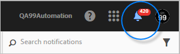
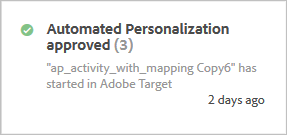

# 活動通知{#activity-notifications}

Target 可以與使用 Adobe Pulse 的其他 Adobe Experience Cloud 解決方案交換通知。Target 會為所有活動類型傳送兩種通知: 活動上線與活動停用時。

如果使用者有 [!DNL Target Standard/Premium] 的 [!DNL Experience Cloud] 產品環境定義，則可以在所有解決方案中看到來自 [!DNL Target] 的通知。

如需設定通知的詳細資訊，請參閱 [!DNL Adobe Experience Cloud] 文件中的通知。

從 [!DNL Target] 中的任何地方存取通知，但不包括從活動建立工作流程內: 按一下頁首的鈴聲圖示，以顯示或隱藏通知小工具。

對於所有活動類型，[!DNL Target] 會傳送兩種通知:

* 當活動上線且開始傳送選件時:

   例如:

   

* 當活動停用且停止傳送選件時:

   例如:

   

當排定的活動到了開始日期，以及到了結束日期而結束時，也會出現類似的通知。

所有 [!DNL Target] 通知會顯示已批准或停用的活動名稱，且包含 &quot;Adobe Target&quot; 以便於識別。

如果單一活動傳送相同類型的多個通知，則會合併成單一片卡，並於其中顯示通知數目。例如:

按一下通知卡片以檢視每一個通知的詳細資料。

例如，假設您按一下如上的卡片，則會顯示三個通知:

## 限制 {#section_B466EB20B2554CE7B1915374B39F4322}

* 通知不會指出是誰批准、停用或匯入活動。
* MVT 通知會顯示成「A/B 測試」，因為在 [!DNL Target Classic] 中是隨著 A/B 行銷活動而同步。

