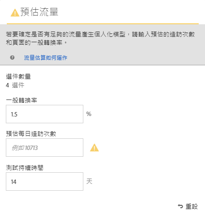
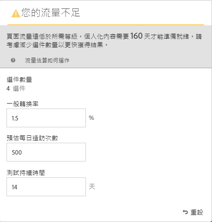
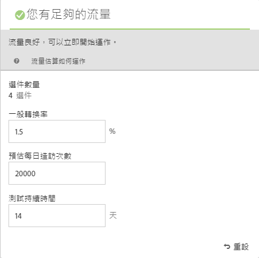

#  預估成功所需的流量

[!UICONTROL 流量估計器]提供反饋，讓您知道是否有足夠的流量使[!DNL Adobe Target]活動成功。

由於[!UICONTROL 自動個人化]活動使用多個選件組合，因此務必瞭解提供有意義結果所需的流量。 [!UICONTROL 流量估計器]會使用您頁面的統計資料和所測試體驗的數目，來估計流量量以及成功進行活動所需的測試持續時間。

[!UICONTROL 流量估計器]會比較估計的頁面印象和頁面的典型轉換率，判斷是否有足夠的流量產生個人化模型。 理想上，對於成功的活動，正確的樣本大小可確保個人化內容會在活動持續期間的 50% 或 14 天內就緒 (以較少者為準)。這可讓您有充分的時間來取得個人化內容並學習要傳送的內容。

請記住，[!DNL Target]會隨機提供體驗，直到建立個人化演算法為止。 每個選件旁的核取標籤圖示會顯示該選件的模型已就緒，且[!DNL Target]可開始傳送個人化內容。 因為僅能在模型就緒之後預期提升度，視覺說明可讓您設定正確的預期。使用[!UICONTROL 視覺體驗撰寫器](VEC)中的[!UICONTROL 流量估計器]，以取得模型準備就緒的指南。

## 使用流量估計器

1. 在[!UICONTROL Visual Experience Composer]中，按一下&#x200B;**[!UICONTROL Traffic]**。

   

   [!UICONTROL 流量估計器]隨即開啟。 您可以再次按一下「流量&#x200B;****」，隱藏「流量估計器]」。[!UICONTROL 

   

1. 提供一般轉換率 (或您從此活動預期的轉換率)、預估每日活動曝光次數和測試持續期間。

   * **選件數**:根據在排除任何項目後作為活動一部分建立的體驗數自動計算。
   * **一般轉換率**: 轉換率會根據您的估計或來自您分析系統的過去資料而以百分比表示.
   * **預計每日瀏覽次數**:這是根據定位條件，能夠檢視活動的訪客每天的瀏覽次數。這可能根據您的分析資料。請注意，此數量應為造訪次數，而非不重複訪客次數。
   * **測試持續時間**: 活動要執行的天數。

   [!UICONTROL 流量估計]r使用這些統計資料來判斷執行成功測試需要哪些調整。

   在[!UICONTROL 流量估計器]的頂部附近，將計算您輸入的值並顯示結果。

   

   當您變更數量時，預估即會變更。例如，如果您測試大量組合且轉換率和印象太低，[!UICONTROL 流量估計器]會顯示測試需要執行多久才能成功。 或者，如果您的流量較低，[!UICONTROL 流量估計器]可能會建議較少的選件組合，以便您執行所需天數的測試。

   如果您沒有足夠的流量，您可以執行以下一個或所有動作:

   * 請考慮使用[Auto-Target](/help/c-activities/auto-target/auto-target-to-optimize.md)活動，而非[!UICONTROL Automated Personalization]來建立體驗，其中在一個體驗變化中，有數個選件變更。
   * 減少[!UICONTROL 自動個人化]活動中的選件組合數。
   * 增加活動的持續時間。

   調整數字，直到[!UICONTROL 流量估計器]指出您有足夠的流量，然後據以設計您的測試。

   

   如果流量足夠，[!UICONTROL 流量]圖示會顯示綠色勾選。 如果流量不足，圖示會顯示紅色的警告標籤。

## 關於流量估計器的常見問題

使用[!UICONTROL 流量估計器]時，請考慮下列常見問答：

### 為什麼[!DNL Target]沒有在AP活動具有足夠流量時建立個人化模型？

在某些情況下，您的流量可能足夠大，足以建立個人化模型，但該流量可能會通知[!DNL Target]個人化模型與隨機模型之間沒有有意義的差異。 雖然模型是在[!DNL Target]中建立並經過測試，但不會部署它，因為模型並未明顯優於隨機模型。

模型未比隨機選件好的一個可能原因是選件彼此差異不大。 如果是這樣，您可以嘗試讓選件在視覺上更不同（如果訊息類似），或嘗試變更訊息本身。
