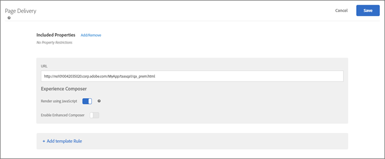

# 活動 URL{#activity-url}

活動 URL 會決定測試中使用以及設計測試時開啟的頁面。

活動建立期間出現提示時，請輸入活動 URL。輸入完整的 URL (包括 `https://`)，然後按一下**[!UICONTROL 「建立活動」]**。

>[!NOTE]
>
>[!DNL Target] 不會區分 URL 通訊協定([!DNL https] 和 [!DNL http])。因此，[!DNL `https://www.adobe.com`] 和 [!DNL `http://www.adobe.com`] 都相符。

依預設，可視化體驗撰寫器會開啟帳戶偏好設定中指定的頁面。您可以在活動建立期間指定不同的頁面。

若要在可視化體驗撰寫器開啟後顯示不同的頁面，請按一下**[!UICONTROL 「設定」]**，接著選取**[!UICONTROL 「URL」]**，然後在「活動 URL」方塊中輸入 URL。

按一下**[!UICONTROL 「新增範本規則」]來新增更多頁面或區段至活動。**

其他規則可以根據以下任何項目:

* URL
* 網域
* 路徑
* 雜湊 (#) 片段
* 查詢
* mbox 參數

可以使用「與」或「或」將其他規則加入活動 URL。您新增的所有規則會使用「與」彼此進行評估。

完成後，按一下**[!UICONTROL 「儲存」]。**

>[!NOTE]
>
>如果您輸入的網站 URL 不包括 Target Standard JavaScript 程式碼，則無法選取頁面元素。

依預設，[!UICONTROL 可視化體驗撰寫器]不允許對包含 JavaScript 的元素進行變更，例如旋轉橫幅。如果想要能夠使用**[!UICONTROL 可視化體驗撰寫器]更改這些元素，您可以將**[!UICONTROL 使用 JavaScript 呈現]切換為關閉。

>[!NOTE]
>
>如果您在對一或多個體驗的頁面進行變更之後變更 URL，則體驗會使用新頁面進行重設，而您所進行的變更會遺失。
