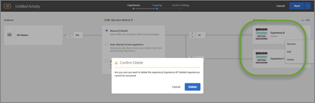

# 新增體驗{#add-experience}

可視化體驗撰寫器提供用於編輯您的頁面上體驗的視覺介面。

如需關於體驗的其他詳細資料，請參閱[體驗](../../../c-experiences/experiences.md#concept_A2E10F6AFB3D4AEAB6951EE14688848D)。

1. 按一下**[!UICONTROL 「新增體驗」]**。

   >[!NOTE]
   >
   >如果您要將體驗鎖定到某個對象，則必須先選取對象，才可以新增體驗。系統會出現訊息以提醒您選擇對象。

1. 出現提示時，輸入活動 URL。輸入完整的 URL (包括 `https://`)，然後按一下**[!UICONTROL 「繼續」]**。

   體驗撰寫器 (請參閱[體驗](../../../c-experiences/experiences.md#concept_1D011219034B492BB03C08B3BB80E3F0)) 會開啟在您的帳戶偏好設定中指定的頁面。若要顯示不同的頁面，請按一下「全域」圖示，接著在體驗撰寫器的「選取 URL」方塊中輸入 URL，然後按一下**[!UICONTROL 「繼續」]**。如果您輸入的網站 URL 不包括 Target Standard JavaScript 程式碼，則無法選取頁面元素。

   依預設，可視化體驗撰寫器不允許對包含 JavaScript 的元素進行變更，例如旋轉橫幅。如果您要能夠使用可視化體驗撰寫器來更改這些元素，則可以選擇停用 JavaScript。

   >[!NOTE]
   >
   >如果您在對一或多個體驗的頁面進行變更之後變更 URL，則體驗會使用新頁面進行重設，而您所進行的變更會遺失。

1. 選取您要變更的元素，並進行需要的變更。

   將游標移至頁面上的元素時，元素會強調顯示。任何強調顯示的元素可以使用體驗撰寫器加以更改。

   如果您在使用 Target Classic (先前的 Test&amp;Target) 的頁面上建立 mbox，該 mbox 會以元素的形式出現並顯示 mbox 名稱，且可如同任何其他元素般加以修改。

   如需可以在顯示頁面上執行元素以變更體驗的動作清單，請參閱[可視化體驗撰寫器選項](/help/c-experiences/c-visual-experience-composer/viztarget-options.md)。

   >[!NOTE]
   >
   >如果您從主要頁面以外的來源 (例如在 akamai.net 上託管並在 dell.com 上傳送的影像) 傳送影像，那麼該影像不會顯示在流程圖中所顯示頁面的縮圖中。

1. 完成體驗的設計時，請按一下核取記號按鈕。

   活動圖表顯示:

   

   如果體驗包括跨網域內容，縮圖可能不會準確顯示，且會由圖示取代。

1. 指定將在活動中看見每個體驗的訪客百分比。

   您可以對相同對象顯示多個體驗。圖表顯示會顯示您選取的對象和新增至活動的體驗。指定您要每個體驗顯示的時間百分比。您可以在所有體驗之間分割百分比，或對每個體驗指定較高或較低的百分比。所有體驗的總計必須等於 100%。您也可以按一下**[!UICONTROL 「新增體驗」]，以新增其他體驗至活動。**

   完成此步驟時，請按一下**[!UICONTROL 「繼續」]。**

## 重新命名、編輯或刪除體驗

請注意，您可以按一下 A/B 測試或體驗鎖定目標 (XT) 活動中體驗的「更多」(三個垂直的點) 圖示，並視需要選擇下列選項:

* 重新命名
* 編輯  
* 刪除

請注意，為體驗命名或重新命名時，不得使用下列字元:

| 字元 | 說明 |
|--- |--- |
| / | 正斜線 |
| ? | 問號 |
| # | 數字符號 |
| : | 冒號 |
| = | 等號 |
| + | 加號 |
| - | 減號 |
| @ | 「@」符號 |

## 複製體驗

您可以複製 A/B 測試中的體驗，不必從頭再次建立體驗，即可進行微幅變更。

在**[!UICONTROL 「體驗」]**頁面 (三步驟引導式工作流程的第一步)，按一下三個垂直的點 &gt; **[!UICONTROL 「複製」]**。

## 訓練影片: 使用可視化體驗撰寫器

以下的影片提供關於使用可視化體驗撰寫器選項的資訊。(7:17)

* 變更頁面的內容
* 變更頁面的配置

>[!VIDEO](https://video.tv.adobe.com/v/17399)
