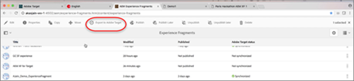

# AEM 體驗片段{#aem-experience-fragments}

在 Target 活動中使用在 Adobe Experience Manager (AEM) 中建立的體驗片段，以輔助最佳化或個人化的相關資訊。

## AEM 體驗片段 {#topic_1E1E4EA01F074349B2CF8785387B5FE8}

在 Target 活動中使用在 Adobe Experience Manager (AEM) 中建立的體驗片段，以輔助最佳化或個人化的相關資訊。

>[!NOTE]
>
>您需為 Adobe Experience Manager (AEM) 客戶才能使用此功能。如需詳細資訊，請參閱以下的[需求](../../c-experiences/c-manage-content/aem-experience-fragments.md#section_AE6F0971E1574B3AA324003599B96E5A)。

## 概述 {#section_95A91830530F493B81C5C9CDB9B783EA}

在 Target 活動中使用 AEM 中建立的體驗片段，可讓您將 AEM 的易用性和威力，結合 Target 中強大的自動化智慧 (AI) 和機器學習 (ML) 功能，以大規模測試並個人化體驗。

AEM 將您的所有內容和資產集中在一個中央位置，以支援您的個人化策略。AEM 可讓您在一個位置中輕鬆地為桌上型電腦、平板電腦和行動裝置建立內容，不必撰寫程式碼。不需要為每個裝置建立頁面，AEM 會自動根據您的內容來調整每一次體驗。

Target 可讓您根據一組包含行為、情境和離線變數的規則型和 AI 驅動型機器學習方法，以大規模實現個人化體驗。  透過 Target，您可以輕鬆地設定和執行 A/B 及多變數 (MVT) 活動，以決定最佳選件、內容和體驗。

體驗片段意味著，內容/體驗建立者和管理者，與使用 Target 來推動業務成果的最佳化和個人化專家，在合作方面跨出一大步。

## 要求 {#section_AE6F0971E1574B3AA324003599B96E5A}

您必須在 Target 中部署體驗片段功能。此外，您必須使用 AEM 6.3 版搭配對應的 Service Pack，或 6.4 版 (或更新版本)。您的客戶代表可協助確認您是否符合使用此功能的要求。

* Adobe Experience Manager 6.4 (或更新版本)。
* Adobe Experience Manager 6.3 SP2 (或更新版本)。
* Adobe Target Standard 或 Adobe Target Premium 帳戶。
* 聯絡 Adobe Target 客戶服務以啟用整合並提供您驗證詳細資訊。

## 在 AEM 中建立和設定體驗片段 {#section_745C8EFE29F547A2958FDBF61A5ADF7B}

為了在 Target 中使用 AEM 體驗片段，您必須執行下列步驟:

### 步驟 1: 整合 AEM 與 Target

如需詳細資訊，請參閱:

* **AEM 6.3:**[Adobe Experience Manager 6.3](https://docs.adobe.com/docs/en/aem/6-3/administer/integration/marketing-cloud/opt-in.html) 文件中的&#x200B;_選擇使用 Adobe Analytics 和 Adobe Target_。
* **AEM 6.4:**[Adobe Experience Manager 6.4](https://helpx.adobe.com/experience-manager/6-4/sites/administering/using/opt-in.html) 文件中的&#x200B;_選擇使用 Adobe Analytics 和 Adobe Target_。
* **AEM6.5：**[選擇加入Adobe Analytics和Adobe Target](https://helpx.adobe.com/experience-manager/6-5/sites/administering/using/opt-in.html)

### 步驟 2: 建立體驗片段

體驗片段是在 AEM 中建立。如需詳細資訊，請參閱:

* **AEM 6.3:**[Adobe Experience Manager 6.3](https://docs.adobe.com/docs/en/aem/6-3/author/experience-fragments.html) 文件中的&#x200B;*體驗片段*。
* **AEM 6.4:**[Adobe Experience Manager 6.4](https://helpx.adobe.com/experience-manager/6-4/sites/authoring/using/experience-fragments.html) 文件中的&#x200B;*體驗片段*。
* **AEM6.5：**[體驗片段](https://helpx.adobe.com/experience-manager/6-5/sites/authoring/using/experience-fragments.html)

### 步驟 3: 設定 AEM 讓 Target 共用體驗片段

1. 從 AEM 內，選取所需的體驗片段或其收納資料夾，然後按一下[!UICONTROL 「屬性」]。
2. 按一下[!UICONTROL 「雲端服務」]標籤，然後從[!UICONTROL 「雲端服務組態」]下拉式清單中，選取 [!UICONTROL Adobe Target]。

   >[!NOTE]
   >
   >上一步假設組織裡有人已建立 Adobe Target 組態。

3. 按一下[!UICONTROL 「儲存並關閉」]。

### 步驟 4: 發佈體驗片段並將其匯出至 Target

**AEM 6.3:**

1. 從 AEM 內，選取所需的體驗片段，按一下[!UICONTROL 「發佈」]標籤，然後按一下[!UICONTROL 「發佈」]按鈕。
2. 從 AEM 內，選取所需的體驗片段，按一下[!UICONTROL 「匯出至 Adobe Target」]，然後按一下[!UICONTROL 「確定」]。

   

**AEM 6.4:**

1. 從 AEM 內，選取所需的體驗片段，按一下[!UICONTROL 「匯出至 Adobe Target」]。

   

2. 在隨即顯示的對話方塊中，選取[!UICONTROL 「發佈」]，即可將體驗片段內的所有資產發佈至 [!DNL Target]。

## Using Experience Fragments in Target Activities {#section_17CE4BE6B2B74CCEBAE0C68DEB84ABB9}

執行先前的工作之後，體驗片段會顯示在 Target 的[!UICONTROL 「選件」]頁面中。

>[!NOTE]
>
>Target 目前每十分鐘會尋找要匯入的體驗片段。十分鐘內應該就能在 Target 中看到匯入的體驗片段，但日後所需時間會日益縮短。

>[!IMPORTANT]
>
>體驗片段目前是以 HTML 選件的形式匯入 Target 中。請注意，體驗片段「主要」版本會保留在 AEM 中。您無法在 Target 中編輯體驗片段。

您可以暫留在清單中的體驗片段上，然後按一下「檢視」圖示 (

)，以查看體驗片段的其他資訊，包括其公開選件傳送 URL、AEM 路徑，以及用來在 AEM 內開啟體驗片段的深層連結。

您可以使用可視化體驗撰寫器 (VEC) 或表單式體驗撰寫器，在 Target 活動中取用體驗片段。

>[!NOTE]
>
>若要充分利用 Target 的 AI 和 ML 功能，您可以在建立 A/B 測試時選取[「自動分配」](../../c-activities/automated-traffic-allocation/automated-traffic-allocation.md#concept_A1407678796B4C569E94CBA8A9F7F5D4)或[「自動個人化」](../../c-activities/t-automated-personalization/automated-personalization.md#task_8AAF837796D74CF893CA2F88BA1491C9)。

**使用 VEC 來取用體驗片段:**

1. 在 Target 中，建立或編輯體驗時[可視化體驗撰寫器](../../c-experiences/experiences.md#concept_A2E10F6AFB3D4AEAB6951EE14688848D)，請在頁面上按一下您要插入 AEM 內容的位置，然後選取&#x200B;**[!UICONTROL 「交換體驗片段」]**，以顯示[!UICONTROL 「選擇體驗片段」]清單。

   >[!NOTE]
   >
   >[!UICONTROL 「交換體驗片段」]選項不適用於影像。如果您想將此選項用於影像，請按一下包含所需影像的容器元素。

   顯示 AEM 中所建立所有內容的[!UICONTROL 體驗片段]清單，現在已可從 Target 內取得原生清單。

   

1. 選取需要的體驗片段，然後按一下&#x200B;**[!UICONTROL 「儲存」]**。
1. 完成活動的設定。

   如需有關設定各種活動類型的詳細資訊，請參閱下列主題:

   * **A/B 測試:** [建立 A/B 測試](../../c-activities/t-test-ab/t-test-create-ab/test-create-ab.md#task_68C8079BF9FF4625A3BD6680D554BB72)
   * **自動分配:** [自動分配](../../c-activities/automated-traffic-allocation/automated-traffic-allocation.md#concept_A1407678796B4C569E94CBA8A9F7F5D4)
   * **自動鎖定目標** [針對個人化體驗自動鎖定目標](../../c-activities/auto-target-to-optimize.md#concept_67779E5B7F67427A97D7EA2A6FB919B3)
   * **Automated Personalization (AP):**[建立 Automated Personalization 活動](../../c-activities/t-automated-personalization/create-ap-activity.md#task_8AAF837796D74CF893CA2F88BA1491C9)
   * **體驗鎖定目標 (XT):** [建立體驗鎖定目標活動](../../c-activities/t-experience-target/t-xt-create/xt-create.md#task_D6B3429AC31549E1A70EDF04B3DDC765)
   * **多變數測試 (MVT):** [建立多變數測試](../../c-activities/c-multivariate-testing/t-create-multivariate-test/create-multivariate-test.md#task_BF870FA60A8245AB8F0B775BE32EA710)
   * **建議:** [建立建議活動](../../c-recommendations/t-create-recs-activity/create-recs-activity.md#task_6874328773C64C44A73F0A130AD3F96F)

**使用表單式體驗撰寫器來取用體驗片段:**

1. 在 Target 中，建立或編輯體驗時[表單式體驗撰寫器](../../c-experiences/form-experience-composer.md#task_FAC842A6535045B68B4C1AD3E657E56E)，請在頁面上按一下您要插入 AEM 內容的位置，然後選取&#x200B;**[!UICONTROL 「變更體驗片段」]**，以顯示[!UICONTROL 「選擇體驗片段」]清單。

   

   顯示 AEM 中所建立所有內容的[!UICONTROL 體驗片段]清單，現在已可從 Target 內取得原生清單。

1. 選取需要的體驗片段，然後按一下&#x200B;**[!UICONTROL 「儲存」]**。
1. 完成活動的設定。

## 訓練影片: 將 AEM 體驗片段用於 Adobe Target {#section_C0EDC54063464F41A182492D2045BC64}

下列影片會示範如何設定並使用體驗片段: [搭配 Adobe Target 使用 AEM 體驗片段](https://helpx.adobe.com/experience-manager/kt/sites/using/experience-fragment-target-feature-video-use.html)。
