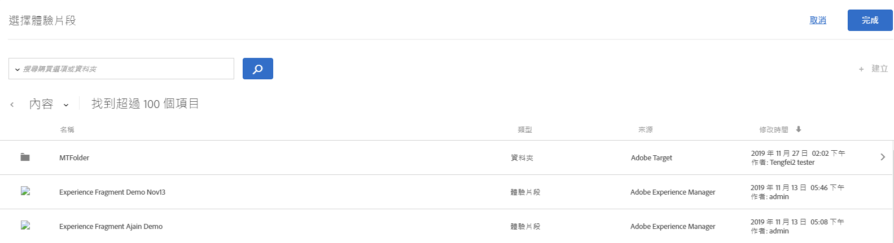

# AEM 體驗片段{#aem-experience-fragments}

Information about using experience fragments created in [!DNL Adobe Experience Manager] (AEM) in [!DNL Target] activities to aid optimization or personalization.

>[!NOTE]
>
>This feature requires that you are an [!DNL Adobe Experience Manager] ([!DNL AEM]) customer. 如需詳細資訊，請參閱以下的[需求](../../c-experiences/c-manage-content/aem-experience-fragments.md#section_AE6F0971E1574B3AA324003599B96E5A)。

## 概述 {#section_95A91830530F493B81C5C9CDB9B783EA}

Using experience fragments created in [!DNL AEM] in [!DNL Target] activities lets you combine the ease-of-use and power of [!DNL AEM] with powerful Automated Intelligence (AI) and Machine Learning (ML) capabilities in [!DNL Target] to test and personalize experiences at scale.

[!DNL AEM] 將您的所有內容和資產集中在一個中央位置，以支援您的個人化策略。[!DNL AEM] 可讓您在一個位置中輕鬆地為桌上型電腦、平板電腦和行動裝置建立內容，不必撰寫程式碼。您不需要為每個裝置建立頁面。 [!DNL AEM] 使用您的內容自動調整每個體驗。

[!DNL Target] 可讓您根據一組包含行為、情境和離線變數的規則型和 AI 驅動型機器學習方法，以大規模實現個人化體驗。With [!DNL Target] you can easily set up and run [A/B Test](/help/c-activities/t-test-ab/test-ab.md) and [Multivariate](/help/c-activities/c-multivariate-testing/multivariate-testing.md) (MVT) activities to determine the best offers, content, and experiences.

Experience fragments represent a huge step forward to link the content/experience creators and managers to the optimization and personalization professionals who are driving business outcomes using [!DNL Target].

## 要求 {#section_AE6F0971E1574B3AA324003599B96E5A}

You must be provisioned with the experience fragments functionality within [!DNL Target]. In addition, you must be using [!DNL AEM] 6.3 with the appropriate service pack or [!DNL AEM] 6.4 (or later). 您的客戶代表可協助確認您是否符合使用此功能的要求。

* [!DNL Adobe Experience Manager] 6.4（或更新版本）。
* [!DNL Adobe Experience Manager] 6.3 SP2（或更新版本）。
* [!DNL Adobe Target Standard] 或帳 [!DNL Adobe Target Premium] 戶。
* Contact [Adobe Target Customer Care](/help/cmp-resources-and-contact-information.md#reference_ACA3391A00EF467B87930A450050077C) to enable the integration and to provide you with authentication details.

## Creating and configuring experience fragments in [!DNL AEM] {#section_745C8EFE29F547A2958FDBF61A5ADF7B}

In order to use [!DNL AEM] experience fragments in [!DNL Target], you must perform the following steps:

### 步驟1:與 [!DNL AEM] [!DNL Target]

如需詳細資訊，請參閱:

* **[!DNL AEM]6.3**: [在](https://docs.adobe.com/docs/en/aem/6-3/administer/integration/marketing-cloud/opt-in.html) Adobe Experience Manager 6.3檔案中選擇Adobe Analytics和Adobe Target __ 。
* **[!DNL AEM]6.4**: [在](https://helpx.adobe.com/experience-manager/6-4/sites/administering/using/opt-in.html) Adobe Experience Manager 6.4檔案中選擇Adobe Analytics和Adobe Target __ 。
* **[!DNL AEM]6.5**: [在](https://helpx.adobe.com/experience-manager/6-5/sites/administering/using/opt-in.html) Adobe Experience Manager 6.5檔案中選擇Adobe Analytics和Adobe Target ** 。

### 步驟 2: 建立體驗片段

Experience fragments are created in [!DNL AEM]. 如需詳細資訊，請參閱:

* **[!DNL AEM]6.3**: [在](https://docs.adobe.com/docs/en/aem/6-3/author/experience-fragments.html) Adobe Experience Manager 6.3檔案中體驗片段 ** 。
* **[!DNL AEM]6.4**: [Adobe Experience Manager 6](https://helpx.adobe.com/experience-manager/6-4/sites/authoring/using/experience-fragments.html) .4文 *件中的體驗片段* 。
* **[!DNL AEM]6.5**: [在](https://helpx.adobe.com/experience-manager/6-5/sites/authoring/using/experience-fragments.html) Adobe Experience Manager 6.5檔案中體驗片段 ** 。

### Step 3: Configure [!DNL AEM] to share the experience fragment with [!DNL Target]

1. From within [!DNL AEM], select the desired experience fragment or its containing folder, then click **[!UICONTROL Properties]**.
2. 按一下&#x200B;**[!UICONTROL 「雲端服務」]**&#x200B;標籤，然後從&#x200B;**[!UICONTROL 「雲端服務組態」]**&#x200B;下拉式清單中，選取 **[!UICONTROL Adobe Target]**。

   >[!NOTE]
   >
   >The previous step assumes that someone in your organization has created the [!DNL Adobe Target] configuration.

3. 按一下&#x200B;**[!UICONTROL 「儲存並關閉」]**。

### 步驟 4: 發佈體驗片段並將其匯出至 [!DNL Target]

視您的版 [!DNL AEM] 本而定，請參閱下列連結以取得逐步指示：

* **[!DNL AEM]6.3**: [在](https://helpx.adobe.com/experience-manager/6-3/sites/administering/using/experience-fragments-target.html) Adobe Experience Manager 6.3檔案中，將體驗片段匯出至Target ** 。
* **[!DNL AEM]6.4**: [在](https://docs.adobe.com/content/help/en/experience-manager-64/administering/integration/experience-fragments-target.html) Adobe Experience Manager 6.4檔案中，將體驗片段匯出至Target ** 。
* **[!DNL AEM]6.5**: [在](https://helpx.adobe.com/experience-manager/6-5/sites/administering/using/experience-fragments-target.html) Adobe Experience Manager 6.5檔案中將體驗片段匯出至Target ** 。

## Using experience fragments in Target activities {#section_17CE4BE6B2B74CCEBAE0C68DEB84ABB9}

After performing the preceding tasks, the experience fragment displays on the [!UICONTROL Offers] page in [!DNL Target].

>[!NOTE]
>
>[!DNL Target] 目前每十分鐘會尋找要匯入的體驗片段。The imported experience fragment should be available in [!DNL Target] within ten minutes, but this time frame should shorten going forward.

>[!IMPORTANT]
>
>The experience fragment is currently imported into [!DNL Target] as an HTML offer. Note that the experience fragment &quot;primary&quot; version remains in [!DNL AEM]. You cannot edit the experience fragment in [!DNL Target].

您可以將滑鼠指標暫留在清單中的體驗片段上，然後按一下「 [!UICONTROL View] 」（檢視）圖示「  ，以檢視體驗片段的其他資訊，包括其公開選件傳送URL及其路 [!DNL AEM] 徑。

You can consume experience fragments in [!DNL Target] activities using the [Visual Experience Composer](/help/c-experiences/c-visual-experience-composer/visual-experience-composer.md) (VEC) or the [Form-Based Experience Composer](/help/c-experiences/form-experience-composer.md).

>[!NOTE]
>
>To fully utilize the [!DNL Target] AI and ML functionality, you can select [Auto-Allocate](../../c-activities/automated-traffic-allocation/automated-traffic-allocation.md#concept_A1407678796B4C569E94CBA8A9F7F5D4) or [Auto-Allocate](/help/c-activities/automated-traffic-allocation/automated-traffic-allocation.md) while creating an A/B Test.

**若要使用VEC使用體驗片段：**

1. 在 [!DNL Target]中，在 [Visual Experience Composer中建立或編輯體驗時，按一下您要插入內容之頁面上的位置，然後選取所要的選項以顯示「](../../c-experiences/experiences.md#concept_A2E10F6AFB3D4AEAB6951EE14688848D)[!DNL AEM] 選擇體驗片段」清單。

   * [!UICONTROL 插入在前]
   * [!UICONTROL 插入在後]
   * [!UICONTROL 與體驗片段交換]

   The [!UICONTROL Experience Fragment] list displays all of the content created in [!DNL AEM] that is now natively available from within [!DNL Target].

   >[!NOTE]
   >
   >[!UICONTROL 「交換體驗片段」]選項不適用於影像。如果您想將此選項用於影像，請按一下包含所需影像的容器元素。

   

1. Select the desired experience fragment, then click **[!UICONTROL Done]**.
1. 完成活動的設定。

   如需有關設定各種活動類型的詳細資訊，請參閱下列主題:

   * **A/B 測試:** [建立 A/B 測試](../../c-activities/t-test-ab/t-test-create-ab/test-create-ab.md#task_68C8079BF9FF4625A3BD6680D554BB72)
   * **自動分配:** [自動分配](../../c-activities/automated-traffic-allocation/automated-traffic-allocation.md#concept_A1407678796B4C569E94CBA8A9F7F5D4)
   * **自動定位：**[自動定位](/help/c-activities/auto-target-to-optimize.md)
   * **Automated Personalization (AP):**[建立 Automated Personalization 活動](../../c-activities/t-automated-personalization/create-ap-activity.md#task_8AAF837796D74CF893CA2F88BA1491C9)
   * **體驗鎖定目標 (XT):** [建立體驗鎖定目標活動](../../c-activities/t-experience-target/t-xt-create/xt-create.md#task_D6B3429AC31549E1A70EDF04B3DDC765)
   * **多變數測試 (MVT):** [建立多變數測試](../../c-activities/c-multivariate-testing/t-create-multivariate-test/create-multivariate-test.md#task_BF870FA60A8245AB8F0B775BE32EA710)
   * **建議:** [建立建議活動](../../c-recommendations/t-create-recs-activity/create-recs-activity.md#task_6874328773C64C44A73F0A130AD3F96F)

**若要使用表單型體驗撰寫器來使用體驗片段：**

1. 在 [!DNL Target]建立或編輯表單型體驗撰寫器中的體驗時 [，選取您要插入內容的頁面位置，然後選取](../../c-experiences/form-experience-composer.md#task_FAC842A6535045B68B4C1AD3E657E56E)Change Experience Fragment [!DNL AEM] ，以顯示 **** Choose an Experience Fragment Composer。

   

   The [!UICONTROL Experience Fragment] list displays all of the content created in [!DNL AEM] that is now natively available from within [!DNL Target].

1. 選取需要的體驗片段，然後按一下&#x200B;**[!UICONTROL 「儲存」]**。
1. 完成活動的設定。

## 考量事項 {#considerations}

* [!DNL Target] 目前每十分鐘會尋找要匯入的體驗片段。The imported experience fragment should be available in [!DNL Target] within ten minutes, but this time frame should shorten going forward.
* The experience fragment is currently imported into [!DNL Target] as an HTML offer. Note that the experience fragment &quot;primary&quot; version remains in [!DNL AEM]. You cannot edit the experience fragment in [!DNL Target].
* 您可以將JSON選件匯入為體驗片段 [!DNL Target]。 不過，這些選件會匯入為HTML選件。 UI目前不完全支援JSON選件（體驗片段） [!DNL Target] 。
* 您無法使用Adobe IO建立體驗片段。 您必須使用AEM建立體驗片段，如上所述。

## Training video: Using AEM experience fragments with Adobe Target  {#section_C0EDC54063464F41A182492D2045BC64}

以下影片將示範如何設定和使用體驗片段：

>[!VIDEO](https://video.tv.adobe.com/v/22383)

>[!NOTE]
>
>4: [!DNL AEM] 54討論的深層連結功能已移除。

如需詳細資訊，請參 [閱「](https://docs.adobe.com/content/help/en/experience-manager-learn/sites/personalization/experience-fragment-target-offer-feature-video-use.html) AEM Sites影片和教學課程」頁面上的「搭配Adobe Target使用體驗片段 ** 」。
