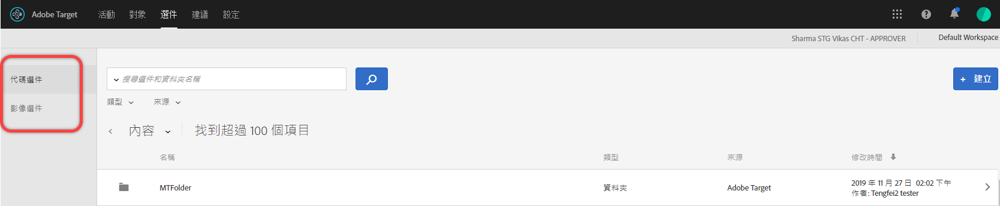

# 選件{#offers}

使用選件資料庫來管理您的代碼選件和影像選件內容。

>[!NOTE]
>
>在 2017 年 1 月版本中，透過 [!DNL Target Classic]、[!DNL Adobe Experience Manager] (AEM)、[!DNL Adobe Mobile Services] (AMS) 和 API 建立的選件，可顯示在 [!DNL Target Standard/Premium] 使用者介面中。將可看見前兩年使用這些方法所更新的選件 (亦即 2015 年 1 月及之後)。組織中的任何使用者第一次開啟[!UICONTROL 「選件」]頁面時，將會進行首次同步處理。首次同步處理所需的時間視資料量而定。首次同步處理之後，資料會漸進地同步。在此版本之前，如果您在相同的資料夾中有程式碼和影像，[!DNL Target] 會將它們分割成兩個重複的資料夾。請注意，「已更新」日期和時間是指資料夾移轉的時間，不是反映您最初建立資料夾的日期。

按一下&#x200B;**[!UICONTROL 「選件」]**&#x200B;以開啟資料庫。此資料庫包含已透過 [!DNL Target Standard/Premium]、[!DNL Target Classic]、[!DNL Adobe Experience Manager] (AEM)、[!DNL Adobe Mobile Services] (AMS) 和 API 來設定的選件。在 [!DNL Target Classic] 或其他解決方案中建立的選件，都可以在 [!DNL Target Standard/Premium] 中編輯。

[!UICONTROL 「選件」]頁面的右側有兩個標籤: 程式碼選件和影像選件，可讓您依類型來檢視選件。

您可以依類型 (HTML 選件、重新導向選件、遠端選件或資料夾) 和依來源 (Adobe Target, Adobe Target Classic, Adobe Experience Manager, Adobe Mobile Services 或 API) 來篩選選件。

您可以暫留在所需的項目上，然後按一下「編輯」或「複製」，以編輯或複製資料夾或選件。

## 檢視選件定義  {#section_6B059DD121434E6292CAB393507D010E}

在「選件資料庫」中，您可以在快顯卡片上檢視選件定義詳細資料，而不需要開啟選件。

例如，暫留在「內容清單」上的某個選件，然後按一下資訊圖示，即可存取 HTML 選件的選件定義卡片，如下所示:

可使用下列資訊:

* 名稱
* 來源
* 類型
* 選件 ID
* 選件路徑
* 上次修改

按一下[!UICONTROL 「選件使用情況」]標籤，即可在每一個選件的定義快顯卡片中，檢視已參考程式碼選件的活動。此功能不適用影像選件。這樣可讓您在編輯選件時，避免影響其他活動。資訊包括「已上線活動」和「非使用中的活動」。

以下是「重新導向」選件的選件定義卡片:

可使用下列資訊:

* 名稱
* 來源
* 類型
* 選件 ID
* 選件路徑
* 上次修改
* 重新導向 URL
* 包含所有 URL 參數 (開啟或關閉)
* 傳遞 mbox 工作階段 ID (開啟或關閉)

以下是「遠端」選件的選件定義卡片:

可使用下列資訊:

* 名稱
* 來源
* 類型
* 選件 ID
* 選件路徑
* 上次修改
* 重新導向 URL 類型
* 絕對或相對 URL

## 訓練影片: 內容存放庫  

此影片包含管理選件的相關資訊。

* [Experience Cloud 資產資料庫](https://experienceleague.adobe.com/docs/core-services/interface/assets/creative-cloud.html) 與 Target 內容庫之間的連線
* 自訂 HTML 選件
* 可視化體驗撰寫器中的自訂 HTML 選件

>[!VIDEO](https://video.tv.adobe.com/v/17387)