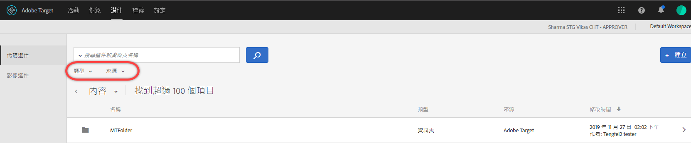
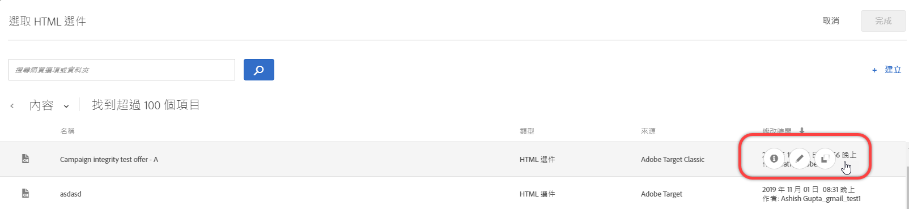
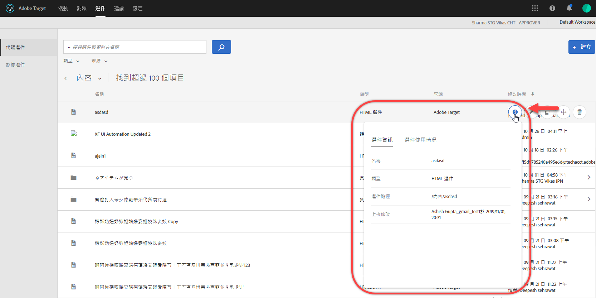
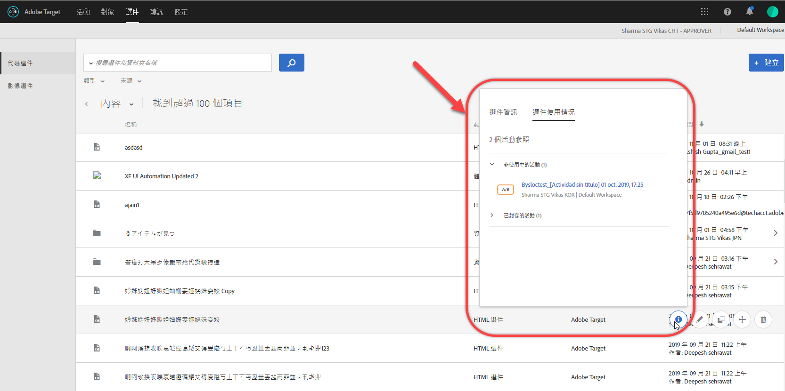
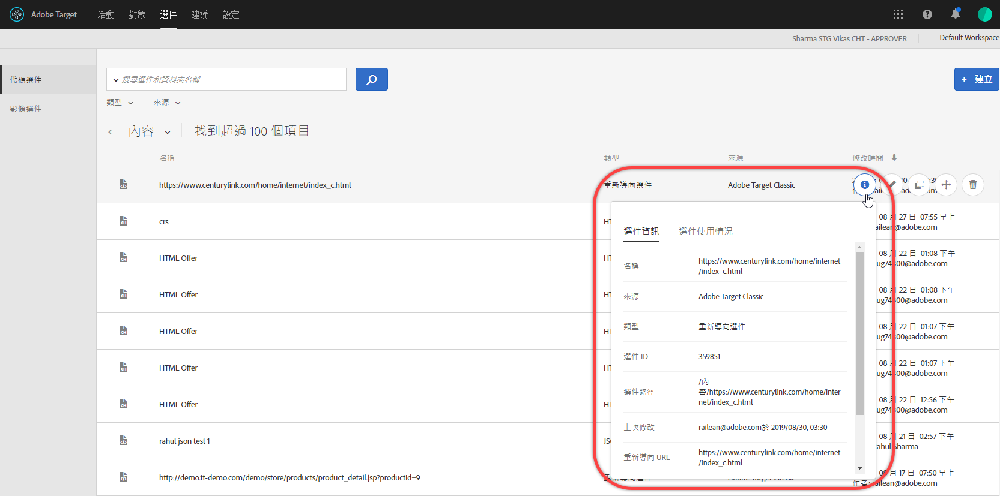
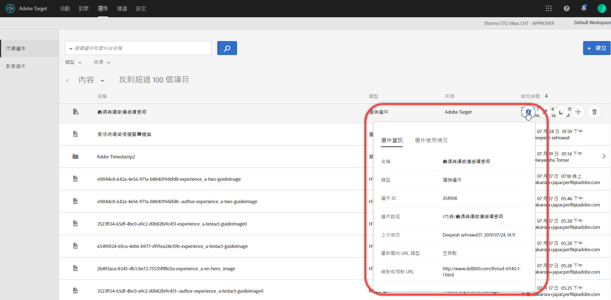

# 選件

使用[!DNL Adobe Target]中的[!UICONTROL 選件]程式庫來管理您的程式碼選件和影像選件內容。

1. 按一下&#x200B;**[!UICONTROL 「選件」]**&#x200B;以開啟資料庫。

   此資料庫包含已透過 [!DNL Target Standard/Premium]、[!DNL Target Classic]、[!DNL Adobe Experience Manager] (AEM)、[!DNL Adobe Mobile Services] (AMS) 和 API 來設定的選件。在 [!DNL Target Classic] 或其他解決方案中建立的選件，都可以在 [!DNL Target Standard/Premium] 中編輯。

   [!UICONTROL 選件]頁面右側有兩個標籤：[!UICONTROL 程式碼選件]和[!UICONTROL 影像選件]，可讓您依類型檢視選件。

   

1. （可選）按一下「**[!UICONTROL 類型]**」下拉式清單，依類型篩選選件（HTML選件、[體驗片段](/help/c-experiences/c-manage-content/aem-experience-fragments.md)、[重新導向選件](/help/c-experiences/c-manage-content/offer-redirect.md)、[遠端選件](/help/c-experiences/c-manage-content/about-remote-offers.md)、[JSON選件](/help/c-experiences/c-manage-content/create-json-offer.md)和&lt;a）10/>資料夾](/help/c-experiences/c-manage-content/create-content-folder.md))。[

   

1. （可選）按一下&#x200B;**[!UICONTROL 來源]**&#x200B;下拉式清單，依來源（Adobe Target、Adobe Target Classic和Adobe Experience Manager）篩選選件。

1. （可選）將滑鼠指標暫留在[!UICONTROL 程式碼選件]標籤上所要的選件或資料夾上，然後按一下所要的圖示，以執行其他工作。

   

   選項包括:

   * 檢視（如需詳細資訊，請參閱下方的[檢視選件定義](#section_6B059DD121434E6292CAB393507D010E)。）
   * 編輯
   * 複製
   * 移動（例如，要將一個或多個項目移動到資料夾中，請按一下所需項目的&#x200B;**[!UICONTROL 移動]**&#x200B;表徵圖，按一下所需資料夾，然後按一下&#x200B;**[!UICONTROL 拖放]**。）
   * 刪除

   視您的權限而定，您可能看不到所有選項的圖示。 例如，具有[!UICONTROL Observer]權限的使用者無權使用[!UICONTROL Copy]選項。

1. （可選）將滑鼠指標暫留在[!UICONTROL 影像選件]標籤上所要的影像選件或資料夾上，然後按一下所要的圖示，以執行其他工作。

   

   選項包括:

   * 選擇
   * 下載
   * 檢視屬性
   * 編輯
   * 注釋
   * 複製

## 檢視選件定義{#section_6B059DD121434E6292CAB393507D010E}

您可以在[!UICONTROL 選件]程式庫中檢視快顯資訊卡的選件定義詳細資訊，而不需開啟選件。

例如，將滑鼠指標暫留在[!UICONTROL Content]清單上的選件上，然後按一下資訊圖示，即可存取HTML選件的下列選件定義卡：

可使用下列資訊:

* 名稱
* 來源
* 類型
* 選件 ID
* 選件路徑
* 上次修改

按一下[!UICONTROL 「選件使用情況」]標籤，即可在每一個選件的定義快顯卡片中，檢視已參考程式碼選件的活動。此功能不適用影像選件。這樣可讓您在編輯選件時，避免影響其他活動。資訊包括[!UICONTROL 即時活動]和[!UICONTROL 非活動活動]。

以下是「重新導向」選件的選件定義卡片:

可使用下列資訊:

* 名稱
* 來源
* 類型
* 選件 ID
* 選件路徑
* 上次修改
* 重新導向 URL
* 包含所有URL參數（開啟或關閉）
* 傳遞mbox作業ID（開啟或關閉）

以下是「遠端」選件的選件定義卡片:

可使用下列資訊:

* 名稱
* 來源
* 類型
* 選件 ID
* 選件路徑
* 上次修改
* 重新導向 URL 類型
* 絕對或相對 URL

## 訓練影片: 內容存放庫  

此影片包含管理選件的相關資訊。

* [Experience Cloud 資產資料庫](https://experienceleague.adobe.com/docs/core-services/interface/assets/creative-cloud.html) 與 Target 內容庫之間的連線
* 自訂 HTML 選件
* 可視化體驗撰寫器中的自訂 HTML 選件

>[!VIDEO](https://video.tv.adobe.com/v/17387)