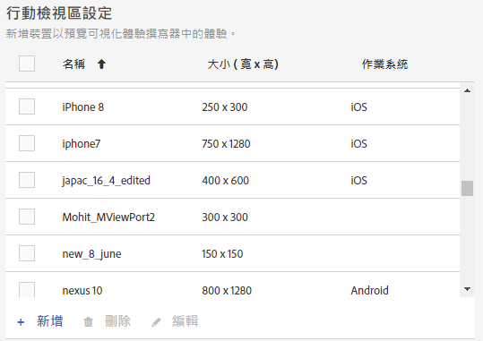

# 行動檢視區，提供互動式體驗

行動檢視器可協助您預覽[!DNL Adobe Target]活動在各種大小螢幕上的顯示方式。

行動視訊埠預覽功能是專為可在各種裝置、視窗或螢幕大小上呈現良好效果的互動式網站所設計。 互動式網站會自動調整並調整以適應任何螢幕大小，包括桌上型電腦、筆記型電腦、平板電腦或行動電話。

>[!NOTE]
>
> * 如果網站具回應力，而桌面頁面中的相同元素也透過不同的組態用於行動頁面中，請使用行動檢視區。如果您有個別的行動網站具有個別的結構，例如`m.mysite.com`，請改用[多頁活動](/help/c-experiences/c-visual-experience-composer/multipage-activity.md#concept_277E096063E14813AC5D8EDFA1D2ED48)。
   >
   >
* 行動檢視區被重新導向選件覆蓋所重疊時會無法使用。

檢視區是以螢幕上的網頁所填入的矩形大小來定義。即瀏覽器視窗減去捲軸和工具列之後的大小。瀏覽器使用「CSS 像素」。對於許多裝置，例如有視網膜螢幕的裝置，檢視區小於公布的裝置解析度。

以下為某些熱門裝置的檢視區和解析度。請記得在[!DNL Target]中使用視區大小。 有許多網站都有列出熱門裝置的檢視區大小。例如，請參閱[https://viewportsizer.com/devices/](https://viewportsizer.com/devices/)或參閱裝置製造商的網站。

| 裝置 | 檢視區大小 | 裝置解析度 |
|---|---|---|
| iPhone SE | 375w x 667h | 750w x 1334h |
| iPhone 11 Pro Max | 414w x 896h | 1242w x 2688h |
| iPhone 11 Xs最大值 | 414w x 896h | 1242w x 2688h |
| iPhone 11 | 414w x 896h | 828w x 1792h |
| iPhone 11 Xr | 414w x 896h | 828w x 1792h |
| iPhone 11 Pro | 375w x 812h | 1125w x 2436h |
| iPhone 11 X | 375w x 812h | 1125 寬 x 2436 高 |
| iPhone 11 Xs | 375w x 812h | 1125w x 2436h |
| iPhone X | 375w x 812h | 1125w x 2436h |
| iPhone 8 Plus | 414w x 736h | 1080w x 1920h |
| iPhone 8 | 375w x 667h | 750w x 1334h |
| iPhone 7 Plus | 414w x 736h | 1080w x 1920h |
| iPhone 7 | 375w x 667h | 750w x 1334h |
| iPhone 6s 加號 | 414w x 736h | 1080w x 1920h |
| iPhone 6s | 375w x 667h | 750w x 1334h |
| iPhone 6 加號 | 414w x 736h | 1080w x 1920h |
| iPhone 6 | 375w x 667h | 750w x 1334h |
| iPad Pro | 1024w x 1366h | 2048w x 2732h |
| iPad 第 3 代與第 4 代 | 768w x 1024h | 1536w x 2048h |
| iPad Air 1 與 2 | 768w x 1024h | 1536w x 2048h |
| iPad Mini | 768w x 1024h | 768w x 1024h |
| iPad Mini 2 與 3 | 768w x 1024h | 1536w x 2048h |
| Nexus 6P | 411w x 731h | 1440w x 2560h |
| Nexus 5X | 411w x 731h | 1080w x 1920h |
| Google Pixel | 411w x 731h | 1080w x 1920h |
| Google Pixel XL | 411w x 731h | 1440w x 2560h |
| Google Pixel 2 | 411w x 731h | 1080w x 1920h |
| Google Pixel 2 XL | 411w x 823h | 1440w x 2880h |
| Samsung Galaxy Note 5 | 480w x 853h | 1440w x 2560h |
| LG G5 | 480w x 853h | 1440w x 2560h |
| One Plus 3 | 480w x 853h | 1080w x 1920h |
| Samsung Galaxy S9 | 360w x 740h | 1440w x 2960h |
| Samsung Galaxy S9+ | 360w x 740h | 1440w x 2960h |
| Samsung Galaxy S8 | 360w x 740h | 1440w x 2960h |
| Samsung Galaxy S8+ | 360w x 740h | 1440w x 2960h |
| Samsung Galaxy S7 | 360w x 640h | 1440w x 2560h |
| Samsung Galaxy S7 Edge | 360w x 640h | 1440w x 2560h |
| Nexus 7 (2013) | 600w x 960h | 1200w x 1920h |
| Nexus 9 | 768w x 1024h | 1536w x 2048h |
| Samsung Galaxy Tab 10 | 800w x 1280h | 800w x 1280h |
| Chromebook Pixel | 1280w x 850h | 2560w x 1700h |

如果您要將活動傳送給使用特定裝置的人，請在活動圖表中選擇適合該裝置的對象。使用「行動裝置 Web 撰寫器」，針對該裝置來編輯活動中的頁面。如果您想要在整個數位體驗中執行活動，並確保在所有裝置上都完美呈現，請勿套用鎖定目標，應該使用行動檢視區以每一種螢幕大小來預覽活動。

如果您有回應式網站，則網站通常設計成由特定螢幕大小的裝置所存取時，就在不同檢視中開啟。觸發新檢視的螢幕大小稱為 CSS 中斷點。CSS中斷點是網站內容根據裝置寬度而回應的點，可顯示最佳的訪客版面。 CSS中斷點也稱為[媒體查詢](https://developer.mozilla.org/en-US/docs/Web/CSS/Media_Queries/Using_media_queries)。

將CSS中斷點儲存在[!DNL Target]中，以便預覽您所定義的每個檢視的體驗。 這些體驗都會顯示在[!DNL Target]介面的行動檢視區中。 若要開啟每一個螢幕大小的檢視，請在畫面頂端按一下該檢視區。

如果網站不具回應力，只要活動已鎖定特定裝置為目標，您仍可使用「行動裝置 Web 撰寫器」來檢視網站。

>[!IMPORTANT]
>
>雖然您可以在行動檢視區內編輯體驗，但這些變更會套用至所有檢視區和裝置，而不只是您正在使用的檢視區。 同樣地，在標準桌面檢視中編輯體驗時，將會變更所有螢幕大小的頁面，而不只是桌面檢視。目前，不支援針對個別檢視區來變更頁面。

## 行動視區設定{#task_B4B161499DC0470584ED922A4D20FCAB}

建立您的體驗時，請設定您要提供使用的任何行動檢視區。

1. 按一下「**[!UICONTROL 管理]** > **[!UICONTROL 視覺體驗撰寫器]**」。
1. 要添加新的移動視區，請在&#x200B;**[!UICONTROL 移動視區配置]**&#x200B;部分中按一下&#x200B;**[!UICONTROL 添加]**。

   

   若要變更現有行動檢視區的設定，請選取該檢視區，然後按一下「編輯」([!UICONTROL )圖示（鉛筆）。]

1. 輸入行動檢視區的名稱。

   為您的行動檢視區提供易於識別的描述性名稱。名稱的長度最多可為 36 個字元。

1. 輸入行動裝置的畫面大小，包含寬度和高度。

   寬度可以介於 150 和 968 像素之間。高度可以介於 150 和 1280 像素之間。

1. (可選) 選取裝置的作業系統。

   選項:

   * Android
   * iOS 
   * Windows
   * Symbian
   * Blackberry

   如果您使用[增強體驗撰寫器](/help/c-experiences/experiences.md#section_34265986611B4AB8A0E4D6ACC25EF91D)並選擇作業系統， 會在您檢視頁面時模擬該裝置。[!DNL Target]例如，若您的回應式網站上的Android與iOS的外觀和感覺不同，[!DNL Target]會模擬該行為。

1. 按一下&#x200B;**[!UICONTROL 「儲存」]**。

>[!NOTE]
>
>如果您嘗試刪除正在使用的行動檢視區，會顯示下列訊息：「此視區目前與一或多個活動相關聯。 您必須先從這些活動中移除視區，才能刪除它。」

## 建立互動式體驗{#task_D6332438B5EE48CCA8AF199270F1CAEF}

將行動檢視區加入您的[!DNL Target]活動，以建立行動螢幕的互動式體驗。

1. 建立所需的[活動](/help/c-activities/activities.md)。
1. 在可視化體驗撰寫器中，按一下&#x200B;**[!UICONTROL 「設定」]**&#x200B;齒輪圖示，然後選取&#x200B;**[!UICONTROL 「新增行動檢視區」]**。

   

1. 按一下&#x200B;**[!UICONTROL 「裝置」]**&#x200B;圖示，然後啟用應該具有行動檢視區的每個裝置。

   

   行動檢視區會根據寬度從最小到最大列出。

1. 視需要編輯行動檢視區。

   您對體驗進行的任何變更 (例如，如果您變更標題中的文字) 都會套用至所有裝置上的體驗。

   將游標移至檢視區的名稱來查看檢視區的大小。

   

1. 視需要按一下所要的方向圖示，在縱向和橫向模式之間切換。

   

## 使用案例：定位兩個iPhone版本{#task_CC3144BF5BA54034996E1D3DB0BC1A35}

此使用案例說明如何為兩個iPhone版本設定體驗：iPhone 6和iPhone 6 Plus。

1. 按一下「**[!UICONTROL 管理]** > **[!UICONTROL 視覺體驗撰寫器]**」。
1. 在&#x200B;**[!UICONTROL 行動視區設定]**&#x200B;區段中，建立iPhone 6和iPhone 6 plus的行動視區。

   為每個檢視區使用下列設定:

   | 名稱 | 寬度 | 高度 | 作業系統  |
   |---|---|---|---|
   | iPhone 6 | 375 | 667 | iOS  |
   | iPhone 6 Plus | 414 | 736 | iOS  |

   

1. 使用您要定位的體驗建立活動。
1. 選取您要對從 iPhone 6 或 iPhone 6 Plus 存取您的網站的訪客鎖定的體驗。
1. 選取您的目標時，按一下&#x200B;**[!UICONTROL 「建立對象」]**，然後設定對象，如下圖所示:

   

   因為手機可以旋轉為橫向，在結合 iPhone 裝置型號時，若同時要求高度和寬度大於 320，便會建立僅 6 和 6 Plus 能夠符合的條件。
1. 按一下&#x200B;**[!UICONTROL 「儲存」]**。
1. 如您一般的作法繼續設定您的活動。

## 訓練影片

以下影片含有本文章探討之概念的詳細資訊。

### 可視化體驗撰寫器 (2/2) (上午 07:29)  

下列示範影片包含透過可視化體驗撰寫器來使用行動檢視區的相關資訊:

* 重新命名和複製體驗
* 建立重新導向體驗
* 將活動鎖定在單一 URL 或一組 URL
* 建立多頁活動
* 針對回應性網站預覽和建置體驗
* 使用覆蓋來強調顯示元素的類型

>[!VIDEO](https://video.tv.adobe.com/v/17401)

### Adobe Target中的帳戶偏好設定

此視訊包含設定行動視訊的相關資訊，從視訊的4:40開始。

>[!VIDEO](https://video.tv.adobe.com/v/17379)