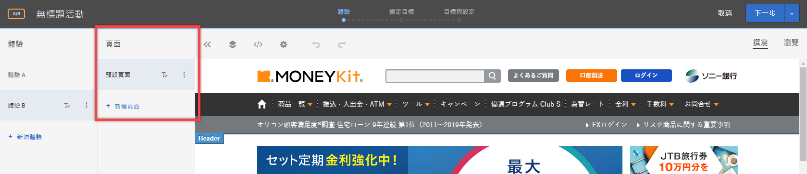
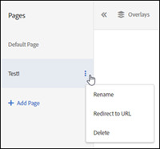

# 多頁活動{#multipage-activity}

多頁活動可讓您利用每個頁面的特定設計，來建立多個頁面的歷程記錄。

例如，您可能要測試某個選件，在購買超過某個金額時提供免運費。您可能想要讓該選件出現在您的登陸頁面、類別頁面和某些產品頁面，但想要它有不同的大小且位在每個頁面類型上不同位置。您可以在首頁上顯示一個顯眼的選件，然後在其他相關頁面上以較小的選件強化該選件。

您也可以使用多頁活動來為您的桌面和非回應式行動網站定義不同的配置。如果網站有獨立的手機版，例如 [!DNL m.mysite.com]，而不是 [!DNL `www.mysite.com`]，您應該改為建立[多頁面活動](/help/c-experiences/c-visual-experience-composer/multipage-activity.md#concept_277E096063E14813AC5D8EDFA1D2ED48)，並以獨立頁面新增 [!DNL m.mysite.com]，然後套用行動編輯，對相同體驗中的桌面版和行動版完成適當的變更。若為回應式行動網站，請使用[行動體驗編](/help/c-experiences/c-visual-experience-composer/mobile-viewports.md#concept_8E45527C4ABC41D59AA3553BEDC76FA5)。

>[!NOTE]
>
>多頁面活動是針對同一選件在多個頁面上有不同外觀的活動而設計。如果選件在所有頁面上皆呈現相同外觀，使用[範本測試](/help/c-experiences/c-visual-experience-composer/temtest.md#task_2539D51A18044F82B0D9895636546781)會更有效率。

您可以對多頁面測試中的每一個頁面指定範本規則。例如，在首頁和所有類別頁面上執行多頁面測試時，您可以在多頁面測試中對類別頁面套用範本規則。請參閱[在類似頁面上包含相同體驗](/help/c-experiences/c-visual-experience-composer/temtest.md#task_2539D51A18044F82B0D9895636546781)。

若要將頁面新增至測試:

1. 按一下&#x200B;**[!UICONTROL 「設定」]**&#x200B;齒輪圖示。
1. 按一下&#x200B;**[!UICONTROL 「新增其他頁面」]**。

   畫面左側會出現導覽列。

   

1. 使用導覽列來指定您的頁面和設定預設頁面。

   按一下&#x200B;**[!UICONTROL 「新增頁面」]**&#x200B;以新增另一個頁面。

   按一下三個垂直橢圓圖示以顯示動作選單:

   

   使用此功能表來重新命名頁面、從多頁面活動內執行重新導向測試，或刪除頁面。

1. 使用可視化體驗撰寫器來設計選件在每一個頁面上的外觀。

