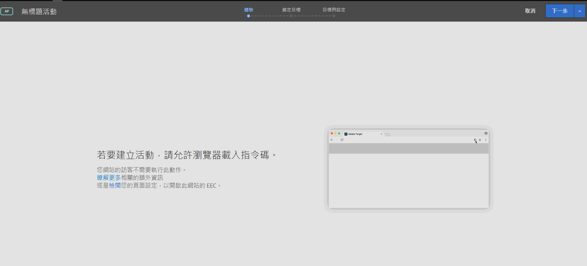

# 在您的瀏覽器中啟用混合的內容{#enabling-mixed-content-in-your-browser}

如果安全的內容與不安全的內容混合，則某些瀏覽器會封鎖頁面的顯示。

## 在您的瀏覽器中啟用混合的內容 {#concept_46D022D50280468C9EF6D5DF6EFC911C}

如果安全的內容與不安全的內容混合，則某些瀏覽器會封鎖頁面的顯示。

如果可視化體驗撰寫器 (VEC) 嘗試開啟的頁面含有混合 (安全和不安全) 內容，將會出現訊息指出如何停用瀏覽器中的封鎖，讓您可以開啟 HTTP 網站，或有混合呼叫 (HTTPS 和 HTTP) 的網站。

以前，雖然不允許混合內容，但您在建立活動時，仍可在三步驟引導式工作流程的步驟 1 中執行一些動作。Target 現在禁止在步驟 1 執行動作。出現此訊息時，您必須啟用混合內容才能繼續。

瀏覽器的安全性設定可能會阻止混合內容或不安全 (HTTP) 內容載入至安全 (HTTPS) 頁面或頁框 (例如 VEC)。如果不想停用瀏覽器的安全性設定，則您需要有 HTTPS 網站。

如果網站在不安全 (HTTP) 網域中運作，則您需要允許 VEC 載入使用中的混合內容。

>[!NOTE]
>
>允許混合內容只會影響 VEC，不影響已上線的網站。

如需詳細資訊，請參閱 *Mozilla Developer Network* (MDN) 網站上的[混合內容](https://developer.mozilla.org/en-US/docs/Web/Security/Mixed_content)。

## 在 Firefox 中啟用混合的內容 {#task_5448763B8DC941FD80F84041AEF0A14D}

依預設，Firebox 會封鎖混合了安全和不安全內容的頁面。若要使用 [!DNL Target]，建議您永久變更此設定。

<!-- 

target/t_mixed_content_firefox.xml

 -->

1. 在 Firefox 的位址列中，輸入 `about:config`。
1. 認可 Firefox 顯示的警告訊息。
1. 在搜尋列中，輸入 `block_active`。
1. 按兩下 ` **[!UICONTROL security.mixed_content.block_active_content]**`。

   值會從「True」變更為「False」。值顯示「False」時即為完成。變更此設定之後，建議您重新啟動電腦。

## 在 Internet Explorer 中啟用混合的內容 {#task_59E7D13C04DF486C92CD78D0C63DDDE8}

依預設，Internet Explorer 會封鎖混合了安全和不安全內容的頁面。若要使用 Target Standard，建議您永久變更此設定。

<!-- 

target/t_mixed_content_ie.xml

 -->

1. 在 Internet Explorer 中，按一下設定圖示 &gt;**[!UICONTROL 「網際網路選項」]**。
1. 開啟[!UICONTROL 「安全性」]索引標籤。
1. 選取&#x200B;**[!UICONTROL 「網際網路」]**，然後按一下&#x200B;**[!UICONTROL 「自訂層級」]**。
1. 選取&#x200B;**[!UICONTROL 「雜項」]**。
1. 在[!UICONTROL 「雜項」]下，啟用&#x200B;**[!UICONTROL 「顯示混合的內容」]**。
1. 按一下&#x200B;**[!UICONTROL 「確定]** &gt; **[!UICONTROL 是]** &gt; **[!UICONTROL 套用」]**。

變更此設定之後，建議您重新啟動電腦。

## 在 Chrome 中啟用混合的內容 {#task_FF297A08F66E47A588C14FD67C037B3A}

如果您透過安全連線造訪網站，Google Chrome 將會驗證網頁上的內容已安全地傳輸。

<!-- 

target/t_mixed_content_chrome.xml

 -->

請參閱 Google Chrome 說明中的[此頁面有不安全的內容](https://support.google.com/chrome/answer/1342714?hl=en)。
