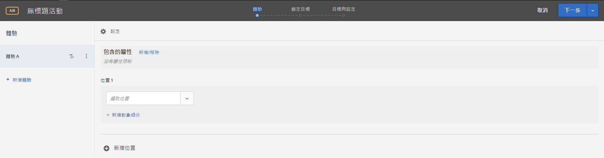
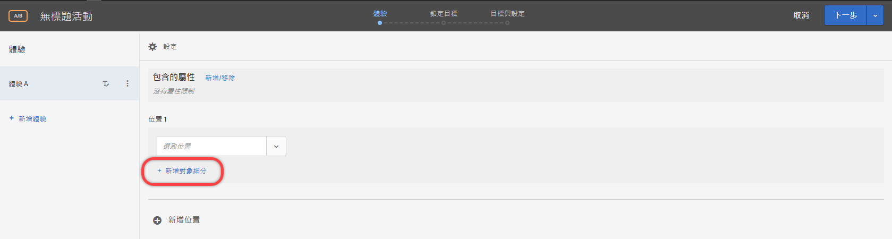
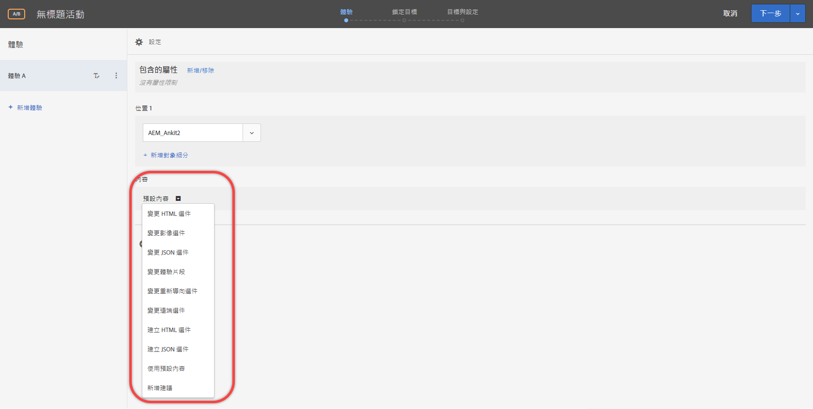
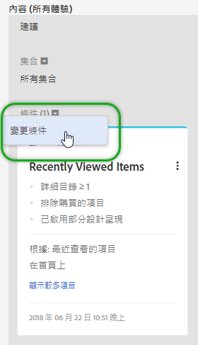

# 表單式體驗撰寫器{#form-based-experience-composer}

表單式體驗撰寫器是一種非可視化體驗和選件建立介面，適合在可視化體驗撰寫器無法使用或不實用的情況下，用於建立可供 A/B 測試、體驗鎖定目標、Automated Personalization 和 Recommendations 活動使用的體驗。例如，您可以使用表單式撰寫器，建立可在電子郵件、資訊站和語音助理中傳送的體驗和選件。

如果是建立 Recommendations 活動，則沒有體驗。選擇您的條件和設計。如果您選擇多個條件或設計，Target 會自動產生體驗。

1. 按一下&#x200B;**[!UICONTROL 「建立活動」]**，然後選取您要建立的活動類型。

   表單式體驗撰寫器可用於 A/B 測試、體驗鎖定目標、自動個人化和 Recommendations 活動。
1. 從&#x200B;**[!UICONTROL 「新增活動」]**&#x200B;對話方塊選取[!UICONTROL 「表單式體驗撰寫器」]。

   表單式體驗撰寫器隨即開啟。

   

   如果您要建立 Recommendations 活動，則此畫面會不同。Recommendations 活動未包括體驗。
1. 為活動命名。
1. 選取位置。

   When you click in the [!UICONTROL Select Location] box, a list of available locations appears. 選取這些位置中的一個。若要選擇透過 target.js 提供的全域位置，請選擇「target-global-mbox」。

   您也可以輸入此處未列出的位置。如果您尚未在頁面上建立或檢視 mbox，則此項目相當實用。輸入位置的名稱。輸入尚未存在的位置時請注意。如果拼字或大寫不符合進行 mbox 呼叫時使用的拼字或大寫，將不會傳送活動。手動輸入的位置將保存到可用位置清單中。 下次嘗試選擇手動輸入的位置時，該位置將可從「選擇位置 [!UICONTROL 」(Select Location] )下拉清單中為該活動提供。

   >[!NOTE]
   >
   >在建立活動期間建立手動輸入的位置不會自動建立新位置。 位置名稱僅保存在活動的上下文中。 當有內容傳送呼叫時，就會建立位置。 在建立位置後，它將可用於其他活動，以建立觀眾等。 從可用位置的下拉式清單。

1. 按一下&#x200B;**[!UICONTROL 「新增對象細分」]**，然後選擇一或多個此活動的[對象](/help/c-target/target.md#concept_A782F8481A5041EBA75103CB26376522)。

   

   在表單式體驗撰寫器中，細分已由完整的對象功能取代。現有活動的細分已移轉至[僅限於此活動的對象](/help/c-target/creating-activity-only-audience.md#concept_A6BADCF530ED4AE1852E677FEBE68483)。
1. 選取您要在該位置中顯示的內容類型。

   

1. 針對您選取的內容類型指定內容。

   **變更 HTML 選件:** 選擇 HTML 選件。

   **變更影像選件:** 選擇儲存在 Target 內容資料庫中的影像。

   您也可以新增連結至影像 (點進、目的地、登陸等等)。

   1. 按一下[!UICONTROL 「變更影像選件」]。
   1. 選取需要的影像，然後按一下[!UICONTROL 「編輯連結」]。
   1. 指定您的網站上需要的 URL 或頁面，然後按一下[!UICONTROL 「更新」]。

   **變更 JSON 選件:** 選擇 JSON 選件。

   **變更體驗片段:** 選擇體驗片段。

   **變更重新導向選件:** 選擇重新導向選件。

   **變更遠端選件:** 選擇遠端選件。

   **建立 HTML 選件:**

   1. 按一下[!UICONTROL 「選件」]，然後選取[!UICONTROL 「代碼選件」]索引標籤。
   1. 按一下[!UICONTROL 「建立] > [!UICONTROL HTML 選件」]。
   1. 輸入選件名稱。
   1. 在「程式碼」方塊中，輸入或貼上 HTML 程式碼。
   1. 按一下[!UICONTROL 「儲存」]。

   **建立 JSON 選件:**

   1. 按一下[!UICONTROL 「選件」]，然後選取[!UICONTROL 「代碼選件」]索引標籤。
   1. 按一下「[!UICONTROL 建立] > [!UICONTROL JSON 選件]」。
   1. 輸入選件名稱。
   1. 在「程式碼」方塊中，輸入或貼上 JSON 程式碼。
   1. 按一下[!UICONTROL 「儲存」]。

   針對 Recommendations 活動，內容下拉式清單會提供您「新增建議」選項。按一下&#x200B;**[!UICONTROL 「新增建議」]**，然後選取頁面類型。然後遵循介面中定義的步驟來[建立Recommendations 活動](/help/c-recommendations/t-create-recs-activity/create-recs-activity.md)。

   在表單式體驗撰寫器選取「Recommendations」條件時，已有直接連結，可連結至選取的條件卡片，讓您輕鬆快速編輯條件。

   

   在 Target 三步驟引導式工作流程的「鎖定目標」頁面:

   

1. (Optional, for AB activities, Automated Personalization, and Experience Targeting) To repeat this process for additional locations, click **[!UICONTROL Add Location]** and configure the location and content.
1. Click **[!UICONTROL Next]**, then complete the activity creation steps as usual for your activity type.

* [建立 A/B 測試](/help/c-activities/t-test-ab/t-test-create-ab/test-create-ab.md)
* [建立體驗鎖定目標活動](/help/c-activities/t-experience-target/t-xt-create/xt-create.md#task_D6B3429AC31549E1A70EDF04B3DDC765)
* [建立 Recommendations 活動](/help/c-recommendations/t-create-recs-activity/create-recs-activity.md#task_6874328773C64C44A73F0A130AD3F96F)

## 訓練影片: 表單式撰寫器 

此影片提供表單式撰寫器的示範。

* 使用表單式體驗撰寫器建立活動
* 瞭解使用表單式體驗撰寫器與可視化體驗撰寫器的時機
* 使用細分來鎖定位置

>[!VIDEO](https://video.tv.adobe.com/v/17390)