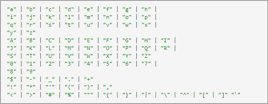

# 將資料傳入 Target 的方法

您可使用不同方法將資料匯入[!DNL Adobe Target]的相關資訊，包括頁面參數、頁面內描述檔屬性、指令碼描述檔屬性、資料提供者、大量描述檔更新API、單一描述檔更新API和客戶屬性。

## 頁面參數 (又稱為「mbox 參數」){#section_5A297816173C4FE48DC4FE03860CB42B}

頁面參數是直接透過頁面程式碼傳入的名稱/值配對，不儲存在訪客的設定檔中供未來使用。

頁面參數很適合將額外的頁面資料傳送至 Target，這些資料不需要隨著訪客的設定檔一起儲存，以供未來鎖定目標使用。這些值改用來說明頁面，或使用者在特定頁面上採取的動作。

### 格式

頁面參數以字串名稱/值配對形式，透過伺服器呼叫而傳入 Target。參數名稱和值可自訂 (但有一些「保留名稱」是特定用途)。

範例:

* `page=productPage`

* `categoryId=homeLoans`

### 範例使用案例

**產品頁面**: 傳送已檢視之特定產品的相關資訊 (此為「建議」的運作方式)

**訂單詳細資料**: 傳送訂購 ID、orderTotal 等供收集訂單

**類別相關性**: 將類別檢視資訊傳送至 Target，以瞭解使用者與特定網站類別的相關性

**第三方資料**: 傳送來自第三方資料來源的資訊，例如，天氣鎖定目標提供者、帳戶資料 (例如 DemandBase)、人口統計資料 (例如 Experian) 及其他。

### 方法優點

資料會即時傳送至 Target，而且可用在送來資料的同一個伺服器呼叫上。

### 注意事項

* 需要頁面程式碼更新 (直接或透過標記管理系統)。
* 如果後續的頁面/伺服器呼叫需要使用資料來鎖定目標，則資料必須轉移至設定檔指令碼。
* 查詢字串僅可包含符合[網際網路工程任務小組 (IETF) 標準](https://www.ietf.org/rfc/rfc3986.txt)的字元。

   除了在 IETF 網站上提到的字元外，Target 也允許在查詢字串中包含下列字元:

   `&lt; > # % &quot; { } | \\ ^ \[\] \``

   除此之外的字元都必須經過 URL 編碼。此標準指定下列格式([https://www.ietf.org/rfc/rfc1738.txt](https://www.ietf.org/rfc/rfc1738.txt))，如下所示：

   

   或者，為簡單起見，下列為完整清單:

   

### 代碼範例

targetPageParamsAll (將參數附加至頁面上的所有 mbox 呼叫):

`function targetPageParamsAll() { return "param1=value1&param2=value2&p3=hello%20world";`

targetPageParams (將參數附加至頁面上的全域 mbox):

`function targetPageParams() { return "param1=value1&param2=value2&p3=hello%20world";`

mboxCreate 程式碼中的參數:

`<div class="mboxDefault"> default content to replace by offer 
 `

### 相關資訊的連結

建議: [根據頁面類型實作](/help/c-recommendations/plan-implement.md#reference_DE38BB07BD3C4511B176CDAB45E126FC)

訂單確認: [追蹤轉換](/help/c-implementing-target/c-implementing-target-for-client-side-web/how-to-deployatjs/implementing-target-without-a-tag-manager.md#task_E85D2F64FEB84201A594F2288FABF053)

類別相關性: [類別相關性](/help/c-target/c-visitor-profile/category-affinity.md#concept_75EC1E1123014448B8B92AD16B2D72CC)

## 頁面內設定檔屬性 (又稱為「mbox 內設定檔屬性) {#section_57E1C161AA7B444689B40B6F459302B6}

頁面內設定檔參數是直接透過頁面程式碼傳遞的名稱/值配對，儲存在訪客的設定檔中供未來使用。

頁面內設定檔屬性允許將使用者特定的資料儲存在 Target 的設定檔中，供稍後鎖定目標和分割。

### 格式

頁面內設定檔屬性以字串名稱/值配對形式，透過伺服器呼叫而傳入 Target，字首 &quot;profile.&quot; 會加在屬性名稱之前。

屬性名稱和值可自訂 (但有一些「保留名稱」是特定用途)。

範例:

* `profile.membershipLevel=silver`
* `profile.visitCount=3`

### 範例使用案例

**登入資訊**: 根據使用者的登入將非 PII (個人識別資訊) 資料與 Target 共用。其中包括成員資格狀態、訂單歷程記錄等。

**商店資訊**: 追蹤哪一家商店是此使用者偏好的位置。

**先前的互動**: 追蹤使用者先前在網站上完成的動作，以提供未來個人化的相關資訊。

### 方法優點

資料會即時傳送至 Target，而且可用在送來資料的同一個伺服器呼叫上。

### 注意事項

需要頁面程式碼更新 (直接或透過標記管理系統)。

屬性和值在伺服器呼叫中可見，所以訪客可以看到值。如果共用資訊，例如信用等級或其他可能的私人資訊，則這可能不是最佳方法。

### 代碼範例

targetPageParamsAll (將屬性附加至頁面上的所有 mbox 呼叫):

`function targetPageParamsAll() { return "profile.param1=value1&profile.param2=value2&profile.p3=hello%20world"; }`

targetPageParams (將屬性附加至頁面上的全域 mbox):

`function targetPageParams() { return profile.param1=value1&profile.param2=value2&profile.p3=hello%20world"; }`

mboxCreate 程式碼中的屬性:

`<div class="mboxDefault"> default content to replace by offer 
 `

### 相關資訊的連結

[設定檔屬性](/help/c-target/c-visitor-profile/profile-parameters.md#concept_01A30B4762D64CD5946B3AA38DC8A201)

[訪客資料](/help/c-target/c-audiences/c-target-rules/visitor-profile.md#concept_E972690B9A4C4372A34229FA37EDA38E)

## 指令碼設定檔屬性 {#section_3E27B58C841448C38BDDCFE943984F8D}

指令碼設定檔屬性是 Target 解決方案中定義的名稱/值配對。值取決於每次伺服器呼叫在 Target 的伺服器上執行 JavaScript 片段。

使用者撰寫較小的程式碼片段，在每次 mbox 呼叫時執行，以及在評估訪客的對象和活動成員資格之前執行。

### 格式

指令碼設定檔屬性是在 Target 的「對象」區段中建立。任何屬性名稱都有效，值是 Target 使用者撰寫的 JavaScript 函式的結果。在 Target 中，屬性名稱開頭自動加上 &quot;user.&quot;，以方便與頁面內設定檔屬性有所區別。

程式碼片段以 Rhino JS 語言撰寫，可參考 Token 和其他值。

### 範例使用案例

**購物車放棄**: 當訪客到達購物車時，將設定檔指令碼設為 1。當訪客轉換時，重設為 0。如果值 = 1，表示訪客在購物車中有一件項目。

**造訪計數**: 每次新的造訪時，計數就增加 1，以追蹤訪客每隔多久回到網站。

### 方法優點

不需要更新頁面程式碼。

在決定對象和活動成員資格之前執行，因此，這些設定檔指令碼屬性在單次伺服器呼叫上就可影響成員資格。

可能非常強大。每個指令碼最多可執行 2,000 個指令。

### 注意事項

需要 JavaScript 知識。

無法保證設定檔指令碼的執行順序，因此無法彼此依賴。

可能很難偵錯。

### 代碼範例

設定檔指令碼相當有彈性:

`user.purchase_recency: var dayInMillis = 3600 * 24 * 1000; if (mbox.name == 'orderThankyouPage') {  user.setLocal('lastPurchaseTime', new Date().getTime()); } var lastPurchaseTime = user.getLocal('lastPurchaseTime'); if (lastPurchaseTime) {  return ((new Date()).getTime()-lastPurchaseTime)/dayInMillis; }`

### 相關資訊的連結

[設定檔指令碼屬性](/help/c-target/c-visitor-profile/profile-parameters.md#concept_8C07AEAB0A144FECA8B4FEB091AED4D2)

## 資料提供者 {#section_14FF3BE20DAA42369E4812D8D50FBDAE}

資料提供者這項功能可以讓您輕鬆將資料從第三方傳入 Target。

注意: at.js 1.3 或更新版本才支援資料提供者功能。

### 格式

`window.targetGlobalSettings.dataProviders` 設定是資料提供者的陣列。

如需各資料提供者結構的詳細資訊，請參閱[資料提供者](/help/c-implementing-target/c-implementing-target-for-client-side-web/targetgobalsettings.md#data-providers)一節。

### 範例使用案例

從第三方收集氣象服務、DMP 甚至您自己的網頁服務等資料。接著，您就能使用此資料來建立對象、鎖定內容及擴充訪客設定檔。

### 方法優點

此設定可讓客戶收集來自第三方資料提供者 (例如 Demandbase、BlueKai 和自訂服務) 的資料，並在全域 mbox 要求中以 mbox 參數的形式傳遞資料至 Target。

它透過非同步和同步要求，以支援來自多個提供者的資料收集。

使用此方法可讓您方便管理預設頁面內容的忽隱忽現情形，同時對每個提供者包含獨立的逾時計算，以限制對頁面效能的影響

### 注意事項

如果新增至 `window.targetGlobalSettings.dataProviders` 的資料提供者非同步，則會並行執行。訪客 API 要求將與新增至 `window.targetGlobalSettings.dataProviders` 的函數並行執行，以允許最低的等候時間。

at.js 不會嘗試將資料快取。如果資料提供者擷取資料一次，則資料提供者應該確定已將該資料快取，並且當叫用該提供者函數時，可做為第二個叫用的快取資料。

### 代碼範例

[資料提供者](/help/c-implementing-target/c-implementing-target-for-client-side-web/targetgobalsettings.md#data-providers)中提供許多範例。

### 相關資訊的連結

文件: [資料提供者](/help/c-implementing-target/c-implementing-target-for-client-side-web/targetgobalsettings.md#data-providers)

### 訓練影片:

* [使用 Adobe Target 中的資料提供者](https://helpx.adobe.com/tw/target/kt/using/dataProviders-atjs-feature-video-use.html)
* [實作 Adobe Target 中的資料提供者](https://helpx.adobe.com/tw/target/kt/using/dataProviders-atjs-technical-video-implement.html)

## 大量設定檔更新 API {#section_92AB4820A5624C669D9A1F1B6220D4FA}

透過 API，將 .csv 檔案傳送至 Target，此檔案包含許多訪客的訪客設定檔更新項目。一次呼叫就能以多個頁面內設定檔屬性來更新每一個訪客設定檔。

此選項很類似於「客戶屬性」，只有輕微差異:

* 「客戶屬性」使用 FTP 上傳，而 Target「大量設定檔更新 API」使用 HTTP POST API。
* 客戶屬性資料可以與 Analytics 共用。大量設定檔更新只能 Target 中使用。
* 「客戶屬性」支援為 Target 尚未看到的使用者建立設定檔。「大量設定檔更新 API」只會更新現有 Target 設定檔。
* 「客戶屬性」需要使用 Experience Cloud ID (ECID)。「大量設定檔更新 API」需要 TNT ID 或 `mbox3rdPartyId`。
* 您無法在 `mbox3rdPartyID` 中傳送下列字元: 加號 (+) 和正斜線 (/)。

### 格式

.csv 檔案必須透過訪客的 Target PCID 或 mboxThirdPartyId 來參照每一個訪客。不支援 Experience Cloud ID (ECID)。所有設定檔屬性/值都是透過 API 來建立和更新。API 文件中提供格式詳細資料。

### 範例使用案例

CRM 或其他內部系統中儲存關於訪客的實用資料 (您希望持續更新至 Target)，不會讓設定檔資料在頁面實作中曝光。

### 方法優點

設定檔屬性的數量不限。

透過網站傳送的設定檔屬性可以透過 API 更新，反之亦然。

### 注意事項

批次檔的大小必須小於 50 MB。此外，每次上傳的總列數不得超過 500,000 列。

在 24 小時期間內，不限制後續批次中可上傳的列數。不過，在上班時間可以節流汲取程序，以確保其他程序的執行效率。

對相同的 thirdPartyIds 採用連續 [V2 批次更新呼叫](https://developers.adobetarget.com/api/#updating-profiles)，且其中不需使用 mbox 呼叫，會覆寫第一次批次更新呼叫所更新的屬性。

### 代碼範例

請參閱[更新設定檔](https://developers.adobetarget.com/api/#updating-profiles)。

### 相關資訊的連結

[更新設定檔](https://developers.adobetarget.com/api/#updating-profiles)

## 單一設定檔更新 API {#section_5D7A9DD7019F40E9AEF2F66F7F345A8D}

與「大量設定檔更新 API」幾乎相同，但一次只更新一個訪客設定檔，在 API 呼叫中排隊，而不是使用 .csv 檔案。

### 格式

必須透過 Target mboxPC 值或 mboxThirdPartyId 值來識別訪客。不支援 Experience Cloud ID (ECID)。

### 範例使用案例

當訪客執行一些離線動作，您需要即時更新 Target，例如聯絡客戶服務中心、獲得貸款、在商店中使用尊榮卡、使用資訊站等。

### 方法優點

設定檔屬性的數量不限。

透過網站傳送的設定檔屬性可以透過 API 更新，反之亦然。

### 注意事項

24 小時期間內以 1,000,000 次 API 呼叫 (1 百萬) 為限制。

只更新設定檔。無法為 Target 尚未看到的潛在使用者建立設定檔。

### 代碼範例

支援 GET 和 POST。  `https://CLIENT.tt.omtrdc.net/m2/client/profile/update?mboxPC=1368007744041-575948.01_00&profile.attr1=0&profile.attr2=1...`

### 相關資訊的連結

[更新設定檔](https://developers.adobetarget.com/api/#updating-profiles)

## 客戶屬性 {#section_C47FC7980A9A4608BD1A5F0BD900FA70}

客戶屬性可讓您透過 FTP 將訪客設定檔資料上傳至 Experience Cloud。上傳後，即可在 Adobe Analytics 和 Adobe Target 中運用這些資料。

Target Standard 客戶可使用 5 個屬性，Target Premium 客戶可使用 200 個屬性。

### 格式

含有 Experience Cloud ID (ECID) 和屬性名稱/值配對的 .csv 檔案是透過 FTP 上傳，或在 Experience Cloud UI 中手動上傳。

### 範例使用案例

您的 CRM 或其他內部系統儲存實用的資訊，可以與 Adobe 的 Experience Cloud 共用，包括 Target 和 Analytics。

### 方法優點

上傳客戶資料會在 Target 中針對該訪客建立設定檔項目，即使 Target 尚未看過該訪客也一樣。

相同的資料會自動出現在 Target 和 Analytics 中。

FTP 是比 API 更簡單的實作方法。

### 注意事項

Target Standard 客戶可使用 5 個屬性，Target Premium 客戶可使用 200 個屬性

只能透過「客戶屬性」來更新值，而不是在頁面上更新。

需要 Experience Cloud ID (ECID) 實作。

### 代碼範例

如需詳細資訊，請參閱[建立客戶屬性來源並上傳資料檔案](https://experienceleague.adobe.com/docs/core-services/interface/customer-attributes/t-crs-usecase.html)。

### 相關資訊的連結

[建立客戶屬性來源及上傳資料檔案](https://experienceleague.adobe.com/docs/core-services/interface/customer-attributes/t-crs-usecase.html).