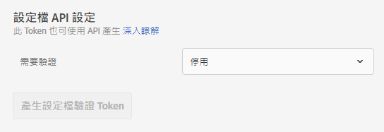

# 設定檔 API 設定

透過[!DNL Adobe Target] API啟用或停用批次更新的驗證，並產生描述檔驗證Token。

[!DNL Adobe Target] 會為每一個使用者建立和維護一個設定檔: 此描述檔會儲存在[!DNL Target]邊緣叢集上，並在每次瀏覽後即時更新；不過，您可以個別或透過API大量更新描述檔。

為了提高安全性，您可以要求「大量更新 API」呼叫必須在要求的標頭中傳送有效的存取 Token。

**若要使用 Target UI 來要求驗證和產生存取 Token:**

1. 按一下「**[!UICONTROL 管理]** > **[!UICONTROL 實施]**」。
1. 在&#x200B;**[!UICONTROL 描述檔API]**&#x200B;下方，將&#x200B;**[!UICONTROL 要求驗證]**&#x200B;切換至啟用或停用的位置。

   

1. （條件性）如果您啟用驗證需求，請按一下「產生新的描述檔驗證Token ]**」。**[!UICONTROL 

   

   Token 會根據[!UICONTROL 「到期時間」]方塊中列出的時間而到期。

   您必須具備下列其中一個使用者權限才能產生驗證Token:

   * 至少[!UICONTROL Editor]權限（或[!UICONTROL Approver]）

      如需[!DNL Target Standard]客戶的詳細資訊，請參閱&#x200B;*Users*&#x200B;中的[指定角色和權限](/help/administrating-target/c-user-management/c-user-management/user-management.md#roles-permissions)。 如需[!DNL Target Premium]客戶的詳細資訊，請參閱[設定企業權限](/help/administrating-target/c-user-management/property-channel/properties-overview.md)。

   * 工作區／產品設定檔層級上的管理員角色

      工作區僅適用於[!DNL Target Premium]客戶。 如需詳細資訊，請參閱[設定企業權限](/help/administrating-target/c-user-management/property-channel/properties-overview.md)。

   * [!DNL Adobe Target]產品層級的管理權限（Sysadmin權限）
   >[!NOTE]
   >
   >您也可以透過 API 來產生設定檔驗證 Token。如需詳細資訊，請參閱 [Adobe Target Developers 網站](https://developers.adobetarget.com/)上的[設定檔](https://developers.adobetarget.com/api/#profiles)。

1. 複製 Token 並加入要求的標頭中，格式為: &quot;Authorization&quot; : &quot;Bearer &quot;

按一下「產生新的描述檔驗證Token]」以視需要重新產生Token。[!UICONTROL 

>[!IMPORTANT]
>
>重設此 Token 會造成使用目前 Token 的 API 呼叫失敗。這需要更新任何使用此 Token 的指令碼或應用程式。
