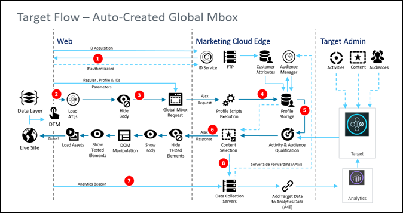

# at.js 如何運作{#how-at-js-works}

若要實施 [!DNL Adobe Target] 用戶端，您必須使用at. js程式庫。

在用戶端實作中， [!DNL Adobe Target][!DNL Target] 將與活動相關的體驗直接傳送至用戶端瀏覽器。瀏覽器會決定要顯示並顯示的體驗。透過用戶端實施，您可以使用WYSIWYG編輯器、 [Visual Experience Composer](/help/c-experiences/c-visual-experience-composer/visual-experience-composer.md) (CMS)或非視覺化介面( [以表單為基礎的Experience Composer](/help/c-experiences/form-experience-composer.md))來建立測試和個人化體驗。

## 甚麼是at. js？

[at. js程式庫](/help/c-implementing-target/c-implementing-target-for-client-side-web/t-mbox-download/c-target-atjs-implementation/target-atjs-implementation.md#concept_8AC8D169E02944B1A547A0CAD97EAC17) 是Target的新實作程式庫。at.js 程式庫改善 Web 實作的頁面載入時間，並且為單頁應用程式提供更好的實作選項。at.js 為建議的實作程式庫，且經常更新功能。我們建議所有客戶實作或移轉至[最新版本的 at.js](/help/c-implementing-target/c-implementing-target-for-client-side-web/target-atjs-versions.md#reference_DBB5EDB79EC44E558F9E08D4774A0F7A)。

如需詳細資訊，請參閱 [Target JavaScript程式庫](/help/c-intro/how-target-works.md#libraries)。

在下圖所示的 [!DNL Target] 實作中，已實作下列 [!DNL Adobe Experience Cloud] 解決方案: Analytics、Target 和「對象管理」。此外，還實作了下列 Experience Cloud 核心服務: Adobe Launch、「對象」和「訪客 ID 服務」。

## at.js 1.*x* 和at. js2.x工作流程圖？

如  需從1.*x* 版有所差異之處。

從高階角度來看，兩個版本之間存在幾項差異:

* at. js2.x沒有全域mbox請求概念，而是頁面載入請求。頁面載入要求可視為要求擷取網站初始頁面載入時應套用的內容。
* at. js2.x管理用於單一頁面應用程式(SPA)的檢視概念。at.js 1。*x* 不知道這個概念。

## at.js 2.x 圖表

下列圖表可協助您瞭解at. js2.x含檢視的工作流程，以及如何增強SPA整合。若要更好地介紹在. js2.x中使用的概念，請參閱 [「單頁應用程式實施](/help/c-implementing-target/c-implementing-target-for-client-side-web/how-to-deployatjs/target-atjs-single-page-application.md)」。

| 步驟 | 詳細資料 |
| --- | --- |
| 1 | 如果使用者已通過驗證，呼叫會傳回 [!DNL Experience Cloud ID]，而另一個呼叫會同步客戶 ID。 |
| 2 | at.js 程式庫會同步載入並隱藏文件本文。 也能使用將頁面上實作的程式碼片段預先隱藏的選項，以非同步方式載入 at.js。 |
| 3 | 提出頁面載入要求，包含所有已設定的參數 (MCID、SDID 和客戶 ID)。 |
| 4 | 設定檔指令碼執行，然後注入設定檔存放區。存放區會從對象資料庫中請求合格對象 (例如，從 Adobe Analytics、對象管理 等共用的對象)。 客戶屬性會透過批次程序傳送至設定檔存放區。 |
| 5 | [!DNL Target] 會根據 URL 要求參數和設定檔資料，決定可針對目前頁面和未來檢視傳回哪些活動和體驗給訪客。 |
| 6 | 目標內容會傳回至頁面，選擇性地包括其他個人化的設定檔值。 目前頁面上目標內容會儘快出現，不會有忽隱忽現的預設內容。 針對在瀏覽器中快取的使用者 SPA 動作顯示檢視的目標內容，以便在透過 `triggerView()` 觸發檢視時立刻套用，不需額外的伺服器呼叫。 |
| 7 | Analytics 資料傳送至「資料收集」伺服器。 |
| 8 | 目標資料會透過 SDID 來比對 Analytics 資料，然後經過處理放入 Analytics 報表儲存體中。然後就可以在 Analytics 與 Target 中，透過 Analytics for Target (A4T) 報表來檢視  Analytics 資料。 |

現在，SPA 上只要是有實作 `triggerView()` 的位置，系統都會從快取擷取檢視和動作並向使用者顯示，不需要伺服器呼叫。`triggerView()` 也會對 [!DNL Target] 後端發出通知要求，以便增加和記錄曝光計數。如需針對採用檢視的 SPA 瞭解 at.js 的詳細資訊，請參閱[單頁應用程式實作](/help/c-implementing-target/c-implementing-target-for-client-side-web/how-to-deployatjs/target-atjs-single-page-application.md)。

| 步驟 | 詳細資料 |
| --- | --- |
| 1 | 系統在 SPA 中呼叫 `triggerView()`，以便呈現檢視和套用動作來修改視覺元素。 |
| 2 | 從快取讀取檢視的目標內容。 |
| 3 | 目標內容會儘快出現，不會有忽隱忽現的預設內容。 |
| 4 | 通知要求會傳送至 [!DNL Target] 設定檔存放區，以計算活動中的訪客數和增加量度。 |
| 5 | Analytics 資料傳送至資料收集伺服器。 |
| 6 | Target 資料會透過 SDID 來比對 Analytics 資料，然後經過處理放入 Analytics 報表儲存體中。然後就可以在 Analytics 與 Target 中，透過 A4T 報表來檢視 Analytics 資料。 |

## at.js 1.x 圖表

| 步驟 | 說明 | 呼叫 | 說明 |
|--- |--- |--- |--- |
| 1 | 如果使用者已驗證，呼叫會傳回 [!DNL Experience Cloud ID] (MCID)；另一個呼叫會同步客戶 ID。 | 2 | at.js 程式庫會同步載入並隱藏文件本文。 |
| 3 | 提出全域 mbox 請求，含所有已設定的參、MCID、SDID 和客戶 ID (可選)。 | 4 | 設定檔指令碼執行，然後注入設定檔存放區。存放區會從[!UICONTROL 對象資料庫]中要求合格對象 (例如從 [!DNL Adobe Analytics]、[!DNL Audience Manager] 等共用的對象)。 客戶屬性會透過批次程序傳送至 [!DNL Profile Store]。 |
| 5 | [!DNL Target] 根據 URL、mbox 參數和設定檔資料，決定要傳回給訪客的活動和體驗。 | 6 | 已鎖定的目標內容會傳回至頁面，選擇性地包括其他個人化的設定檔值。 體驗會儘快出現，不會有忽隱忽現的預設內容。 |
| 7 | [!DNL Analytics] 資料傳送至「資料收集」伺服器。 | 8 | [!DNL Target] 資料會透過 SDID 來比對 [!DNL Analytics] 資料，然後經過處理放入 [!DNL Analytics] 報表儲存體中。然後就可以在 [!DNL Analytics] 與 [!DNL Target] 中，透過 [!DNL Analytics for Target] (A4T) 報表來檢視  [!DNL Analytics] 資料。 |

## 訓練影片：at. js2.x架構圖表

at. js2.x增強Adobe Target對SPA的支援，並與其他Experience Cloud解決方案整合。本影片說明整合方式。

>[!VIDEO](https://video.tv.adobe.com/v/26250)

如需詳細資訊，請參閱 [瞭解at. js2.x的](https://helpx.adobe.com/target/kt/using/atjs20-diagram-technical-video-understand.html) 如何運作。