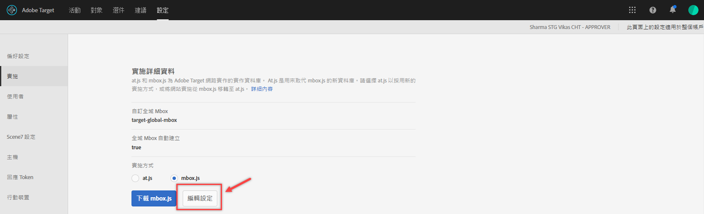
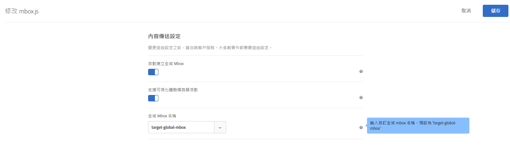
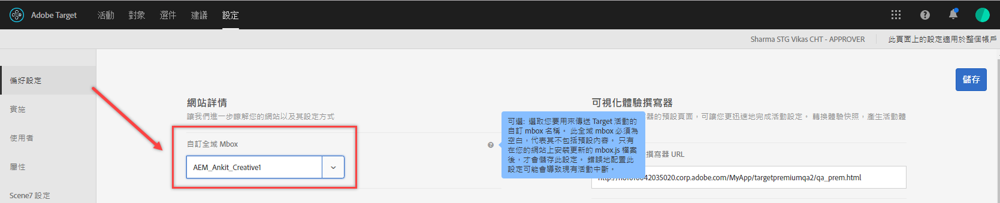

# 自訂全域 mbox{#customize-a-global-mbox}

可協助您為 at.js 和 mbox.js 自訂全域 mbox 的資訊。

1. 編輯 mbox.js。

   前往 **[!UICONTROL 「Target]** &gt; **[!UICONTROL 設定]** &gt; **[!UICONTROL 實作」]**。

   * 針對 mbox.js，按一下 **[!UICONTROL 「編輯 mbox.js 設定」]**。
   * 針對 [!DNL at.js]，請選取「實施方式」下的 **[!UICONTROL 「at.js」]**，然後按一下 **[!UICONTROL 「編輯 mbox.js 設定」]**。
   

1. 編輯 [!DNL mbox.js] 或 [!DNL at.js]

   停用 **[!UICONTROL 「自動建立全域 mbox」]**，然後新增您想要用來透過 [!DNL Target Standard/Premium] 傳送活動之自訂全域 mbox 的名稱。此自訂全域 mbox 也用於點擊追蹤。

   

   完成後按一下 **[!UICONTROL 「儲存」]。**
1. 在您的網站上實施 [!DNL mbox.js] 或 [!DNL at.js] 資料庫。

* 若使用 mbox.js，請參閱 [Mbox.js 實作](../../../../c-implementing-target/c-implementing-target-for-client-side-web/t-mbox-download/mbox-download.md#task_4EAE26BB84FD4E1D858F411AEDF4B420)。
* 若使用 at.js，請參閱 [at.js 實作](../../../../c-implementing-target/c-implementing-target-for-client-side-web/t-mbox-download/c-target-atjs-implementation/target-atjs-implementation.md#concept_8AC8D169E02944B1A547A0CAD97EAC17)。

1. 計算您的發行轉變所需的時間。

   在您準備好使用 [!DNL Target Standard/Premium] 時，若要開始對未來的所有活動使用您的全域 mbox，您可以繼續進行此步驟。

   更新自訂全域 mbox 的名稱以符合以上的步驟 2 中使用的名稱。

   

   >[!IMPORTANT]
   >
   >儲存時，您帳戶中的所有活動都會與此 mbox 同步。如果此 mbox 不在您的網站上，則所有活動將停止運作。

   按一下 **[!UICONTROL 「儲存」]**。
