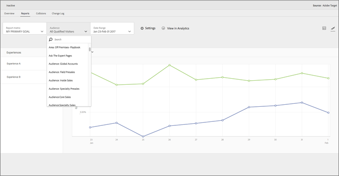

# Adobe Analytics 作為 Adobe Target (A4T) 的報表來源

[!DNL Adobe Analytics for Target] (A4T)是跨解決方案整合，可讓您根據轉換量度和受眾細 [!DNL Analytics] 分來建立活動。A4T整合可讓您使用[!DNL Analytics]報表來檢查結果。 如果您使用[!DNL Analytics]作為活動的報告來源，則該活動的所有報告和分段都基於[!DNL Analytics]資料收集。

## A4T 概覽 {#section_92B66069210C40DBA937790E8CC596CF}

[!DNL Analytics]和[!DNL Target]之間的[!DNL Analytics for Target]整合為您的最佳化程式提供強大的分析和省時工具。

在[!DNL Target]中使用[!DNL Analytics]資料的三個主要優點是：

* 行銷人員可隨時動態套用[!DNL Analytics]成功度量或報告區段至[!DNL Target]活動報表。 執行活動之前完全不需要指定。
* 單一資料來源可排除在兩個不同系統中收集資料時發生不一致的情況。
* 您現有的[!DNL Analytics]實作會收集所有必要資料。 不需要只為了收集報表的資料而在頁面上實作 Mbox。不過，仍建議您實作[自動個人化](/help/c-activities/t-automated-personalization/automated-personalization.md)(AP)活動的訂單確認mbox。

>[!IMPORTANT]
>
>開始使用 A4T 之前，您必須要求針對整合佈建您的帳戶。使用[此表單](https://www.adobe.com/go/audiences_tw)來要求佈建帳戶。
>
>啟用[!DNL Analytics]作為[!DNL Target](A4T)資料來源的整合，代表Test&amp;Target到SiteCatalyst外掛程式的新一代。 此外掛程式已淘汰，但仍支援原本已使用的客戶。

如果您使用[!DNL Analytics]作為活動的報告來源，則該活動的所有報告和分段都基於[!DNL Analytics]。

所有[!DNL Analytics]度量（包括計算度量）都可在[!DNL Target]和[!DNL Analytics]的「目標活動」報表中使用。 同樣地，[!DNL Analytics]中可用的任何區段都可套用至兩個解決方案。 活動啟動後，或甚至活動完成後，您都可以將量度或對象套用至[!DNL Target]中的報表。

每個量度都包含在內，包括[!DNL Analytics]內建的任何客戶或計算量度。

分類期過後，從網站收集完資料的大約一小時後，資料就會出現在這些報表中。報表中的所有量度、區段和值，來自於您設定活動時所選取的報表套裝。

考慮使用 A4T 時，請謹記下列重點:

* 若要使用[!DNL Analytics]作為[!DNL Target]的報告來源，您和您的公司都必須擁有[!DNL Analytics]和[!DNL Target]的存取權。 [如果您需要任一解決方案，請聯絡客戶代表](/help/cmp-resources-and-contact-information.md#concept_34A1CA16F2244D42930BB77846A5ABBB)。
* 每個活動皆會設定報表來源。[!DNL Target] 繼續收集要用於報告的資料，如果您 [!DNL Target] 想要根據所收集的資料來建立活動，資料仍可供使用 [!DNL Target]。
* 您必須使用這兩個報表來源的其中一個。您無法同時從這兩個來源收集單一活動的資料。
* 使用A4T時，您活動可用的所有成功度量都是[!DNL Analytics]度量。 不過，目標量度可以根據 Mbox 呼叫。例如，您可搭配A4T使用Target的現成可用的點按追蹤功能，而不需實作[!DNL Analytics]點按追蹤代碼。
* 在[!DNL Target] UI中查看A4T活動的報告時，您正在查看[!DNL Analytics]資料。 例如，如果您在[!DNL Target]中使用[!UICONTROL 訪客]量度，則您使用[!DNL Analytics] [!UICONTROL 訪客]量度，而不是[!DNL Target] [!UICONTROL 訪客]量度，現在稱為[!UICONTROL 新進者]。 此差異對於基本流量量度（[!UICONTROL 訪客]、[!UICONTROL 瀏覽]、[!UICONTROL 頁面檢視]）和轉換量度尤其重要。
* 任何現有的[!DNL Target]活動都會繼續使用[!DNL Target]資料收集，並不受啟用A4T的影響。
* 使用[!DNL Analytics]做為報表來源時，僅允許一個mbox型量度。
* 從[!DNL Target]到[!DNL Analytics]的伺服器對伺服器呼叫會將活動和體驗資訊傳送至[!DNL Analytics]。 此整合不會導致對[!DNL Target]或[!DNL Analytics]進行其他伺服器呼叫。

   在某些情況下，從[!DNL Target]到[!DNL Analytics]的分類呼叫可能會失敗，而活動不會在[!DNL Analytics]中顯示資料。 如果發生此情況，請參閱[疑難排解Analytics與Target整合(A4T)](/help/c-integrating-target-with-mac/a4t/c-a4t-troubleshooting/a4t-troubleshooting.md)。 您也可以[連絡Client Care](/help/cmp-resources-and-contact-information.md#concept_34A1CA16F2244D42930BB77846A5ABBB)以取得進一步協助。

## 支援的活動類型{#section_F487896214BF4803AF78C552EF1669AA}

下表顯示哪些活動類型支援[!DNL Analytics]作為[!DNL Target](A4T)中的報告源：

| 活動類型 | A4T 相容? | 備註 (若適用) |
|--- |--- |--- |
| 手動分割流量的 A//B 活動 | 是 |  |
| 自動分配的 A/B 活動 | 是 | 請參閱[Analytics for Target(A4T)支援自動分配和自動目標活動](/help/c-integrating-target-with-mac/a4t/campaign-creation.md#a4t-aa)。 |
| 自動鎖定目標的 A/B 活動 | 是 | 請參閱[Analytics for Target(A4T)支援自動分配和自動目標活動](/help/c-integrating-target-with-mac/a4t/campaign-creation.md#a4t-aa)。 |
| 體驗鎖定目標 (XT) | 是 |  |
| 多變數測試 (MVT) | 是 | 需要以mbox為基礎的目標量度目標，才能取得[!UICONTROL 元素貢獻]報表。  [!UICONTROL 元素貢獻]報表目前不支援[!DNL Analytics]量度。 |
| 自動個人化 (AP) 活動 | 無 |  |
| Recommendations 活動 | 是 |  |
| 行動應用程式 | 是 | 支援行動服務 SDK 4.13.1 版或更新版本。如需詳細資訊，請參閱[行動服務文件](https://experienceleague.adobe.com/docs/mobile-services/using/home.html)。 |
| 電子郵件 | 無 |  |
| 伺服器端傳送 API | 是 | 如需詳細資訊，請參閱[伺服器端: 實作 Target](/help/c-implementing-target/c-api-and-sdk-overview/api-and-sdk-overview.md)。 |
| NodeJS SDK | 是 | 如需詳細資訊，請參閱[伺服器端: 實作 Target](/help/c-implementing-target/c-api-and-sdk-overview/api-and-sdk-overview.md)。 |
| AEM 6.1 (或更舊) 雲端服務整合 | 無 |  |
| AEM 6.2 (或更新) 雲端服務整合 | 是 | 如需詳細資訊，請參閱[!DNL Adobe Experience Manager] 6.2檔案中的[與Adobe Target整合。](https://helpx.adobe.com/experience-manager/6-2/sites/administering/using/target.html) |
| 使用重新導向選件的任何活動 | 是 | 搭配 A4T 使用重新導向選件時，最低需求較嚴格。如需詳細資訊，請參閱[重新導向選件 - A4T 常見問題集](/help/c-integrating-target-with-mac/a4t/r-a4t-faq/a4t-faq-redirect-offers.md)。 |
| Node.JS | 是 | 如需詳細資訊，請參閱&#x200B;*Adobe Target SDK*&#x200B;指南中的[Node.js SDK](https://adobetarget-sdks.gitbook.io/docs/sdk-reference-guides/nodejs-sdk)。 |
| Java SDK | 是 | 如需詳細資訊，請參閱&#x200B;*Adobe Target* SDK指南中的[Java SDK](https://adobetarget-sdks.gitbook.io/docs/sdk-reference-guides/java-sdk)。 |

由於所有活動類型尚未支援A4T，因此建議您保留或實作重要的轉換mbox，例如`orderConfirmPage` mbox。

## A4T報告的範例{#section_F0A43A1CB2F04E8282B909E4D7034361}

若要在[!DNL Target]中檢視A4T報表，請按一下「活動」**[!UICONTROL ，從使用[!DNL Analytics]作為報表來源的清單中按一下所需活動，然後按一下「報表」]**&#x200B;標籤。]****[!UICONTROL 

>[!NOTE]
>
>您可以使用[!UICONTROL 「活動」]頁面頂端的[!UICONTROL 「報表來源」]下拉式清單，指定只顯示使用 [!DNL Analytics] 作為報表來源的活動。

按一下報表右上方的適當圖示，即可在報表的[!UICONTROL 表格檢視]和[!UICONTROL 圖形檢視]之間切換。

下圖顯示 A4T 報表的[!UICONTROL 「圖表檢視」]，其中[!UICONTROL 「報表量度」]下拉式清單顯示可用的 [!DNL Analytics] 目標量度:

下圖顯示 A4T 報表的[!UICONTROL 「圖表檢視」]，其中[!UICONTROL 「對象」]下拉式清單顯示可用的 [!DNL Analytics] 對象:

下圖顯示 A4T 報表的[!UICONTROL 「表格檢視」]:

若要在 [!DNL Analytics] 中檢視報表，而非在 [!DNL Target] 中，請按一下報表頂端的&#x200B;****&#x200B;在 Analytics 中檢視。

## Analytics 與 Target: Analysis 最佳實務教學課程 {#section_3438E6E77A464424B717A4FD333B84B2}

開啟[Analytics &amp; Target:[!DNL Adobe Experience League]提供的分析最佳實務](https://spark.adobe.com/page/Lo3Spm4oBOvwF/)教學課程。

## 訓練影片:

以下影片包含本主題中討論之概念的詳細資訊。

### Analytics for Target(A4T)(4:32)

此影片說明如何在[!DNL Target]中使用[!DNL Analytics]做為報告來源，以推動最佳化程式的分析。

* 說明何謂 A4T 以及為何您會使用它
* 說明 A4T 的運作方式
* 瞭解使用 A4T 之前所需的先決條件

>[!VIDEO](https://video.tv.adobe.com/v/17384)

### Analytics / Target整合(A4T)(40:33)

這支影片記錄了「[營業時間](/help/cmp-resources-and-contact-information.md#concept_58EA30379D3B48C4848BA2A8C464A5B7)」，這是一項 Adobe 客戶服務團隊主導的計劃。

* 如何設定並驗證整合項目成功運作
* 整合項目的運作原理
* 瞭解適合用於 Analytics 的報表
* 回答有關 A4T 的常見問題

[Analytics/Target整合(A4T)辦公時間](https://helpx.adobe.com/customer-care-office-hours/target/analytics-target-A4T-integration.html)