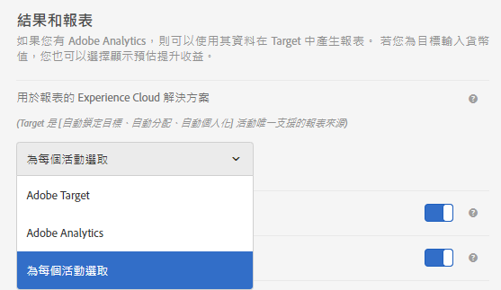

# 活動設定 - A4T 常見問題集

本主題包含有關活動設定和使用[!DNL Analytics]作為[!DNL Target](A4T)報告源的常見問題的解答。

## Analytics 作為報表來源 (A4T) 時支援哪些活動類型?{#section_5E4F58CD25A5424E869E6FE0803968EF}

如需完整清單，請參閱 [Adobe Analytics 作為 Adobe Target (A4T) 的報表來源](/help/c-integrating-target-with-mac/a4t/a4t.md#concept_7540C8C04259434AB6EE33B09F47A1DE)中的「支援的活動類型」。

## 在設定目標量度時，我為何無法存取進階設定？

對於使用[!DNL Analytics]作為報告來源(A4T)的活動，目標量度一律會使用「[!UICONTROL 在活動中增加計數並保留使用者」和「每次曝光時]」設定。 ][!UICONTROL 這是&#x200B;*not*&#x200B;可配置的。

如需詳細資訊，請參閱「設定目標量度時，我為何無法存取進階設定選項？」 在[量度定義- A4T常見問答](/help/c-integrating-target-with-mac/a4t/r-a4t-faq/a4t-faq-metric-definition.md)中。

## 我剛才建立了活動。為何沒看到任何資料進入?  {#section_9F8092BE4225442896F926540292F221}

建立活動時，[!DNL Target]將分類檔案發送到[!DNL Analytics]。 雖然[!DNL Analytics]正在擷取和處理資料，但直到分類檔案更新後，才會顯示在報表中。 這可能需要 24 小時。如果 48 小時之後沒看到資料，請[聯絡客戶服務](/help/cmp-resources-and-contact-information.md#reference_ACA3391A00EF467B87930A450050077C)。或者，如果您已知將會啟動活動，您可以提前幾天建立活動，在儲存活動時即會傳送分類。於是，啟動後資料即會立即出現在報表中。請注意，在[!DNL Analytics]中處理資料需要45-90分鐘。

## 建立新活動時，為何無法選取 Analytics 作為報表來源?  {#section_9F4F69C3085F4C2480AF439127EB27CD}

您可以變更[!UICONTROL 管理]中的[!UICONTROL 報表設定]選項。

1. 在[!DNL Target]中，按一下&#x200B;**[!UICONTROL 管理]**。
1. 在&#x200B;**[!UICONTROL 「用於報表的 Experience Cloud 解決方案」]**&#x200B;下拉式清單中，按一下&#x200B;**[!UICONTROL 「為每個活動選取」]**。

**[!UICONTROL 「目標與設定」]**&#x200B;畫面中會啟用&#x200B;**[!UICONTROL 「報表來源」下拉式清單，以供您建立和編輯活動。]**

若要一律使用[!DNL Analytics]作為報表來源，請從[!UICONTROL 管理]的下拉式清單中選取&#x200B;**[!UICONTROL Adobe Analytics]**。

## 訪客是否可在使用A4T的Auto-Target活動中，在不同瀏覽中切換目標體驗和控制體驗？

假設訪客在兩次瀏覽之間不會變更visitorId，則符合下列條件。

如果流量分配百分比已調整中型活動，則訪客可能會在定位體驗與控制體驗之間移動。

如果百分比未調整mid活動，則一開始看到控制項的訪客一律會傳送至控制項。 傳送至定位體驗的訪客一律會傳送至定位體驗。

* 在定位的流量「貯體」中後，如果機器學習模型判斷新瀏覽有不同的體驗，則訪客可以被傳送至與瀏覽不同的體驗。
* 在指派給流量的控制「貯體」後，訪客一律會看到相同的體驗，因為體驗指派是以訪客visitorId的確定性偽隨機雜湊為基礎。
