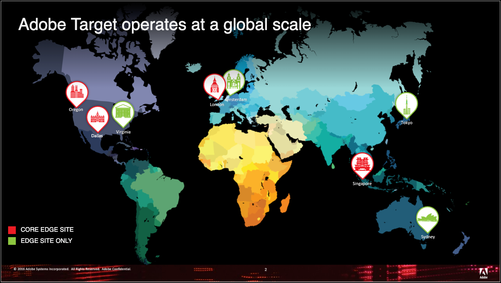

# Adobe Target 如何運作{#how-adobe-target-works}

有關 Adobe Target 如何運作的資訊，包括 Target JavaScript 資料庫 (at.js and mbox.js) 以及 Target 中包含的各種活動類型的相關資訊。

## Target JavaScript 資料庫 {#libraries}

Adobe Target透過兩個JavaScript程式庫之一，與網站整合：at. js或mbox. js

* **at.js**: [at.js 資料庫](../c-implementing-target/c-implementing-target-for-client-side-web/t-mbox-download/c-target-atjs-implementation/target-atjs-implementation.md#concept_8AC8D169E02944B1A547A0CAD97EAC17)是新的 Target 實作資料庫。at.js 程式庫改善 Web 實作的頁面載入時間，並且為單頁應用程式提供更好的實作選項。at.js 為建議的實作程式庫，且經常更新功能。我們建議所有客戶實作或移轉至[最新版本的 at.js](../c-implementing-target/c-implementing-target-for-client-side-web/target-atjs-versions.md#reference_DBB5EDB79EC44E558F9E08D4774A0F7A)。
* **mbox.js:** mbox.js 程式庫為舊版的 Target 實作程式庫。系統仍支援 mbox.js 程式庫，但將不會提供功能更新。

>[!IMPORTANT]
>
>所有客戶應該移轉至 at.js。For more information, see [Migrate to at.js from mbox.js](../c-implementing-target/c-implementing-target-for-client-side-web/t-mbox-download/c-target-atjs-implementation/target-migrate-atjs.md#task_DE55DCE9AC2F49728395665DE1B1E6EA)

您必須在網站上的每個頁面上參考Target JavaScript程式庫檔案。例如，您可以將此檔案新增至全域標頭。Alternatively, consider using [Adobe Launch tag manager](/help/c-implementing-target/c-implementing-target-for-client-side-web/how-to-deployatjs/cmp-implementing-target-using-adobe-launch.md)

每當訪客請求已針對 Target 而最佳化的頁面時，就會傳送請求給目標系統，以決要提供什麼內容給訪客。此程序即時發生：每次載入頁面時，系統就會提出並履行內容要求。內容是由市場行銷人員控制之活動和體驗的規則所管理，且目標鎖定在網站的個別訪客。提供的內容要讓每一位網站訪客最有可能回應、互動、最終購買，以獲得最高的回應率、贏取率、收入。

在 Target 中，頁面上的每一個元素都屬於整個頁面的單一體驗。每個體驗都可能包含頁面上的多個元素。

顯示給訪客的內容取決於您建立的活動類型：

### A/B 測試

如需詳細資訊，請參閱[建立 A/B 測試](../c-activities/t-test-ab/t-test-create-ab/test-create-ab.md#task_68C8079BF9FF4625A3BD6680D554BB72)。

基本 A/B 測試中顯示的內容是根據您為每一個體驗所選擇的百分比，從您指派給活動的資產中隨機挑選。因為這樣的隨機流量分割，在平分百分比之前可能需要許多初始流量。例如，如果您建立兩個體驗，則會隨機挑選開始的體驗。如果流量小，該百分比的訪客可能全偏到其中一個體驗。隨著流量增加，百分比會更平均。

您可以指定每個體驗的百分比目標。在這種情況下會產生亂數，使用此數字選擇顯示的體驗。結果百分比可能和指定目標不完全相同，但流量更多表示體驗分割就會更接近定位目標。

1. 客戶向伺服器請求頁面，並在瀏覽器中顯示該頁面。
2. 在客戶瀏覽器中設定第一方 Cookie，以儲存客戶行為。
3. 頁面呼叫目標系統。
4. 內容會根據活動的規則顯示。

### 自動分配

如需詳細資訊，請參閱[自動分配](../c-activities/automated-traffic-allocation/automated-traffic-allocation.md#concept_A1407678796B4C569E94CBA8A9F7F5D4)。

自動分配會從兩個或多個體驗中識別獲勝者，並自動重新分配更多流量給獲勝者體驗以增加轉換，同時測試會繼續執行和學習。

### 自動鎖定目標(AT)

如需詳細資訊，請參閱[自動鎖定目標](../c-activities/auto-target-to-optimize.md#concept_67779E5B7F67427A97D7EA2A6FB919B3)。

Auto-Target使用先進的機器學習功能，從多個高效能行銷人員定義的體驗中選擇，並根據每位訪客的個人檔案和類似設定檔的行為，為每位訪客提供最量身打造的體驗，以便個人化內容並推動轉化。

### 自動個人化 (AP)

如需詳細資訊，請參閱[自動個人化](../c-activities/t-automated-personalization/automated-personalization.md#task_8AAF837796D74CF893CA2F88BA1491C9)。

自動個人化 (AP) 結合選件或訊息，並使用進階機器學習來根據訪客的個別客戶設定檔比對每位訪客的不同選件變數，以便個人化內容並促進提升度。

### 體驗鎖定目標 (XT)

[體驗鎖定目標](../c-activities/t-experience-target/experience-target.md#task_A53DF336CB9F4D7BB87EF2106099EFC4)

體驗鎖定目標 (XT) 會根據一組市場行銷人員定義的規則和條件為特定對象提供內容。

體驗鎖定目標 (包括地理定位) 對於定義將特定體驗或內容鎖定在特定對象的規則大有幫助。您可以在傳送不同內容變數至不同對象的活動中定義數個規則。在訪客檢視您的網站時，體驗鎖定目標 (XT) 會評估他們，以決定他們是否符合您設定的條件。如果他們符合條件，他們會進入活動，並且針對符合資格對象設計的體驗會顯示。您可以為單一活動內的多個對象建立體驗。

### 多變數測試 (MVT)

如需詳細資訊，請參閱[多變數測試](../c-activities/c-multivariate-testing/multivariate-testing.md#concept_628695CDC71B449B8DCC2F5654C11499)。

多變數測試 (MVT) 會比較頁面上元素中選件的組合，以判斷哪個組合對特定對象執行時效果最佳，並識別哪個元素最能影響活動的成功。

### 建議

如需詳細資訊，請參閱 [Recommendations](../c-recommendations/recommendations.md#concept_7556C8A4543942F2A77B13A29339C0C0)。

Recommendations 活動可依據先前的使用者行為或其他演算法，自動顯示可能使客戶感興趣的產品或內容。Recommendations 可協助引導客戶至他們可能不知道的相關項目。

## Edge 網路 {#concept_0AE2ED8E9DE64288A8B30FCBF1040934}

「Edge」是按地理區域分配服務的架構，可確保對一般使用者的請求內容有最短的回應時間，無論他們身在何處。

為改善回應時間，Edge環境僅裝載活動邏輯和快取描述檔和選件資訊。活動和選件資料庫、[!DNL Analytics] 資料、API 和市場行銷人員使用者介面都存放在 Adobe 的中央資料環境中。接著會將更新傳送至 Edge 節點。中央環境和Edge節點會自動同步，以持續更新快取的活動資料。1：1模型也會儲存在每個邊緣，因此也可以在Edge上處理更複雜的請求。

每個 Edge 節點有所有必要的資訊，可回應使用者的內容請求及追蹤該請求的分析資料。使用者請求會被轉至最近的 Edge 節點。

Adobe目前擁有美國奧勒崗和德州的核心Edge網站；英國倫敦；和新加坡。Adobe目前在Virginia(美國)的Virginia(美國)設有Edge網站；日本東京；和澳洲雪梨。

Core Edge 網站位置同時包含資料收集中心和資料處理中心。Edge 網站位置僅包含資料收集中心。每個報表套裝會被指派至特定的資料處理中心。

Adobe 目前在幾個大洲上皆有資料中心，涵蓋多個區域位置，橫跨北美洲、歐洲和亞洲。

與其回應單一位置的所有定位要求，請求會由最靠近訪客的Edge環境處理，進而減輕網路/網際網路旅行時間的影響。

>[!IMPORTANT]
>
>[!DNL Adobe Target] 目前中國並無Edge網路，而在中國 [!DNL Target] 客戶的效能將繼續有限。Because of the Great Firewall and the lack of Edge nodes within the country, the experiences of sites with [!DNL Target] deployed will be slow to render and page loads will be affected. Also, marketers may experience latency when using the [!DNL Target] Authoring UI.

## 受保護的使用體驗 {#concept_40A5E781D90A41E4955F80EA9E5F8F96}

Adobe 盡可能確保定位基礎建設的可用度和效能值得信賴。然而，使用者瀏覽器和 Adobe 伺服器之間的通訊中斷可能會造成內容傳輸的中斷。

To safeguard against service interruptions and connectivity issues, all locations are set up to include default content (defined by the client), which is displayed if the user’s browser cannot connect to [!DNL Target].

如果使用者的瀏覽器無法在定義的逾時期間內連線(預設為預設)，則不會對頁面進行任何變更：15秒)。如果到達逾時臨界值，則會顯示預設位置內容。

Adobe 藉由效能最佳化以及保衛效能的方式保護使用體驗。

* Adobe 會依據產業標準確保基準效能，這一點在 Adobe 的服務等級合約中已給予保證。
* Edge 網路確保資料及時傳送。
* Adobe 採用多層面的方法保護其應用程式，使其為客戶提供最高水準的可用度和可靠度。
* [!DNL Target] 諮詢服務提供實施協助和使用中產品的支援。

## 搜尋引擎最佳化 (SEO) 友善測試 {#concept_C0C865663CAB4251B66A1F250FD25E6A}

[!DNL Adobe Target] 會符合搜尋引擎對於測試的準則。

Google 鼓勵使用者測試，且已於說明文件中表示只要遵守一些簡單的準則，A/B 和多變數測試並不會影響搜尋引擎自然排名。

如需詳細資訊，請參閱下列 Google 資源:

* [網站測試和 Google 搜尋](https://webmasters.googleblog.com/2012/08/website-testing-google-search.html)
* [實驗和隱匿](https://support.google.com/analytics/answer/2576845?hl=en&ref_topic=1745207)

[Google 網站管理員中心部落格](https://webmasters.googleblog.com/2012/08/website-testing-google-search.html)文章中已提供準則。雖然文章發佈於 2012 年，但仍為 Google 對這件事的最新表述，準則仍然適用。

* **不隱匿** - 隱匿是指將一份內容顯示給使用者，但會識別搜尋引擎機器人並故意供應不同內容，而將另一份內容顯示給搜尋引擎機器人。

   Target (作為一種平台) 已設定為將搜尋引擎機器人視同任何使用者。這表示機器人可能會納入您執行的測試中 (如果隨機選取) 並「看見」測試變異。

* **使用 rel="canonical"** - 有時會顧及變異而需要使用不同的 URL 來設定 A/B 測試。在這些情況下，所有變異都應該包含 `rel="canonical"` 標籤來參照原始 (控制) URL。例如，假設 Adobe 針對每一個變異使用不同的 URL 來測試首頁，首頁的下列 canonical 標籤會出現在每一個變異的 `<head>` 標籤中:

   `<link rel="canonical" href="https://www.adobe.com" />`

* **使用 302 (暫時) 重新導向** - 在對測試中的變異頁面使用個別 URL 的情況下，Google 建議使用 302 重新導向，將流量導向測試變異。這會向搜尋引擎表示重新導向只是暫時，只有在測試執行時才有作用。

   302 重新導向是伺服器端重新導向，Target 及其大部分最佳化提供者都使用用戶端功能。因此，在這方面，Target 不完全符合 Google 的建議。但這對測試的影響很小。透過 Target 執行測試的標準方法會要求在單一 URL 內變更內容，因此不需要重新導向。有時，用戶端需要使用多個 URL 來代表測試變異。在這種情況下，Target 會使用 JavaScript `window.location` 命令，將使用者導向測試變異，但這不明確表明重新導向是 301 還是 302。

   雖然我們持續尋找可行的解決方案，以完全符合搜尋引擎準則，但對於必須使用不同 URL 來測試的客戶，我們確信只要適當實施上述的 canonical 標記，就能降低此方法帶來的風險。

* **執行實驗只要夠久即可** - 我們認為「夠久即可」是指達到統計顯著性所花的時間。Target [提供最佳作法](https://docs.adobe.com/content/target-microsite/testcalculator.html)來判斷測試何時達到此點。建議將獲勝測試寫入程式碼的實作納入測試工作流程中，並分配適當的資源。

   雖然可使用 Target 平台來「發佈」獲勝測試，但不建議當作永久解決方案，但只要是基於100% 的時間來針對 100% 的使用者發佈獲勝測試，則在完成將獲勝測試寫入程式碼的程序時可採用此方法。

   也必須考量您的測試已變更的事物。只是更新頁面上的按鈕或其他次要非文字項目的顏色，完全不影響自然排名。不過，對文字的變更應該寫入程式碼中。

   還必須考量您所測試頁面的可存取性。如果頁面無法供搜尋引擎存取，也從未設計成要在自然搜尋引擎中排在第一名，例如電子郵件行銷活動的專用登陸頁面，則上述考量完全沒必要。

Google指出，遵循這些指引「應該會導致您的測試在搜尋結果中對您的網站沒有任何影響」。

除了這些準則，Google 在說明文件中還對「內容實驗」工具多提供一條準則:

* 「變異頁面應該維持原始頁面內容的本意。這些變異不可變更該原始內容的意義，或使用者對原始內容的普遍認知。」

Google 舉例表示「如果網站的原始頁面所載入的關鍵字與顯示給使用者的組合無關，我們會從索引中移除該網站。」

我們認為在測試變異內非存心變更原始內容的意義並不容易，但建議要注意頁面上的關鍵字主題，並維護這些主題。變更頁面內容 (尤其是新增或刪除有意義的關鍵字) 可能導致 URL 在自然搜尋中的排名發生變化。建議在擬訂測試時與您的 SEO 夥伴合作。

機器人 {#bots}

Adobe Target uses [DeviceAtlas](https://deviceatlas.com/) to detect known bots. 識別為機器人產生之流量的流量，如同一般使用者一樣，仍可確保其符合SEO准則。使用機器人流量會傾斜A/B測試或個人化演算法(如果他們被視為一般使用者)。因此，如果在Target活動中偵測到已知機器人，流量會略有不同。移除機器人流量可提供更精確的使用者活動測量。

尤其是，對於已知機器人流量Target，不會：

* 建立或擷取訪客描述檔
* 記錄任何描述檔屬性或執行描述檔指令碼
* 查閱Adobe Audience Manager(AAM)區段(如果適用)
* 使用機器人流量模型，並為Recommendations、自動目標、自動個人化或自動分配活動提供個人化內容
* 記錄活動瀏覽以進行報告
* 記錄資料以傳送至Adobe Experience Cloud平台
