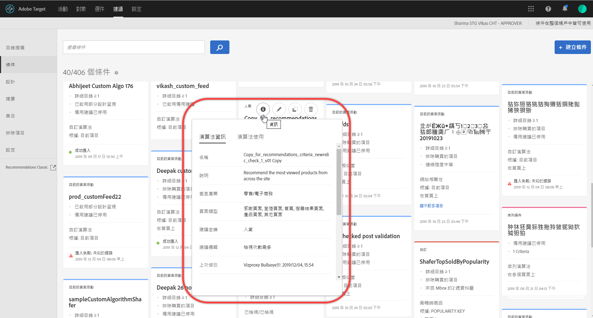
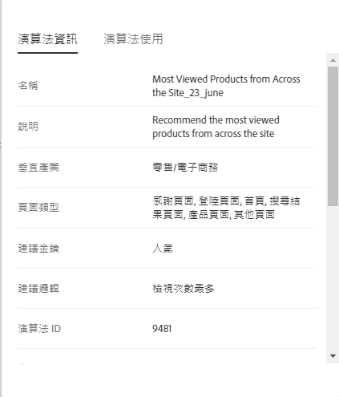
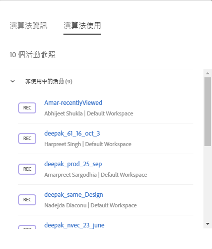
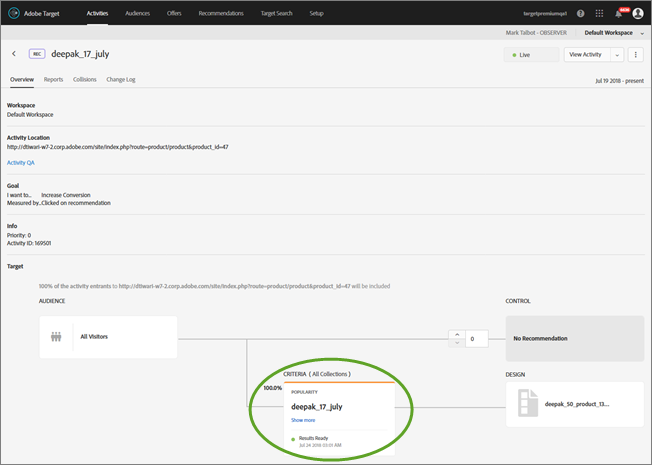

#  條件{#criteria}

條件即為一種規則，用來根據預先決定的一組訪客行為決定要建議的產品。

## 標準 {#concept_4BD01DC437F543C0A13621C93A302750}

條件即為一種規則，用來根據預先決定的一組訪客行為決定要建議的產品。

條件決定什麼動作會產生什麼建議。您可以新增多個條件，將多個建議類型彼此測試。

## 垂直產業 {#section_936BCFCF234C49A2BEC1C38AAC2D71AF}

您需要根據建議活動的目標，選取垂直產業。

| 垂直產業 | 目標 |
|--- |--- |
| 零售/電子商務 | 轉換帶動購買 |
| 潛在客戶開發/B2B/金融服務 | 轉換但未購買 |
| 媒體/出版 | 參與 |

## 建議金鑰 {#section_885B3BB1B43048A88A8926F6B76FC482}

您選取的建議金鑰決定條件類型。提供幾個條件類型，當您設定 [!DNL Recommendations] 活動時會以條件卡呈現。

| 條件類型 | 密鑰 |
|--- |--- |
| 目前頁面活動 | 根據使用者在目前頁面上的行為來建議項目。例如，訪客在檢視特定文章時，可能想看同類型的其他文章。<ul><li>目前項目</li><li>目前類別</li></ul> |
| 自訂 | 根據自訂屬性來建議項目。<ul><li>自訂屬性</li></ul>根據自訂屬性來建議時，您必須選取自訂屬性，然後選取建議類型。 對於您自己的自訂條件輸出，您可以執行即時篩選。例如，您可以將建議的項目限制在來自訪客最喜愛的類別或品牌的內容。此功能可讓您結合離線計算與即時篩選。 此功能表示對於離線計算的建議或自訂策展清單，您可以使用 Target 來新增個人化。這結合資料科學家的本領和研究，與 Adobe 的實測可靠傳送、執行階段篩選、A/B 測試、鎖定目標、報表、整合及其他。 連同在自訂條件上增加包含規則，這還可以根據訪客的興趣，將原本靜態的建議轉換成動態建議。<ul><li>就像建議中的其他條件一樣，自訂條件也可設定。</li><li>您可以使用[收集](/help/c-recommendations/c-products/collections.md)、[排除](/help/c-recommendations/c-products/exclusions.md)和[包含](/help/c-recommendations/c-algorithms/use-dynamic-and-static-inclusion-rules.md) (包括用於價格和存貨的特殊規則) 的方式與任何其他條件相同。</li></ul>可能的使用案例包括:<ul><li>您想從自訂策展清單中建議電影，但僅限於訪客還沒看過。</li><li>您想執行離線演算法，並利用結果來強化建議，但您需要確定絕不會建議沒有庫存的項目。</li><li>您想只包含此訪客最喜愛的類別中的項目。</li></ul> |
| 過去行為 | 根據訪客以往如何回應項目來建議項目。例如，購買特定牌品的人很可能購買相同牌品的其他項目。<ul><li>上次購買的項目</li><li>上次檢視的項目</li><li>檢視次數最多的項目</li><li>最喜愛的類別</li></ul> |
| 人氣 | 建議最熱門項目，例如相關類別中最熱門的影片，或您網站上最常被看到的產品。<ul><li>人氣</li></ul> |
| 最近查看的項目 | 建議訪客最近看過的項目，例如訪客上次造訪網站時查看的項目，或此刻最夯的文章。 「最近查看的項目」演算法會傳回某個[環境](/help/administrating-target/hosts.md)中特定訪客活動的結果。如果兩個網站分屬不同環境，且訪客在兩個網站之間切換，演算法僅會傳回相應網站的最近查看項目。 此條件類型不受限於集合。<ul><li>最近查看的項目</li></ul>**注意:** 您無法對備用建議使用「最近查看的項目」條件。 您可以篩選「最近查看的項目/媒體」，以便僅顯示具有特定屬性的項目。<ul><li>如同建議中的其他條件一樣，「最近查看」條件也可設定。</li><li>您可以使用[收集](/help/c-recommendations/c-products/collections.md)、[排除](/help/c-recommendations/c-products/exclusions.md)和[包含](/help/c-recommendations/c-algorithms/use-dynamic-and-static-inclusion-rules.md) (包括用於價格和存貨的特殊規則) 的方式與任何其他條件相同。</li></ul>可能的使用案例包括:<ul><li>經營多種業務的跨國公司可能讓訪客看到遍及多種數位屬性的項目。在此情況下，您可以將最近查看的項目限制在僅顯示檢視其所在位置的各自屬性。這會防止在另一個數位屬性的網站上顯示「最近查看的項目」。</li></ul> |

## 條件/演算法 {#section_DC4E38A00B9744959F05F8E10A0087A1}

[!DNL Target Recommendations] 採用複雜的演算法，用於判斷訪客的動作何時符合活動中設定的條件。建議金鑰決定可用的建議邏輯選項。

| 標準 | 說明 |
|--- |--- |
| 具有類似屬性的項目/媒體 | 根據目前頁面活動或訪客的過去行為，建議相似的項目或媒體。 **注意:** 如果您選取「具有類似屬性的項目/媒體」，便可選擇設定內容相似度規則。 |
| 瀏覽過此項目、也瀏覽了其他項目的使用者 | 建議在檢視所指定項目的相同工作階段中，最常檢視的項目。 |
| 瀏覽過此項目、但購買了其他項目的使用者 | 建議在檢視所指定項目的相同工作階段中，最常購買的項目。此條件傳回在檢視這個產品之後購買的其他產品，而指定的產品未包含在結果集合中。 |
| 購買了此項目、也購買了其他項目的使用者 | 建議當客戶購買所指定項目的同時，最常購買的項目。 |
| 網站相關性 | 根據項目之間關係的必然性來建議項目。您可以使用「包含規則」滑桿來設定此條件，以決定呈現建議之前需要多少資料。例如，如果選擇「非常強」，則會建議符合確定性最強的產品。 例如，如果您設定非常強的相關性，且您的設計包含五個項目，其中三個符合連線強度臨界值，則不符合最低強度需求的兩個項目不會出現在建議中，而會由您定義的備用項目取代。具有最強相關性的項目會先顯示。 某些客戶具有相異產品集合和相異網站行為，如果他們設定弱網站相關性，可能會獲得最佳結果。 |
| 最暢銷商品 | 多數完成的訂單中包含的項目。單一訂單中相同項目的多個單位視為一份訂單。 |
| 檢視次數最多 | 最常檢視的項目或媒體。 |
| 最近查看的項目/媒體 | 訪客最近檢視的項目。使用此條件時，您應更新 Target 設計來處理先前檢視的項目數不足以顯示而出現空白建議的情況。 |

>[!NOTE] {class=&quot;- topic/note &quot;}
>
>如果執行建議時變更其條件，將會失去報表資料。

您也可以使用訪客的其他已知資訊來增強建議。

所有一天條件每日執行兩次。所有一週及更久條件每日執行一次。網站相關性條件每日執行一次。備用條件每日執行兩次。

## 查看條件資訊 {#section_7162DE58E4594FD688A4D7FDB829FD8B}

您可以將游標移至卡片上並按一下卡片上的「資訊」圖示，這樣無需開啟條件，即可在快顯卡上查看條件詳情。

按一下 **[!UICONTROL 「演算法資訊」]索引標籤，即可查看選取條件的一般資訊，包括名稱、說明、垂直產業、頁面類型、建議金鑰、建議邏輯和演算法 ID。**

按一下 **[!UICONTROL 「演算法使用情形」]索引標籤，即可查看參照選取條件的活動清單。** 卡片會列出使用中和非使用中的活動。按一下「已上線活動」或「非使用中活動」下拉式清單，即可查看參照該條件的完整活動清單。您可以按一下活動連結以開啟活動並編輯。

## 判斷條件結果何時可就緒播放 {#section_03F328C07F234692B6D996DF745584B3}

在活動圖表中，條件卡現在會指出結果何時可就緒播放。掌握結果是否以就緒播放可協助您判斷您的活動是否已準備好啟動以推送上線。亦可協助您瞭解條件是否有任何問題。

>[!NOTE]
>
>如需有關載入時間的討論，請參閱[建立條件](../../c-recommendations/c-algorithms/create-new-algorithm.md#task_8A9CB465F28D44899F69F38AD27352FE)中的「預計條件處理時間」。

下圖顯示 Recommendations 活動「概覽」頁面上的活動圖表。您也可以在步驟 2 的活動建立工作流程期間，查看活動圖表，並附有條件狀態結果。

狀態結果包括下列項目: 可用結果、不可用結果、摘要失敗，如下方圖表所示:

