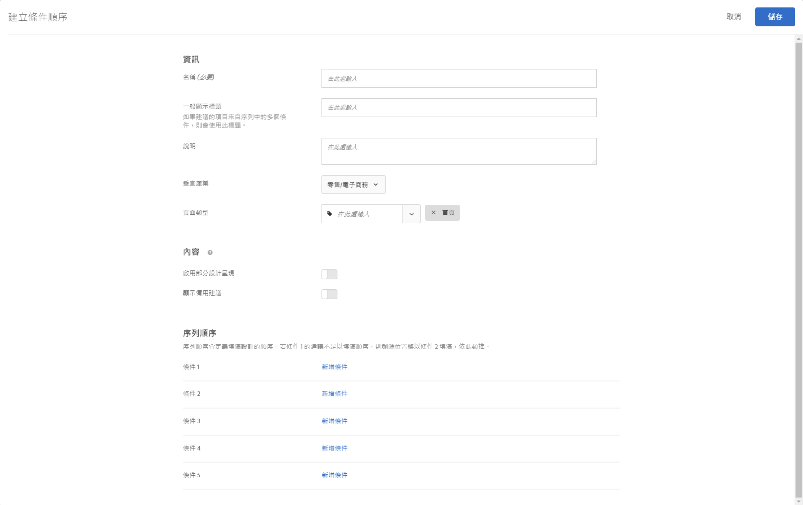

#  建立條件序列

使用最多五個條件的序列來對 [!UICONTROL Recommendations] 活動中出現的項目執行更好的控制。

>[!NOTE]
>
>條件序列不能搭配在 [!UICONTROL  2016 年 10 月之前版本中建立的 ]Recommendations[!DNL Target Premium] 活動使用。

若要建立條件順序，您必須先建立您要在序列中包括的條件。請參閱[建立條件](/help/c-recommendations/c-algorithms/create-new-algorithm.md)，以取得相關資訊。

透過使用條件序列，您可以在條件未傳回可滿足您的設計的足夠結果時，提供其他鎖定目標的建議，而非使用更一般的備用建議。通常，條件序列會從傳回較少結果的更特定定位，到傳回更多結果的更一般定位。

您的准則順序可能依頁面類型而異，如下列範例所示：

| 頁面類型 | 可能的順序 |
| --- | --- |
| 產品頁面 | <ol><li>根據目前項目，來自相同品牌</li><li>根據目前項目，來自所有品牌</li><li>根據內容相似度</li><li>根據最暢銷商品</li><li>根據各網站間檢視次數最多的項目</li></ol> |
| 首頁 | <ol><li>根據訪客的最近一次的購買 </li><li>根據訪客最喜愛的項目</li><li>根據訪客最喜愛的類別</li><li>根據最暢銷商品</li><li>根據各網站間檢視次數最多</li></ol> |

## 建立標準順序

您可以從「建立標準序列」屏 [!UICONTROL 幕建立標準序列] 。

有多個方式可到達[!UICONTROL 「建立條件順序」]畫面。根據您達到畫面的方式，部分畫面選項可能有所不同。

* 在&#x200B;**[!UICONTROL 「Recommendations」]**>**[!UICONTROL 「條件」]**&#x200B;資料庫畫面上，按一下&#x200B;**[!UICONTROL 「建立條件」**[!UICONTROL >]**「建立條件順序」]**。您在這裡建立的條件會自動可供所有 [!UICONTROL Recommendations] 活動使用。
* 當您建立 [!UICONTROL Recommendations活動時] ，從「選取准則」畫面中按一下「建立新 **[!UICONTROL 增]** >建立 **[!UICONTROL 准則序列」]**。 您將可以選擇儲存您的新條件順序以搭配其他 [!UICONTROL Recommendations] 活動使用。
* When you are editing a [!UICONTROL Recommendations] activity, click in a [!UICONTROL Recommendations Location] box on your page, then select **[!UICONTROL Change Criteria]**. 在[!UICONTROL 「選取條件」]畫面上，按一下&#x200B;**[!UICONTROL 「新建」]**>**[!UICONTROL 「建立條件順序」]**。您將可以選擇儲存您的新條件以搭配其他 [!UICONTROL Recommendations] 活動使用。

以下步驟假定您使用第一 [!UICONTROL 種方法訪問「建立標準序列] 」螢幕：「建 **[!UICONTROL 議]** > **[!UICONTROL 准則]** 」程式庫畫面。

1. 按一 **[!UICONTROL 下「建議]** > **[!UICONTROL 准則]**」。

1. 按一 **[!UICONTROL 下「建立條件]** >建 **[!UICONTROL 立條件順序」]**。

   

1. Fill in the information in the [Basic Information](/help/c-recommendations/c-algorithms/create-new-algorithm.md#info) section.

1. 在「標準 **[!UICONTROL 序列]** 」區段中，按一 **[!UICONTROL 下「新增標準」]**。

   序列順序定義填充設計的順序。 如果條件1沒有足夠的建議來填入您的設計，其餘的槽將填入條件2等。

   

1. 在「選擇 [!UICONTROL 標準] 」畫面上，選取標準，然後按一下「 **[!UICONTROL 新增」]**。

   您可以使用「搜尋」方塊和篩選下拉式清單來尋找所需的准則。

   

1. （選擇性）投 **[!UICONTROL 影片「限制傳回的項目數]** 」會切換至「開啟」位置，然後指定項目數（介於1到50之間）。

   

   為協助您瞭解「限制傳回 [!UICONTROL 的項目數」選項的值] ，請考慮下列使用案例：

   * **使用案例1**:您想要在單一建議托盤中混合使用不同種類的項目。 例如，您想要展示混搭的外套（夾克）和上衣（襯衫、T恤）。 若要達成此目的，請使用「系列」作業，其中包含您設計中任何位置所需的所有潛在產品類型。 然後，使用限制條件僅包含外套的靜態篩選器來設定您的第一個准則，並使用限制條件僅包含頂端的靜態篩選器來設定您的第二個准則。 最後，將兩個准則新增至准則序列，並將第一個准則限制為2個槽。

      Recommendations托盤在您的網站上可能如下所示：

      

   * **使用案例2**:您需要混合使用替代項目和互補項目。 設定一個准則以使用已檢視／已檢視演算法，並使用動態篩選，將建議項目限制為目前項目的類別。 設定第二個條件以使用已檢視／購買的演算法，並使用動態篩選，其中僅包含不符合目前項目類別的建議項目。 最後，將兩個准則新增至序列，並將第一個准則限制為2個槽。

1. 繼續將其他條件新增至序列。 您可以新增最多五個條件至順序。

1. 啟用 [備份內容選項](/help/c-recommendations/c-algorithms/create-new-algorithm.md#content)。

1. 按一下&#x200B;**[!UICONTROL 「儲存」]**。

   條件序列會出現在條件清單中。

   如需關於建議邏輯選項的詳細資訊，請參閱[條件](/help/c-recommendations/c-algorithms/algorithms.md)。

## 訓練影片: 在 Recommendations 中建立條件 (12:33) 

此影片包含下列資訊:

* 建立條件
* 建立條件序列
* 上傳自訂條件

>[!VIDEO](https://video.tv.adobe.com/v/27694?quality=12)
