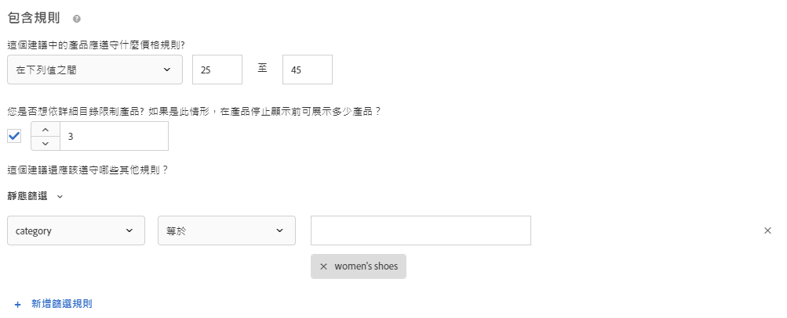
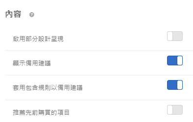

#  建立條件{#create-criteria}

條件可控制 Recommendations 活動的內容。建立條件以顯示最適合您的活動的建議。

## 建立條件 {#task_8A9CB465F28D44899F69F38AD27352FE}

條件可控制 [!DNL Recommendations] 活動的內容。建立條件以顯示最適合您的活動的建議。

有多個方式可進入[!UICONTROL 「建立新條件」]畫面。根據您達到畫面的方式，部分畫面選項可能有所不同。

* 建立 [!DNL Recommendations]**活動時，請在[!UICONTROL 「選取條件」]** 畫面上按一下[!UICONTROL 「新建」]。您將可以選擇儲存您的新條件以搭配其他 [!DNL Recommendations] 活動使用。
* 編輯 [!DNL Recommendations] 活動時，請在頁面上的[!UICONTROL 「Recommendations 位置」]方塊中按一下，然後選取 **[!UICONTROL 「變更條件」]**。在[!UICONTROL 「選取條件」]畫面上，按一下 **[!UICONTROL 「新建」]**。您將可以選擇儲存您的新條件以搭配其他 [!DNL Recommendations] 活動使用。
* 在 **[!UICONTROL 「Recommendations]** &gt; **[!UICONTROL 條件」]** 資料庫畫面上，按一下 **[!UICONTROL 「建立條件」**]。您在這裡建立的條件會自動可供所有 [!DNL Recommendations] 活動使用。

1. 按一下 **[!UICONTROL 「建立條件」]** 或 **[!UICONTROL 「新建」]**。

   

1. 選取 **[!UICONTROL 「建立條件」]**。

   

1. 輸入 **[!UICONTROL 條件名稱]**。

   這是用來說明該條件的「內部」名稱。例如，您可能想要將您的條件稱為「利潤最高的產品」，但您不想要將該標題公開顯示。請參閱下一個步驟來設定公開顯示的標題。

1. 輸入公開顯示的 **[!UICONTROL 顯示標題]**，以在使用此條件的任何 Recommendations 頁面上顯示。

   例如，使用此條件來顯示建議時，您可能想要顯示「瀏覽過此項目、也瀏覽了其他項目的使用者」或「類似產品」。

1. 輸入條件的簡短 **[!UICONTROL 說明]**。

   說明應該能協助您識別條件，並且可能包括關於條件用途的資訊。

1. 選取 **[!UICONTROL 垂直產業]**:

   * [!UICONTROL 零售/電子商務]
   * [!UICONTROL 潛在客戶開發/B2B/金融服務]
   * [!UICONTROL 媒體/出版]
   其他條件選項將根據您選取的垂直產業而變更。

1. 選取一個 **[!UICONTROL 頁面類型]**。

   您可以選取多個頁面類型。

   產業垂直和頁面類型可共同用來分類您儲存的條件，讓您可輕鬆對其他 [!DNL Recommendations] 活動重複使用條件。

1. 選取一個 **[!UICONTROL 建議索引鍵]**。

   如需依據索引鍵的條件之相關詳細資訊，請參閱[讓建議以建議索引鍵為依據](../../c-recommendations/c-algorithms/create-new-algorithm.md#task_2B0ED54AFBF64C56916B6E1F4DC0DC3B)。

1. 選取 **[!UICONTROL 「建議邏輯」]**。

   如需關於建議邏輯選項的詳細資訊，請參閱[條件](../../c-recommendations/c-algorithms/algorithms.md#concept_4BD01DC437F543C0A13621C93A302750)。

   >[!NOTE]
   >
   >如果您選取 **[!UICONTROL 「具有類似屬性的項目]**/**[!UICONTROL 媒體」]**，便可選擇設定[內容相似度規則](../../c-recommendations/c-algorithms/create-new-algorithm.md#concept_5402DAFA279C4E46A9A449526889A0CB)。

1. 設定 **[!UICONTROL 資料範圍]**，以便在決定要顯示哪些建議時，限定要使用的可用歷史使用者行為資料的時間範圍。

   如果您的網站經常有大量流量和行為變更，請選擇較短的資料時段。較短的時段可讓 [!DNL Recommendations] 對於市場和您的業務中的變更更具回應力。例如，較短的時段表示 [!DNL Recommendations] 將在您的訪客開始季節性購物 (例如開學購物或聖誕節) 時偵測訪客行為中的變更，並將對這些購物季建議適當的項目。

   如果您沒有許多資料，或訪客行為不會經常變更，則可以選取較長的時段。不過，對許多網站來說，較短的時段會造成較好的建議。

   可用的資料範圍為:

   * 兩天
   * 一週
   * 兩週
   * 一個月
   * 兩個月

1. 選取需要的 **[!UICONTROL 行為資料來源]**: [!UICONTROL mbox] 或 [!UICONTROL Analytics]。

   如果您選擇 [!UICONTROL Analytics]，請選取需要的報表套裝。

1. 設定 **[!UICONTROL 內容]** 規則。

   內容規則會決定如果建議的項目數量無法滿足您設計時所要發生的情況。例如，如果您的設計有五個項目的空間，但您的條件造成只有建議三個項目，您可以將剩餘空間保留空白，或您可以使用備用建議來填滿額外的空間。

   選取適當的切換:

   * [!UICONTROL 啟用部分設計呈現]
   * [!UICONTROL 顯示備用建議]
   * [!UICONTROL 建議先前購買的項目]
   此設定是根據 `productPurchasedId`。如果您銷售的是客戶一般只會購買一次的項目，例如獨木舟，則此相當實用。如果您銷售的是客戶會回來再次購買的項目，例如洗髮精或其他個人項目，則應該停用此選項。

1. 設定您的 **[!UICONTROL 包含規則]**。

   包含規則可決定將在您的建議中包括哪些項目。可用的選項取決於您的垂直產業。

   如需更多詳細資料，請參閱[包含規則](../../c-recommendations/c-algorithms/create-new-algorithm.md#task_28DB20F968B1451481D8E51BAF947079)。

1. 設定 **[!UICONTROL 屬性加權]**。

   您可以新增多個規則，以依據關於內容目錄的重要說明或中繼資料來「推進」演算法。例如，您可以對在售項目套用較高的加權，以便在建議中更頻繁地顯示它們。

   請參閱[屬性加權](../../c-recommendations/c-algorithms/create-new-algorithm.md#task_2AEDA0DB15B74770B76F6982B24C2E42)。

1. 完成時，按一下 **[!UICONTROL 「儲存」]**。

   如果您要建立新的 [!UICONTROL Recommendations] 活動或編輯現有的活動，依預設會選取 **[!UICONTROL 「儲存條件以供稍後使用」]核取方塊。** 如果您不想在其他活動中使用條件，請在儲存之前清除核取方塊。

### 預計條件處理時間

* **mboxes**: 如果條件使用 mbox 當作行為資料來源，條件建立後便會立即執行。根據使用的行為資料數量和目錄大小，演算法最多可能需 12 小時來執行。變更條件設定會導致條件重新執行。

* **Analytics**: 如果條件使用 [!DNL Adobe Analytics] 當作行為資料來源，建立後，條件可用時間會根據其他條件是否已使用選取的報表套裝和回顧期間而定。如果報表套裝先前已搭配至少與所選回顧期間一樣長的回顧期間，Target 中即可使用行為資料，Recommendations 也會立即執行條件。視使用的行為資料數量和目錄大小而定，演算法最多可能需 12 個小時來執行。如果先前未使用報表套裝，或是搭配更長回顧期間，Recommendations 必須要求和接收 Adobe Analytics 的資料，接著再執行演算法。與 Analytics 同步的過程視 Analytics 系統負載而定，一般至少需 2 天，最多可能需 7 天才能完成。

## 讓建議以建議索引鍵為依據 {#task_2B0ED54AFBF64C56916B6E1F4DC0DC3B}

基於機碼的 Recommendations 會利用訪客行為環境來顯示相關結果。

有兩種類型的建議: 

* **人氣:** 根據「檢視次數最多」、「銷售最高」和「排名最前的量度」列出項目。人氣條件的金鑰為空白。
* **以金鑰為依據:** 組成條件的其餘部分。Recommendations 提供與金鑰類型相關的多種設定選擇。選項範圍從「目前項目」到「設定檔參數」，這允許您以程式設計方式設定要建議的值金鑰。您可以讓每個條件以不同金鑰為基礎，對彼此測試多個條件。

各條件均在自己的標籤中定義。流量平均分入不同的條件測試中。換句話說，如果您有兩個條件，流量會在它們之間平均分配。如果您有兩個條件和兩個設計，流量會在四個組合中平均分割。您也可指定可看到預設內容的訪客比例，以進行比較。這種情況下，指定比例的訪客看到預設內容，其餘的分入條件和設計組合之間。

1. 建立新建議，或選取現有的建議，然後按一下 **[!UICONTROL 「編輯」]**。
1. 若要變更建議索引鍵，請從[!UICONTROL 「建議索引鍵」]下拉式清單中選取新索引鍵，然後按一下 **[!UICONTROL 「儲存」]**。

   因為不同邏輯會對應至不同建議金鑰，而不同建議會將自身借出，以放置在不同類型的頁面上。請參閱下文章節，瞭解有關每個索引鍵的詳細資訊。

### 目前項目

建議由訪客正在檢視的項目確定。

Recommendations 會顯示對指定項目感興趣的訪客的其他項目。

選取此選項時，必須將 `entity.id` 值作為顯示 mbox 的參數傳遞。

**邏輯 (條件)**

* [!UICONTROL 具有類似屬性的項目]
* [!UICONTROL 瀏覽過此項目、也瀏覽了其他項目的使用者]
* [!UICONTROL 瀏覽過此項目、但購買了其他項目的使用者]
* [!UICONTROL 購買了此項目、也購買了其他項目的使用者]
* [!UICONTROL 網站相關性]

**使用您網站上的哪個位置**

單一項目頁面，例如產品頁面。

請勿在 null 搜尋結果頁面上使用。

### 目前類別

建議由訪客正在檢視的產品類別確定。

Recommendations 會將項目顯示在指定的產品類別中。

選取此選項時，必須將 `entity.categoryId`   值作為參數傳入顯示 mbox。

**邏輯 (條件)**

* 最暢銷商品
* 檢視次數最多

**使用您網站上的哪個位置**

單一類別頁面。

請勿在 null 搜尋結果頁面上使用。

### 自訂屬性 {#custom}

Recommendation 由儲存在訪客設定檔中的項目決定，並使用user.*x* 或設定檔。*x* 屬性。

選取此選項時，設定檔屬性中必須呈現 `entity.id` 值。

**邏輯 (條件)**

* [!UICONTROL 瀏覽過此項目、也瀏覽了其他項目的使用者]
* [!UICONTROL 瀏覽過此項目、但購買了其他項目的使用者]
* [!UICONTROL 購買了此項目、也購買了其他項目的使用者]
* [!UICONTROL 整體行為]
* [!UICONTROL 檢視次數最多]
* [!UICONTROL 最暢銷商品]

如果金鑰為自訂設定檔屬性，而演算法類型為「檢視次數最多」或「最暢銷商品」，則系統會顯示稱為「依下列唯一值分組:」的新下拉式清單，其中有已知實體屬性 (除了 ID、類別、利潤、值、存貨和環境) 的清單。此為必填欄位。

**使用您網站上的哪個位置**

可以在任何頁面上使用。

**使用自訂建議索引鍵**

您可以讓建議以自訂設定檔屬性的值為依據。例如，假設您要依據訪客最近新增至其佇列中的電影顯示推薦電影。

1. 從 **[!UICONTROL 建議索引鍵]** 下拉式清單 (例如「最近新增到觀看清單的節目」) 中選取自訂設定檔屬性。
1. 接著，選取 **[!UICONTROL 建議邏輯]** (例如「瀏覽過此項目、也瀏覽了其他項目的使用者」)。

   

如果自訂設定檔屬性未直接比對至單一實體 ID，則需要向 [!DNL Recommendations] 解說您希望實體的比對如何發生。例如，假設您要顯示訪客最喜愛品牌的最暢銷商品項目。

1. 從 **[!UICONTROL 建議索引鍵]** 下拉式清單 (例如「最喜愛的品牌」) 選取自訂設定檔屬性。

1. 接著，選取您要用於此索引鍵的 **[!UICONTROL 建議邏輯]** (例如「最暢銷商品」)。

   [!UICONTROL 依下列唯一值分組]選項隨即顯示。

1. 選取比對至您已選擇之索引鍵的實體屬性。在此範例中，「最喜愛的品牌」比對至 `entity.brand`。

   [!DNL Recommendations] 現在會產生每個品牌的「最暢銷商品」清單，並依據訪客最喜愛的品牌設定檔屬性中儲存的值，向訪客顯示相關的「最暢銷商品」清單。

   

### 上次購買的項目

建議由每位獨特訪客上次購買的項目確定。這會自動擷取，因此無需向頁面傳遞任何值。

**邏輯 (條件)**

* [!UICONTROL 具有類似屬性的項目]
* [!UICONTROL 瀏覽過此項目、也瀏覽了其他項目的使用者]
* [!UICONTROL 瀏覽過此項目、但購買了其他項目的使用者]
* [!UICONTROL 購買了此項目、也購買了其他項目的使用者]
* [!UICONTROL 網站相關性]

**使用您網站上的哪個位置**

首頁、我的帳戶頁面、離站廣告。

請勿在產品頁面或與購買相關的頁面上使用。

### 上次檢視的項目

建議由每位獨特訪客上次檢視的項目確定。這會自動擷取，因此無需向頁面傳遞任何值。

**邏輯 (條件)**

* [!UICONTROL 具有類似屬性的項目]
* [!UICONTROL 瀏覽過此項目、也瀏覽了其他項目的使用者]
* [!UICONTROL 瀏覽過此項目、但購買了其他項目的使用者]
* [!UICONTROL 購買了此項目、也購買了其他項目的使用者]
* [!UICONTROL 網站相關性]

**使用您網站上的哪個位置**

首頁、我的帳戶頁面、離站廣告。

請勿在產品頁面或與購買相關的頁面上使用。

### 檢視次數最多的項目

建議由檢視次數最多的項目確定，而使用的方法與最喜愛類別的相同。

這由最新/頻率條件判斷，方式如下:

* 第一個產品檢視 10 點
* 每個後續檢視 5 點
* 作業結束時，所有值除以 2

例如，在一次作業中先後檢視 surfboardA 和 surfboardB，結果為 A: 10、B: 5。作業結束之後，結果為 A: 5、B: 2.5。如果您在下次作業時檢視相同項目，值會變更為 A: 15、B: 7.5。

**邏輯 (條件)**

* [!UICONTROL 具有類似屬性的項目]
* [!UICONTROL 瀏覽過此項目、也瀏覽了其他項目的使用者]
* [!UICONTROL 瀏覽過此項目、但購買了其他項目的使用者]
* [!UICONTROL 購買了此項目、也購買了其他項目的使用者]
* [!UICONTROL 網站相關性]

**使用您網站上的哪個位置**

一般頁面，例如首頁或登陸頁面及離站廣告。

### 最喜愛的類別

建議由接收最多活動的類別確定，而使用的方法與「檢視次數最多的項目」的相同，只不過是以類別計分，而並非產品。

這由最新/頻率條件判斷，方式如下:

* 第一個類別檢視 10 點
* 每個後續檢視 5 點

第一次造訪的類別會獲得 10 點。後續對相同類別的造訪會獲得 5 點。隨著每次造訪，之前已檢視的非目前類別會減少 1。

例如，在一次作業中先後檢視 categoryA 和 categoryB，結果為 A: 9、B: 10。如果您在下次作業時檢視相同項目，值會變更為 A: 20 B: 9。

**邏輯 (條件)**

* [!UICONTROL 最暢銷商品]
* [!UICONTROL 檢視次數最多]

**使用您網站上的哪個位置**

一般頁面，例如首頁或登陸頁面及離站廣告。

### 人氣

建議由網站上的項目人氣確定。人氣包括依據 mbox 資料的最暢銷商品和檢視次數最多的產品，如果使用 Adobe Analytics，則還依據產品報表中的所有可用量度。項目的排名是根據您選取的建議邏輯。

**邏輯 (條件)**

* [!UICONTROL 最暢銷商品]
* [!UICONTROL 檢視次數最多]
* 產品報表量度 (如果您使用 Adobe Analytics)

**使用您網站上的哪個位置**

一般頁面，例如首頁或登陸頁面及離站廣告。

### 最近查看的項目 {#recently-viewed}

根據設計中的位置數量，使用訪客的歷史 (跨工作階段) 以呈現訪客已檢視的前 *x* 個項目。

現在，「最近檢視的項目」條件會傳回指定[環境](/help/administrating-target/hosts.md)的特定結果。如果兩個網站分屬於不同環境，當訪客在這兩個網站之間進行切換時，每個網站都只會顯示適用網站最近檢視過的項目。如果兩個網站屬於同一環境，當訪客在這兩個網站之間進行切換時，訪客會看到兩個網站同樣最近檢視過的項目。

**使用您網站上的哪個位置**

一般頁面，例如首頁或登陸頁面及離站廣告。

## 包含規則 {#task_28DB20F968B1451481D8E51BAF947079}

有數個選項可以協助您縮減在建議中顯示的項目。您可以在建立條件或促銷活動時使用包含規則。

包含規則屬於可選; 不過，設定這些詳細資料可讓您對於建議中出現的項目擁有更多控制。您設定的每個詳細資訊都會進一步縮小顯示條件。

例如，您可以選擇只顯示存貨超過 50 雙且價格介於 $25 和 $45 之間的女鞋。您也可以加權每個屬性，讓對於您業務更為重要的項目可以更常顯示。

另一個範例是，您可以選擇對造訪您的網站、僅來自特定城市且擁有所需大學學位的訪客顯示職缺。

包含規則選項可能因垂直產業而不同。依預設，包含規則會套用至備用建議。

>[!NOTE]
>
>您應該謹慎使用包含規則。例如，如果您的組織具有規則，要求在顯示某個品牌時不建議其他品牌，則這些選項很有用。不過，此功能有機會成本。將活動條件通常會顯示的某些項目限制為不要顯示時，您可能會遺失提升度百分比。

利用 AND 聯合包含規則。必須符合所有規則，才能在建議中納入某個項目。

如先前所提及，若要建立簡單的包含規則，僅顯示存貨大於 50 且價格介於 $25 與 $45 之間的女鞋，請執行下列步驟:

1. 設定您要建議之產品的價格範圍。
1. 設定您要建議之產品的存貨量下限。
1. 設定建議只在項目符合您的特定條件時才顯示。

   

   您可以指定僅在符合清單中的其中一項屬性，或不符合一項或多項指定的條件時，才包括項目。

   可用的評估工具取決於您在第一個下拉式清單中選擇的值。您可以列出多個項目。這些項目會使用 OR 來評估。

   多個規則會使用 AND 來結合。

   >[!NOTE]
   >
   >此選項會限制建議中所顯示的項目。不會限制在哪些頁面中顯示建議。若要限制建議顯示的位置，請在體驗撰寫器中選取頁面。

## 屬性加權 {#task_2AEDA0DB15B74770B76F6982B24C2E42}

使用屬性加權來「微調」演算法，使得某些項目更可能顯示。行銷人員可依據關於內容目錄的重要說明或中繼資料來影響演算法。

給予在售項目更高的加權，以便在建議中更頻繁地顯示它們。不完全排除非售項目，但它們的顯示頻率較低。多種加權屬性皆可套用至相同的演算法，並能依據建議中的拆分流量測試加權屬性。

1. 選擇值。

   根據數個可用條件中的一個，值會決定較可能顯示的項目類型。

1. 選擇一個求值器。
1. 輸入關鍵字以完成規則屬性。

   例如，完成的規則會是「類別包含鞋子」。

   

1. 選取要指派至規則的加權。

   選項範圍從 0 到 100 (增量為 25)。

1. 如有需要，可新增其他規則。

## 內容設定 {#concept_BC16005C7A1E4F1A87E33D16221F4A96}

[!UICONTROL 內容]設定會決定在您的設計建議的顯示方式。

[!UICONTROL Recommendations] 條件可能傳回較您的設計所需更少的建議。例如，您的設計可能有五個可用「位置」，但條件僅傳回三個建議的項目。[!UICONTROL 內容]設定會控制發生此情況時，呈現建議的方式。

內容規則會決定如果建議的項目數量無法滿足您設計時所要發生的情況。例如，如果您的設計有五個項目的空間，但您的條件造成只有建議三個項目，您可以將剩餘空間保留空白，或您可以使用備用建議來填滿額外的空間。

選取適當的切換:

* [!UICONTROL 啟用部分設計呈現]
* [!UICONTROL 顯示備用建議]
* [!UICONTROL 對備用建議套用包含規則]
* [!UICONTROL 建議先前購買的項目]

   此設定是根據 `productPurchasedId` 設定檔值。預設行為是不推薦先前購買的項目。大多數情況下，您不會想推銷客戶最近已購買的項目。如果客戶通常會重複購買特定項目，啟用此功能即可繼續推薦先前購買的項目。

如果您啟用 **[!UICONTROL 「顯示備用建議」]**，系統會依預設啟用對備用建議套用[包含規則](../../c-recommendations/c-algorithms/create-new-algorithm.md#task_28DB20F968B1451481D8E51BAF947079)的選項。

| 部分設計呈現 | 備份建議 | 結果 |
|--- |--- |--- |
| 已停用 | 已停用 | 如果傳回的建議少於設計呼叫的數目，則會以預設內容取代建議設計，並且不顯示建議。 |
| 已啟用 | 已停用 | 系統會轉譯設計，但如果傳回的建議少於設計呼叫的數目，則可能包含空格。 |
| 已啟用 | 已啟用 | 備用建議會填滿可用的設計「槽」，以完整呈現設計。 如果因套用包含規則至備用建議而限制了合格備用建議的數量，以致設計無法填滿，則會轉譯部分設計。 如果條件未傳回任何建議，並且包含規則將備用建議限制為零，則會以預設內容來取代設計。 |
| 已停用 | 已啟用 | 備用建議會填滿可用的設計「槽」，以完整呈現設計。 如果因套用包含規則至備用建議而限制了合格備用建議的數量，以致設計無法填滿，則會以預設內容取代設計，並且不顯示建議。 |

## 內容相似度 {#concept_5402DAFA279C4E46A9A449526889A0CB}

使用[!UICONTROL 內容相似度]規則根據項目或媒體屬性來提出建議。

內容相似度會比較項目屬性關鍵字並根據不同項目有多少共通的關鍵字進行建議。根據內容相似度的建議不需要過去的資料即可傳送強大的結果。

使用內容相似度來產生建議對於新項目來說尤其有效，它不太可能在使用*瀏覽過此項目、也瀏覽了其他項目的使用者*和根據過去行為之其他邏輯的建議中顯示。您也可以使用內容相似度，為沒有過去的購買或其他歷史資料的新訪客產生實用的建議。

選取「具有類似屬性的 **[!UICONTROL 項目]**/**[!UICONTROL 媒體]**」時，您可選擇建立規則，以增加或減少在決定建議時特定項目屬性的重要性。對於書籍之類的項目，您可能想要增強*風格*、*作者*、*系列*之類屬性的重要性，以建議類似的書籍。

因為內容相似度使用關鍵字來比較項目，有些屬性，例如*訊息*或*說明*可能會對比較產生「雜訊」。您可以建立規則來忽略這些屬性。

依預設，所有屬性會設為*「基線」*。除非您要變更此設定，否則您不需建立規則。
