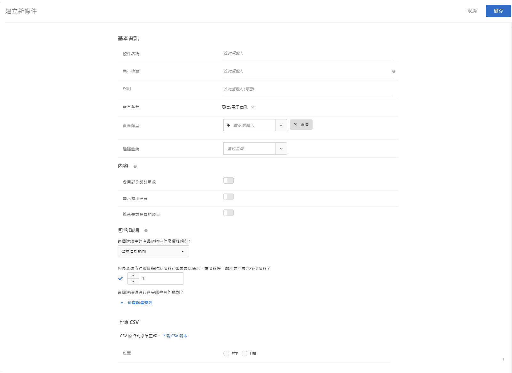

#  上傳自訂條件{#upload-custom-criteria}

上傳 CSV 檔案來自訂您的建議。

有多個方式可進入[!UICONTROL 「建立新條件」]畫面。根據您達到畫面的方式，部分畫面選項可能有所不同。

* 建立 [!UICONTROL Recommendations] 活動時，請在&#x200B;**[!UICONTROL 「選取條件」]**&#x200B;畫面上按一下[!UICONTROL 「新建」]。您將可以選擇儲存您的新條件以搭配其他 [!UICONTROL Recommendations] 活動使用。
* 編輯 [!UICONTROL Recommendations] 活動時，請在頁面上的[!UICONTROL 「Recommendations 位置」]方塊中按一下，然後選取&#x200B;**[!UICONTROL 「變更條件」]**。在[!UICONTROL 「選取條件」]畫面上，按一下&#x200B;**[!UICONTROL 「新建」]**。您將可以選擇儲存您的新條件以搭配其他 [!UICONTROL Recommendations] 活動使用。
* 在&#x200B;**[!UICONTROL 「Recommendations]** &gt; **[!UICONTROL 條件」]**&#x200B;資料庫畫面上，按一下&#x200B;**[!UICONTROL 「建立條件」**]。您在這裡建立的條件會自動可供所有 [!UICONTROL Recommendations] 活動使用。

1. 按一下&#x200B;**[!UICONTROL 「建立條件」]**。

   

1. 選取&#x200B;**[!UICONTROL 「上傳自訂條件」]**。

   

1. 輸入&#x200B;**[!UICONTROL 條件名稱]**。

   這是用來說明該條件的「內部」名稱。例如，您可能想要將您的條件稱為「利潤最高的產品」，但您不想要將該標題公開顯示。請參閱下一個步驟來設定公開顯示的標題。
1. 輸入公開顯示的&#x200B;**[!UICONTROL 顯示標題]**，以在使用此條件的任何 Recommendations 頁面上顯示。

   例如，使用此條件來顯示建議時，您可能想要顯示「瀏覽過此項目、也瀏覽了其他項目的使用者」或「類似產品」。
1. 輸入條件的簡短&#x200B;**[!UICONTROL 說明]**。

   說明應該能協助您識別條件，並且可能包括關於條件用途的資訊。
1. 選取&#x200B;**[!UICONTROL 「垂直產業」]**。

   其他條件選項可能會根據您選取的垂直產業而變更。1. 選取&#x200B;**[!UICONTROL 「頁面類型」]**。

   您可以選取多個頁面類型。

   產業垂直和頁面類型可共同用來分類您儲存的條件，讓您可輕鬆對其他 [!UICONTROL Recommendations] 活動重複使用條件。
1. 選取一個&#x200B;**[!UICONTROL 建議索引鍵]**。

   如需依據索引鍵的條件之相關詳細資訊，請參閱[讓建議以建議索引鍵為依據](../../c-recommendations/c-algorithms/create-new-algorithm.md#task_2B0ED54AFBF64C56916B6E1F4DC0DC3B)。
1. 設定&#x200B;**[!UICONTROL 內容]**&#x200B;規則。

   內容規則會決定如果建議的項目數量無法滿足您設計時所要發生的情況。例如，如果您的設計有五個項目的空間，但您的條件造成只有建議三個項目，您可以將剩餘空間保留空白，或您可以使用備用建議來填滿額外的空間。選取適當的切換。請參閱[內容設定](../../c-recommendations/c-algorithms/create-new-algorithm.md#concept_BC16005C7A1E4F1A87E33D16221F4A96)。
1. 設定您的&#x200B;**[!UICONTROL 包含規則]**。

   包含規則可以協助您縮減在建議中顯示的項目。請參閱[包含規則](../../c-recommendations/c-algorithms/create-new-algorithm.md#task_28DB20F968B1451481D8E51BAF947079)。1. 選取 CSV 檔案的所在&#x200B;**[!UICONTROL 位置]**。

   CSV 檔案的格式必須正確上傳才能成功。按一下&#x200B;**[!UICONTROL 「下載 CSV 範本」]來取得格式正確的 CSV 檔案。**

   您有兩個位置選項︰

   * **FTP:** 若要從 FTP 伺服器上傳 CSV 檔案，請選取 **[!UICONTROL FTP]**，然後輸入必要的資訊。您有選項可使用 SSL，其使用 FTPS 通訊協定來安全地傳輸您的 CSV 檔案。
   * **URL:** 若要從 URL 上傳您的 CSV 檔案，請選取&#x200B;**[!UICONTROL 「URL」]**，然後輸入摘要 URL。

1. 按一下&#x200B;**[!UICONTROL 「儲存」]**。

   >[!NOTE]
   >
   >自訂條件實體 (列) 現在可以包含最多 1,000 個建議的項目 (欄)。

自訂條件更新預設為「累積」。CSV 上傳檔案中指定的新機碼值組會覆寫現有的機碼值組。CSV上載中未指定的現有索引鍵值配對仍可供傳送，並將於31天後將其作為CSV檔案上次上傳的一部分過期。

請聯絡客戶服務啟用這項設定，刪除下次 CSV 上傳中未涵蓋的現有結果。如果已啟用這項設定，則只有自訂 CSV 摘要檔案的機碼可供傳送。這項設定會套用至所有自訂條件。

自訂條件摘要每 24 小時會更新一次。

您可以在「Recommendations &gt; 條件」頁面上每個條件卡片的底端查看您的自訂條件上傳的上傳和同步狀態。編輯自訂條件時，您也可以在「編輯」對話方塊中看見狀態。

沒有錯誤的上傳流程應該是「已排程」&gt;「下載摘要檔案」&gt;「正在匯入」&gt;成功。

如果 Target 遇到上傳的問題，下列是您可能會收到的可能錯誤訊息:

| 錯誤訊息 | 詳細資料 |
|--- |--- |
| 未知錯誤 | 指出內部技術錯誤。 |
| 剖析錯誤 | 摘要檔案格式可能有問題。更正檔案格式並重新儲存演算法，如此將重新開始檔案下載程序。 |
| 找不到伺服器 | 提供可在網際網路上顯示的 IP 或主機名稱。 |
| 憑證錯誤 | 提供伺服器上使用中帳戶的有效的使用者和密碼。 |
| 找不到目錄 | 提供伺服器上存在的目錄。 |
| 找不到檔案 | 提供伺服器上存在於指出目錄中檔案的名稱。 |

## 訓練影片：在Recommendations中建立標準(12：33)

此影片包含下列資訊：

* 建立條件
* 建立條件序列
* 上傳自訂條件

>[!VIDEO](https://video.tv.adobe.com/v/27694?quality=12&captions=chi_hant)