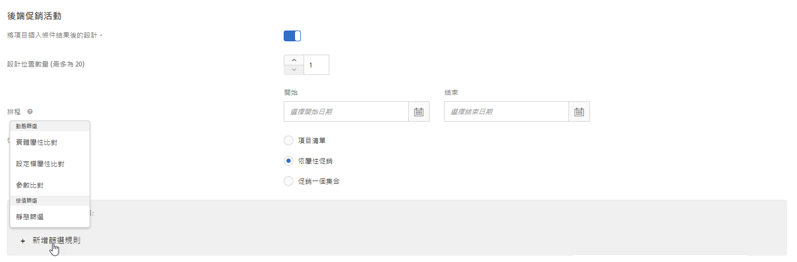
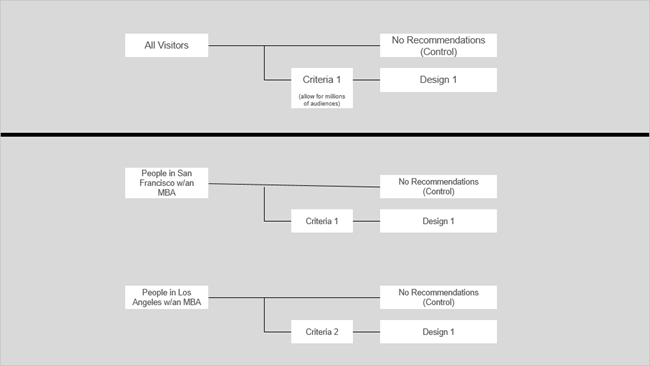
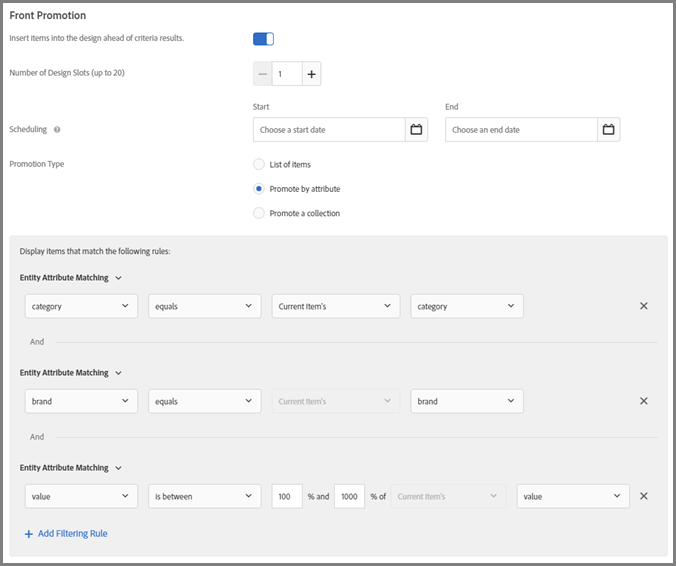
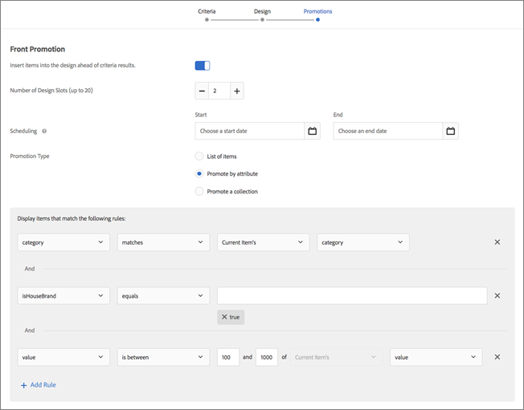
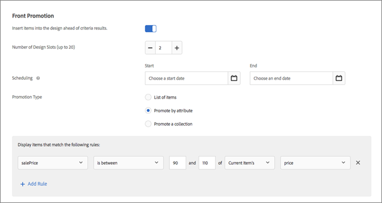

#  使用動態和靜態包含規則{#use-dynamic-and-static-inclusion-rules}

關於為條件和促銷活動建立包含規則，以及新增其他動態或靜態篩選規則以獲得較好結果的資訊。

對於條件和促銷活動，建立和使用包含規則的過程很相似，就如同使用案例和範例很相似一樣。本主題涵蓋條件和促銷活動及如何使用包含規則。

## 將篩選規則新增至條件 {#section_CD0D74B8D3BE4A75A78C36CF24A8C57F}

[建立條件時](../../c-recommendations/c-algorithms/create-new-algorithm.md#task_8A9CB465F28D44899F69F38AD27352FE)，請按一下**[!UICONTROL 「包含規則」]**下的**[!UICONTROL 「新增篩選規則」]**。


可用的選項依選取的行業別和建議金鑰而不同。

## 將篩選規則新增至促銷活動 {#section_D59AFB62E2EE423086281CF5D18B1076}

[建立促銷活動](../../c-recommendations/t-create-recs-activity/adding-promotions.md#task_CC5BD28C364742218C1ACAF0D45E0E14)時，請選取**[!UICONTROL 「依屬性促銷」]**，然後按一下**[!UICONTROL 「新增篩選規則」]**。



## 篩選類型 {#section_0125F1ED10A84C0EB45325122460EBCD}

下表列出條件和促銷活動的篩選選項類型:

| 類型 | 選項 | 可用的運算子 |
|--- |--- |--- |
| **動態篩選** | **實體屬性比對:**比較一批潛在的建議項目與使用者已有互動的特定項目，以動態篩選。<br>例如，僅建議符合目前項目品牌的項目。 | 等於<br>不等於<br>介於<br>包含<br>不包含<br>開頭為<br>結尾為<br>值存在<br>值不存在<br>大於或等於<br>小於或等於 |
|  | **設定檔屬性比對:**比較項目 (實體) 與使用者設定檔中的值，以動態篩選。<br>例如，僅建議符合訪客最喜愛品牌的項目。 | 等於<br>不等於<br>包含<br>不包含<br>開頭為<br>結尾為<br>大於或等於<br>小於或等於<br>介於 |
|  | **參數比對:**比較項目 (實體) 與請求 (API 或 mbox) 中的值，以動態篩選。<br>例如，僅建議符合「產業」頁面參數的內容。<br>**重要:** 如果活動是在 2016 年 10 月 31 日之前建立，假如使用「參數比對」篩選，則傳送會失敗。若想暫時解決此問題，請:<ul><li>建立新活動，並在其中新增條件。</li><li>使用不包含「參數比對」篩選的條件。</li><li>從條件中移除「參數比對」篩選。</li></ul> | 等於<br>不等於<br>包含<br>不包含<br>開頭為<br>結尾為<br>大於或等於<br>小於或等於<br>介於 |
| **按值篩選** | **靜態篩選:**手動輸入一或多個要篩選的靜態值。<br>例如，僅建議 MPAA 評等為 &quot;G&quot; 或 &quot;PG&quot; 的內容。 | 等於<br>不等於<br>包含<br>不包含<br>開頭為<br>結尾為<br>值存在<br>值不存在<br>大於或等於<br>小於或等於 |

>[!NOTE]
>
>如果您熟悉 Target 17.6.1 版 (2017 年 6 月) 之前包含規則的設定方式，您將注意到一些選項和運算子已變更。只會顯示適用於所選取選項的那些運算子，而一些運算子已重新命名 (「符合」現在是「等於」)，以便更為一致且直覺。在此版本之前建立的所有現有排除規則皆已自動移轉至新結構。您不需要重新處理結構。

您可以視需要建立許多包含規則。包含規則是以 AND 運算子來結合。必須符合所有規則，才能在建議中納入某個項目。

動態條件搭配促銷活動比靜態條件搭配促銷活動更強大，結果和參與度也更佳。下列範例可讓您構想如何在市場行銷工作中使用動態促銷活動:

**等於:**如果在動態促銷活動中使用「等於」運算子，當訪客檢視您網站上的項目時 (例如產品、文章或電影)，您可以促銷下列來源的其他項目:

* 相同品牌
* 相同種類
* 相同類別 AND 來自於自主品牌
* 相同商店

**不等於:**如果在動態促銷活動中使用「不等於」運算子，當訪客檢視您網站上的項目時 (例如產品、文章或電影)，您可以促銷下列來源的其他項目:

* 不同影集
* 不同內容類型
* 不同產品系列
* 不同樣式 ID

**介於:**如果在動態促銷活動中使用「介於」運算子，當訪客檢視您網站上的項目時 (例如產品、文章或電影)，您可以促銷如下的其他項目:

* 較貴
* 較便宜
* 成本加或減 30%
* 同一季的最後幾集
* 同一套書的前幾本

## 依實體屬性比對、設定檔屬性比對及參數比對來篩選時處理空白值 {#section_7D30E04116DB47BEA6FF840A3424A4C8}

針對結束條件和促銷活動，在依實體屬性比對、設定檔屬性比對及參數比對來篩選時，您可以選擇數個選項來處理空白值。

以前，如果值空白，則不會傳回結果。如果條件有空白值，則「如果 *x* 為空白」下拉式清單可讓您選擇適當的動作來執行，如下圖所示:


若要選取所需的動作，請將游標停留在齒輪圖示上 ()，然後選擇所需的動作:

| Action | 可用於 | 詳細資料 |
|--- |--- |--- |
| 忽略此篩選規則 | 設定檔屬性比對<br>參數比對 | 這是設定檔屬性比對和參數比對的預設動作。<br>此選項會指定忽略規則。例如，假設有三個篩選規則，而第三個規則未傳遞任何值，為了避免不傳回任何結果，您可以直接用空白值忽略第三個規則。 |
| 不顯示此條件的任何結果 | 實體屬性比對<br>設定檔屬性比對<br>參數比對 | 這是實體屬性比對的預設動作。<br>在新增此選項的值之前，此動作代表 Target 處理空白值的方式，也就是不顯示此條件的任何結果。 |
| 使用靜態值 | 實體屬性比對<br>設定檔屬性比對<br>參數比對 | 如果值為空白，您可以選擇使用靜態值。 |

以下的[情節 9](../../c-recommendations/c-algorithms/use-dynamic-and-static-inclusion-rules.md#section_9873E2F22E094E479569D05AD5BB1D40) 是處理空白值的範例:

## 動態篩選情節 {#section_9873E2F22E094E479569D05AD5BB1D40}

**情節 1:** 除了使用靜態篩選來比對目錄中的一個項目與另一個項目之外，您還可以使用動態篩選來比對目錄中的項目與訪客設定檔中的屬性。

例如，您可以使用[!UICONTROL 設定檔屬性比對]選項來建立規則，而只在品牌等於 `profile.favoritebrand` 中儲存的值或文字時才建議項目。透過此規則，如果訪客在查看特定品牌的慢跑短褲，則只有符合使用者最喜愛品牌 (訪客設定檔中 `profile.favoritebrand` 內儲存的值) 的建議才會出現。

**情節 2:**在 Target 可讓您使用訪客設定檔中的屬性資訊以前，如果您要設定職缺名單，但只顯示給來自特定區域和具有特定大專院校學位的求職者，則必須以不同對象來設定許多活動 (每個城市和學位各一個)。如果您在許多城市中都有職缺名單，這項任務會很繁重。

您可以現在使用包含規則，從求職者的訪客設定檔中取得地點和學位，再拿來比對職缺名單，如下列範例所示:


左邊的職缺名單要求訪客住在舊金山、紐約或洛杉磯 (`entity.jobCity`) 且擁有 BSCS 或 MBA 學位 (`entity.requiredDegree`)。

在右邊，此求職者住在洛杉磯 (`profile.usersCity`) 且擁有 MBA 學位 (`profile.degree`)。

使用動態篩選搭配設定檔屬性比對，您可以建立上圖的下半部所顯示的篩選器，根據地點和學位而只建議此訪客符合資格的職位清單。

這些篩選器的條件如下:

```
entity.jobCity - equals - the value/text stored in - profile.usersCity
```

和

```
entity.requiredDegree - equals - the value/text stored in - profile.degree
```

採用設定檔屬性比對的動態篩選，可讓您利用更少的活動來做更多事，如下所示：



上圖頂端的圖表描述採用設定檔屬性的動態篩選如何運作。您可以建立一個對象，利用條件 (上述情節中的城市和學位) 來顯示訪客符合資格的職位清單。在地點和學位方面，此篩選幾乎適用於無限多種可能性。

圖例底端的圖表只描述眾多對象中的兩個，如果您不是使用設定檔屬性搭配動態篩選來設定條件或促銷活動，則必須設定這些對象，您必須為每一個城市和每一個學位設定不同對象所需的對象數目很快會變得難以管理，尤其如果您有大量的缺職名單分屬於許多城市，更是如此。

如果不使用設定檔屬性，您的對象和體驗看起來就如同下圖的上半部，但每個可想到的情節都有額外的對象/體驗配對。


動態篩選採用設定檔屬性來比對實體屬性和使用者屬性，您可以設定一個對象來動態、即時地傳送所需的體驗，如上圖的下半部所示。

只要您將所需的資訊內嵌到每一個職缺名單，並且在使用者設定檔內擷取所需的資訊，則建立和管理對象及體驗就非常簡單。

**情節 3:**一家體育公司想要在網站上顯示某人所關心球隊的文章。每一篇文章都有一個使用 `entity.featuredTeams` 的欄位，其中包含文章中討論的所有球隊。每一個設定檔屬性都可以有使用者「訂閱」的最喜愛球隊名單。

包含規則範例如下所示:

只有當 `entity.featuredTeam` 有一或多個符合 `profile.favoriteTeams` 的值時才包含。

考量下列範例時，請記住，至少需要有一整個字串值 (完全) 符合。如果字串都不符，則不符合。請注意比對規則中的實體屬性已分離。這樣可以在不同中繼資料欄位之間比對。

範例/說明

`"entity.featuredTeam" - "Athletics,Red Sox" equals "profile.favoriteTeams" - "Athletics"`

視為相符，因為 &quot;Athletics&quot; 相等，即便 &quot;Red Sox&quot; 不相等。

`"entity.featuredTeam" - "Athletics,Red Sox" equals "profile.favoriteTeams" - "Athletics,Red Sox"`

視為符合，因為 &quot;Athletics&quot; 和 &quot;Red Sox&quot; 相等，但不一定兩隊都符合。

`"entity.featuredTeam" - "Athletics" equals "profile.favoriteTeams" - "Athletics,Red Sox"`

視為相符，因為 &quot;Athletics&quot; 相等，即便 &quot;Red Sox&quot; 不相等。

`"entity.featuredTeam" - "Athletics" equals "profile.favoriteTeams" - "Athletic"`

不符合，因為 &quot;Athletics&quot; (複數) 不等於 &quot;Athletic&quot; (單數)。

或者，您也可以使用「包含」而非「等於」，以促成符合。

`"entity.featuredTeam" - "Athletic" equals "profile.favoriteTeams" - "Athletics"`

不符合，因為 &quot;Athletic&quot; (單數) 不等於 &quot;Athletics&quot; (複數)。

或者，您也可以使用「開頭為」而非「等於」，以促成符合。

**情節 4:**下圖示範如何使用「等於」和「介於」運算子，以促銷相同類別和相同品牌中較貴的項目。例如，運動服公司可能促銷較貴的跑鞋，以努力向查看跑鞋的訪客追加銷售。



此範例中使用下列規則:

```
category - equals - current item's - category 
And 
brand - equals - current item's - brand 
And 
value - is between - 100% and 1000% of - current item's - value
```

>[!NOTE]
>
>在含有多個規則的動態促銷活動中，您無法變更索引鍵 (前兩個規則中的第三個下拉式清單，圖中標示為「目前項目的」)。

**情節 5:**第二個圖示範如何使用「等於」和「介於」運算子，以促銷相同類別、相同品牌和自有品牌中較貴的項目。例如，辦公用品公司可能促銷相同品牌和公司自有品牌中較貴的碳粉匣，以努力對查看印表機的訪客追加銷售。



此範例中使用下列規則:

```
category - equals - current item's - category 
And 
IsHouseBrand - equals - true 
And 
value - is between - 100% and 1000% of - current item's - value
```

請注意，此範例使用兩個動態規則和一個靜態規則。

**情節 6:**第三個圖示範如何使用「不等於」運算子，以促銷與訪客目前正在檢視的系列不相等的另一個系列。例如，媒體網站可以促銷與訪客目前正在檢視的影集不同的影集。


此範例中使用下列規則:

```
series - does not equal - current item's - series
```

**情節 7:**第四個圖示範如何根據訪客上次購買的項目，以促銷相容的周邊項目。例如，假設某人購買新的 TV，則您可以動態促銷 HDMI 纜線。


此範例中使用下列規則:

```
id - equals - last purchased item's - compatibleAccessoryids
```

**情節 8:**下一個圖示範如何根據訪客目前正在檢視的項目，以促銷價格介於 90% 和 110% 之間出售的項目。例如，假設某人正在查看 TV，您可以動態促銷以大約相同的價格範圍出售的相似 TV。



此範例中使用下列規則:

```
salesPrice - is between - 90% and 110% of - current item's - price
```

**情節 9:**考量下列運動媒體網站如何處理空白值的情節，如上方的[依實體屬性比對、設定檔屬性比對及參數比對來篩選時處理空白值](../../c-recommendations/c-algorithms/use-dynamic-and-static-inclusion-rules.md#section_7D30E04116DB47BEA6FF840A3424A4C8)所述:

運動媒體網站的內容團隊想要向使用者顯示其最喜愛球隊的內容。如果使用者已指定最喜愛的球隊，則團隊希望顯示這個球隊的媒體。如果使用者未指定最喜愛的球隊，則團隊可以使用「如果 *x* 為空白」下拉式清單來執行下列其中一個動作:

* 使用[!UICONTROL 「忽略此篩選規則」]選項，以完全忽略球隊篩選器，如下圖所示:

   

* 使用[!UICONTROL 「不顯示此條件的任何結果」]選項，不在此條件中顯示任何媒體，如下圖所示:

   

* 使用[!UICONTROL 「使用靜態值」]選項，以顯示特定球隊的媒體 (例如 49ers)，如下圖所示:

   

## 注意事項 {#section_A889FAF794B7458CA074DEE06DD0E345}

>[!IMPORTANT]
>
>使用「等於」和「不等於」運算子時，在執行階段，動態條件或促銷活動中的不同資料類型可能不相容。如果左手邊有預先定義的屬性或自訂屬性，您應該在右手邊聰明地使用「價格」、「利潤」、「存貨」和「環境」值。


下表顯示有效規則，以及在執行階段可能不相容的規則:

| 相容規則 | 潛在不相容規則 |
|--- |--- |
| value - 介於 - 目前項目的 90% 和 110% - salesValue | salesValue - 介於 - 目前項目的 90% 和 110% - value |
| value - 介於 - 目前項目的 90% 和 110% - value | clearancePrice - 介於 - 目前項目的 90% 和 110% - margin |
| margin - 介於 - 目前項目的 90% 和 110% - margin | storeInventory - 等於 - 目前項目的 - inventory |
| inventory - 等於 - 目前項目的 - inventory |