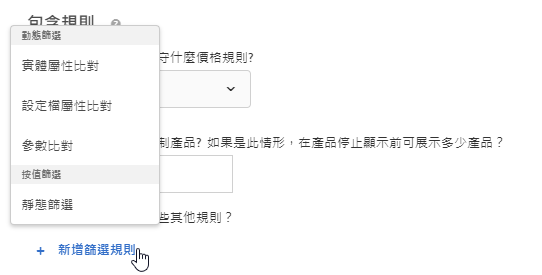
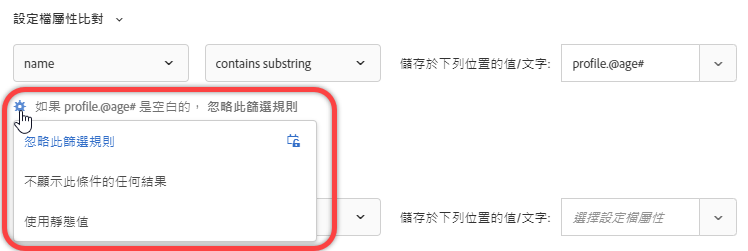

#  使用動態和靜態包含規則{#use-dynamic-and-static-inclusion-rules}

Information about creating inclusion rules for criteria and promotions in [!DNL Adobe Target] and adding additional dynamic or static filtering rules to achieve better results for your recommendations.

對於條件和促銷活動，建立和使用包含規則的過程很相似，就如同使用案例和範例很相似一樣。本節將涵蓋標準和促銷活動以及包含規則的使用。

## 將篩選規則新增至條件 {#section_CD0D74B8D3BE4A75A78C36CF24A8C57F}

[建立條件時](../../c-recommendations/c-algorithms/create-new-algorithm.md#task_8A9CB465F28D44899F69F38AD27352FE)，請按一下&#x200B;**[!UICONTROL 「包含規則」]**&#x200B;下的&#x200B;**[!UICONTROL 「新增篩選規則」]**。

可用的選項依選取的行業別和建議金鑰而不同。

## 將篩選規則新增至促銷活動 {#section_D59AFB62E2EE423086281CF5D18B1076}

[建立促銷活動](../../c-recommendations/t-create-recs-activity/adding-promotions.md#task_CC5BD28C364742218C1ACAF0D45E0E14)時，請選取&#x200B;**[!UICONTROL 「依屬性促銷」]**，然後按一下&#x200B;**[!UICONTROL 「新增篩選規則」]**。

## 篩選類型 {#section_0125F1ED10A84C0EB45325122460EBCD}

以下章節列出標準和促銷、動態篩選和依值篩選的篩選選項類型：

### 動態篩選

動態包含規則比靜態包含規則更強大，而且可產生更佳的結果和參與度。 考慮以下事項:

* 動態包含規則會比對使用者描述檔參數或mbox呼叫中的屬性，以提供建議。

   例如，您可以建立「最受歡迎的准則」建議，然後針對傳回的建議集，針對使用者存取顯示建議之頁面時所傳遞的屬性即時篩選任何建議。

* 使用靜態規則來限制建議中包含的項目（而非系列）。

* 您可以視需要建立任意數量的動態包含規則。 包含規則是以 AND 運算子來結合。必須符合所有規則，才能在建議中納入某個項目。

動態篩選可使用下列選項：

| 動態篩選選項 | 詳細資料 |
| --- | --- |
| [實體屬性比對](/help/c-recommendations/c-algorithms/entity-attribute-matching.md) | 透過比較潛在建議項目群組與使用者已互動的特定項目，動態篩選。 當您想要顯示最有可能吸引訪客的建議（例如訪客的最愛品牌）時，請使用「實體屬性符合」。 |
| [設定檔屬性比對](/help/c-recommendations/c-algorithms/profile-attribute-matching.md) | 透過比較項目（實體）與使用者描述檔中的值，動態篩選。 當您  想要顯示符合訪客描述檔中儲存之值（例如大小或我的最愛品牌）的建議時，請使用描述檔屬性符合。 |
| [參數比對](/help/c-recommendations/c-algorithms/parameter-matching.md) | 透過比較項目（實體）與請求中的值（API或mbox），動態篩選。 使用參數符合可建議符合頁面參數或訪客參數的內容，例如裝置尺寸或地理位置。 |

### 按值篩選

以下選項可用於按值篩選：

| 依值篩選選項 | 詳細資料 |
| --- | --- |
| [靜態濾鏡](/help/c-recommendations/c-algorithms/static-value.md) | 手動輸入一或多個靜態值以進行篩選。 |

## 動態准則和促銷範例

動態條件搭配促銷活動比靜態條件搭配促銷活動更強大，結果和參與度也更佳。

下列範例將提供您關於如何在行銷活動中使用動態促銷的一般概念：

### 等於

在動態促銷中使用「等於」運算子，當訪客在您的網站上檢視項目（例如產品、文章或影片）時，您可從以下網站促銷其他項目：

* 相同品牌
* 相同種類
* 相同類別 AND 來自於自主品牌
* 相同商店

### 不等於

在動態促銷中使用「不等於」運算子，當訪客在您的網站上檢視項目（例如產品、文章或影片）時，您可以從以下位置促銷其他項目：

* 不同影集
* 不同內容類型
* 不同產品系列
* 不同樣式 ID

### 介於

在動態促銷中使用「介於」運算子，當訪客在您的網站上檢視項目（例如產品、文章或影片）時，您可以促銷其他項目：

* 較貴
* 較便宜
* 成本加或減 30%
* 同一季的最後幾集
* 同一套書的前幾本

## Handling empty values when filtering by Entity Attribute Matching, Profile Attribute Matching, and Parameter Matching {#section_7D30E04116DB47BEA6FF840A3424A4C8}

You can choose several options to handle empty values when filtering by [!UICONTROL Entity Attribute Matching], [!UICONTROL Profile Attribute Matching], and [!UICONTROL Parameter Matching] for exit criteria and promotions.

以前，如果值空白，則不會傳回結果。如果條件有空白值，則「如果 *x* 為空白」下拉式清單可讓您選擇適當的動作來執行，如下圖所示:

若要選取所需的動作，請將游標停留在齒輪圖示上 ()，然後選擇所需的動作:

| Action | 可用於 | 詳細資料 |
|--- |--- |--- |
| 忽略此篩選規則 | 設定檔屬性比對 參數比對 | 這是設定檔屬性比對和參數比對的預設動作。 此選項會指定忽略規則。例如，假設有三個篩選規則，而第三個規則未傳遞任何值，為了避免不傳回任何結果，您可以直接用空白值忽略第三個規則。 |
| 不促銷任何項目 | 實體屬性匹 配配置檔案屬 性匹配參數匹配 | 這是實體屬性比對的預設動作。 [!DNL Target]在新增此選項的值之前，此動作代表 處理空白值的方式，也就是不顯示此條件的任何結果。 |
| 使用靜態值 | 實體屬性比對 設定檔屬性比對 參數比對 | 如果值為空白，您可以選擇使用靜態值。 |

## 注意事項 {#section_A889FAF794B7458CA074DEE06DD0E345}

>[!IMPORTANT]
>
>使用「等於」和「不等於」運算子時，在執行階段，動態條件或促銷活動中的不同資料類型可能不相容。You should use [!UICONTROL Value], [!UICONTROL Margin], [!UICONTROL Inventory], and [!UICONTROL Environment] values wisely on the right hand side if the left hand side has predefined attributes or custom attributes.

下表顯示有效規則，以及在執行階段可能不相容的規則:

| 相容規則 | 可能不相容的規則 |
|--- |--- |
| value - 介於 - 目前項目的 90% 和 110% - salesValue | salesValue - 介於 - 目前項目的 90% 和 110% - value |
| value - 介於 - 目前項目的 90% 和 110% - value | clearancePrice - 介於 - 目前項目的 90% 和 110% - margin |
| margin - 介於 - 目前項目的 90% 和 110% - margin | storeInventory - 等於 - 目前項目的 - inventory |
| inventory - 等於 - 目前項目的 - inventory |  |
