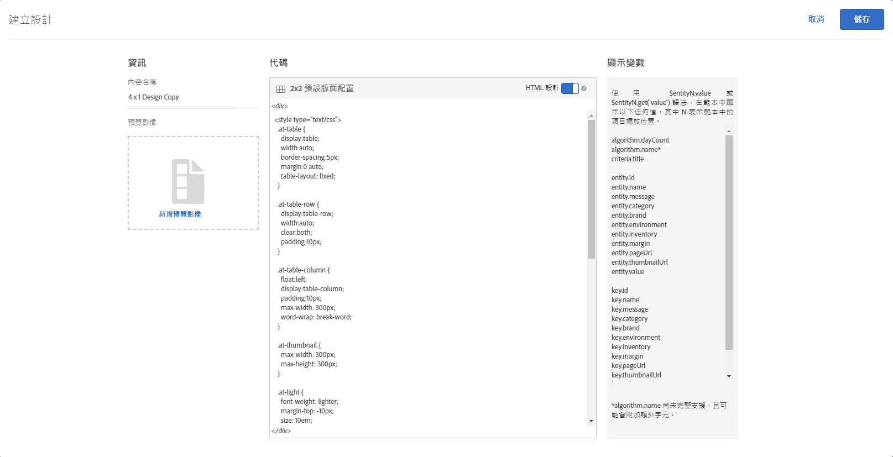
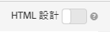

#  建立設計{#create-a-design}

設計可定義建議出現在頁面上的方式。

您可以使用預設的設計來建立 [!UICONTROL Recommendations] 設計，或建立自訂的設計。**[!UICONTROL Recommendations > Designs]**&#x200B;螢幕會顯示預設設計卡片和您帳戶中建立的任何設計。

當您處理設計時，請記住下列資訊：

* 您可以使用預設設計來建立建議設計，或建立自訂設計。
* 不能編輯或刪除預設設計。
* 您可以編輯、複製或刪除自訂設計。
* 要根據預設設計建立設計，必須先複製設計，然後編輯該副本。

此圖顯示預設的1 x 4設計：


下圖顯示自訂設計：


您可以在活動建立程式期間，從Visual Experience Composer(VEC)或設計程式庫建立活動建立以外的設計。 以下章節假設您是從程式庫建立設計，但步驟類似。

## 建立設計

您可以根據預設設計建立設計，或建立自訂設計。

### 根據預設設計建立設計

1. 按一下「**[!UICONTROL Recommendations]** > **[!UICONTROL Designs]**」以顯示「[!UICONTROL Designs]」程式庫。

   

1. 將滑鼠指標暫留在卡片上，以便建立設計，然後按一下&#x200B;**[!UICONTROL Copy]**&#x200B;圖示。

   

   將顯示[!UICONTROL 建立設計]對話框。

   

1. 在&#x200B;**[!UICONTROL 資訊]**&#x200B;面板中，新增&#x200B;**[!UICONTROL 內容名稱]**&#x200B;和可選的預覽影像，以顯示在設計卡片上。

   當您使用預設設計時，設計名稱和「複製」會顯示在&#x200B;**[!UICONTROL 內容名稱]**&#x200B;欄位中。 您可以編輯名稱。您也可以選取要在設計卡上顯示的影像。

1. （條件性）視需要編輯設計&#x200B;**[!UICONTROL 程式碼]**。

   Recommendation 設計使用開放式原始碼 Velocity 設計語言。有關Velocity的資訊，請參閱[https://velocity.apache.org](https://velocity.apache.org)和[使用Velocity](/help/c-recommendations/c-design-overview/customizing-a-template.md)自訂設計。

   設計可以是 HTML 或非 HTML。根據預設，HTML 設計會以`<div>`標籤包住，以允許在 Web 環境中進行點擊追蹤。非 HTML 設計用於非 Web 環境，在其中無法進行點擊追蹤。投影[!UICONTROL HTML Design]切換至「關閉」位置，以使用非HTML程式碼。

   >[!NOTE]
   >
   >在設計中可參考的實體（硬式編碼或透過循環）數目上限為99。

1. 按一下&#x200B;**[!UICONTROL 「儲存」]**。

### 建立自訂設計

1. 按一下「**[!UICONTROL Recommendations]** > **[!UICONTROL Designs]**」以顯示「[!UICONTROL Designs]」程式庫。

1. 按一下「建立設計」。****

   如果您想要在現有設計的基礎上建立新的自訂設計，請將滑鼠移至所要的設計上，然後按一下[!UICONTROL Copy]圖示。 然後，您可以編輯復本以建立新的自訂設計。

1. 新增&#x200B;**[!UICONTROL 內容名稱]**&#x200B;和選用的預覽影像。

1. （條件性）視需要編輯設計&#x200B;**[!UICONTROL 程式碼]**。

   如需詳細資訊，請參閱上述步驟4中的資訊。

1. 按一下&#x200B;**[!UICONTROL 「儲存」]**。

## 編輯、複製或刪除設計

請記住，您無法編輯或複製預設設計；您只能複製預設設計。

將滑鼠指標暫留在[!UICONTROL Design]程式庫中所要的設計上，然後按一下適當的圖示：編輯、複製或刪除。


您可以複製現有設計以建立複製設計，然後再加以修改。 這可讓您輕鬆建立類似的設計。

請注意，整個帳戶都提供設計。 在刪除設計之前，請務必考慮這一點。 無法刪除的設計。

## JSON 範例 {#section_75BFB2537CFF4FBD9B560F59EB32C8DD}

下列範例說明如何在透過表單編輯器設定活動時傳回JSON回應。

1. 從設計程式庫或表單工作流程中建立設計。 如果您嘗試在Visual Experience Composer(VEC)工作流程中進行此動作，則無法建立HTML設計以外的其他項目，而HTML設計會包裝在`<div>`中，以用於點按追蹤。

1. 確定「HTML 設計」選項已關閉:

   

1. 以下程式碼是您可貼入設計的範例：

   ```javascript
       #* 
       * "Return a simple list of recommended entity ids"   
       *#
   
       {   
         "notes":{   
         "purpose": "Return a simple list of recommended entity ids",   
         "use-case": "Use this approach if you prefer to do a real-time lookup of entity attribute details (such as inventory, price, rating) from another system (such as a CMS, PIM or ecommerce platform)",   
         "version": "01"   
         },   
         "recommendedItems": {   
           "key": "$key.id",   
           "slot-01": "$entity1.id",   
           "slot-02": "$entity2.id",   
           "slot-03": "$entity3.id",   
           "slot-04": "$entity4.id",   
           "slot-05": "$entity5.id",   
           "slot-06": "$entity6.id",   
           "slot-07": "$entity7.id",   
           "slot-08": "$entity8.id",   
           "slot-09": "$entity9.id",   
           "slot-10": "$entity10.id"   
         }   
       }  
   ```

1. 設定使用此設計的表單型[!DNL Recommendations]活動。

   1. 導覽至&#x200B;**[!UICONTROL 活動]**&#x200B;頁面。
   1. 按一下&#x200B;**[!UICONTROL 「建立活動」]**>**[!UICONTROL 「Recommendations」]**。
   1. 在&#x200B;**[!UICONTROL 選擇「Experience Composer」]**&#x200B;下，選擇「**[!UICONTROL Form]**」，然後按一下「**[!UICONTROL Next」（下一步）。]**
   1. 在位置下，輸入文字: &quot;Sample_Recs_Response&quot;
   1. 在&#x200B;**[!UICONTROL 「預設內容」]**&#x200B;下，按向下箭頭，然後按一下&#x200B;**[!UICONTROL 「新增建議」]**。
   1. 選擇頁面類型。這會決定下一個畫面的起始篩選。
   1. 選取條件卡，然後按&#x200B;**[!UICONTROL 「下一步」]**。
   1. 選擇您在上一步中建立的設計，然後按一下&#x200B;**[!UICONTROL Next]**。
   1. 完成設定程序。
   1. 按一下&#x200B;**[!UICONTROL 「非使用中」]**&#x200B;旁的向右箭頭，然後選取&#x200B;**[!UICONTROL 「啟動」]**。

1. 在設定並啟動活動之後，您可以設定請求範例來取回全新的 JSON 回應。

   從您儲存活動時起，[!DNL Target]將需要建立模型以支援選取的准則設定。 根據許多因素而定，這需要一些時間。模型建立後就會顯示結果。

   例如:

   ```
   https://[YOUR_CLIENT_CODE].tt.omtrdc.net/m2/YOUR_CLIENT_CODE/ubox/raw?mbox=[YOUR_MBOX_NAME]&mboxContentType=text/html&mboxXDomain=disabled&entity.id=[ENTITY_ID]&mboxHost=rawbox_sample&at_property=[AT_PROPERTY_TOKEN]&mboxNoRedirect=true&mboxPC=1234-4321&mboxSession=9876-7000
   ```

   where

   | 參數 | 值 |
   |--- |--- |
   | `[YOUR_CLIENT_CODE]` | 目標用戶端代碼(可從「/help/target/products.html#recsSettings > Recommendations API Token >用戶端代碼」取得)。 |
   | `[YOUR_MBOX_NAME]` | 您在表單型Recommendations的「位置」區段中選取的名稱，在此例中為Sample_Recs_Response。 |
   | `[ENTITY_ID` | 目錄中之項目的 `entity.id`。 |
   | `[AT_PROPERTY_TOKEN]` | (可選) 如果您已在活動設定期間選取「屬性」(「企業權限」的部分)，則新增。 |

當演算法執行之後，而且也有結果，則回應會如下所示:

{width=&quot;575px&quot;}

## 其他JSON物件提示與秘訣{#section_C305673C68944749969DB239E3221DC2}

您也可以使用下列語法來設定設計，只傳回一份簡單的以逗號分隔的項目清單:

```
entity1.id, $entity2.id, $entity3.id, $entity4.id, $entity5.id, 
```

或者，您可以在回應中傳送其他資訊。下列程式碼檔案是較複雜的範例，不只傳回實體 ID，還有其相關聯的位置 (訂單)。此設計範例也會傳回活動詳細資料、Target Profile詳細資料（如適用），以及與傳回項目相關的其他`entity.attributes`。

```javascript
    {   
     "adobeRecommendations": {   
      "notes": {   
       "purpose": "Return a list of entity ids with their associated entity.attributes",   
       "use-case": "Use this approach to avoid looking up attribute details after receiving a response from Target",   
       "version": "01"   
      },   
      "recommendedItems": {   
       "slot-01": "$entity1.id",   
       "slot-02": "$entity2.id",   
       "slot-03": "$entity3.id",   
       "slot-04": "$entity4.id",   
       "slot-05": "$entity5.id",   
       "slot-06": "$entity6.id",   
       "slot-07": "$entity7.id",   
       "slot-08": "$entity8.id",   
       "slot-09": "$entity9.id",   
       "slot-10": "$entity10.id"   
      },   
      "activityDetails": {   
       "mbox.name": "email-mbox",   
       "campaign.name": "\${campaign.name}",   
       "campaign.id": "\${campaign.id}",   
       "campaign.recipe.name": "\${campaign.recipe.name}",   
       "campaign.recipe.id": "\${campaign.recipe.id}",   
       "offer.name": "\${offer.name}",   
       "offer.id": "\${offer.id}",   
       "criteria.title": "$criteria.title",   
       "algorithm.name": "$algorithm.name",   
       "algorithm.dayCount": "$algorithm.dayCount"   
      },   
      "visitorProfile": {   
       "profile.favorite-category": "\${profile.favorite-category}",   
       "profile.test": "\${profile.test}",   
       "user.endpoint.lastPurchasedEntity": "\${user.endpoint.lastPurchasedEntity}",   
       "user.endpoint.lastViewedEntity": "\${user.endpoint.lastViewedEntity}",   
       "user.endpoint.mostViewedEntity": "\${user.endpoint.mostViewedEntity}",   
       "user.endpoint.categoryAffinity": "\${user.endpoint.categoryAffinity}",   
       "profile.geolocation.city": "\${profile.geolocation.city}",   
       "profile.geolocation.dma": "\${profile.geolocation.dma}",   
       "profile.geolocation.state": "\${profile.geolocation.state}",   
       "profile.geolocation.country": "\${profile.geolocation.country}",   
       "profile.sessionCount": "\${profile.sessionCount}",   
       "profile.averageDaysBetweenVisits": "\${profile.averageDaysBetweenVisits}",   
       "profile.browserTime": "\${profile.browserTime}",   
       "user.activeActivities": "\${user.activeActivities}",   
       "user.pcId": "\${user.pcId}",   
       "user.isFirstSession": "\${user.isFirstSession}",   
       "user.isNewSession": "\${user.isNewSession}",   
       "user.header": "\${user.header}",   
       "user.parameter": "\${user.parameter}"   
      },   
      "recKey": {   
       "recKeyDetails": {   
        "id": "$key.id",   
        "name": "$key.name",   
        "category": "$key.category",   
        "pageUrl": "$key.pageUrl",   
        "thumbnailUrl": "$key.thumbnailUrl"   
       }   
      },   
      "recDetailedResults": {   
       "recEntity1Details": {   
        "id": "$entity1.id",   
        "name": "$entity1.name",   
        "category": "$entity1.category",   
        "pageUrl": "$entity1.pageUrl",   
        "thumbnailUrl": "$entity1.thumbnailUrl"   
       },   
       "recEntity2Details": {   
        "id": "$entity2.id",   
        "name": "$entity2.name",   
        "category": "$entity2.category",   
        "pageUrl": "$entity2.pageUrl",   
        "thumbnailUrl": "$entity2.thumbnailUrl"   
       },   
       "recEntity3Details": {   
        "id": "$entity3.id",   
        "name": "$entity3.name",   
        "category": "$entity3.category",   
        "pageUrl": "$entity3.pageUrl",   
        "thumbnailUrl": "$entity3.thumbnailUrl"   
       },   
       "recEntity4Details": {   
        "id": "$entity4.id",   
        "name": "$entity4.name",   
        "category": "$entity4.category",   
        "pageUrl": "$entity4.pageUrl",   
        "thumbnailUrl": "$entity4.thumbnailUrl"   
       },   
       "recEntity5Details": {   
        "id": "$entity5.id",   
        "name": "$entity5.name",   
        "category": "$entity5.category",   
        "pageUrl": "$entity5.pageUrl",   
        "thumbnailUrl": "$entity5.thumbnailUrl"   
       },   
       "recEntity6Details": {   
        "id": "$entity6.id",   
        "name": "$entity6.name",   
        "category": "$entity6.category",   
        "pageUrl": "$entity6.pageUrl",   
        "thumbnailUrl": "$entity6.thumbnailUrl"   
       },   
       "recEntity7Details": {   
        "id": "$entity7.id",   
        "name": "$entity7.name",   
        "category": "$entity7.category",   
        "pageUrl": "$entity7.pageUrl",   
        "thumbnailUrl": "$entity7.thumbnailUrl"   
       },   
       "recEntity8Details": {   
        "id": "$entity8.id",   
        "name": "$entity8.name",   
        "category": "$entity8.category",   
        "pageUrl": "$entity8.pageUrl",   
        "thumbnailUrl": "$entity8.thumbnailUrl"   
       },   
       "recEntity9Details": {   
        "id": "$entity9.id",   
        "name": "$entity9.name",   
        "category": "$entity9.category",   
        "pageUrl": "$entity9.pageUrl",   
        "thumbnailUrl": "$entity9.thumbnailUrl"   
       },   
       "recEntity10Details": {   
        "id": "$entity10.id",   
        "name": "$entity10.name",   
        "category": "$entity10.category",   
        "pageUrl": "$entity10.pageUrl",   
        "thumbnailUrl": "$entity10.thumbnailUrl"   
       }   
      }   
     }   
    }  
```

## 訓練影片：在Recommendations中建立自訂設計(3:20)

此影片包含下列資訊:

* 建立自訂設計
* 瞭解如何參考設計中的顯示變數

>[!VIDEO](https://video.tv.adobe.com/v/27687)
