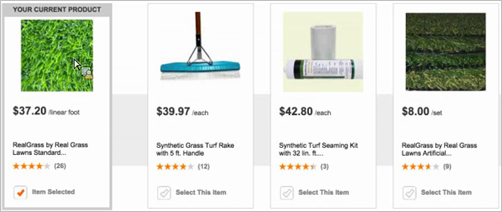

#  使用 Velocity 自訂設計{#customize-a-design-using-velocity}

使用開放原始碼 Velocity 設計語言來自訂建議設計。

## Velocity概觀 {#section_C431ACA940BC4210954C7AEFF6D03EA5}

有關 Velocity 的資訊，請參閱 [](https://velocity.apache.org)https://velocity.apache.org。

所有 Velocity 邏輯、語法等，均可用於建議設計。即是說，您可使用 Velocity 取代 JavaScript 來建立 *for* 迴圈、*if* 陳述式及其他程式碼。

[!DNL Recommendations] mbox 或 CSV 上傳項目中任何傳送至 `productPage` 的變數均可在設計中顯示。這些值以下列語法加以參考:

```
$entityN.variable
```

變數名稱必須遵循 Velocity 縮寫標記法，亦即包含前置 *$* 字元，後接 Velocity 範本語言 (VTL) 識別碼。VTL 識別碼的開頭必須為字母字元 (a-z 或 A-Z)。

Velocity 變數名稱僅限於下列字元類型:

* 字母 (a-z、A-Z)
* 數字 (0-9)
* 連字號 ( - )
* 底線 ( _ )

下列變數可當成 Velocity 陣列使用。因此，可透過索引逐一查看或參照。

* `entities`
* `entityN.categoriesList`

例如:

```
#foreach ($category in $entity1.categoriesList) 
<br/>$category 
#end
```

或

```
#if ($entities[0].categoriesList.size() >= 3 ) 
$entities[0].categoriesList[2] 
#end
```

如需 Velocity 變數的詳細資訊，請參閱 [https://velocity.apache.org/engine/releases/velocity-1.7/user-guide.html#variables](https://velocity.apache.org/engine/releases/velocity-1.7/user-guide.html#variables)。

如果您在設計中使用設定檔指令碼，指令碼名稱前面的 $ 必須以 \ 來轉譯。例如, `\${user.script_name}`。

>[!NOTE]
>
>可在設計中參照 (明確寫在程式碼中或透過迴圈) 的實體數上限是 99。範本指令碼長度最多可以包含 65,000 個字元。

例如，如果想要讓範本顯示類似下方的內容︰


您可使用下列代碼:

```
<table style="border:1px solid #CCCCCC;"> 
 
<tr> 
 
<td colspan="3" style="font-size: 130%; border-bottom:1px solid  
#CCCCCC;"> You May Also Like... </td> 
 
</tr> 
 
<tr> 
 
<td style="border-right:1px solid #CCCCCC;"> 
 
<div class="search_content_inner" style="border-bottom:0px;"> 
 
<div class="search_title"><a href="$entity1.pageUrl"  
style="color: rgb(112, 161, 0); font-weight: bold;"> 
$entity1.id</a></div> 
 
By $entity1.message <a href="?x14=brand;q14=$entity1.message"> 
(More)</a><br/> 
 
sku: $entity1.prodId<br/> Price: $$entity1.value 
 
<br/><br/> 
 
</div> 
 
</td> 
 
<td style="border-right:1px solid #CCCCCC; padding-left:10px;"> 
 
<div class="search_content_inner" style="border-bottom:0px;"> 
 
<div class="search_title"><a href="$entity2.pageUrl"  
style="color: rgb(112, 161, 0); font-weight: bold;"> 
$entity2.id</a></div> 
 
By $entity2.message <a href="?x14=brand;q14=$entity2.message"> 
(More)</a><br/> 
 
sku: $entity2.prodId<br/> 
 
Price: $$entity2.value 
 
<br/><br/> 
 
</div> 
 
</td> 
 
<td style="padding-left:10px;"> 
 
<div class="search_content_inner" style="border-bottom:0px;"> 
 
<div class="search_title"><a href="$entity3.pageUrl"  
style="color: rgb(112, 161, 0); font-weight: bold;"> 
$entity3.id</a></div> 
 
By $entity3.message <a href="?x14=brand;q14=$entity3.message"> 
(More)</a><br/> 
 
sku: $entity3.prodId<br/> Price: $$entity3.value 
 
<br/><br/> 
 
</div> 
 
</td> 
 
</tr> 
 
</table>
```

>[!NOTE] {class=&quot;- topic/note &quot;}
>
>如果想在變數值後新增資訊，您可使用正規註釋來完成此項作業。例如: `${entity1.thumbnailUrl}.gif`。

您亦可在範本中使用 `algorithm.name` 和 `algorithm.dayCount` 當作變數，因此，一個設計便可用於測試多個條件，而條件名稱可動態地在設計中顯示。藉此，訪客即知道自己正在看「最暢銷商品」或「看過這件的人也買那件」。甚至，您可以使用這些變數來顯示 `dayCount` (條件中使用的資料天數，例如「過去 2 天最暢銷的商品」等)。

## 藍本：使用建議的產品顯示關鍵項目 {#section_7F8D8C0CCCB0403FB9904B32D9E5EDDE}

您可以修改設計來連同其他建議的產品一起顯示主要項目。例如，您可以在建議旁邊顯示目前項目當作參考。

方法是在設計中建立一欄，此欄使用您的建議所依據的 `$key` 屬性，而不是 `$entity` 屬性。例如，主要欄的程式碼可能如下所示:

```
<div class="at-table-column"> 
   <a href="$key.pageURL"> 
       
      <br/><h3>$key.name</h3> 
      <br/><p class="at-light">$key.message</p> 
      <br/><p class="at-light">$key.value</p> 
   </a> 
</div>
```

結果會產生如下的設計，其中有一欄顯示主要項目。



當您建立 [!DNL Recommendations] 活動時，如果主要項目取自於訪客的設定檔，例如「上次購買的項目」，則 [!DNL Target] 會在[!UICONTROL 可視化體驗撰寫器] (VEC) 中顯示隨機產品。這是因為當您設計活動時，沒有設定檔可用。訪客檢視頁面時就會看到預期的主要項目。

## 藍本：以銷售價格以逗號取代小數點 {#section_01F8C993C79F42978ED00E39956FA8CA}

您可以修改設計，以歐洲和其他國家/地區採用的逗號分隔符號，取代美國採用的小數點分隔符號。

下面顯示一條件式售價範例的其中一行程式碼:

```
<span class="price">$entity1.value.replace(".", ",") €</span><br>
```

以下程式碼為完整的條件式售價範例:

```
<div class="price"> 
    #if($entity1.hasSalesprice==true) 
    <span class="old">Statt <s>$entity1.salesprice.replace(".", ",") €</s></span><br> 
    <span style="font-size: 10px; float: left;">jetzt nur</span> $entity1.value.replace(".", ",") €<br> #else 
    <span class="price">$entity1.value.replace(".", ",") €</span><br> #end 
    <span style="font-weight:normal; font-size:10px;"> 
                                        $entity1.vatclassDisplay 
                                        <br/> 
                                        $entity1.delivery 
                                        <br> 
                                    </span>
```

## 藍本：使用null檢查邏輯建立4x預設建議設計 {#default}

使用Velocity指令碼來控制實體顯示的動態大小，下列範本可容納一對多結果，以避免在沒有足夠的相符實體時建立空白HTML元素 [!DNL Recommendations]。當備份建議不合理且 [!UICONTROL 部分範本轉譯] 啓用時，此指令碼最適合藍本。

下列HTML程式碼片段取代了4x預設設計中現有的HTML部分(為了簡短而不包含CSS)：

* 如果有第五個實體存在，則指令碼會插入關閉div並開啓新的列 `<div class="at-table-row">`。
* 在4x中，顯示的最大結果為8，但可透過修改 `$count <=8`來自訂較小或較大的清單。
* 請注意，邏輯不會在多列上平衡實體。例如，如果要顯示五或六個實體，它不會動態變成頂端，而在底部則不會動態變成兩個實體(頂端或底部三個)。第一列開始前，頂端列會顯示四個項目。

```
<div class="at-table">
  <div class="at-table-row">
    #set($count=1) 
    #foreach($e in $entities)  
        #if($e.id != "" && $count < $entities.size() && $count <=8) 
            #if($count==5) 
                </div>
                <div class="at-table-row">
            #end
            <div class="at-table-column">
                <a href="$e.pageUrl">
                    <br/>
                    <h3>$e.name</h3>
                    <br/>
                    <p class="at-light">$e.message</p>
                    <br/>
                    <p class="at-light">$$e.value</p>
                </a>
            </div>
            #set($count = $count + 1) 
        #end 
    #end
    </div>
  </div>
```
