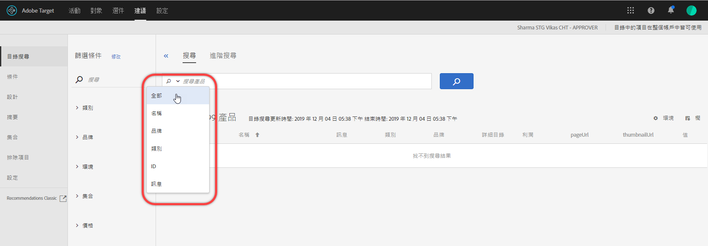

#  PREMIUMCatalog搜尋

[!DNL Adobe Recommendations]中的[!UICONTROL 目錄搜尋]頁面可協助您找出目錄中的產品或內容。 您在此頁面上可執行的最基本工作是搜尋項目。 此外，您還可以變更環境、將搜尋結果儲存至系列或排除、新增篩選Facet，以及修改表格中的欄、新增搜尋Facet等。

目錄是指您的整個產品集（實體）。 您的目錄可包含許多系列，這是在邏輯區間中組織產品的方式。

## 存取目錄搜尋

若要存取[!UICONTROL 目錄搜尋]頁面，請按一下&#x200B;**[!UICONTROL 建議]** > **[!UICONTROL 目錄搜尋]**。

## 搜尋項目

您可以使用簡單搜尋或進階搜尋來尋找目錄中的項目。

### 執行簡單搜尋

1. 在&#x200B;**[!UICONTROL 搜尋產品]**&#x200B;欄位中輸入搜尋詞。

1. （可選）您可以從選項選單中選取搜尋選項，當您按一下搜尋欄位中的向下箭頭時，就會顯示此選項。

   

   搜尋選項包含下列項目:

   * ALL -使用OR邏輯在所有其他搜索標準中進行搜索。
   * 名稱
   * 品牌
   * 類別
   * ID
   * 訊息

1. 您現在可以捲動搜尋結果中的項目，以檢視縮圖和其他產品資訊。

   下圖顯示使用「全部」選項的「腳踏車」結果。

   

   「產品」旁顯示的數字代表在所指定環境中可用的總數之中，符合搜尋詞語的產品數量。

   請注意，您可以使用搜尋自動完成功能。 在下圖中，輸入&quot;bik&quot;會傳回包含&quot;bike&quot;字詞的所有產品。

   

   >[!NOTE]
   >
   >當您對具有數值的自訂屬性執行目錄搜尋時，結果會將自訂屬性視為字串類型，而非數值。
   >
   >目前，沒有可讓您變更屬性類型的功能。 要進行更改，請[開啟一個客戶問題](/help/cmp-resources-and-contact-information.md#reference_ACA3391A00EF467B87930A450050077C)，該問題引用需要將類型從字串更改為數字的屬性。

1. 您也可以使用篩選器來尋找所需的產品。 在下列範例中，展開[!UICONTROL Collections]面並選取「Bike Tools」，目錄中會顯示所有腳踏車工具。

   

1. 您可以輸入搜尋詞，例如&quot;chain&quot;，在結果清單中進一步搜尋。

   

### 執行進階搜尋{#advanced-search}

您可以使用[!UICONTROL 進階搜尋]進一步調整搜尋結果，或將搜尋結果儲存為[系列](/help/c-recommendations/c-products/collections.md)或[排除](/help/c-recommendations/c-products/exclusions.md)。

1. 按一下&#x200B;**[!UICONTROL 高級搜索]**&#x200B;連結。

   

1. 使用下拉式清單來指定您搜尋的參數、運算子和值。

1. （可選）按一下「新增規則&#x200B;**[!UICONTROL 」以新增其他搜尋規則。]**

   每個額外的搜尋規則都與AND運算子連結。

1. 按一下&#x200B;**[!UICONTROL 搜尋]**。

1. （可選）按一下「另存新檔」，然後按一下「**[!UICONTROL 系列]**&#x200B;或「排除」。********

   

   如需詳細資訊，請參閱下方的「根據進階搜尋建立系列或排除」。

## 檢視項目的詳細資訊

您可以檢視個別項目的詳細資訊，包括ID、名稱、訊息、類別等。

1. 在搜尋結果中按一下項目，以檢視其詳細資訊。

   

## 從目錄中移除項目

1. 在搜尋結果中按一下項目，以檢視其詳細資訊。

1. 按一下「從目錄中刪除」(**[!UICONTROL Remove from Catalog]**)。

1. 確認您要移除項目。

該項目的所有資訊都會從目錄索引中刪除。 只有在資料饋送中再次新增項目時，該項目才會包含在您的目錄中。 已刪除的項目必須從動態消息中單獨刪除。

## 刷新目錄

在您上傳第一個動態消息時，目錄的索引會自動建立，並根據[指定的排程](/help/c-recommendations/c-products/feeds.md#steps)重新整理。

透過摘要檔案、API 或 mbox 更新收到更新時，目錄會自動重新整理。更新通常會在一小時內完成。如果正在進行更新，會顯示最新更新的開始時間。如果沒有任何正在進行的更新，會顯示最新更新的開始和結束時間。

## 根據進階搜尋建立集合或排除項目  {#save-as}

您可以使用目錄搜尋頁面上的進階搜尋 (Recommendations[!UICONTROL  > ]目錄搜尋[!UICONTROL  > ]進階搜尋[!UICONTROL )，以建立]集合[!UICONTROL 或]排除項目。

1. 執行[進階搜尋](#advanced-search)。

1. 按一下「另存新檔」，然後按一下「**[!UICONTROL Collection]**&#x200B;或「排除」。********

   

   >[!IMPORTANT]
   >
   >[!UICONTROL 進階搜尋]功能不區分大小寫；不過，在傳送時傳回的產品會以區分大小寫的搜尋為基礎。 此不相符的情況可能導致混淆。使用[!UICONTROL 進階搜尋]功能根據結果建立系列或排除時，請務必考慮區分大小寫。 例如，如果您執行 &quot;Holiday&quot; 的搜尋，初始的搜尋清單結果會包含 &quot;Holiday&quot; 和 &quot;holiday&quot;。如果您之後建立一個目錄，目的要傳回包含 &quot;holiday&quot; 的產品，則只會傳回包含 &quot;holiday&quot; 的產品。不會傳回包含 &quot;Holiday&quot; 的產品。排除項目也是以類似的方式處理。

## 改變環境

[環](/help/administrating-target/environments.md) 境可讓您組織網站和生產前環境，以方便管理和分開報告。

1. 按一下「Environment（環境）」連結。

   

1. 選擇所需的環境。

## 修改目錄搜索頁（篩選器和列）

您可以暫時修改目前作業的[!UICONTROL 目錄搜尋]頁面上的可用篩選器和欄。

### 修改篩選

您可以新增其他篩選Facet至[!UICONTROL 目錄搜尋]頁面。

1. 在&#x200B;**[!UICONTROL Filters]**&#x200B;面板中，按一下&#x200B;**[!UICONTROL Modify]**。

   

1. 選擇所要的搜尋刻面（ID、名稱、訊息等），然後按一下「儲存」。****

   

請記住，其他篩選Facet僅適用於目前作業。

### 修改列

您可以暫時修改[!UICONTROL 目錄搜索]頁面上的活動列。

1. 按一下&#x200B;**[!UICONTROL Columns]**&#x200B;連結。

   

1. （條件性）若要重新排序作用中欄的順序，請依所需順序拖放&#x200B;**[!UICONTROL 作用中欄]**&#x200B;區段中的欄。

1. （條件性）視需要將項目從&#x200B;**[!UICONTROL 作用中欄]**&#x200B;拖放至&#x200B;**[!UICONTROL 作用中欄]**（反之亦然）。

   您也可以按一下您要從作用中區段移至非作用中區段之欄旁的刪除圖示(x)。

請記住，您所做的任何變更都只會套用至目前的作業。

