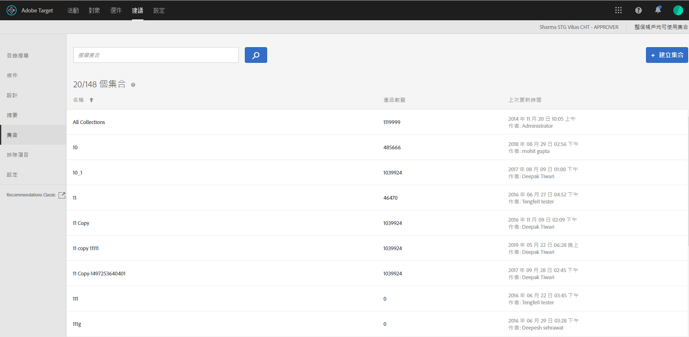

#  集合{#collections}

集合是符合建議資格的一組產品或項目。

集合通常是指一組相似或相關的項目，例如單一產品集合。不過，只要符合業務的需要，您可以將任何項目分組到類別中，例如特定價格範圍或顏色的產品，或可能在特定地理區受到歡迎的項目。

請使用集合以在邏輯分組中組織產品。例如，如果某些項目在一個區域中銷售，但在另一個區域中沒有上市，您可能需要建立集合來排除未於訪客區域銷售的項目。您也可以使用集合來組織季節性項目，或使用業務上適合的任何其他組織參數。

The [backup recommendations](/help/c-recommendations/c-algorithms/backup-recs.md) generated for each criteria within the recommendation also uses this collection, so only items in the collection are included in the backup recommendation. 集合可讓您確保只顯示必須出現在位置中的產品。

每個條件每次執行時皆會重建或更新集合。

您可以將項目分組為目錄，然後為每個集合建立個別的建議。

包含條件的用途類似集合，但必須在您每次建立活動時設定。集合可讓您一次建立一組項目，然後在適當時機派上用場，而不必再次設定。

當您建立或編輯 [!DNL Recommendations] 活動時，集合名稱會出現在活動圖的[!UICONTROL 「條件」]標籤旁。

>[!NOTE]
>
>使用[!UICONTROL 「最近查看的項目」]建議索引鍵時不會套用集合。

## 建立集合 {#task_1256DFF6842141FCAADD9E1428EF7F08}

建立收集來組織您要在建議中顯示的產品。

1. 依序按下&#x200B;**[!UICONTROL 「Recommendations]** &gt; **[!UICONTROL 集合」]**，即可顯示現有集合清單。

   

   [!UICONTROL 「集合」]清單檢視上，每個集合的「項目數量」為設定的預設 Recommendations [主機群組](/help/administrating-target/hosts.md) (環境) 中，符合集合規則的產品數量。請參閱[設定](../../c-recommendations/plan-implement.md#concept_C1E1E2351413468692D6C21145EF0B84)，瞭解如何變更預設主機群組。

1. 按一下&#x200B;**[!UICONTROL 「建立集合」]**。

1. (依條件) 建立 (或更新) 集合時，從&#x200B;**[!UICONTROL 「環境」]**&#x200B;篩選器中選擇一個環境，以便預覽該環境中的集合內容。依照預設，會顯示預設主機群組的結果。

   

1. 輸入集合的&#x200B;**[!UICONTROL 名稱]**。

   您也可以輸入選填的&#x200B;**[!UICONTROL 說明]**。

1. 設定用來建立集合的規則。

   例如，您的集合可能根據清單中的產品 ID 或類別、利潤或任何其他參數建立。

   您可以新增規則，以使用多個參數來定義集合。以 AND 聯合多個規則。所有指定的規則必須符合，才會套用集合。

1. 按一下&#x200B;**[!UICONTROL 「儲存」]**。

## 使用進階搜尋建立系列

You can also create collections using Advanced Search on the [Catalog Search](/help/c-recommendations/c-products/catalog-search.md) page ([!UICONTROL Recommendations] &gt; [!UICONTROL Catalog Search] &gt; [!UICONTROL Advanced Search]).

例如，使用 "id &gt; contains" 建立搜尋之後，您就可以按一下[!UICONTROL 「另存新檔] &gt; [!UICONTROL 集合」]。

>[!IMPORTANT]
>
>「進階搜尋」功能不區分大小寫，不過傳送時傳回的產品會以區分大小寫的搜尋為依據。此不相符的情況可能導致混淆。使用「進階搜尋」功能來根據結果建立集合時，務必注意大小寫。例如，如果您執行 "Holiday" 的搜尋，初始的搜尋清單結果會包含 "Holiday" 和 "holiday"。如果您之後建立一個目錄，目的要傳回包含 "holiday" 的產品，則只會傳回包含 "holiday" 的產品。不會傳回包含 "Holiday" 的產品。

## 訓練影片：在Recommendations中建立系列和排除(7：05)

此影片包含下列資訊：

* 建立系列
* 建立排除

>[!VIDEO](https://video.tv.adobe.com/v/27689?captions=chi_hant)