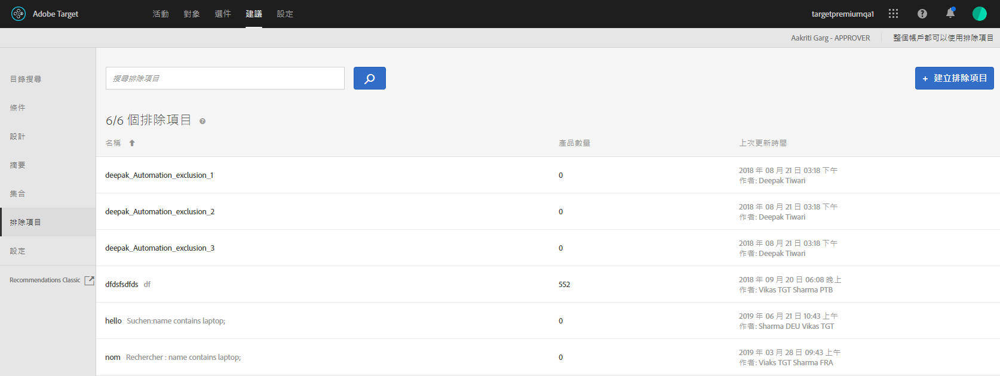

# 排除項目{#exclusions}。

建立排除清單來防止項目被建議。

>[!IMPORTANT]
>
>靜態和動態排除規是可協助您從事行銷活動的強大功能。如需詳細資訊、範例和使用案例，請參閱[使用動態和靜態包含規則](../../c-recommendations/c-algorithms/use-dynamic-and-static-inclusion-rules.md#concept_4CB5C0FA705D4E449BD0B37B3D987F9F)。

1. 按一下&#x200B;**[!UICONTROL 「Recommendations]** &gt; **[!UICONTROL 排除項目」]**，即可顯示現有排除項目的清單。

   [!UICONTROL 「排除項目」]清單檢視上各排除項目顯示的「項目數量」，為預設 Recommendations [主機群組](/help/administrating-target/hosts.md) (環境) 內符合該排除項目規則的產品數量。請參閱[設定](../../c-recommendations/plan-implement.md#concept_C1E1E2351413468692D6C21145EF0B84)，瞭解如何變更預設主機群組。

   

1. 按一下&#x200B;**[!UICONTROL 「建立排除項目」]**。

1. (依條件) 建立 (或更新) 排除項目時，從&#x200B;**[!UICONTROL 「環境」]**&#x200B;篩選器中選擇一個環境，以便預覽該環境中的排除項目內容。依照預設，會顯示預設主機群組的結果。

   

1. 輸入排除項目&#x200B;**[!UICONTROL 名稱]**，然後選填說明。

1. 使用規則產生器來建立排除項目。

   在「規則」清單中選取參數，選取運算子，然後輸入一或多個值以辨別產品。使用逗號分隔多個值。

1. 按一下&#x200B;**[!UICONTROL 「儲存」]**。

   您也可以使用「目錄搜尋」頁面上的「進階搜尋」([!UICONTROL 「Recommendations] &gt; [!UICONTROL 目錄搜尋] &gt; [!UICONTROL 進階搜尋」])，以建立排除項目。例如，使用「id &gt; contains」建立搜尋之後，您就可以按一下[!UICONTROL 「另存新檔] &gt; [!UICONTROL 排除項目」]。

>[!IMPORTANT]
>
>「進階搜尋」功能不區分大小寫，不過傳送時傳回的產品會以區分大小寫的搜尋為依據。此不相符的情況可能導致混淆。使用「進階搜尋」功能來根據結果建立排除項目時，務必注意大小寫。例如，如果您執行 "Holiday" 的搜尋，初始的搜尋清單結果會包含 "Holiday" 和 "holiday"。如果您接著建立排除項目而希望排除含有 "holiday" 的產品，則只會排除含有 "holiday" 的產品。不會排除含有 "Holiday" 的產品。