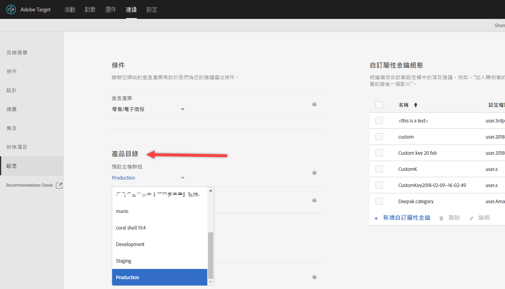
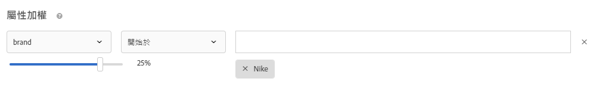

#  Recommendations 常見問題集

關於[!DNL Adobe Target] [!DNL Recommendations]活動的常見問題(FAQ)清單。

## 當我搜尋具有數值的自訂屬性時，目錄搜尋為何無法顯示正確的結果？

當您對具有數值的自訂屬性執行目錄搜尋時，結果會將自訂屬性視為字串類型，而非數值。

目前，沒有可讓客戶變更屬性類型的功能。 要進行更改，請[開啟一個客戶問題](/help/cmp-resources-and-contact-information.md#reference_ACA3391A00EF467B87930A450050077C)，該問題引用需要將類型從字串更改為數字的屬性。

## 目錄中項目的更新需要多久才會反映在網站上？

時間範圍和結果會依項目的更新方式而有所不同。

| 來源 | 詳細資料 |
| --- | --- |
| 透過mbox或API更新項目屬性 | <ul><li>Recommendations在15分鐘內更新。</li><li>現有建議和項目屬性會顯示，直到有更新可供使用為止。</li><li>目錄搜尋會在目錄索引後更新（3-8小時）。</li></ul> |
| 透過動態消息更新項目屬性 | <ul><li>Recommendations在摘要後（2-8小時）更新。</li><li>現有建議和項目屬性會顯示，直到有更新可供使用為止。</li><li>「目錄搜尋」會在饋送收錄（2-8小時）和後續目錄索引（3-8小時）之後更新。 目錄搜尋通常在5-16小時內更新。</li></ul> |
| 透過Target UI或API從目錄刪除的項目 | <ul><li>Recommendations在15分鐘內更新。</li><li>現有建議和項目屬性會顯示，直到有更新可供使用為止。</li><li>目錄搜尋會在目錄索引後更新（3-8小時）。</li></ul> |
| 透過mbox或API新增至目錄的項目 | <ul><li>Recommendations在演算法執行後更新。 演算法執行是每12小時排程1-2天演算法，而7天以上演算法則每24小時排程一次。</li><li>現有建議會顯示，直到更新可供使用為止（如果新增的項目不是請求的金鑰）。</li><li>如果所新增的項目是請求的金鑰，則會顯示備份建議，直到更新可供使用為止。</li><li>目錄搜尋會在目錄索引後更新（3-8小時）。</li></ul> |
| 透過動態消息新增至型錄的項目 | <ul><li>Recommendations在攝入飼料後（2-8小時）更新。 後續演算法會排程為每12小時執行1-2天演算法，而7天以上演算法則每24小時執行。 Recommendations通常在2-32小時內更新。</li><li>現有建議會顯示，直到更新可供使用為止（如果新增的項目不是請求的金鑰）。</li><li>如果所新增的項目是請求的金鑰，則會顯示備份建議，直到更新可供使用為止。</li><li>「目錄搜尋」會在饋送收錄（2-8小時）和目錄索引（3-8小時）後更新。 目錄搜尋通常在5-16小時內更新。</li></ul> |

匯入動態消息檔案後，或透過API或mbox接收實體更新後，下列變更會反映在60分鐘內：

* 如果先前已排除某個項目，但現在應該包含在內，該項目將包含在下次演算法執行中（12-24小時）。

   發生此情況是因為Target會套用線上和離線排除。 新排除項目時，線上排除會快速套用。 新加入項目時，線上排除會很快消失，但離線排除會在下次演算法執行之前消失。

* 如果先前已包含某個項目，但現在應該排除，則該項目將根據「項目屬性已更新……」排除。 上述的時間線視動態消息來源而定（透過mbox/API需15分鐘，或透過動態消息需要12-24小時）。

在下一個演算法執行作業發生之前 (在 12 至 24 小時內)，不會反映下列變更:

* 用於活動的收集規則中使用的項目屬性。
* 促銷活動中使用的項目屬性，根據與活動相關聯的屬性或集合。
* 項目類別，項目會出現在最暢銷商品或檢視次數最多演算法中的「目前類別」或「最喜愛類別」。
* 建議項目排名 (在已變更的屬性是用來作為演算法自訂金鑰的自訂屬性的情況下)。
* 當建議邏輯是「具有相似屬性的項目」、使用「內容相似性」加權系數或使用「屬性加權」系數時，建議項目的排名會根據一或多個變更的屬性。

>[!NOTE]
>
>在摘要檔案的狀態從「匯入項目」變更為「準備搜尋索引更新」時，摘要檔案會視為已匯入。更新可能需要60分鐘以上的時間，才會反映在目錄搜尋使用者介面中；目錄搜尋是動態消息狀態變更為「已完成更新」時的最新狀態。 即使「目錄搜尋」尚未更新，您的網站仍會反映上述時段的更新。 最新目錄搜尋索引更新時間會顯示在目錄搜尋頁面上。

## 如果特殊字元破壞陣列，怎麼辦? {#section_D27214116EE443638A60887C7D1C534E}

在 JavaScript 中使用逸出值。引號 ( &quot; ) 會破壞陣列。下列程式碼片段是逸出值的範例:

```
#set($String='') 
#set($escaper=$String.class.forName('org.apache.commons.lang.StringEscapeUtils')) 
<script type="text/javascript"> 
console.log("$escaper.escapeJavaScript($entity1.name)") 
console.log("$escaper.escapeJavaScript($entity2.name)") 
console.log('$escaper.escapeJavaScript($entity3.name)') 
names.push("$escaper.escapeJavaScript($entity4.name)") 
</script>
```

## 建立「建議」活動時，為何不是所有條件都可供選擇，包括自訂條件?  {#section_B2265AC8B8A94E0298D495A05C5D817F}

可用的條件取決於目前類別。當您建立建議選件時，演算法選擇器會根據類別Id顯示標準。

如果您套用此條件的位置不含類別 ID，則某些條件不會出現在演算法選擇器中。

如果您使用mbox中類別Id所在的位置，則條件選擇器會包含所有適用的條件。

Target具有[「篩選不相容准則」設定，可控制演算法選擇器的智慧篩選。](/help/c-recommendations/plan-implement.md#concept_C1E1E2351413468692D6C21145EF0B84)

>[!NOTE]
>
>此設定僅適用於可視化體驗撰寫器 (VEC) 中建立的活動。此設定不適用於表單式體驗撰寫器中建立的活動 (Target 沒有位置環境定義)。

若要存取[!UICONTROL 篩選不相容的條件]設定，請按一下「[!UICONTROL 建議] > [!UICONTROL 設定]」:


如果「未」啟用[!UICONTROL 篩選不相容的條件]設定，Target 就不會篩選「演算法選擇器」中的篩選演算法，所有演算法都會出現。

如果[!UICONTROL 篩選不相容的條件]設定已啟用，則在 VEC 活動中，Target 會從選取的位置讀取 entityId 和 categoryId，然後根據 `currentItem|currentCategory` 來顯示演算法 (如果各自的值存在該位置上)。因此，依預設，演算法選擇器中只會顯示所選位置的相容演算法。

如果[!UICONTROL 篩選不相容的條件]設定已啟用，您仍可在選取條件時取消選取[!UICONTROL 「相容」]核取方塊，以檢視不相容的演算法。


下列清單包含 Target 未顯示[!UICONTROL 「相容」]核取方塊的特殊情況:

* entityId 和 categoryId 都存在位置上，所以完全不篩選。
* 您使用 [!DNL mbox.js] 55 版或更舊版本。
* 未從頁面上觸發任何 mbox (!config.isAutoCreateGlobalMbox &amp;&amp; !config.isRegionalMbox)
* Target 參數未定義。

## 如果「建議」中的集合變成零 (0)，怎麼辦?  {#section_E2DB2FE67CF24EEC81412BFF3FA6385D}

如果您看到一個集合原先不是零而現在變成零，請考量下列資訊:

* 您可以重新儲存系列，並查看它是否更新數字。 儲存後，系列會重新執行使用該系列的所有演算法。
* 您所看的環境對嗎? 請移至 [!DNL /target/products.html#recsSettings] 仔細檢查 (如下所示)。

   

* 索引是最新的嗎? 轉到[!DNL /target/products.html#productSearch]並檢查索引的存在時間（例如，&quot;3小時前已編製索引&quot;）。 您可以視需要重新整理索引。
* 您是否更動過摘要或資料層，而導致實體不再符合收集規則? 請確定「大小寫」相符 (區分大小寫)。
* 摘要執行成功嗎? 有人變更FTP目錄、密碼等嗎？
* Target 會儘力讓傳送儘快更新 (在客戶的頁面/應用程式上)。不過，Target也必須在UI中為行銷人員提供一些呈現方式。 Target不會延遲傳送更新，以等待UI更新同步。 您可以使用 [mboxTrace](/help/c-activities/c-troubleshooting-activities/content-trouble.md) 查看當請求進來時系統中有什麼。

## 一般「屬性加權」和「內容相似度」特有的屬性加權之間有何差異? {#section_FCD96598CBB44B16A4C6C084649928FF}

屬性加權有兩種形式:「標準屬性加權」和「內容相似度屬性加權」。

「標準屬性加權」適用於大部分 (但不是全部) 條件類型 (不只是「內容相似度」)。這種加權會給某些屬性值更多權重。在下列範例中，Nike產品在輸出建議中會有所增加。



「內容相似度屬性加權」僅適用於內容相似度條件。

這種加權較動態，而且是根據目前的「建議金鑰」(目前檢視的項目)。在下列範例中 (品牌 x 16)，如果訪客在檢視 Nike 運動鞋，就很可能向該訪客建議其他 Nike 產品 (不一定是運動鞋)，而不是競爭者的運動鞋。如果訪客正在檢視阿迪達斯運動鞋，該訪客更可能是建議使用阿迪達斯產品。


## 為何 Target 有時無法顯示建議?  {#section_DB3F40673AED42228E407C05437D99E9}

Target 有時會因為可用的建議數量不夠而無法顯示建議。

每個標準生成的值數是設計中指定的圖元數的三倍。 產生 3 倍的值之後會套用執行階段篩選 (例如、詳細目錄、mbox 屬性比對)，最後在傳送時可能會少於 3 倍的值。要避免這種情況，請通過隱藏其他實體來增加設計中的實體數。

可以在設計開始時使用以下 JavaScript 來增加請求實體的數量。在此範例中，請求的實體計數為 30 (3x10)。

```
#foreach($entity in $entities) 
 #if( $foreach.count > 10 ) 
  #break 
 #end 
 #set ($foo = $entity.id) 
#end 
```

## 插入/更新產品之 API 呼叫的大小限制是多少? 我是否可以使用 API (而非動態消息) 更新某次呼叫中的 50,000 種產品? {#section_434FE1F187B7436AA39B7C14C7895168}

Target在應用程式層級規定50-MB的貼文限制；不過，這只有在您傳遞`application/x-www-form-urlencoded`內容類型標題時才會發生。

您當然可以嘗試在單一呼叫中傳送 50,000 個產品。如果失敗，您可將其分成批。 Adobe建議客戶將其呼叫分為5,000或10,000個產品批，以降低系統負載導致逾時的可能性。

## 我必須在建立Recommendations標準、促銷或範本測試規則時指定mbox名稱？{#section_FFA42ABCC5954B48A46526E32A3A88A2}

根據 mbox 參數建立建議條件、促銷活動或範本測試規則時，`mboxParameter` 不再提示您輸入 `mboxName`。mbox 名稱現在是可選項目。此變更可讓您使用多個 mbox 中的參數，或參考尚未記錄在 Edge 上的參數。

若要選取需要的參數:

* 在建立標準、升級或模板測試規則時，從清單中選擇參數名稱。 開始鍵入所需參數名稱的第一個字元，或鍵入所需參數名稱的完整名稱。
* 如果您記得 mbox 名稱，但不記得參數名稱，請使用核取方塊來篩選會傳遞所需參數的確定 mbox。

不論使用哪一種方法，mbox 和參數之間並沒有任何連結。標準、促銷或範本測試規則會根據傳遞該參數之所有mbox的參數運作。

如果編輯現有條件、促銷活動或範本測試規則，則篩選條件將顯示建立期間提供的 mbox 名稱。

## 定義新對象後，為何無法儲存舊版 Recommendations 活動?  {#section_1E47C40B1FE7479BAC3EE0F50CE7C2C4}

請確定對象有唯一的名稱。若您為對象指定了與現有對象相同的名稱，則無法儲存舊版 Recommendations 活動 (2016 年 10 月以前建立的 Recommendations 活動)。

## 用於摘要上傳之 CSV 檔案的檔案大小上限是多少?  {#section_20F1AF4839A447B9889B246D6E873538}

摘要的 CSV 檔案上傳對於資料列數量或檔案大小並沒有嚴格限制。不過，Adobe建議將CSV檔案大小限制為1 GB以避免檔案上傳程式失敗。 如果檔案大小超過1 GB，則最理想的是可分割為多個動態消息檔案。 自訂屬性欄數的上限為 100，而自訂屬性限制為 4096 個字元。[「目標限制」頁面](/help/r-troubleshooting-target/target-limits.md#reference_BEFE60C3AAA442FF94D4EBFB9D3CC9B1)中提供了對所需列長度的其他限制。

## 是否可以動態地排除實體? {#exclude}

在查詢字串中，您可以傳遞要從建議中排除之實體的實體 ID。例如，您可以排除已在購物車中的項目。

若要啟用排除功能，請使用 `excludedIds` mbox 參數。此參數指向逗號分隔的實體 ID 清單。例如, `mboxCreate(..., "excludedIds=1,2,3,4,5")`。要求建議時會傳送值。

排除僅針對目前的Target呼叫執行；後續Target呼叫中不會排除項目，除非再次傳遞`excludedIds`值。 若要從每個頁面上的建議中排除購物車中的項目，請繼續在每個頁面上傳遞`excludedIds`值。

>[!NOTE]
>
>如果排除太多實體，則建議會以沒有足夠實體可填入建議範本的情況來處理。

若要排除`entityIds`，請將`&excludes=${mbox.excludedIds}`代號附加至選件內容URL。 擷取內容 URL 時，目前的 mbox 請求參數會替代必要參數。

依預設，新建立的建議會啟用此功能。必須儲存現有的建議來支援動態排除的實體。

## 在Recommendations內容追蹤中有時傳回的NO_CONTENT回應代表什麼意思？

當請求的演算法和索引鍵組合無法使用建議時，會傳回NO_CONTENT。 一般而言，當演算法的備份停用，且下列一或多個項目也成立時，就會發生這種情況：

* 結果尚未準備好。

   這種情況通常發生在首次儲存新建立的活動時，或在變更活動中使用的系列、標準或促銷後。

* 對於請求的演算法／鍵組合，結果已準備就緒，但尚未在最近的邊緣伺服器快取。

   請求會啟動快取作業，因此在重新載入數個頁面並／或經過幾分鐘後，這個問題應該會自行解決。

* 結果已就緒，但無法用於提供的鍵值。

   這種情況通常發生在為最近演算法執行後新增至目錄的項目請求建議，並會在下次演算法執行後自行解決時。

* 部分範本轉譯已停用，而且沒有足夠的結果可填滿範本。

   這種情況通常發生在您有動態包含規則時，該規則會從可能的結果中積極篩選許多項目。 為避免這種情況，請啟用備份，不要將包含規則應用於備份，或者使用順序不那麼激進的篩選條件。

