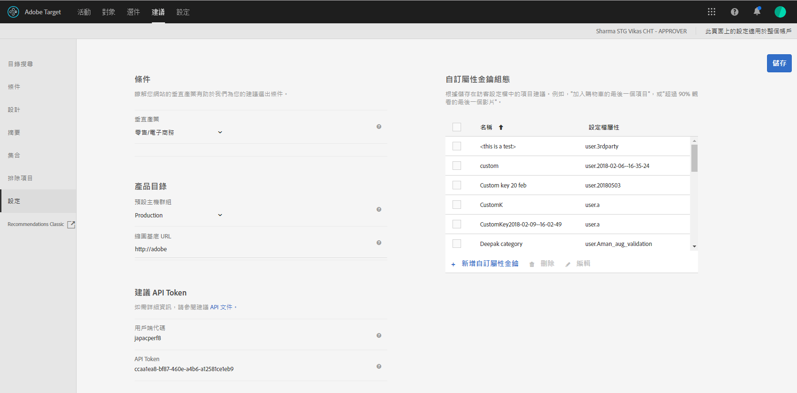

#  PREMIUMPlan和實施Recommendations  {#plan-and-implement-recommendations}

建立建議活動之前需要知道的事項。

## 計劃和實作 Recommendations {#concept_02AA644A4C7D4D5CB1D9CADA208CF8D1}

建立 [!DNL Recommendations] 活動之前需要知道的事項。

[!DNL Recommendations] 需要您設定下列資訊階層:

| 步驟 | 資訊 | 詳細資料 |
|--- |--- |--- |
|  | JavaScript 程式庫 | 每一個頁面都需要參考 at.js 0.9.1 版 (或更新版) 或 mbox.js 版本 55 (或更新版)。所有將使用 Target 活動的頁面都需要此實作步驟，其中可能包含索引鍵，例如產品或類別 ID。<BR>如需 at.js 的相關資訊，請參閱 [at.js 實作](/help/c-implementing-target/c-implementing-target-for-client-side-web/t-mbox-download/c-target-atjs-implementation/target-atjs-implementation.md)。<br>如需 mbox.js 的相關資訊，請參閱[Mbox.js 實作](/help/c-implementing-target/c-implementing-target-for-client-side-web/t-mbox-download/mbox-download.md)。 |
|  | 密鑰 | 此索引鍵決定建議中顯示的產品或內容類型。例如，索引鍵可能是產品類別。請參閱[讓建議以建議金鑰為依據](/help/c-recommendations/c-algorithms/base-the-recommendation-on-a-recommendation-key.md)。 |
|  | 屬性 | 屬性可以針對您想顯示的產品，提供更具體的相關資訊。例如，您可能需要顯示特定價格範圍內的產品，或符合庫存臨界值的項目。屬性可以在 mbox 中提供，或透過[摘要](/help/c-recommendations/c-products/feeds.md)。<br>請參 [閱指定包含規則](/help/c-recommendations/c-algorithms/create-new-algorithm.md#inclusion)。 |
|  | 排除項目 | 「排除項目」決定在建議中不要出現的特定項目。<br>請參閱[排除項目](/help/c-recommendations/c-products/exclusions.md)。 |
|  | 購買詳細資料 | 採購完成時，購買詳細資料提供採購項目及訂單的相關資訊。 |

## 基礎實作 {#concept_D1154A3FB0FB4467A29AD2BDD21C82D5}

基礎實作需要您將參數傳遞至頁面，以決定要在您的建議中出現的產品或服務。

開始設定 [!DNL Recommendations] 活動之前，請瞭解產品資料如何提供給 [!DNL Recommendations]，然後決定最符合需要的方法。

提供產品和服務的相關資訊給 [!DNL Recommendations] 有兩種方法:

| 方法 | 說明 |
|--- |--- |
| 直接將參數傳給頁面 | 此方法適用於經常變更的項目。不過，因為這需要直接變更頁面，在許多組織裡，此方法需要 IT 和實作頁面人員參與。 |
| 透過 Google 或 CSV 摘要來傳送參數 | 此方法適用於不常變更的集合。透過摘要來提供產品資訊時，通常不需要變更 實作或其他頁面程式碼。不過，因為產品清單保持不變，快速變更會較困難。如需詳細資訊，請參閱[動態消息](/help/c-recommendations/c-products/feeds.md)。 |

這些方法可以分開或一起使用，如下列範例所示。

## 範例一: 結合頁面和摘要 {#section_DF6BAE4BF11548BD9C44D0A426BCF5A7}

一個通用 [!DNL Recommendations] 實作選項使用頁面參數和摘要。

如果零售商有相當固定的產品目錄，但想要強調特殊的季節性項目或促銷項目，可能會喜歡此方法。多數客戶可能主要是透過摘要來提供資訊，偶爾才調整頁面。

使用摘要提供不常變更的資訊。無論使用 CSV 檔案或 Google 摘要，請使用下列參數:

* 必要的參數

   * `entity.id`

* 實用的參數

   * `entity.name`
   * `entity.categoryId`
   * `entity.brand`
   * `entity.pageUrl`
   * `entity.thumbnailUrl`
   * `entity.message`
   * 所有自訂屬性

設定摘要並將其傳遞至 [!DNL Recommendations] 後，請針對經常變更的屬性 (亦即頻繁程度超過每日) 將參數傳遞至頁面上。

* 必要的參數

   * `entity.id`
   * `entity.categoryId`

* 實用的參數

   * `entity.inventory`
   * `entity.value`

最近執行的資料集較優先。如果您先傳遞摘要，再更新頁面參數，則會顯示頁面參數中的變更，以取代摘要中傳遞的資訊。

## 範例二: 在產品 (或內容) 詳細資料頁面上傳遞所有參數  {#section_D5A4F69457604CA7AACFD7BFF79B58A9}

如果您在頁面上傳遞所有參數，則可以更新頁面來快速完成更新。在某些組織裡，這需要 IT 或網頁設計團隊參與。

對於時常變更內容的媒體公司，此範例可能非常實用。

* 必要的參數

   * `entity.id`
   * `entity.categoryId`
   * 所有其他屬性

## 程式碼範例  {#section_6E8A73376F30468BB549F337C4C220B1}

例如，您可以在產品或內容頁面的標題區段中使用下列程式碼:

```
function targetPageParams() {
 return {
    "entity": {
       "id": "32323",
       "categoryId": "My Category",
       "value": 105.56,
       "inventory": 329
    }
 }
}
```

如需更多您在不同頁面上可能使用的程式碼範例，請參閱[根據頁面類型的實作](/help/c-recommendations/plan-implement.md#reference_DE38BB07BD3C4511B176CDAB45E126FC)

## 根據頁面類型實作 {#reference_DE38BB07BD3C4511B176CDAB45E126FC}

頁面類型將影響您的 [!DNL Recommendations] 實作。

例如，您要在產品頁面上呈現的建議類型與在類別頁面或您的首頁上的可能不同。針對每個頁面，您可以在 mbox 呼叫之前執行特定函數，以顯示適當的建議。

如需關於範例中屬性的資訊，請參閱[實體屬性](/help/c-recommendations/c-products/entity-attributes.md#reference_3BCC1383FB3F44F4A2120BB36270387F)。

需要有效的 JSON 格式。

如果您使用標記管理解決方案來實作您的頁面，則以下顯示的 `targetPageParams` 函數特別實用。[!DNL Adobe Launch] 或 [!DNL Adobe Dynamic Tag Manager] (DTM) 將 at.js/mbox.js 參照和 `targetPageParams` 函式放置在頁面上，並允許您設定值。您應該將該函數放置在 at.js/mbox.js 呼叫之前，或將它放在 at.js/mbox.js 的「額外 JavaScript」區段。

## 全部頁面 {#section_A22061788BAB42BB82BA087DEC3AA4AD}

包含建議的所有頁面需要在頁面上有 [!DNL at.js] 或 [!DNL mbox.js] 參考。新增下列其中一個參考至具有建議的所有頁面:

```
<script src="/help/at.js /></script>
```

```
<script src="/help/mbox.js /></script>
```

此實作需要:

* [!DNL at.js] 版本 0.9.2 (或更新版本) 或 [!DNL mbox.js] 版本 55 (或更新版本)

* [!DNL mbox.js] 必須包括 [!DNL target.js] 的參照 ([!DNL at.js] 不需要 [!DNL target.js] 的參照)

如需關於實作 [!DNL at.js] 的詳細資訊，請參閱[如何部署 at.js](/help/c-implementing-target/c-implementing-target-for-client-side-web/how-to-deployatjs/how-to-deployatjs.md#topic_ECF2D3D1F3384E2386593A582A978556)。

如需關於實作 [!DNL mbox.js] 的詳細資訊，請參閱 [Mbox.js 實作](/help/c-implementing-target/c-implementing-target-for-client-side-web/t-mbox-download/mbox-download.md#task_4EAE26BB84FD4E1D858F411AEDF4B420)。

如需關於這兩個 Target Javascript 資料庫之間差異的詳細資訊，請參閱 [at.js 的優點](/help/c-implementing-target/c-implementing-target-for-client-side-web/t-mbox-download/c-target-atjs-implementation/target-atjs-implementation.md#benefits)。

## 類別頁面 {#section_F51A1AAEAC0E4B788582BBE1FEC3ABDC}

在類別頁面上，您可能想要將您的建議限制在該類別中的產品或內容。若要設定類別頁面，您可以設定頁面使用的索引鍵。如需關於索引鍵的詳細資訊，請參閱[讓建議以建議金鑰為依據](/help/c-recommendations/c-algorithms/base-the-recommendation-on-a-recommendation-key.md)。

```
function targetPageParams() { 
   return { 
      "entity": { 
         "categoryId": "My Category" 
      } 
   } 
}
```

## 產品頁面 {#section_205B3953C9664125A17CA8574FA6B2A3}

在產品頁面上，您可能想要建議特定項目或具有特定價格或詳細目錄層級的項目。針對產品頁面，除了類別頁面所需的索引鍵以外，您可能需要設定頻繁變更屬性 (例如值和詳細目錄)。

```
function targetPageParams() { 
   return { 
      "entity": { 
         "id": "32323", 
         "categoryId": "My Category", 
         "value": 105.56, 
         "inventory": 329 
      } 
   } 
}
```

## 購物車頁面 {#section_D37E48700F074556B925D0CA0291405E}

在購物車頁面上，您會想要從您的建議中排除一些項目，例如已在購物車中的項目。

```
<script type="text/javascript">
function targetPageParams() {
   return {
      "excludedIds": [352, 223, 23432, 432, 553]
      }
}
</script>
```

## 感謝頁面 {#section_C6126A4517A1478693AB7EC2A1D4ACCA}

在感謝頁面上，您會想要顯示訂購總計和訂購 ID，以及顯示所購買的產品，而不建議其他項目。您可以實作第二個 mbox 來擷取訂購資訊。

* 如果您使用 at.js，請參閱[追蹤轉換](/help/c-implementing-target/c-implementing-target-for-client-side-web/how-to-deployatjs/implementing-target-without-a-tag-manager.md#task_E85D2F64FEB84201A594F2288FABF053)。
* 若您使用 mbox.js，請參閱[建立訂購確認 mbox - mbox.js](/help/c-implementing-target/c-implementing-target-for-client-side-web/t-mbox-download/orderconfirm-create.md#task_0036D5F6C062442788BB55E872816D82)。

## 設定 {#concept_C1E1E2351413468692D6C21145EF0B84}

使用設定來管理您的 [!DNL Recommendations] 實作。

若要存取「Recommendations設定」[!UICONTROL 選項，請開啟[!DNL Adobe Experience Cloud]中的[!DNL Target]，然後按一下「Recommendations ]**>**[!UICONTROL &#x200B;設定」]**。]**[!UICONTROL 



可使用下列選項: 

| 設定 | 說明 |
|--- |--- |
| 自訂全域 Mbox | (可選) 指定用來提供 [!DNL Target] 活動的自訂全域 mbox。依預設，[!DNL Target]使用的全域mbox會用於[!DNL Recommendations]。<br>注意：此選項在「管理」頁 [!DNL Target]  面上設定。開啟[!DNL Target]，然後按一下「管理」>「視覺體驗撰寫器」[!UICONTROL >「管理」。] |
| 垂直產業 | 行業別用於協助將建議條件分類。這有助於團隊的成員尋找特定頁面適合的條件，例如最適合購物車頁面或媒體頁面的條件。 |
| 篩選不相容的條件 | 啟用此選項只會顯示讓所選頁面傳遞必要資料的條件。不是每個條件都能在每個頁面上正確執行。頁面或 mbox 必須傳入 `entity.id` 或 `entity.categoryId`，目前項目/目前類別建議才能相容。一般來說，最好只顯示相容的條件。不過，如果您要讓活動可以使用不相容的條件，請取消勾選此選項。<br>如果您使用標記管理解決方案，建議您停用此選項。<br>如需此選項的詳細資訊，請參閱 [Recommendations 常見問題集](/help/c-recommendations/c-recommendations-faq/recommendations-faq.md)。 |
| 預設主機群組 | 選取預設主機群組。<br>主機群組可用來將目錄中可用項目區分為不同用途。例如，您可以將主機群組用於開發和生產環境、不同品牌或不同地理位置。依照預設，「目錄搜尋」、「集合」和「排除項目」中的預覽結果是根據預設主機群組所產生。(您也可以使用「環境」篩選器，選取不同的主機群組來預覽結果。)依照預設，除非在建立或更新項目時指定環境 ID，否則新增的項目可在所有主機群組中使用。提供的建議取決於要求中指定的主機群組。<br>如果沒有看見您的產品，請確定您使用正確的主機群組。例如，假設您將建議設定為使用測試環境，並將主機群組設為「測試」，則可能需要在測試環境中重建集合，才會顯示產品。若要查看每個環境中可用的產品，請對每個環境使用「目錄搜尋」。您也可以針對所選的環境 (主機群組)，預覽 Recommendations 集合和排除項目的內容。<br>**注意:** 變更選定環境後，您必須按一下「搜尋」來更新傳回的結果。<br>[!UICONTROL 「環境」]篩選器可在 [!DNL Target] UI 中的以下位置使用:<ul><li>「目錄搜尋」(「建議 > 目錄搜尋」)</li><li>「建立集合」對話方塊 ([!UICONTROL 「Recommendations > 集合 > 新建」])</li><li>「更新集合」對話方塊 ([!UICONTROL 「Recommendations > 集合 > 編輯」])</li><li>「建立排除項目」對話方塊 ([!UICONTROL 「Recommendations > 排除項目 > 新建」])</li><li>「更新排除項目」對話方塊 ([!UICONTROL 「Recommendations > 排除項目 > 編輯」])</li></ul>如需詳細資訊，請參閱[主機](/help/administrating-target/hosts.md)。 |
| 縮圖基底 URL | 設定產品目錄的基底 URL 可讓您在傳入縮圖 URL 時，使用相對 URL 來指定產品的縮圖。<br>例如:<br>`"entity.thumbnailURL=/Images/Homepage/product1.jpg"`<br>設定相對於縮圖基底 URL 的 URL。 |
| Recommendations API Token | 在「建議 API」呼叫中 (例如「下載 API」) 使用此 Token。 |
