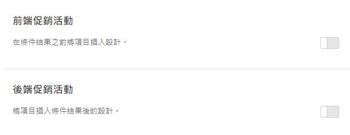

#  新增促銷活動{#add-promotions}

新增提示的項目並控制其在您的 Recommendations 設計中的放置位置。您可以新增靜態和動態促銷活動。

>[!IMPORTANT]
>
>靜態和動態排除規是可協助您從事行銷活動的強大功能。如需詳細資訊、範例和使用案例，請參閱[使用動態和靜態包含規則](/help/c-recommendations/c-algorithms/use-dynamic-and-static-inclusion-rules.md#concept_4CB5C0FA705D4E449BD0B37B3D987F9F)。

建立 [!DNL Recommendations] 活動時，您有選項可在您的 [!DNL Recommendations] 設計中包括促銷的項目。促銷活動使用設計中的可用位置，並且優先於條件結果和備用建議。例如，如果您的設計有六個位置，並且您對促銷活動使用其中兩個，即有四個位置可供根據條件建議的項目使用。

促銷活動會根據活動條件所建議之項目取消重複，因此在單一建議匣中，指定項目不會顯示兩次。

您可以促銷特定項目、動態地促銷項目、根據屬性促銷項目或促銷集合。

>[!NOTE]
>
>使用促銷活動會變更 CSV 結構和輸出。這些變更對牽涉到 CSV 的任何外部程序 (例如電子郵件) 會造成影響。

1. 在&#x200B;**[!UICONTROL 選項]**&#x200B;頁面上，按一下&#x200B;**[!UICONTROL 前端促銷活動]**&#x200B;或&#x200B;**[!UICONTROL 後端促銷活動]**&#x200B;切換按鈕。

   下圖顯示處於「開啟」位置的[!UICONTROL 前端促銷活動]切換按鈕。

   

   您可以將促銷活動插入在 *and* 之前與您的條件結果之後。
1. 設定要用於促銷的項目之設計位置的數量。

   根據您的 [!DNL Recommendations] 設計，您可以使用最多 20 個位置。您使用的每個位置會變得無法供根據您的條件傳回的建議使用。

1. 設定您促銷項目的開始日期和結束日期。

   如果您未設定開始日期，則促銷活動會立即開始。如果您未設定結束日期，則促銷活動會無限期地執行。

1. 選取&#x200B;**[!UICONTROL 促銷活動類型]**。

   * 選取&#x200B;**[!UICONTROL 「項目清單」]**&#x200B;並輸入 `entity.id` 值，將您要促銷的特定項目以逗號區隔。

      如果您的清單包括的項目多於為促銷活動設定的位置數量，您可以選取&#x200B;**[!UICONTROL 「隨機排列項目順序」]**&#x200B;核取方塊，以變更在您的設計中顯示的促銷的項目。若選擇此選項，Target 從對每次造訪設定的整個促銷活動中，隨機選取在範本中為促銷活動啟用項目數量。

   * 選取&#x200B;**[!UICONTROL 「依屬性促銷」]**，並新增規則以定義您要促銷的項目的屬性。

      如果您選取「依屬性促銷」，您可以建立動態匹配。如需詳細資訊，請參閱[使用動態和靜態包含規則](/help/c-recommendations/c-algorithms/use-dynamic-and-static-inclusion-rules.md#concept_4CB5C0FA705D4E449BD0B37B3D987F9F)。

   * 選取&#x200B;**[!UICONTROL 「促銷一個集合」]**，並選擇您要促銷的項目集合。您可以建立新的集合用於促銷活動。請參閱[建立集合](/help/c-recommendations/c-products/collections.md#task_1256DFF6842141FCAADD9E1428EF7F08)以取得更多資訊。

1. Click **[!UICONTROL Save.]**.

促銷活動會套用至活動中的所有體驗。
