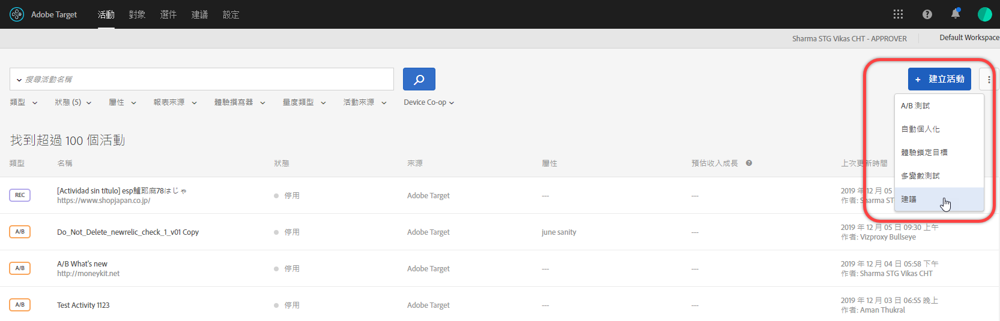
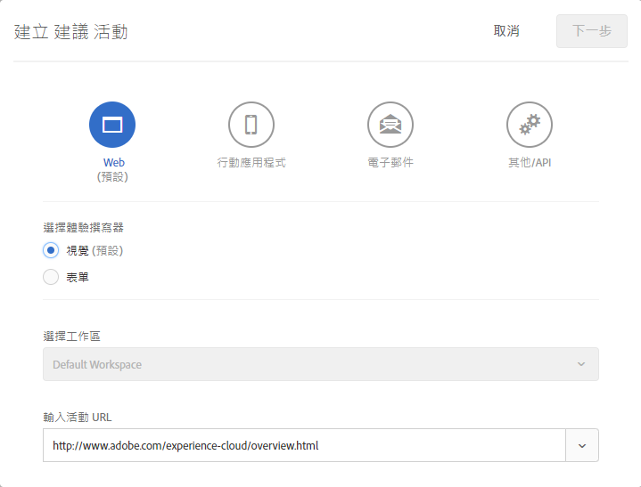
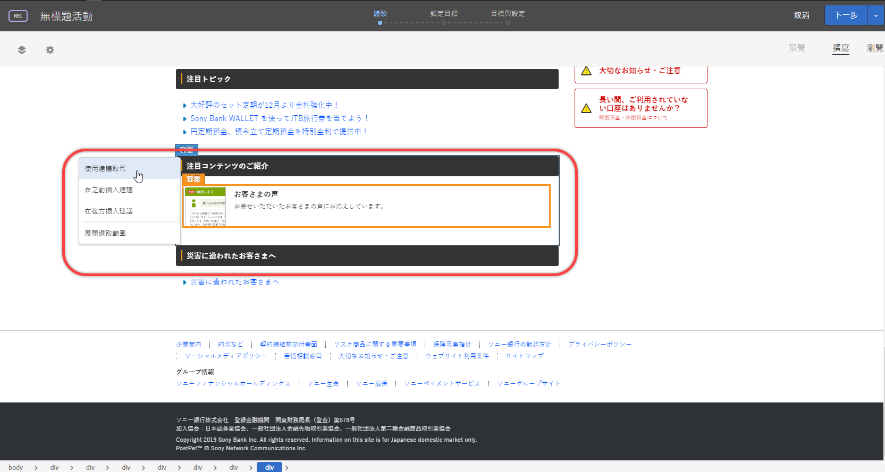
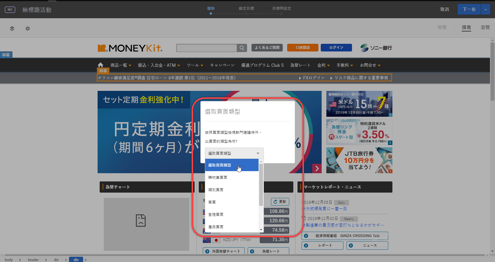
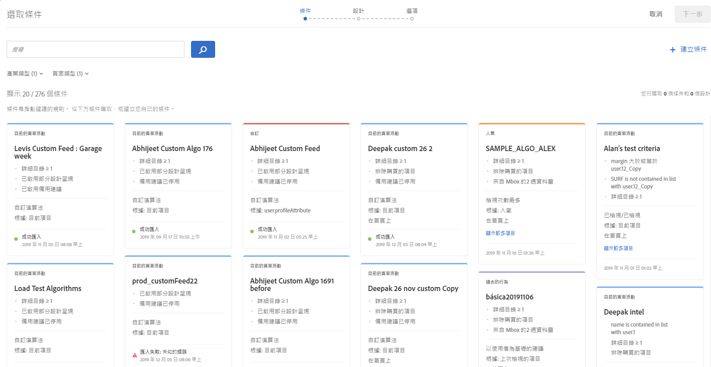
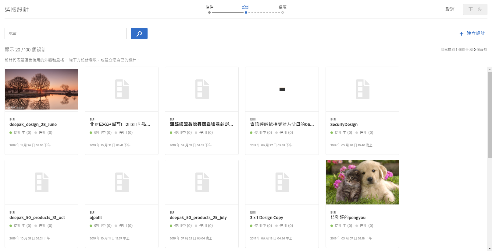
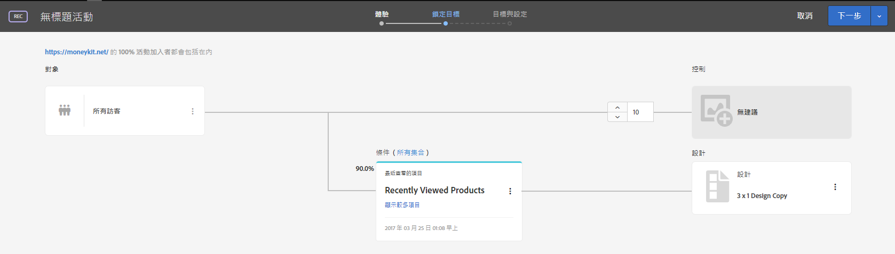

#  建立 Recommendations 活動{#create-a-recommendations-activity}

使用 Target 可視化體驗撰寫器 (VEC) 直接在啟用 Target 的頁面上建立建議活動，以及在 Target 內修改頁面的部分。

1. 按一下**[!UICONTROL 「建立活動]** &gt; **[!UICONTROL Recommendations」]**。

   

1. 指定活動 URL，然後按**[!UICONTROL 「下一步」]**。

   >[!NOTE]
   >
   >[!DNL Target] 不會區分 URL 通訊協定([!DNL https] 和 [!DNL http])。因此，[!DNL `http://www.adobe.com`] 和 [!DNL `https://wwww.adobe.com`] 都相符。

   活動 URL 為將顯示建議所在的頁面。

   

   如果您偏好使用表單式體驗撰寫器，請選取該選項。請參閱[表單式體驗撰寫器](https://marketing.adobe.com/resources/help/en_US/target/target/t_form_experience_composer.html)。

   按[!UICONTROL 「下一步」]時，VEC 會開啟並顯示您的頁面。您可以使用建議取代目前的元素，或插入建議。

   如遇問題，需要關於 VEC 的疑難排解資訊，請參閱[疑難排解可視化體驗撰寫器](../../c-experiences/c-visual-experience-composer/r-troubleshoot-composer/troubleshoot-composer.md#reference_77743144F10143A3A89D56E116D296E4)。
1. 按一下您的頁面上的元素，然後如果建議可供元素所在的位置使用，按一下**[!UICONTROL 「使用建議取代」]**或在選取的元素之前或之後**[!UICONTROL 「插入建議」]**。

   

   使用建議取代元素會刪除目前的內容，並將它以您的建議取代。
1. 選取頁面類型。

   

1. 選取一或多個條件。

   條件會以卡片的形式顯示，顯示每個條件的相關資訊。依預設，[!UICONTROL 「選取條件」]畫面會顯示與您的垂直產業和您選取的頁面類型相容的條件。您可以變更這些選項以顯示其他條件。

   >[!NOTE]
   >
   >不是每個條件都能在每個頁面上正確執行。頁面或 mbox 必須傳入 `entity.id` 或 `entity.categoryId`，目前項目/目前類別建議才能相容。一般來說，最好只顯示相容的條件。不過，如果您想要讓不相容的條件可供活動使用，請清除**[!UICONTROL 「相容」]核取方塊。**視您的 Recommendations 設定 (**[!UICONTROL 「Recommendations]** &gt; **[!UICONTROL 設定]** &gt; **[!UICONTROL 篩選不相容的條件」]**) 而定，系統可能不會顯示[!UICONTROL 「相容」]選項。如需詳細資訊，請參閱[設定](../../c-recommendations/plan-implement.md#concept_C1E1E2351413468692D6C21145EF0B84)。

   

   如果您選取多個條件，流量會在選取的條件間平均分割。例如，如果您已選取了兩個條件，而您的活動是設計為對 20% 的活動加入者顯示預設內容，那麼 40% 的活動加入者將看到每個條件所控制的建議。沒有選項可變更每個條件的百分比。

* 若要搜尋現有條件 (例如，如果顯示了大量條件卡片)，請在搜尋欄位中輸入內容，直到需要的條件出現為止，接著選取條件，然後按一下**[!UICONTROL 「完成」]**。

   有些條件是由 [!DNL Recommendations] 提供。您和您的團隊也可以建立自己的自訂條件。

* 若要建立新條件，請按一下**[!UICONTROL 「新建]** &gt; **[!UICONTROL 建立條件」]**，然後填寫新條件的資訊。如需關於建立新條件的資訊，請參閱[建立條件](../../c-recommendations/c-algorithms/create-new-algorithm.md#task_8A9CB465F28D44899F69F38AD27352FE)。
* 您也可以將條件群組為序列。若要建立新條件序列，請按一下**[!UICONTROL 「新建]** &gt; **[!UICONTROL 建立條件序列」]**。請參閱[建立條件序列](../../c-recommendations/c-algorithms/create-criteria-sequence.md#task_8A9CB465F28D44899F69F38AD27352FE)以取得相關資訊。

1. 按**[!UICONTROL 「下一步」]**。
1. 選取設計。

   設計是一種用來決定位置在您頁面上外觀的範本。[!DNL Target] 包括數個預先設定的設計。您也可以建立自己的自訂設計。如需詳細資訊，請參閱[建立設計](../../c-recommendations/c-design-overview/create-design.md#task_CC5BD28C364742218C1ACAF0D45E0E14)和[自訂設計](../../c-recommendations/c-design-overview/customizing-a-template.md#concept_94F1554C3F2E4CDB9A2C3D78F10EDA59)。

   

   每個設計會顯示其外觀的圖形呈現，而圖示會顯示目前您的已上線和非使用中的活動有多少使用該設計。

* 若要選取一或多個現有設計，按一下設計，然後按一下**[!UICONTROL 「完成」]**。

   如果您選取了多個條件，則僅能選取一個設計。

* 若要建立自訂設計，請按一下**[!UICONTROL 「新建」]**，然後填寫新設計的名稱和代碼。按**[!UICONTROL 「下一步」]**，然後選取或上傳影像並按一下**[!UICONTROL 「完成]** &gt; **[!UICONTROL 完成」**]。如需關於建立新設計的資訊，請參閱[建立設計](../../c-recommendations/c-design-overview/create-design.md#task_CC5BD28C364742218C1ACAF0D45E0E14)。

1. 按**[!UICONTROL 「下一步」]**。

   您有選項可將促銷活動新增至您的建議。如需關於新增前端和後端促銷活動的詳細資訊，請參閱[新增促銷活動](../../c-recommendations/t-create-recs-activity/adding-promotions.md#task_CC5BD28C364742218C1ACAF0D45E0E14)。
1. 按一下**[!UICONTROL 「儲存」]**。

   VEC 畫面會在您的頁面上顯示建議的設計。
1. (可選) 按一下**[!UICONTROL 「預覽」]**來查看向訪客呈現的活動效果。

[!UICONTROL 預覽]模式可讓您與您的建議互動，雖然訪客會這麼做。

預覽完建議時，請按一下**[!UICONTROL 「撰寫」]**。
1. 在 VEC 中檢閱您的建議，然後按**[!UICONTROL 「下一步」]**。

   流程圖表隨即顯示。1. 在流程圖表中檢閱您的 [!DNL Recommendations] 活動，並進行任何必要的變更。

   

   流程圖表將引導您進行選擇活動對象和設定體驗的步驟，並指定成功量度。您可從流程圖表執行下列工作: 

* 變更將看見建議的對象

   >[!NOTE]
   >
   >除了選取現有對象，您還可以[建立僅限於此活動的對象](../../c-target/creating-activity-only-audience.md#concept_A6BADCF530ED4AE1852E677FEBE68483)，或是[結合多個對象](../../c-target/combining-multiple-audiences.md#concept_A7386F1EA4394BD2AB72399C225981E5)來建立隨選對象而非建立新對象。

   依預設，所有使用者都會看到建議。不過，您可以將建議鎖定在特定對象。

   針對 [!DNL Recommendations] 活動，控制群組會看見沒有任何建議的頁面。

* 檢視條件
* 變更集合 ([!UICONTROL 「條件」]標籤旁)
* 變更可看見控制體驗的加入者百分比
* 檢視設計代碼
* 變更或移除設計

1. 完成後，按**[!UICONTROL 「下一步」]**。
1. 指定您的活動設定。

   例如，輸入活動的名稱 (必要) 和目標 (可選)。如需關於設定的資訊，請參閱 [Recommendations 活動設定](../../c-recommendations/t-create-recs-activity/recs-activity-settings.md#reference_3FDA8388CEEC4159949151C1829E2FBB)。

   >[!NOTE]
   >
   >如果指定的 [!DNL Recommendation] 活動名稱是 [!DNL Recommendations Classic] 中另一個已存在活動的名稱，則會將新活動重新同步為新名稱。新名稱為原始名稱附加時間戳記的唯一名稱。這個新名稱會顯示在 [!DNL Target Standard/Premium] 和 [!DNL Recommendations Classic] 中。

1. 完成時，按一下**[!UICONTROL 「儲存」]**。

   您的活動概覽隨即顯示。從[!UICONTROL 「概覽」]頁面，您可以:

* 啟動活動
* 編輯活動
* 將活動釘選至您的 Experience Cloud board
* 檢視您的體驗 URL
* 下載資料
* 變更可看見控制體驗的活動加入者百分比
* 顯示或隱藏條件詳細資料
* 檢視您的設計的代碼

1. (可選) 開啟[!UICONTROL 「報表」]頁面來檢視可顯示您的 [!DNL Recommendations] 活動效能的報表。
1. (可選) 開啟[!UICONTROL 「衝突」]頁面以檢視可能發生的任何[活動衝突](https://marketing.adobe.com/resources/help/en_US/target/target/c_activity_collisions.html)。

   當多個活動設為傳送內容至相同的頁面時會發生活動衝突，並且可能造成顯示未預期的內容。
