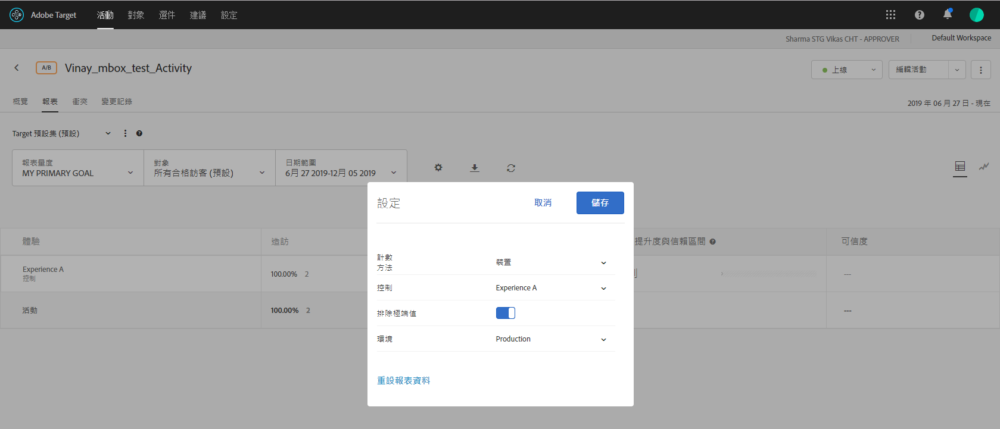

# 排除極端值

您可以排除極端值而不影響[!DNL Adobe Target]中的報表，如此一來，少數不尋常的訂單不會影響您的活動結果。 異常訂單的範例可能是為整個團隊購買制服的教練，而非購買個別制服的個別購買者。

>[!NOTE]
>
>[!UICONTROL 排除極端值]旗標僅會套用至具有收入和參與量度類型的活動。

系統會根據下述規則自動標記極端值。您可在報表中的查看極端訂單和排除極端值之間切換。一旦活動執行超過一小時或 15 筆訂單 (以先到者為準)，活動便會排除其極端值。

如果值與使用上個月資料的平均訂購值 (直到進行計算的時間點) 相差超過 +/- 3 個標準差，就視為極端值。

例如，極端值篩選器在使用 RPV 時經常相當實用。RPV 結合了轉換率和平均訂購值，通常會公開這些的揮發性。如果您使用 RPV 並判斷訂單未顯示為常態分佈，則在套用巨量訂購篩選器後應該能看到較常態的結果。

將值標記為極端時，其在促銷活動期間至該時間點的訂單值會以「體驗的平均訂購值」取代，並排除極端訂購內容。在[!UICONTROL 訂購詳細資訊]報表和每日結果的CSV下載中，訂單也會標示為極端。

**若要從您的報表中排除極端值:**

1. 開啟包括收入或參與量度類型的活動，然後按一下&#x200B;**[!UICONTROL 「報表」]**&#x200B;索引標籤。
1. 按一下齒輪表徵圖以顯示&#x200B;**[!UICONTROL Settings]**&#x200B;對話框。

   

1. 投影&#x200B;**[!UICONTROL 排除極端值]**&#x200B;會視需要切換至「開啟」或「關閉」位置。
1. 按一下&#x200B;**[!UICONTROL 「儲存」]**。
