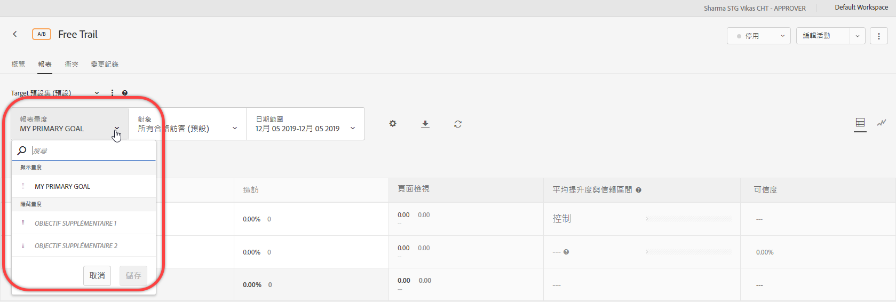
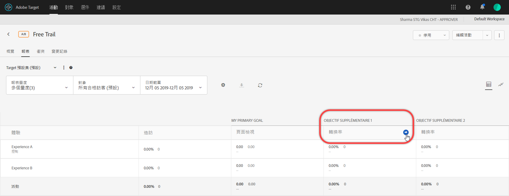

# 在報表中檢視多個量度{#view-multiple-metrics-in-a-report}

您可以選取多個度量以在報表中 [!DNL Adobe Target] 檢視。

在報表中使用多個量度時，請注意下列資訊:

* The ability to view multiple metrics is available for [A/B Test](/help/c-activities/t-test-ab/test-ab.md), [Auto-Allocate](/help/c-activities/automated-traffic-allocation/automated-traffic-allocation.md), [Auto-Target](/help/c-activities/auto-target/auto-target-to-optimize.md), and [Experience Targeting](/help/c-activities/t-experience-target/experience-target.md) (XT) activities only.
* You cannot add more than 20 metrics to a report for an activity that uses [Analytics for Target](/help/c-integrating-target-with-mac/a4t/a4t.md) (A4T). You can add as many metrics as you have in your activity to reports for activities that do *not* use A4T.
* 如果您選取多個量度，則無法使用「下載」選項將報表下載為 CSV。在只有選取一個量度的情況下，才能啟用[!UICONTROL 「下載」]選項。
* You cannot view multiple metrics for activities created before the July 2015 [!DNL Target] release (July 30, 2015).

**若要選取多個量度來顯示在報表中:**

1. 若要顯示報表，請按一下&#x200B;**[!UICONTROL 「活動」]**，從清單按一下需要的活動，然後按一下&#x200B;**[!UICONTROL 「報表」]**&#x200B;索引標籤。
1. 按一下&#x200B;**[!UICONTROL 「報表量度」]**&#x200B;下拉式清單，以顯示[!UICONTROL 「顯示量度」]和[!UICONTROL 「隱藏量度」]清單。

   

   您可以使用[!UICONTROL 「搜尋」]方塊，快速找到可用的量度來新增至[!UICONTROL 「顯示量度」]清單。

   請注意，從報表的[!UICONTROL 「表格檢視」]和[!UICONTROL 「圖表檢視」]模式中，您都可以選取多個量度。

1. 在[!UICONTROL 「隱藏量度」]清單中，將滑鼠指標移至所需的量度上，然後按一下&#x200B;**[!UICONTROL 「選取」]**，將這些量度移至[!UICONTROL 「顯示量度」]清單。

   或

   將所需的量度從[!UICONTROL 「隱藏量度」]清單中拖放至[!UICONTROL 「顯示量度」]清單。

   [!UICONTROL 「顯示量度」]清單中至少必須有一個量度。

   在[!UICONTROL 「顯示量度」]清單中，您可以將量度拖放成想要的順序，以重新排列量度。The selected order will be reflected in the [!UICONTROL Table View] and [!UICONTROL Graph View]. 若要從[!UICONTROL 「顯示量度」]清單中移除量度，請將滑鼠指標移至量度上，然後按一下 **X** 圖示。

1. 完成時，按一下&#x200B;**[!UICONTROL 「儲存」]**。
1. (Conditional) While viewing the report in the [!UICONTROL Table View], hover your mouse pointer on any metric&#39;s column header to display a blue arrow. 按一下箭頭可展開表格，來顯示該量度的[!UICONTROL 提升度]和[!UICONTROL 信賴度]。

   

   您一次只能展開一個量度/欄。再按一次箭頭可折疊欄。

1. （條件性）在「圖形檢視」中檢視報表時，您可以從下拉式清單中選取要顯示的個別量度：

   

