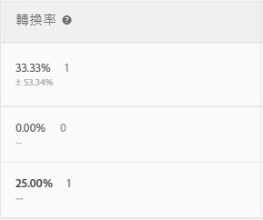
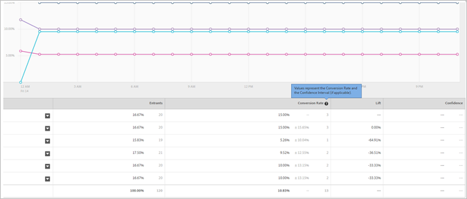

# 轉換率

每次體驗皆會回報轉換率、提升度、信賴 (統計精確度) 和信賴區間。

下圖顯示活動範例的圖表標題，並醒目提示[!UICONTROL 轉換率]、[!UICONTROL 提升度]和[!UICONTROL 信賴度]。

>[!NOTE]
>
>在所有資料中，若傳遞 `orderID`，則會忽略重複訂單。稽核報表會列出忽略的重複訂單。

## 轉換率 {#section_07A36846C4E84D0881906809B9CE5A74}

顯示中位數轉換率、信賴度、區間和轉換次數。

例如，檢查下列轉換率報表欄:

第一行是控制體驗。其中顯示 15% 的轉換率，轉換三次。第二行 (體驗 B) 顯示 15% 轉換率，信賴區間加或減 15.65%，轉換三次。

>[!NOTE]
>
>目前，信賴區間僅針對二進位量度計算。

## 提升度 {#section_0F409572C720433D9378092ABC999982}

對照控制體驗來比較每一個體驗的轉換率。

提升度 = (體驗 CR - 控制 CR) / 控制 CR

若控制值為 0，則無百分比提升度。

## 信賴度 (統計顯著性)  {#section_35DB6724813D40C7B0808DE18FE595C1}

此數字代表再次執行測試時會產生重複結果的可能性。可信度大於或等於 99.995% 時會四捨五入為 100.00%。

請參閱[信賴等級與信賴區間](/help/c-reports/conversion-rate.md#concept_0D0002A1EBDF420E9C50E2A46F36629B)。

## 零售資料 {#section_30A674731BA6440E9BB93C421BE990EE}

如果您插入 [下訂單](/help/c-implementing-target/c-implementing-target-for-client-side-web/t-mbox-download/orderconfirm-create.md) (`orderConfirmPage`) mbox 並選為轉換 mbox，則會顯示每一個體驗的 AOV、RPV 和銷售資料。

## 信賴等級與信賴區間 {#concept_0D0002A1EBDF420E9C50E2A46F36629B}

針對每一種體驗，顯示可信度等級和可信度區間。

Target 型量度 (例如收入和參與量度) 的轉換和連續變數計算如下:

* **轉換:** 是或否
* **其他全部:**&#x200B;範圍內的值

您可以對 for Target (A4T) 執行離線計算，但在 [!DNL Analytics]Analytics 中需要執行資料匯出的步驟。如需詳細資訊，請參閱以下的「對 Target (A4T) 執行離線計算」。

### 信賴等級 {#section_26FE5E44BDD5478792A65FCFD83DCCDC}

*信賴水準*&#x200B;以每個體驗在「轉換率」欄中的深色百分比表示。

  

信賴水準 (或統計顯著性) 指出體驗成功不是出於機遇的可能性。較高的信賴等級代表:

* 體驗的執行情形與控制明顯不同。
* 體驗績效非因發生干擾而產生。
* 若您重新執行此測試，則可能會看見相同的結果。

若可信度層級超過 90% 或 95%，則在統計上可視為顯著結果。下定任何商業決策之前，請試著靜待出現足夠大小的樣本，且有一或多個體驗的四條信賴度在一段持續的時間內保持一致，以確保獲得穩定的結果。

>[!NOTE]
>
>可信度大於或等於 99.995% 時會四捨五入為 100.00%。

### 信賴區間 {#section_F582738DFE1648C78B93D81EBC6CACF7}

>[!NOTE]
>
>目前，信賴區間僅針對二進位量度計算。

*信賴區間*&#x200B;是指在指定信賴等級中發現的真值範圍。信賴區間在「轉換率」欄中以淺灰色 +/- 百分比出現。在下列範例中，體驗 B 提升度的信賴區間會加或減 15.65%。

**範例:** 體驗的 RPV 為 $10，其信賴等級為 95%，而其&#x200B;**信賴區間**&#x200B;為 $5 至 $15。如果我們多次執行此測試，則 95% 的次數中 RPV 會介於 $5 與 $15 之間。

**影響信賴區間的因素為何？**&#x200B;公式會遵循標準統計方法來計算信賴區間。

* **樣本尺寸:** 樣本增大，區間就縮小或變窄。這代表您的報表越來越接近成功度量的真值，因此為有利狀況。
* **標準偏差較小:** 結果越近似 (例如相似的 AOV、數字或每日轉換訪客)，便越會縮小標準偏差。

## 可信度計算以及如何離線執行計算  {#section_86F7C231943043A5B8B6BFE67B706E3B}

[下載的 CSV 報表](/help/c-reports/downloading-data-in-csv-file.md#concept_3F276FF2BBB2499388F97451D6DE2E75)只包含原始資料，不含計算度量，例如每次造訪帶來的收入、提升度或用於 A/B 測試的信賴度。

若要計算這些計算量度，請下載Target的[完整信賴計算器](/help/assets/complete_confidence_calculator.xlsx) Excel檔案以輸入活動值，或檢閱Target](/help/assets/statistical-calculations.pdf)使用的[統計計算。

>[!NOTE]
>
>此計算機適用於鎖定目標型報表，而非 A4T 報表。

## 執行 Analytics for Target (A4T) 的離線計算{#section_B34BD016C8274C97AC9564F426B9607E}

您可以為 A4T 執行離線計算，但是它需要在 [!DNL Analytics] 中進行資料匯出的步驟。

對於 A4T，我們採用 Student 的 t 檢定來計算連續變數 (而非二元量度)。在 Analytics 中，一律會追蹤訪客，並統計每一個採取的動作。因此，如果訪客多次購物或多次造訪成功量度，這些額外的點閱會納入計算。這會使量度變成連續變數。為了執行 Student 的 t 檢定計算，需要「平方和」。這可以從 [!DNL Analytics] 中擷取。若要取得平方和資料，您需要針對想要最佳化的量度，在樣本期間內執行訪客等級的匯出。

例如，假設您想最佳化每位訪客的頁面檢視，則需要匯出每位訪客在指定時間範圍內的頁面檢視總數樣本，或許是幾天 (所有您需要的就是幾千個資料點)。接著，您會求每一個值的平方，並算出總和 (此處的運算順序很重要)。然後，在「完整信賴度計算機」中會使用此「平方和」值。針對這些值，使用該試算表的「收入」區段。

**使用 [!DNL Analytics] 資料匯出功能來這樣做:**

1. 登入 [!DNL Adobe Analytics]。
1. 按一下「**[!UICONTROL 工具]** > **[!UICONTROL 資料倉儲]**」。
1. 在&#x200B;**[!UICONTROL 「資料倉儲要求」]**&#x200B;標籤上，填寫欄位。

   如需每一個欄位的相關資訊，請參閱[資料倉儲](https://experienceleague.adobe.com/docs/analytics/export/data-warehouse/data-warehouse.html)中的「資料倉儲說明」。

   | 欄位 | 說明 |
   |--- |--- |
   | 請求名稱 | 指定要求的名稱。 |
   | 報告日期 | 指定時段和精度。 最佳做法是不要為第一個要求選擇超過一小時或一天的資料。所要求的時段越長，資料倉儲檔案處理的時間就越長，最好一律先要求較短時段的資料，以確保檔案傳回預期的結果。接著，前往「要求管理程式」，複製要求，再第二次要求更多資料。此外，如果您將精度切換為「無」以外的任何值，檔案大小會大幅增加。  |
   | 可用區段 | 視需要套用區段。 |
   | 劃分 | 選取所需的維度:標準是內建 (OOTB)，而「自訂」包含 eVars 與屬性。如果需要訪客 ID 層級資訊，建議您使用「訪客 ID」，而非「Experience Cloud 訪客 ID」。<ul><li>訪客 ID 是 Analytics 使用的最終 ID。這會是 AID (如果客戶是舊的) 或 MID (如果客戶是新的，或已清除從 MC 訪客 ID 服務啟動以來的 Cookie)。</li><li>僅針對新的客戶，或客戶已清除從 MC 訪客服務啟動以來的 Cookie，才會設定 Experience Cloud 訪客 ID。</li></ul> |
   | 量度 | 選取所需的量度。標準是 OOTB，而「自訂」包含自訂事件。 |
   | 報表預覽 | 在排定報表之前檢閱設定。  |
   | 計劃傳送 | 輸入要將檔案傳送到哪個電子郵件地址、命名檔案，然後選取[!UICONTROL 「立即傳送」]。 注意: 在[!UICONTROL 「進階傳送選項」] 。 |

1. 按一下&#x200B;**[!UICONTROL 「請求此報表」]**。

   檔案傳送最多可能需要 72 小時，視所要求的資料量而定。您隨時可以按一下「[!UICONTROL 工具] > [!UICONTROL 資料倉儲] > [!UICONTROL 要求管理程式]」，以檢查要求的進度。

   如果您想要再次要求從前要求過的資料，您可以視需要從[!UICONTROL 「要求管理程式」]複製舊的要求。

如需 [!DNL Data Warehouse] 的相關資訊，請參閱 [!DNL Analytics] 說明文件中的下列連結:

* [建立 Data Warehouse 請求](https://experienceleague.adobe.com/docs/analytics/export/data-warehouse/t-dw-create-request.html)
* [資料倉庫最佳實務](https://experienceleague.adobe.com/docs/analytics/export/data-warehouse/data-warehouse-bp.html)

## 計算方法 {#concept_EC19BC897D66411BABAF2FA27BCE89AA}

您可以選擇依不同的計算方法來檢視報表，以瞭解活動在其存留期或單一作業階段期間影響使用者的方式。

下列活動類型支援計數方法:

* A/B 測試

   例外的是 A/B 活動僅支援預設「造訪」計數方法。

* 體驗鎖定目標 (XT)
* 多變數測試 (MVT)

   對於 MVT 元素貢獻報表，Target 不支援「收入量度」類型的「活動曝光次數」。

* Recommendations

對於自動個人化 (AP) 活動，目前僅支援預設計數方法 (造訪)。

您可以遵循下列計數方法來檢視報表:

* **訪客:** 活動期間的唯一參與者。

   如果某人從新電腦或新瀏覽器造訪網站、刪除 Cookie，或以相同 Cookie 轉換和回到活動，則會將此人視為新的加入者。系統會使用訪客 mbox Cookie 中的 PCID 來識別加入者。若 PCID 變更，則會將使用者視為新訪客。

* **造訪:** 在單一 30 分鐘的瀏覽器工作階段期間，體驗中的唯一參與者。

   若達成轉換或訪客在離開至少 30 分鐘後返回網站，則會將再度訪問的訪客視為新的造訪。系統會使用訪客 mbox Cookie 中的 `sessionID` 來識別瀏覽。當 `sessionID` 變更，則會視為新瀏覽。

* **曝光/頁面檢視:** 每次使用者載入任何活動的頁面時，就計算一次。

   單次造訪可能包含多次曝光，例如首頁。

>[!NOTE]
>
>計數通常是由 Cookie 和作業活動所決定。不過，若您達到活動的最終轉換點，然後重新進入活動，則會將您視為該活動的新加入者和新的造訪。即使您的 PCID 和 `sessionID` 值未變更，亦會採取此處理方式。

## Target為何使用學生的t-tests?{#t-test}

A/B測試是比較控制變數中某些業務量度（也稱為體驗）的平均值與一個或多個替代體驗中該量度的平均值的實驗。

[!DNL Target] 建議使用兩個範例 [Student T-test](https://en.wikipedia.org/wiki/Student%27s_t-test#:~:text=The%20t%2Dtest%20is%20any,the%20test%20statistic%20were%20known.)，因為這些測試需要的假設比Z-tests等替代項目少，而且是在控制體驗和替代體驗之間進行兩對（數量）商業度量比較的適當統計測試。

### 詳細資訊

執行線上A/B測試時，會隨機將每個使用者／訪客指派給單一變數。 隨後，我們會測量感興趣的業務量度（例如轉換、訂購、收入等） 變數中的訪客。 然後，我們使用的統計測試會測試平均業務量度（例如轉換率、每位使用者的訂單、每位使用者的收入等）的假設 等於控制項和給定的替代變數。

雖然業務量度本身可能根據任意分佈進行分配，但此量度（在每個變數內）的平均分佈應通過[中心極限定理](https://en.wikipedia.org/wiki/Central_limit_theorem)收斂到常態分佈。 請注意，雖然無法保證此平均值的取樣分佈會以多快的速度收斂至正常，但此條件通常會線上上測試中根據訪客的規模而達成。

在平均值的這種正常性下，所使用的測試統計值可以被顯示為遵循t分佈，因為它是基於資料的估計值（裝置差的標準誤差）的正常分佈值（業務量度的差值）與縮放項的比值。 如果測試統計資料遵循t分佈，則&#x200B;**學生的t-test**&#x200B;即為適當的假設測試。

### 不使用其他測試的原因

**z-test**&#x200B;不適當，因為在典型的A/B測試情景中，測試統計的分母不是從已知方差中衍生出來的，而是必須從資料中估計。

**Chi-** square測試不被使用，因為這些適用於確定兩個變體之間是否存在定性關係（即在變體之間沒有差異的零假設）。T-tests更適合於&#x200B;_dimutical_&#x200B;比較量度的藍本。

**Mann-Whitney U測試**&#x200B;是非參數測試，適用於平均業務量度（對於每個變體）的抽樣分佈不正常時。 但是，如前所述，線上測試涉及的流量大小，中心極限定理通常適用，因此t-test可以安全地應用。

當測試有兩個以上的體驗時（「A/Bn測試」），可套用更複雜的方法，例如&#x200B;**ANOVA**（將t測試歸納為兩個以上的變體）。 但是，ANOVA回答的問題是「所有變體是否具有相同的平均值」，而在典型的A/Bn測試中，我們更感興趣的是哪個特定變體&#x200B;_最好。_&#x200B;因此，在[!DNL Target]中，我們會套用常規t-test，比較每個變體與控制項，並使用Bonferroni修正來計算多個比較。
