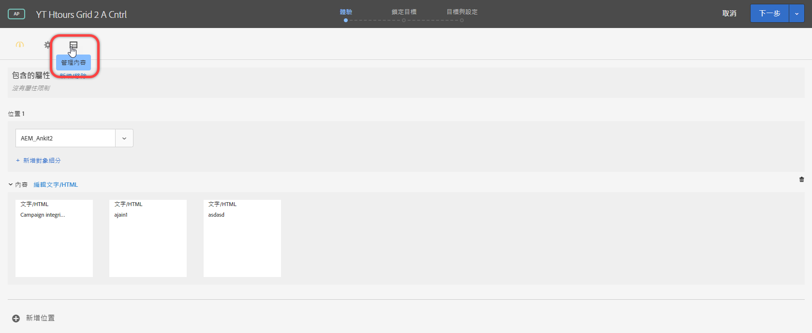
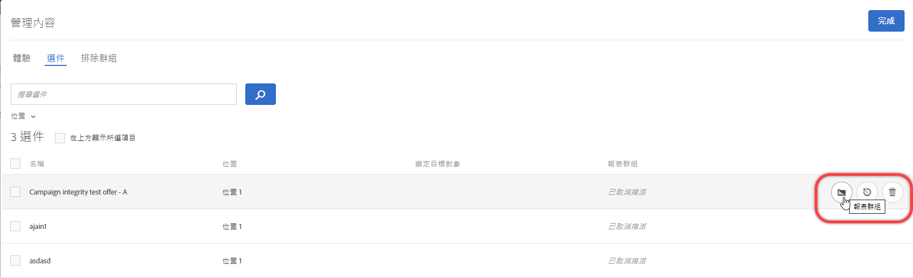
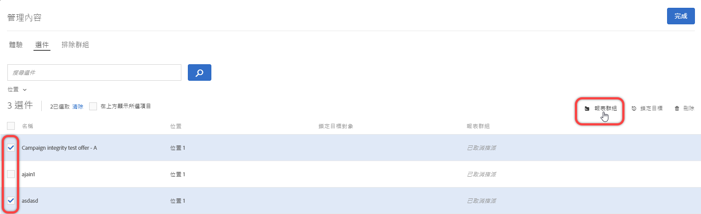
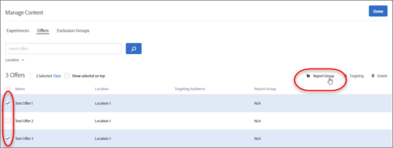

#  自動個人化中的選件報表群組{#offer-reporting-groups-in-automated-personalization}

Information about using reporting groups in [Automated Personalization](/help/c-activities/t-automated-personalization/automated-personalization.md) (AP) activities.

報表群組執行兩個重要功能:

* 這些功能可讓您查看 AP 活動報表中分組的選件。
* They play a key role with how the [!DNL Target] personalization models function.

When you use reporting groups, [!DNL Target] creates only one personalization model for each reporting group instead of each offer in your AP activity using the data from all offers in that group.

如果您的活動設定沒有足夠的資料來為每個選件建立個人化模型，則報表群組可幫助減少使用「自動個人化」的資料要求。報表群組也可以藉由分組類似選件來幫助解決新選件的「冷啟動」問題，以便每個模型獲得更多資料以進行訓練。模組化群組也可用於定期向 AP 活動提供新選件的活動。

如果訪客以相同的方式回應群組中的所有選件，則此方法很有效。最佳做法是對類似訪客群組以類似方式回應的選件進行分組。換句話說，群組選件具有類似的轉換率。您永遠不應將所有選件放置在單一報表群組中。Grouping all offers or grouping offers with very different conversion rates likely reduces the effectiveness of the [!DNL Target] personalization models.

>[!NOTE]
>
>如果從特定模組化群組中移除或替換選件，則也會從模組化群組中刪除看到該特定選件的歷史流量。In other words, deleted offers do not contribute to what data is used for the [!DNL Target] personalization models to learn.

**若要設定報表群組:**

1. On the [!UICONTROL Experiences] page of an AP activity, click the **[!UICONTROL Manage Content]** icon.

   

1. 按一下&#x200B;**[!UICONTROL 「管理內容」]**&#x200B;對話方塊頂端的[!UICONTROL 「選件」]索引標籤。
1. (條件性) 藉由將游標移至所需的選件上，然後按一下&#x200B;**[!UICONTROL 「報表群組」]**&#x200B;資料夾圖示，將特定體驗加入報表群組。

   

1. (條件性) 藉由選取相關體驗的核取方塊，然後按一下對話方塊右上角的&#x200B;**[!UICONTROL 「報表群組」]**&#x200B;資料夾圖示，將體驗批次加入報表群組。

   

1. (Conditional) To assign the selected offer to an existing reporting group, select **[!UICONTROL Existing]**, select the desired reporting group from the drop-down list, then click **[!UICONTROL Apply]**.

   或

   若要建立新報表群組以將選定選件指派至該群組，請選取&#x200B;**[!UICONTROL 「新增」]**，命名新報表群組，然後按一下&#x200B;**[!UICONTROL 「套用」]**。

   

