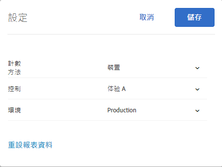

# 報表常見問題集{#reporting-faq}

關於 Target 中報表常見問題的清單。

## Target 中的造訪次數為何比其他 Experience Cloud 解決方案中還要低? {#section_7E626FDB417E41B8B58BBF30FB207409}

由於下列原因，[!DNL Target] 所報告的量度數字 (例如造訪) 一律低於其他 [!DNL Experience Cloud] 解決方案中所報告的數字:

* [!DNL Target] 只會計算活動合格訪客的造訪次數。其他解決方案會針對顯示頁面的訪客來計算造訪次數，而不在乎將他們帶到頁面的活動。
* 不同的活動有時會爭奪相同的位置 (互斥)。因此，訪客在網頁上會看到不同內容，因而影響 [!DNL Target] 所報告的量度數字。

## 活動的報表為何沒有資料可用? {#section_E4722F6445884130951DF79981C8289B}

如果活動的內容成功傳送給使用者，但其報表不含任何資料，請確定您已在報表的設定中選取正確環境 (主機群組)。

如果您已選取開發環境，可能會看到下列錯誤訊息:「沒有可用於所選報表設定的資料」。

若要變更活動報表的環境:

1. 按一下&#x200B;**[!UICONTROL 「活動」]**，從清單中按一下所需的活動，然後按一下&#x200B;**「報表」]標籤。[!UICONTROL **
1. 按一下齒輪圖示進行報表設定。

   

   >[!NOTE]
   >
   >自動個人化報表沒有齒輪圖示可用。

1. 從&#x200B;**[!UICONTROL 「環境」]**&#x200B;下拉式清單中，選取&#x200B;**[!UICONTROL 「生產」]**。

   如果您選取了開發環境，則可能沒有報表資料可用。

1. 按一下&#x200B;**[!UICONTROL 「儲存設定」]**。

如需環境的詳細資訊，請參閱[主機](../administrating-target/hosts.md#concept_516BB01EBFBD4449AB03940D31AEB66E)。
