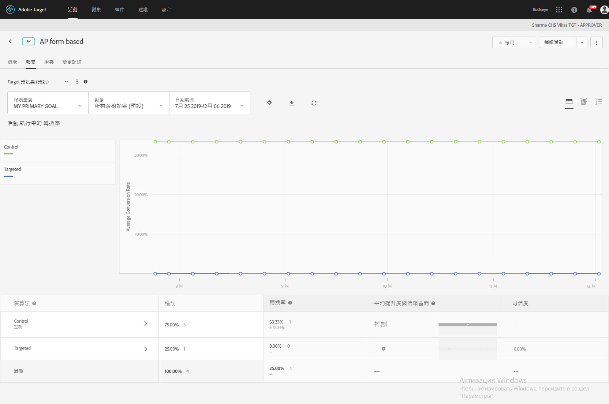

#  自動個人化摘要報表{#automated-personalization-summary-reports}

特製的報表可供自動個人化的使用者使用。

>[!NOTE]
>
>自動個人化屬於 [!DNL Target Premium] 解決方案的一部分。It is not included with [!DNL Target Standard] without a [Target Premium license](/help/c-intro/intro.md#premium).

1. 按一下&#x200B;**[!UICONTROL 「活動」]**，從清單中按一下所需的[!UICONTROL 「自動個人化」]活動，然後按一下**[!UICONTROL 「報表」]**標籤。

   如果您有許多活動，您可以從[!UICONTROL 「類型」]下拉式清單中選取[!UICONTROL 「自動個人化」]，以篩選清單。

1. (可選) 按[!UICONTROL 「下載」]圖示，以下載依所有可用成功量度分解的摘要檢視 (例如，比較「控制」與「目標」流量)。

[!UICONTROL 自動個人化]提供下列報表:

## Activity Level report {#section_6F72FC5C790B4492B3DCECBFFA971337}

[!UICONTROL 活動層級]報表會比較使用[!UICONTROL 自動個人化]演算法與隨機提供內容 (控制) 兩者的彙總效能。

A/B 測試結果解釋的標準規則 (包括提升度、信賴度、趨勢、期間等等) 仍然適用。如需解釋結果的相關資訊，請參閱[關於轉換率](../c-reports/conversion-rate.md#concept_2D9FEDE8F94A485DAC86D611BFBDC844)。

## Offer Level report {#section_CAA6409879E349C6906E2BE8156D87A1}

隨機森林 (Random Forest) 體驗的[!UICONTROL 選件層級]報表中，會比較每個套用演算法的選件與同樣的隨機提供選件 (控制) 兩者的效能。因此，在此檢視中，選件不應該相互比較。

按一下體驗演算法 (隨機森林或控制)，以檢視「選件層級」報表。

選件可顯示在報表群組內，而這些報表群組可以折疊和展開。在下拉式清單中選取[!UICONTROL 「報表群組」]，以檢視依報表群組 (而不是依選件) 彙總的資訊。

>[!NOTE]
>
>時鐘圖示表示演算法模型還在建立中。勾號圖示表示已建立基礎演算法。
