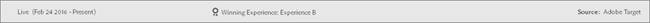

# 報表{#reports}

報表提供關於活動效能的資訊。

>[!NOTE]
>
>您可封鎖來自特定 IP 位址的訪客，不計算在報表中。請聯絡 Client Care 以設定 IP 過濾器。此篩選在使用 [Analytics for Target](../c-integrating-target-with-mac/a4t/a4t.md#concept_7540C8C04259434AB6EE33B09F47A1DE) (A4T) 作為報表來源時不適用。

## 特定活動類型的報表資訊 {#section_DFE037B9E1C345D3B3BDFCB3AC0359CA}

除了本主題及其子主題中的一般報表資訊以外，本指南其他部分提供專用於各活動類型的其他資訊:

| 活動類型 | 詳細資料 |
|--- |--- |
| [A/B 測試](/help/c-activities/t-test-ab/test-ab.md) | 若要瞭解提升度與可信度，以及 [!DNL Target] 中使用的統計方法，請參閱[計劃 A/B 測試](/help/c-activities/t-test-ab/sample-size-determination.md)。 |
| [自動鎖定目標](/help/c-activities/auto-target-to-optimize.md)(AT) | AT 活動之[!UICONTROL 摘要]報表的相關資訊。如需詳細資訊，請參閱[自動鎖定目標摘要報表](/help/c-reports/auto-target-summary-report.md)。 AT 和 AP 活動之兩個[!UICONTROL 「個人化前瞻分析」]報表的相關資訊:[!UICONTROL 「自動化區段」]報表和[!UICONTROL 「重要屬性」]報表。如需詳細資訊，請參閱[個人化前瞻分析報表](/help/c-reports/c-personalization-insights-reports/personalization-insights-reports.md)。 |
| 自動個人化 (AP) | AP 活動之兩個[!UICONTROL 「自動個人化摘要」]報表的相關資訊:[!UICONTROL 「活動層級」]報表和[!UICONTROL 「選件層級」]報表。如需詳細資訊，請參閱[自動個人化摘要報表](/help/c-reports/reports-ap.md)。 AT 和 AP 活動之兩個[!UICONTROL 「個人化前瞻分析」]報表的相關資訊:[!UICONTROL 「自動化區段」]報表和[!UICONTROL 「重要屬性」]報表。如需詳細資訊，請參閱[個人化前瞻分析報表](/help/c-reports/c-personalization-insights-reports/personalization-insights-reports.md)。 |
| [多變數測試](/help/c-activities/c-multivariate-testing/multivariate-testing.md)(MVT) | MVT 活動之兩個報表的相關資訊:[!UICONTROL 「體驗效能」]報表和[!UICONTROL 「位置貢獻」]報表。如需詳細資訊，請參閱[體驗效能報表](/help/c-reports/experience-performance-report.md) (MVT) 和[位置貢獻報表](/help/c-reports/location-contribution-report.md) (MVT)。 |
| [Adobe Analytics 作為 Adobe Target (A4T) 的報表來源](/help/c-integrating-target-with-mac/a4t/a4t.md) | 使用 [!DNL Adobe Analytics] 做為 [!DNL Target] 之報表來源的相關資訊。A4T 可讓您存取 [!DNL Target] 活動的 [!DNL Analytics] 報表。如需詳細資訊，請參閱 [Analytics for Target (A4T) 報表](/help/c-reports/analytics-for-target-a4t-reporting.md)。 |

## 顯示報表 {#section_C4591A32F6D04C95A1AD5A377C27C28B}

1. 按一下**[!UICONTROL 「活動」]**，然後從清單按一下需要的活動。

   如果您有許多活動，您可以利用從[!UICONTROL 「類型」]、[!UICONTROL 「狀態」]、[!UICONTROL 「報表來源」]、[!UICONTROL 「體驗撰寫器」]、[!UICONTROL 「量度類型」]和[!UICONTROL 「活動來源」]下拉式清單選取選項來篩選清單。

   例如，您可以從[!UICONTROL 「類型」]下拉式清單中選取[!UICONTROL 「A/B 測試」]和[!UICONTROL 「體驗鎖定目標」]，並從[!UICONTROL 「狀態」]下拉式清單中選取[!UICONTROL 「上線」]，即可只顯示處於使用中狀態的 A/B 測試和「體驗鎖定目標」活動。

   下圖顯示的[!UICONTROL 「類型」]下拉式清單中已選取兩個類型:

   

1. 按一下**[!UICONTROL 「報表」]標籤。**

   每一個報表都包含圖例來協助您瞭解報表。

   

   圖例會顯示下列資訊:

   * 活動狀態，包括活動執行的日期範圍。
   * 預測的勝出體驗。
   * 活動的來源，例如 [!DNL Adobe Target] 或 [!DNL Adobe Target Classic]。
   >[!NOTE]
   >
   >至少有一個加入者看過體驗之後，體驗結果才會出現。

1. (選用) 視需要[設定報表](../c-reports/c-report-settings/report-settings.md#concept_4BB6A7FDAB6F4806A632F9CD989B8BFA)。
1. (選用) [下載 CSV 格式的報表](../c-reports/downloading-data-in-csv-file.md#concept_3F276FF2BBB2499388F97451D6DE2E75)，以便在 Excel 和其他工具中進行分析。

   可使用下列選項: 

   * [!UICONTROL 匯出報表至 CSV]
   * [!UICONTROL 匯出訂單詳細資料至 CSV]

1. (可選) 按一下**[!UICONTROL 「表格檢視」]**和**「圖表檢視」]圖示，以切換報表格式。[!UICONTROL **

   僅限「多變數」測試，按一下**[!UICONTROL 「位置貢獻」]** () 圖示，將報表切換為依位置來顯示貢獻。
